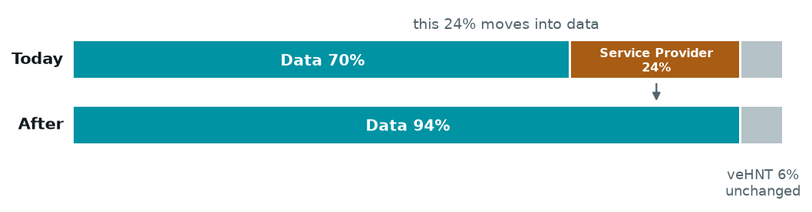

---
authors:
  - '@madninja'
start-date: 2026-08-18
category: Economic, Technical
original-hip-pr:
tracking-issue:
vote-requirements: veHNT Holders
status: Draft
---

# HIP: Mobile Deployer Prioritization

## Summary

This HIP proposes three changes that direct more of the network's emission to the deployers who
serve Mobile data.

1. **Per-Hotspot reward multipliers.** A Hotspot can be granted a multiplier that raises both what
   payers pay for its data and what its deployer earns, in the same proportion.
2. **Direct minting, and a target minimum of 80% for a year.** The [HIP 149][hip-149] Backstop is
   minted straight to the Deployer Data Reward Pool, and the target minimum rises from half of what
   payers paid to 80% of it for one year, with a pre-authorized second year.
3. **Nova Labs contributes its Service Provider Rewards to the Deployer Data Reward Pool**,
   moving the Mobile data bucket from 70% to 94%.

These are one vote because Decisions 2 and 3 pay for each other: minting the Backstop direct and
contributing the Service Provider allocation are together what make a higher target minimum
affordable without growing supply. Decisions 2 and 3 reach every Mobile data deployer; Decision 1
reaches only the Hotspots that are granted a multiplier.

## Motivation

[HIP 149][hip-149] targets a minimum for Mobile data deployers of 50% of the price payers pay for
rewardable data. Three things limit it.

**The target minimum is delivered inefficiently.** The Backstop is minted at DAO level and reaches
deployers only after the sub-DAO and bucket splits take their share. Currently about 1.60 HNT is minted
for every 1.00 that lands on a deployer: of everything minted, deployers receive 63%, the Service
Provider allocation 22%, IoT 9% and veHNT holders 6%. The largest single share of the overhead is
therefore the allocation Decision 3 redirects. That overhead is why the target cannot simply be raised: a
backstop that never grows supply can pay deployers no more than the fraction of a mint that reaches
them, so the overhead *is* the ceiling.

**50% is currently too low, and it is what deployers are paid today.** The target is a share of what payers
paid, so it binds whenever HNT is cheap enough that the emission schedule alone falls short of it.
That is the regime the network is in: the Backstop has fired in every epoch since [HIP 149][hip-149]
went live, averaging about four fifths the size of the emission schedule. The target is not a
rarely-used safety net, it is the mechanism setting deployer pay. Raising the target to 80% lifts what
deployers are paid from 50% of the pay rate to 80% of it, from the first epoch rather than on some
future price move.

**One rate cannot price every location.** A gigabyte at an airport and one at a coffee shop earn
the same today, though they do not cost the same to serve and are not worth the same to a payer.

The first is a delivery problem and the second a parameter one, and they have to be fixed together:
the overhead is what makes a higher target unaffordable. The third needs a mechanism that does
not exist.

## Stakeholders

- **Mobile data deployers.** The target minimum rises from 50% to 80% of what payers paid. Deployers at
  high-demand locations can additionally apply for a multiplier.
- **veHNT holders.** Keep their 6%, and keep delegating as they do now, but take it from the
  emission schedule rather than from a total the Backstop inflates.
- **IoT.** Keeps its share of the emission schedule and its own allocations unchanged, and stops
  receiving a share of what is minted to support Mobile deployers.
- **Nova Labs.** Contributes its Service Provider Rewards, pays the burn
  a multiplier creates, and carries the contractual remedy when a location is abused. Direct minting
  separately ends the growth in Service Provider Rewards that the Backstop produces today, which does
  not return when the contribution does.

## Detailed Explanation

### Decision 1: Per-Hotspot reward multipliers

A multiplier is a number `m` attached to one on-chain Hotspot. It applies to the **data credits
derived from that Hotspot's rewardable bytes**, not to the bytes themselves: a rewardable-byte count
is a measurement and does not change. The payer burns those data credits, and a deployer's share of
the Mobile data pool is pro-rata of them, so one multiplier moves both sides at once. A Hotspot
without one sits at the base tier, `m = 1`, and this decision does nothing to it. Because both sides move together, a multiplier funds itself while the
target minimum binds.

A multiplier need not be a whole number. Applied to a data credit count it is rounded down, so a
payer never burns more than the multiplier earns.

[HIP 149][hip-149]'s band then applies at the Hotspot's own multiplier,
`clamp(baseline_$/GB, 0.8 x m x R_payer, 3.0 x m x R_payer)`. Both bounds already read the total
payers paid, which carries the multipliers, so the band needs no change of its own.

**What the band looks like in practice.** The base pay rate is unchanged: $0.10/GB as of writing,
which Nova Labs sets under [HIP 143][hip-143] and can change.

| Case | Pay rate per GB | Deployer floor | Deployer ceiling |
|---|---|---|---|
| Today, base tier | $0.10 | $0.050 | $0.30 |
| Base tier, `m = 1` | $0.10 | **$0.080** | $0.30 |
| `m = 1.5` | $0.15 | **$0.120** | $0.45 |
| `m = 5` | $0.50 | **$0.400** | $1.50 |

Both bounds are multiples of what the payer paid for that Hotspot's data: the floor is 80% of it,
against 50% today, and the ceiling three times it at every multiplier. The payer's payment is burned
and the deployer's reward minted, so this is a ratio between two flows rather than a division of
revenue.

This decision fixes what a Hotspot must have to hold a multiplier above 1. Nothing here applies to a
Hotspot at the base tier, which needs no enrollment:

- **A deployer agreement and custodial ownership**, via Helium Plus enrollment. Custody makes abuse
  recoverable: rewards withheld or clawed back and the multiplier set back to 1, without notice.
- **An issued ticket.** Nothing else grants a multiplier, and a Hotspot without one stays at `m = 1`.

It also fixes how the mechanism works:

- **The range, 1 to 5**, enforced by the oracles, so a multiplier can only raise a rate.
- **Tickets signed by a known key and publicly recorded**, authorized the way other oracle
  submissions are, so every multiplier in force is externally auditable.
- **A multiplier attaches to the on-chain Hotspot**, not to a self-declared access point.
- **Prospective effect only**, and a return to `m = 1` on relocation pending re-approval.
- **30 days' notice before a reduction or a return to `m = 1`.** An increase needs none.

Each location's value is negotiated, because these venues differ in ways a few fixed steps cannot
capture. Nova Labs expects two standard values at first, 1.5 and 5, as changeable starting points.
A multiplier makes Nova Labs burn that many times the data credits, and that outlay has to be
recovered, so the value the traffic carries is the real bound rather than the maximum.

**The vote sets the mechanism and the range, not any location's value.** Which venues are
candidates, how they are grouped, and which applications are granted are commercial decisions. The base pay
rate is set the same way, under [HIP 143][hip-143].

Higher traffic does not already cover this. Over the seven days to 2026-08-11 the high-value
candidate venues were 2.7% of earning locations and carried 3.3% of rewarded volume, about a fifth
more per location than average rather than a multiple. Their traffic also arrives in bursts, so on
a normal day one of them carries less than a commodity site. Pro-rata pays for the traffic that
arrives; the cost of these deployments is set by the peak they must be ready for. The venue
grouping, its criteria and these measurements are in [supporting notes](files/0000/venue-groups-and-measurements.md),
which are not part of the proposal.

### Decision 2: Direct minting, and a target minimum of 80%

The Backstop is minted directly to the Deployer Data Reward Pool instead of to DAO-level total
rewards. Every HNT minted toward the target reaches a deployer, and the 1.60-per-1.00 overhead goes
away.

The target minimum rises from **50% to 80%** of what payers paid for rewardable data, for one year
from activation, with a second year pre-authorized by this vote. The earnings cap at three times the
pay rate is unchanged, as is the rule that the Backstop may never exceed recent HNT destruction.

The two halves are inseparable. Direct minting without a higher target would simply reduce
emission; a higher target without direct minting would not be affordable.

**What direct minting changes for everyone else.** Today the Backstop passes through the sub-DAO and
bucket splits, so IoT and veHNT holders take a share of every HNT minted to support Mobile deployers.
Minting direct ends that: both keep their share of the emission schedule and lose their share of the
Backstop, and that is the whole of the efficiency gain. [HIP 141][hip-141] provides that a later HIP
adjusting emissions shall be construed to keep its 6% Delegation Rewards Pool unchanged unless the
provision is explicitly modified; this decision is that modification. Nothing else about the pool
changes, including the requirement that a position have voted in 2 of the last 4 veHNT votes.

**80% does not grow supply, but it does reduce the burn.** With the Backstop delivered directly, the
only emission not reaching deployers is the shares IoT and veHNT holders take of it. The emission
schedule and the Backstop together stay below what the network destroys while those two, valued at
the HNT price, stay under 20% of what payers pay; they are under 7% of it today, and that holds even
if rewardable volume fell to roughly a third. [HIP 149][hip-149]'s operations and growth supplement
is a separate mint stream outside that comparison, and this proposal does not change it. So supply keeps falling, just more slowly, because more of what payers pay is
recycled to deployers instead of destroyed.

### Decision 3: Nova Labs contributes Service Provider Rewards to deployers

Nova Labs contributes its Service Provider Rewards to the Deployer Data Reward Pool.
The Mobile data bucket goes from **70% to 94%** of the Mobile sub-DAO slice and the 24% Service
Provider allocation to zero for the duration, leaving the 6% veHNT allocation where it is, and the fixed 450 HNT per epoch paid from it to the
Helium Mobile subscriber wallet pauses with it.

**This is Nova Labs supporting deployers, not a retirement.** Nova Labs is the only registered
Service Provider, so for as long as the contribution runs it is a transfer from Nova Labs to Mobile
data deployers. It runs to the end of the flat operations and growth supplement window on
2027-07-31, and Nova Labs may extend it once by a further year. Ending it earlier, or any other
change to it, takes a later HIP.

### What this proposal does not change

Three things a reader might reasonably expect it to touch.

- **The earnings cap.** It stays at three times the pay rate. Decision 2 raises the floor of the
  band, not its ceiling.
- **The pay rate, and which data is rewardable.** Both stay Nova Labs' to set under
  [HIP 143][hip-143]. A multiplier is a multiple of whatever the rate is; this vote does not set it.
- **The operations and growth supplement.** Unchanged, including the Advisory Council's remit over
  it. Decision 3 ends when its flat window does, but changes nothing about it and draws nothing
  from it.

### Voting mechanics

One vote on the package, at the veHNT level, under the existing voting rules.

## Drawbacks

**The package moves value between existing recipients.** Nova Labs' Service Provider Rewards go to
the Deployer Data Reward Pool for the duration. IoT and veHNT holders keep their share of the base
schedule but lose their share of the Backstop, which for veHNT holders is a cut to the Delegation
Rewards Pool. Those are the transfers that fund the higher target, and they are the substance of the
proposal rather than a side effect.

**The target minimum is still a share of what payers pay.** Raising it to 80% does not insulate
deployers from a fall in the base pay rate or in the volume of rewardable data, neither of which is
governed by this proposal. A deployer whose traffic stops being rewardable earns nothing on it at
any target.

**Multipliers concentrate a reward-affecting decision in one party.** Nova Labs decides who is
offered a multiplier and how large. The range, the prospective-only rule, the public record and the
burn Nova Labs pays all limit that without removing it.

**A contract and custodial ownership are a barrier.** A deployer unwilling to hold the Hotspot
and its rewards custodially cannot reach a multiplier, whatever the venue. Two similar venues can
also end up at different multipliers: the network gains differentiated pricing and loses the
property that identical traffic always earns identically.

**Both concessions have an end date.** A deployer earns 80% of the pay rate for one year, and for a
second unless the pre-authorized extension is cut short, then 50% unless a later HIP says otherwise.
Knowing the date in advance is better than an open-ended promise, but the step down is a 37.5% cut to
the target when it arrives.

## Rationale and Alternatives

**Raise the target without changing delivery.** The overhead is the ceiling, so at 1.60 minted per
1.00 delivered a target much above 60% grows supply. Fixing delivery first is what makes 80%
affordable.

**Set a lower base pay rate and a higher premium rate instead of multipliers.** Most rewarded volume
sits at commodity venues, so pricing groups separately funds the premium by cutting what most
deployers earn. A multiplier on an unchanged base pay rate reaches the same place without taking from
anyone. Paying the premium as its own fixed rate rather than a multiple drifts out of step every
time the base pay rate changes.

**Grant the premium on venue category alone, with no contract.** Venue category comes from a
location the deployer asserts, so anyone could claim a premium by claiming a location.

## Unresolved Questions

- **Whether the working multipliers clear enrollment friction.** Agreement, verification and custody
  cost the same at any level, and the answer cannot be a multiplier above what the traffic carries.

## Deployment Impact

One `helium-sub-daos` upgrade and one oracle release, shipping together. The Backstop mints to the
Mobile data rewards escrow instead of to DAO-level total rewards; the Mobile data bucket moves from
70% to 94%; the target minimum moves from 50% to 80%. The oracles apply each Hotspot's multiplier to
both sides and accept the tickets that grant one.

The package adds no on-chain account and no field, and nothing migrates. Where each change lands, and
why the multiplier belongs where it does, are in [implementation notes](files/0000/implementation-notes.md),
which are not part of the proposal. We leave the implementation to the Helium Core Developers.

**HIPs retired outright:** none.

**HIPs partially amended:**

- **[HIP 149][hip-149]**: target minimum 50% to 80%, direct minting, Mobile data bucket 70% to 94%,
  Service Provider allocation suspended, and the earnings band applies per Hotspot at its own
  multiplier.
- **[HIP 141][hip-141]**: the 6% Delegation Rewards Pool is taken from the emission schedule rather
  than from a Backstop-inflated total, which is the explicit modification its maintain-unchanged
  provision requires. The Protocol Score, delegation, single-token governance, proxy voting and the
  release process are all unaffected.
- **[HIP 148][hip-148]**: the Service Provider pool it consolidated goes to zero for the duration. The mapping and
  Oracle Operator allocations it retired stay retired.
- **[HIP 53][hip-53]**: the Service Provider bucket it created is suspended; the sub-DAO structure is
  preserved.
- **[HIP 82][hip-82]**: the Service Provider registration it created carries no emission while the
  contribution lasts; its Helium
  Mobile subscriber anti-gaming cap is untouched.

The Service Provider role stays defined throughout, and unrewarded only while the contribution
lasts.

Documentation at <http://docs.helium.com> will need to cover the new target minimum, what a
multiplier is and how to apply.

## Success Metrics

- Realized deployer earnings per GB against 80% of the pay rate, and at each multiplier in force.
- Aggregate data credits burned, against the pre-package trend.
- Net HNT supply, confirming the package stays deflationary.
- Rewardable volume and enrollment count at multiplied locations, and retention after a first full
  reward period.

[hip-53]: ./0053-mobile-dao.md
[hip-82]: ./0082-helium-mobile-service-provider.md
[hip-141]: ./0141-single-token-governance-and-release-proposals.md
[hip-143]: ./0143-decoupling-service-provider-pricing-from-governance.md
[hip-148]: ./0148-reallocate-mobile-mapping-rewards.md
[hip-149]: ./0149-helium-utility-and-emissions-realignment.md
