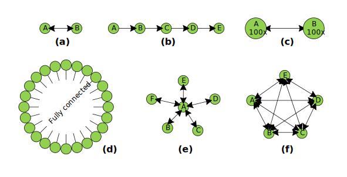

# HIP15: Beaconing Rewards

- Author: [@Carniverous19](https://github.com/Carniverous19)
- Start Date: 2020-10-07
- Category: Technical
- Original HIP PR: [#49](https://github.com/helium/HIP/pull/49)
- Tracking Issue: [#51](https://github.com/helium/HIP/issues/51)

# Summary
[summary]: #summary

This proposal suggests a change to proof-of-coverage (PoC) from multihop to beaconing as well as a change in how PoC is rewarded that combines HNT mining for witnessing and PoC into one pool and gives the bulk of the reward to hotspot witnessing or receiving RF payloads vs transmitting RF payloads.

# Motivation
[motivation]: #motivation

Beaconing with the modified reward structure outlined below does a much better job of rewarding desired coverage.
The existing PoC method and reward structure heavily rewards transmitters with minimal rewards for receivers while the vast majority of LoRaWAN usage is for unconfirmed uplinks, meaning hotspots mostly receive data.
This reward structure better rewards real coverage and encourages honest hotspot owners to see maximized rewards as they build towards efficient network topologies.

Beaconing, regardless of reward structures allows the eliminination of Multi-hop PoC.  Multihop PoC significantly more complex than beaconing requiring complex path building and path verification, 
Significant overhread of building long paths that never complete (due to hop reliability being low).  Large payload sizes that are a-typical for many LoRa applications and require higher datarates, etc.
A lot of implementation complexity is removed with beaconing and those CPU and ledger resources can be re-allocated to more beneficial purposes (like combating gaming/exploitation).

# Stakeholders
[stakeholders]: #stakeholders

All hotspot owners will be affected by this HIP as the reward structure and PoC behavior will undergo a significant change.  In general, hotspots that are able to witness many other hotspots are likely to see rewards go up and hotspots that can only witness a few hotspots may see rewards go down.

The Helium Inc developer team will also need to change sections of the blockchain-core to change how reward distribution is calculated and PoCs are build (although this can be very similar to a length 1 multihop PoC).

Finally, some chain variables may need updating to introduce new variables described below as well as change the reward distribution percentages.

# Detailed Explanation
[detailed-explanation]: #detailed-explanation

Beaconing behaves a lot like a single hop of PoC but there is no intended target, everyone that can receive a transmission is a witness.
Beacons can be initiated in the same manner as PoC today, where challenger hotspots trigger a hotspot to beacon and gather witness receipts (this works fine if the challenger role is being moved to CG per [Consensus Group PoC Challenges](https://github.com/helium/HIP/pull/41)).
I assume each active hotspot will be targeted uniformly randomly so on average, each hotspot will be challenged the same number of times.

To determine the rewards given for a beacon, first define a term ***reward unit***.
A reward unit is not a defined amount of HNT but a slice of the available PoC rewards for each epoch.
So, for example if there are 1,000 HNT to be rewarded for PoC activity and there are 100 reward units from all PoC activity, each reward unit will get 10 HNT.
If there are 5,000 reward units in an epoch, each unit will get 0.2 HNT.
This is very similar to how PoC and witness rewards are distributed today, where the value of each witness varies epoch to epoch depending on how many witnesses there were.

The formulas below and example plot show how the number of reward units is calculated and distributed among the transmitter and witnesses for each beacon.

### Reward Formula for beaconing
Definitions:

 - `w` = Number of witnesses to a transmission
 - `N` = Desired redundancy. `N`+1 hotspots cover an area (transmitter also covers area)
 - `r` = decay rate for additional transmitter reward if `w` > `N`.
 
 Reward formula for Transmitter:
 
 
 
 Reward Formula for each Receiver:
 
 

 A chart showing reward distribution basd on the formulas listed above with example values of `N`=4 and `r`=0.8:
 

There are 3 regions in this reward distribution described below:

#### w < N
For each beacon challenge there is desired number of witnesses which should be set by chain variable `N`.
This number should be >1 because we want redundant RF coverage since hotspots are “unreliable” as compared to enterprise gateways like cell towers.
If the number of witnesses (`w`) is less than `N`, then this area is under desired coverage.
Each witness gets a full 1-unit of reward for providing needed coverage, the transmitter receives a fraction of a reward unit proportionally based on the number of witnesses.
This encourages the transmitter to broadcast as powerfully and broadly as possible.

#### w = N
At this point we have ideal redundant coverage based on the chain variables.
The transmitter gets 1 unit of reward and each witness gets 1 unit of reward.
In total there are `N`+1 units of reward given for this beacon with each participant getting 1 unit.

#### w > N
If the number of witnesses is greater than desired, we have too much coverage for this transmitter.
We still want to encourage the transmitter to transmit as wide reaching as possible to expose this over-coverage, so we give a small portion of the witness rewards to the transmitter up to 1 additional unit of rewards.
For witnesses they all split the pool of reward units remaining for witnesses.
This means the total reward given to all participants remains at `N`+1 so there is no significant gain to be had by having the number of witnesses way above `N`.
This reward structure still encourages witnesses to report receipts as even though they get a smaller and smaller slice of reward they still get rewarded so greedy witnesses will want to witness as many transmissions as possible.

Overall, this method should encourage greedy transmitters to transmit as powerfully and with as much coverage as possible and witnesses to receive as many transmissions as possible and deliver witness receipts.
Thus each hotspot is motivated to provide as much coverage as possible without over-rewarding redundant coverage.
This reward structure does a much better job of giving rewards to “good” coverage meaning coverage over many neighboring hotspots and over hotspots without many existing witnesses.

Note: There is not a maximum number of witnesses but one can set a limit to cap the transaction size and effort required to validate a beacon.

### Example Reward Distribution
The following tables list the reward distributed to transmitters and witnesses with example chain variables of `N`=4, `r`=0.8.  Note `r` of 0.8 was chosen so that 10 additional witnesses above `N` is ~0.9 reward credits.

| # witnesses  | 1  | 2  | 3  | 4  |  5 | 6  | 7  | 8  |
|---:|:---:|:---:|:---:|:---:|:---:|:---:|:---:|:---:|
|  RewardRX per witness |  1.00 | 1.00  | 1.00  | 1.00  | 0.76  | 0.61  | 0.50  | 0.43  |
| RewardTX  | 0.25  | 0.50  |  0.75 | 1.00  | 1.20  | 1.36  | 1.49  | 1.59  |

| # witnesses  | 9  | 10  | 11  | 12  | 13  | 14  | 15  |
|---:|:---:|:---:|:---:|:---:|:---:|:---:|:---:|
| RewardRX per witness  | 0.37  | 0.33  | 0.29  | 0.26  | 0.24  |  0.22 | 0.21  |
| RewardTX  |  1.67 | 1.74  | 1.79  | 1.83  | 1.87  | 1.89  | 1.91  |

### Witness Distance Limits
A radius `R` (today ~300m) sets the minimum distance for “valid” witnesses.
Only witnesses beyond distance `R` are counted in the reward formulas.
It is left to the implementation whether the challenger should filter out witness receipts that violate this threshold or allow them to be included in beacon receipts which may take the place of witnesses sufficient distance away.
There is no penalty for having nearby witnesses (these can be accounted for in an additional proposal “*Method for geographic based transmit reward scaling*”).

### Invalid Witnesses Due to RSSI, SNR, or other gaming detection methods

Unlike nearby witnesses which are excluded even if honest, witness observations that are invalid due to suspect signals means either the transmitter or the witness may be lying about location or some other aspect of coverage.
This cannot simply be dropped since its possible for a gaming hotspot to have many witnesses with most invalid but some still have some “lucky” witnesses with valid signals.
The method of penalizing can change as the methods of evaluating signals change but this section describes a simple method that is compatible with PoC version 10 that is the most recent anti-gaming method active when this HIP is proposed.

Witness with invalid signal count towards `w` but are given 0 reward.
This mildly penalizes honest witnesses since they are splitting rewards with invalid witnesses, but if the percentage of invalid witnesses for a transmission are low then this penalty is minimal.
If the percentage of invalid witnesses is high then its likely the transmitter is invalid and thus witnessing an invalid transmitter should get a small reward.

For transmitters, the reward units earned are scaled by the number of valid witnesses divided by all witnesses.
Again, if the transmitter is valid then its likely only a small number of witnesses are invalid and this penalty is small.
If most witnesses are invalid, then its likely the transmitter is invalid and reward should be small.

### Example Beacon Scenarios
This table gives some examples of rewards distributed for a beacon with varying number of witnesses.

|  Scenario | 12 witnesses  | 8 witnesses  | 4 witnesses  | 2 witnesses  |
|---:|:---:|:---:|:---:|:---:|
| Witnesses outside R  |  12 | 8  | 4  | 2  |
|  Invalid Witnesses |  0 |  0 |  0 |  0 |
|  Reward per witness |  0.26 | 0.43  | 1.00  | 1.00  |
|  Total RewardRX issued | 3.18  | 3.41  | 4.00  | 2.00  |
|  RewardTX issued | 1.83  | 1.59  | 1.00  | 0.50  |
| Total Reward issued | 5.00  | 5.00  | 5.00  | 2.50  |

This table gives examples of beacons with invalid witnesses

|  Scenario | 12 witns. 2 invalid  | 12 witns. 10 invalid  | 4 witns. 1 invalid  | 4 witns. 3 invalid  |
|---:|:---:|:---:|:---:|:---:|
| Witnesses outside R  |  12 | 12  | 4  | 4  |
|  Invalid Witnesses |  2 |  10 |  1 |  3 |
|  Reward per witness |  0.26 | 0.26  | 1.00  | 1.00  |
|  Total RewardRX issued | 2.65  | 0.53  | 3.00  | 1.00  |
|  Tx Scale | 10/12 (0.83)  | 2/12 (0.17)  | 3/4 (0.75)  | 1/4 (0.25)  |
|  RewardTX issued | 1.53  | 0.30  | 0.75  | 0.25  |
| Total Reward issued | 4.18  | 0.83  | 3.75  | 1.25  |

### Example Topologies MultiHop vs Beaconing
Below are five examples to compare how they would be rewarded with the current multihop PoC to this beaconing proposal.  To compare apples to apples, I will call the reward given for a full challenge (RF receive, p2p receipt, RF transmit witnessed) a reward unit for the current multihop PoC.  This is similar to a beacon in the new method.

Note in the current system, the initial target can only earn 2/3 (0.67) of a Reward Unit since it cannot demonstrate the ability to receive RF (it receives over p2p which is not rewarded).

 

A description of each figure:

 - **Figure (a)**: Two isolated hotspots that can witness only each other.  
 - **Figure (b)**: a string of five hotspots A-E where the witness relationship is asymmetric.  B can witness A but A cannot witness B, C can witness B but B cannot witness C etc.
 - **Figure (c)**: this figure is similar to (a) but with 100 hotspots collocated at each position.
 - **Figure (d)**:  is a ring of 24 hotspots that can all witness each other.  Assume hotspots are still spaced beyond minimum distance to witness.
 - **Figure (e)**: is six hotspots with a central hotspot A that can hear all other hotspots transmissions and all other hotspots can witness A’s transmissions.  Hotspots B-F cannot witness each other and can only communicate with A.
 - **Figure (f)**: is a ring of five hotspots where all hotspots can witness each other.

A table of expected rewards for MultiHop PoC (used today) vs this HIPs beaconing rewards

| Figure | (a)  | (b)  | (c)  | (d)  | (e)  | (f) |
|---:|---|---|---|---|---|---|
| MultiHop Rewards  | A:1.67 B:1.67 |  A:0.67, B:1.67 C:2.67, D:3.67 E:2.67 |  A(ea):1.67 B(ea):1.67 |  each:4.67 | A:5.67 B:1.67 | A-E:4.67 |
| Beaconing Rewards  | A:1.25 B:1.25 |  A:0.25 B-D:1.25 E:1.00 |  A(ea):5.00 B(ea):5.00 | each:5.00  | A:6.20 B:1.01 | A-E:5.00 |

We can see rewards are fairly similar except for two figures **(b)** and **(c)**.

In figure (b) we see how asymetric witnessing may cause rewards to be pushed towards certain hotspots.
Hotspot D gets roughly 2.2 times hotspot B even though it has identical coverage.

In figure (c) beaconing hotspots earn significantly more than those with multihop PoC.  This is because the bulk of rewards go to witnessing and although there are only two distinct locations, there are enough witnesses to give the transmitter full credit and the witnesses get to split the maximum rewards for receivers per transmission.
The best way to address this concern is to discount beconing rewards based on some form of density (See *Method for Geographic Based Transmit Reward Scaling* proposal).

# Drawbacks
[drawbacks]: #drawbacks

This will be a considerable implementation effort to change how PoC are constructed and verified.
Also, this change to the reward structure may drastically change how rewards are distributed for some hotspots.
Hotspot owners that optimized for the existing algorithm which has been largely unchanged since Helium’s introduction may find their setups to be suboptimal with the new scheme.
The example topologies show small variations in rewards for most situations.
There are some improvements to rewarding equal coverage equally but also some potential problems introduced where co-located hotspots may see increased rewards
This beaconing reward proposal can be supplemented with other methods to account for these over-rewarded topologies.

It may appear that beaconing is less secure since there is no multi-level onion packet.  I believe this was false security as it is just as easy to distribute raw data received over LoRa to miners whether that is an onion packet or a pseudorandom payload for beaconing.
The multi-level onion packet does not reduce the ability for hotspots to collude, completely virtualize or otherwise lie to increase earnings and in isolated gaming clusters this multihop worked to increase rewards.

Having an intended target chosen from witnesses does not validate the PoC more than simple witnessing.

# Rationale and Alternatives
[alternatives]: #rationale-and-alternatives

Beaconing breaks down the PoC to a more fundamental form of a single transmit and group of receive observations.  It allows more direct targeting of hotspots and PoC activity (and corresponding rewards) to be better controlled by targeting methods and not strongly dictated by witness topologies.

There are many alternatives to this proposal, especially the reward structure.  We can keep rewards the same giving significant rewards to beacon transmitters and a small amount to witnesses.  I think this would be less optimal since the majority of LoRaWAN interactions are uplinks.

# Unresolved Questions
[unresolved]: #unresolved-questions

**Chain Variables**: This HIP presented a reasonable first guess at chain variables of `N`=4, `r`=0.8 but additional analysis may be required to optimize these numbers

**Beacon Payload**: This HIP does not specify what the contents of a payload should be.  This is left to the implementers, but it could simply be a 0-hop onion packet like is used for beacons today (mainly for witness discovery).  Overall, the reward structure is independent of beacon payload.

**Hotspot Impact Analysis**: The community may want more real-world samples of expected beaconing behavior and reward distribution based on existing witness lists to see how this change will effect reward distribution and if it is desirable (and more importantly healthy for network efficiency and growth).

# Deployment Impact
[deployment-impact]: #deployment-impact

Current users will likely see a significant change in reward distribution based on this change.  This will also require a significant update to existing documentation on challenges and reward distribution.  Applications such as the phone apps and blockchain explorer will need significant changes to reflect the new PoC structure.  The blockchain core will need to be updated to implement beaconing and possibly changes to the ETL and API to reflect this change in behavior and the single PoC reward type.

Note a lot of the development effort may be mitigated by treating beacons as length-1 multihop PoC, zeroing out witness rewards and moving into PoC percentages and expanding the allowed number of witnesses.  This may not be the best beaconing implementation, but it would require the least amount of change to the codebase.

# Success Metrics
[success-metrics]: #success-metrics

Success will be determined on smooth running of beaconing and real-world rewards better going to efficient network coverage.
