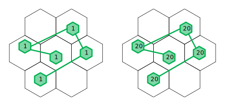
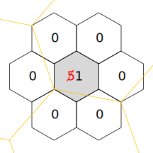
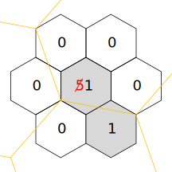
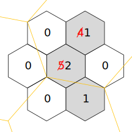
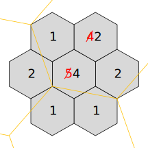
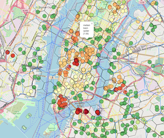

# HIP17: Hex Density Based Transmit Reward Scaling

- Author: [@Carniverous19](https://github.com/Carniverous19)
- Start Date: 2020-10-20
- Category: Technical
- Original HIP PR: [#59](https://github.com/helium/HIP/pull/59)
- Tracking Issue: [#60](https://github.com/helium/HIP/issues/60)

# Summary
This HIP suggests a change to PoC rewarding to better rewards areas of coverage.
This is done by reducing the rewards earned by transmitting or witnessing hotspots in close proximity to each other.

Very little additional coverage is demonstrated by being able to witness multiple hotspots that are  co-located or in close proximity to each other.
On the other hand, being able to witness many hotspots that are in distinct locations demonstrates a hotspot is providing a large area of coverage.
This is in contrast to the current PoC reward structure, where transmitters and high density areas see a significant portion of PoC rewards.

# Motivation
Rewards are dominated by PoC activity (challenge and witness). With the growth of interest in Helium and the number of hotspots coming online, it’s important that rewards encourage “optimal” hotspot deployment and density.
The current PoC, which rewards all challenge hops equally and targets hotspots roughly uniformly, does not account for density.

For example, you could have 5 hotspots in unique locations all >300m apart and able to do a PoC path.
This is healthy, but someone could place multiple hotspots at each of these locations and they will multiply their earnings.

The two topologies shown above cover an equal area with coverage.
The topology on the right will have each hex targeted 20 times as often as the topology on the left and earn around 20 times the reward.
This is undesirable behavior as the increased reward is not going to provide any meaningful increase in coverage.

You can also see some dense urban areas such as SF and NYC have a very high density of hotspots.
These areas may be over-saturated and if not, will likely reach over saturation with the number of hotspots coming online and hotspot-based reward targeting overly benefiting dense areas.

# Stakeholders

All hotspot owners or potential owners will be effected by this HIP as it affects the method by which earnings are calculated for all proof-of-coverage based rewards.
Owners or Patreons who have setup hotspots to optimize for the existing PoC method and reward structure may be especially affected.

Additionally the Helium development team will have considerable work implementing the proposed algorithms on the blockchain.

Due to the nature of the change, its likely an app push notification, engineering blog post, and other social media outreach may be needed to ensure effected stakeholders are notified and can voice support or concerns.

# Detailed Explanation
The following subsctions describe the reward scaling methodology and implementation.

## Definitions

To better describe the proposal, I will introduce some terms and variable names.
Note these may be formatted differently in formulas:

**Density_tgt**: Target number of hotspots in target hex resolution (example = 1).  Density in a target resolution hex will be clipped at this number unless certain conditions are met.  This would be a chain variable for each resolution of interest.

**Density_max**: maximum number of hotspots to consider for target resolution any density beyond this will be clipped under any conditions.  (Example= 4) This would be a chain variable for each resolution of interest.

**N**: number of neighboring hex’s that must meet **Density_tgt** before clipping will be raised above **Density_tgt**. (Example =2).  This would be a chain variable for each resolution of interest.

**Interactive Hotspot**: an active hotspot that has also recently had a transmission witnessed.  Lone wolves are active but not interactive.

**Occupied Hex**: hex where at least one interactive hotspot is present.  This can apply to any resolution of interest.  It also implies that if we know a certain hex is occupied, all parents of that hex up to resolution 0 are also occupied.

**Hex Whitelist**: a list of hex’s that are eligible for rewards, these could be specified at any level but in general should be as low a resolution (largest area) as possible.  If this feature is not desired, you can assume all resolution 0 hexs are in the whitelist.  This would be a chain variable.

## Algorithm

The goal of this algorithm is to limit density to a specific target while being flexible enough to reward areas that require density above this target.
For example, nation capitals or other dense urban areas.
It should also be flexible enough to recognize there are many areas that would require localized density to be best served (non-capital cities, college towns, tech centers, etc).

A brief summary is that rewards for transmitting hotspots and witnesses to transmitting hotspots will be scaled up or down based on hex density (and all parent hex densities) relative to target.
In general hotspots in overly dense areas will have a scale factor < 1 while hotspots in less dense areas will have a scaling factor > 1.
For this proposal to be effective each hotspot should be targeted uniformly randomly over a desired interval, much like initial hop targeting for PoC is done today.

### Getting interactive and losing interactive status

There are many conditions that can be placed on hotspots before they are classified as “interactive”.
As a minimum they need to have an assert_location transaction and must be able to transmit with valid witnesses (300m+ distance, valid metadata, etc).

A hotspot should lose the status of interactive if its transmissions no longer have valid witness(es).
This can be a count of unwitnessed transmission or a period of blocks where the most recent witness must be within that range of blocks (something like 10 times the expected transmission period).

When a hotspot is not “interactive” it will still be targeted for transmitting but it will not contribute to hex densities and the reward scaling factor will be 0.0 meaning no reward is given for transmitting.
Hotspots with reward scale of 0.0 will still be motivated to transmit when challenged in order to discover witnesses and gain “interactive” status.

### Determine Hex Densities

The following describes the process to determine hex densities and how to calculate the limits to hex densities based on the proposed chain variables.

#### Limiting Density

In order to control density, the density of each hex is clipped at **Density_tgt** unless certain criteria are met which would allow density to increase up to **Density_max**.
Density limit can be raised if a certain number of neighboring hexs are also occupied by at least **Density_tgt** hotspots.  Note there are 7 “neighbor” hexs (6 + reference hex in center).

The density limit follows the following criteria:

|  |    |
|---:|:---|
|  **Occupied Count** |   |
| **Hex Density Limit** |    |
|   |

Example thresholds for N=2, Density_tgt = 1

|  n  | 0  | 1  |  2 |  3 | 4  | 5  | 6  |  7 |
|---:|:---:|:---:|:---:|:---:|:---:|:---:|:---:|:---:|
|  limit % of Density_tgt | 100%  | 100%  |  100% | 200%  | 300%  | 400%  | 400%  | 400%  |

Example Topologies, assume we are looking at resolution 8 with chain variables: N=2, Density_tgt=1, Density_max=4.
The yellow / orange lines show the res7 hex boundaries to make it clear these neighboring hexs do not have to belong to the same parent

| Example 1  | Example 2  | Example 3  | Example 4  |
|:---:|:---:|:---:|:---:|
|   |   |   |   |

**Example 1**: there is one occupied hex that has 5 interactive hotspots in it.  Since this is the only occupied hex among its neighbors, its count is limited to **Density_tgt** which is 1.

**Example 2**: There are two occupied hexs this is equal to **N** meaning we are at the threshold of our density limit.  Still, because we do not exceed N, each hex is still limited to **Density_tgt**.

**Example 3**: There are now 3 neighboring occupied hexs meaning the occupied count is above **N**.  The new threshold is 200%  **Density_tgt**.
This raises the clipping limit to 2 for the middle hex.

**Example 4**: There are now 7 occupied hexs.  Since  **Density_max** is set to 4 times target density, the new threshold is  **Density_max** or 4 even though the parent occupancy is 5 hexs above **N**.

#### Determining Transmit Reward Scaling for a Hotspot

A lookup table including clipped and raw hex densities for each occupied hex will need to be built by the consensus group once per epoch or at whatever rate deemed necessary.
To determine the reward scaling for a given hotspot, iterate through lower and lower resolution hexs taking a product of the clipped / unclipped density per the formula below.

Important note, HexDensity_Unclipped is the unclipped sum of clipped child hexs meaning you clip the children, sum them and set the unclipped hex density.  An example of this operation for a specific hotspot is below:

    8828361563fffff h3res:8 has density clipped/unclipped of   4/ 61, scale reduced: 1.000 to 0.066
    872836156ffffff h3res:7 has density clipped/unclipped of  27/ 27, scale reduced: 0.066 to 0.066
    862836157ffffff h3res:6 has density clipped/unclipped of  49/106, scale reduced: 0.066 to 0.030
    85283617fffffff h3res:5 has density clipped/unclipped of  62/ 62, scale reduced: 0.030 to 0.030
    8428361ffffffff h3res:4 has density clipped/unclipped of 117/117, scale reduced: 0.030 to 0.030
    832836fffffffff h3res:3 has density clipped/unclipped of 136/136, scale reduced: 0.030 to 0.030
    822837fffffffff h3res:2 has density clipped/unclipped of 504/504, scale reduced: 0.030 to 0.030
    81283ffffffffff h3res:1 has density clipped/unclipped of 504/504, scale reduced: 0.030 to 0.030

### What does this look like for existing network?

For this analysis I used the example values for chain variables (N=2, R=8, tgt=1, max=4).

The chart below shows violin plots of the transmit reward scaling for hotspots in larger metro areas or those especially effected by this proposal.

Additionally, I mapped each interactive hotspot and its reward scale as well as drawing all resolution 8 and resolution 9, and 10 occupied hexs to get more detail on how this targeting will affect hotspots.

The interactive map can be found: <https://carniverous19.github.io/para1_geohip_USA.html> Some screenshots of areas of interest are below.
I draw occupied R resolution hexs (8: black) plus 3 levels of parents (7:blue, 6:white, 5:pink).
The circles represent hotspots and circle colors represent normalized probability with yellow being the average scale factor, green being above average and orange to red being below average.
The map has a lot of content and is not optimized for speed so it may be laggy to view.

| Manhattan, NY  |  San Fransisco, CA  |
|:---:|:---:|
|  |  |

| Modesto, CA  |  Austin, TX  |
|:---:|:---:|
|  |  |

### How Transmit Reward Scaling is Used

Its very important to understand that this is not a reward scaling for ALL rewards a hotspot will receive, it is scaling for a specific transmission and it effects the witnesses and transmitter.
Hotspots with low transmit reward scaling can still be very high earners if they can witness hotspots with high transmit reward scaling.
This will work best when implemented in conjunction with beaconing and a change in reward distribution that gives the bulk of challenge rewards to RF receivers (witnesses) not transmitters.
There is a separate proposal for details of beaconing in [HIP 15](https://github.com/helium/HIP/blob/master/0015-beaconing-rewards.md).

So for each transmit, the transmitting hotspot’s reward will be based on the number of witnesses and then scaled by its own transmit reward scale.
For witnesses, they will receive a portion of reward based on the number of witnesses scaled by the transmitter’s reward scale.  To better describe the relationship two example distributions are shown below:

***IMPORTANT***: These examples use a slightly outdated methodoogy of scaling that looked at siblings (hexs with the same parent) instead of neighbors (hexs sharing an edge).
The overall principle of how transmit scaling effects rewards is the same but the implementation will have slightly different scalings for these topologies

#### Example 1

The Topology below is taken from real-world transmit scaling factors.  The normalized reward scaling factor for A-C is 1.38 and the normalized reward scaling factor for D-H is 0.31.
For this example, I assume all hotspots can witness all others.  Since hotspots are targeted uniformly, I also assume each hotspot transmits exactly once.
Finally, the rewards earned are assumed to be a (slightly simplified) reward distribution from beaconing above.

| Topology  | Reward Distribution  |
|---|---|
|   |   |

This is an over-simplification of real-word data, but we can see that although D-H have a transmit reward scale of less than ¼ those of A, B, C they only see a 20% reduction in earnings compared to A-C.
This is because they can all witness A-C’s transmissions earning a large chunk of rewards for those witnesses.

#### Example 2

Here we look at a slightly more complex topology.  Same beaconing reward method.
There are 3 sets of hotspots circled, assume transmissions can be heard by everyone in the set(s) the hotpot belongs to.
So for example D and E can witness all hotspots but A can only witness C-E, not F or G.

| Topology  | Reward Distribution  |
|---|---|
|   |   |

Based on this example we can see D and E earn the most even though they have half the transmit reward scaling factor as F and G.
A earns the least but it can only witness hotspots with low reward scaling factor and in proximity.
It is not providing significantly less coverage than D or E and the coverage it is providing is already well saturated.

#### Example 3

There are two topologies from the “motivation” section that show an area with near optimal coverage as well as that same area with 20 times the number of hotspots all covering the same geographic area.
The table on the left below gives an estimate of the rewards when there is only one hotspot per hex and the table on the right when there are 20 hotspots per hex.

| 1 hotspot per Hex  |  20 hotspots per Hex  |
|:---:|:---:|
|  |  |

We can see that although the per-hex earnings do go up with increased density, they only see a 35-65% increase vs 2,000% increase with existing PoC or a PoC reward structure that does not take density into account.

#### Lessons From Examples

Hopefully these examples demonstrate that transmit reward scaling factor does not fully describe earnings, and the way to increase earnings is to provide coverage to as many hexes (or just general area) as possible, especially hex’s without a large amount of coverage already.

# Drawbacks

This proposal will drastically effect earnings across the board as it is a significant change to how earnings are calculated and distributed.
There wil be many hotspots in dense areas that will see significantly reduced earnings.

This method also does not consider first movers to an area who are penalized for over-density just as much as newcomers.
I think this is appropriate as from the device perspective, all coverage is equal.
Additionally, if a new hotspot can be deployed in a more optimal location that makes many existing hotspots redundant, what is healthiest for the network is if the old hotspots move to more ideal locations, not to discourage placement of hoptsots that offer better coverage than existing deployments.

This proposal is also a considerable development effort requiring a change in reward calculation, new code to determine hex densities, etc.

# Rationale and Alternatives

This design is a step towards rewarding areas of coverage and encouraging network breadth (spreading out) as well as depth (redundant coverage).
There are many other methods that can reward this type of coverage with different levels of accuracy or effort.

Some alternatives are:

- Manually assign reward weights to each hex based on separately determined value of each area.  This requires a lot of manual work to determine appropriate rewards per area and will cause a lot of pushback as each hex is debated.
- Increase fidelity of density calculation by not relying on hexs and using more direct density measurements.  Each hotspot can be modeled as a gaussian to determine density, or heuristics from real-world observations can determine the information gained by each hotspots transmission compared to their neighbor and scale rewards accordingly
- Ideal density can be encouraged by adjusting staking fees according to local density.  One problem with this method is the density assessment can only be evaluated once.

# Unresolved Questions

Integrating this design with a beaconing / receive focused reward structure is required.
This could be [HIP 15](https://github.com/helium/HIP/blob/master/0015-beaconing-rewards.md) or an alternative.

Tuning of the chain variables, specifically per H3 resolution target and maximum densities.  Initial analysis shows that scaling target/max densities linearly with area means only the highest resolution thresholds actually apply.
It is suggested to consider a set of (N, Density_tgt, Density_max) for at least resolution 8-3. My proposed initial chain variables are as follows. Note keys under `res_vars` are the hex resolutions:

    "res_vars": {
      "4": {"N":  1, "density_tgt": 250, "density_max": 800},
      "5": {"N":  1, "density_tgt": 100, "density_max": 400},
      "6": {"N":  1, "density_tgt": 25, "density_max": 100},
      "7": {"N":  2, "density_tgt": 5, "density_max": 20},
      "8": {"N":  2, "density_tgt": 1, "density_max": 4},
      "9": {"N":  2, "density_tgt": 1, "density_max": 2},
      "10": {"N":  2, "density_tgt": 1, "density_max": 1},
     }

Tuning of these variables allows a lot of flexibility in how rewards are distributed and periodic updates may be required.

This proposal does not directly effect gaming and methods for discouraging hotspots to lie about their location or the coverage they provided is needed to supplement this proposal which is meant to encourage healthy growth of the nework by honest hotspots.
By penalizing density, this proposal encourages hotspots to spread out which may make some anti-gaming methods more affective.

# Deployment Impact

This method will need to be deployed along with or soon after Beaconing.  It assumes an existing reward structure that biases PoC rewards towards receivers vs transmitters.
One such method is described in [HIP 15](https://github.com/helium/HIP/blob/master/0015-beaconing-rewards.md).
This deployment will effect all hotspot owners.  Current hotspot owners will likely see a significant change in earnings (either up or down) based on the new reward methodology.
It will also require significant documentation update on how proof-of-coverage is performed and rewarded.

# Success Metrics

Success will be determined if rewards encourage breadth and depth of coverage resulting a faster buildout of a ubuiquitous, redundant and reliable network.
