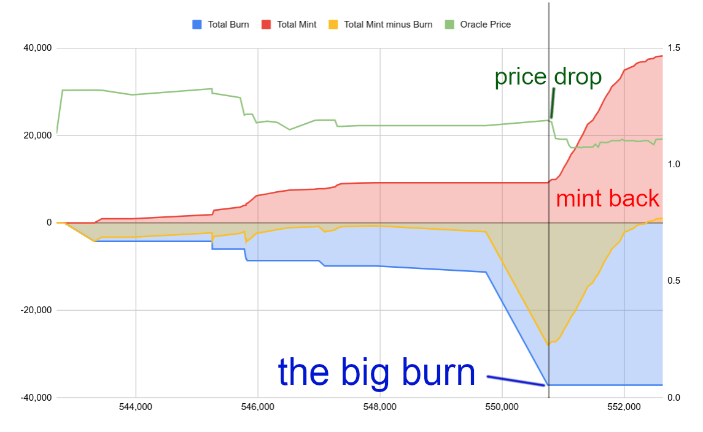

# HIP18: Remove Oracle Forecast for DC Burn

- Author: [@lthiery](https://github.com/lthiery)
- Start Date: 2020-10-22
- Category: Technical
- Original HIP PR: [#59](https://github.com/helium/HIP/pull/62)
- Tracking Issue: [#65](https://github.com/helium/HIP/issues/65)
- Status: Approved

# Summary
A new oracle price takes effect one hour in the future. The reason for this is to provide users with predictability when
 converting HNT to DC:
- if one is trying to “sweep” all HNT from one wallet to another, one can leave just enough HNT to cover the transaction
fee via implicit burn
- if you are converting HNT into DC, you can know with relative certainty that your burn will yield a certain amount of
DCs

Unfortunately, this delay provides an on-chain arbitrage opportunity via state channels. Given the delay, an actor with
 HNT in-hand may see the forecasted drop in HNT price and thus convert HNT into DCs. After the drop takes effect, the
 actor may then “spend” the DCs in a state channel, naming a colluding gateway of theirs as the beneficiary. Effectively,
 the actor is burning and minting HNT on-chain at a profit with very little risk.

To demonstrate the “oracle arbitrage opportunity”, consider the following example:

- At block 200, the current oracle price is $1.10
- Submitted oracle prices will set the new oracle price to $1.00; this will take effect in one hour or roughly at block
 260
- Between block 200 and block 260, the actor may burn 1,000 HNT, yielding $1,100.00 worth of DC
- After block 260, the actor my close a state channel naming its colluding gateway as beneficiary of $1,100.00 worth of
 DC, assuming:
  - the grace period on the state channel has expired
  - the DC reward pool has not been maxed out

  ⇒ the colluding gateway is awarded 1,100 HNT at the next epoch payout

# Example

The Dapper-Hickory-Meerkat, managed by [wallet 13ZiB74TJNdV5D5VFehEH3oMSuFNusjkho4gJYmnRmLRnXrZbE5](https://explorer.helium.com/accounts/13ZiB74TJNdV5D5VFehEH3oMSuFNusjkho4gJYmnRmLRnXrZbE5), has recently exploited this opportunity.

Here it is graphed from on-chain data showing HNT burn events, mining rewards from DC and what the oracle price was for
 all of these events:

As you can see, “the big burn” of about 27k HNT was burned right before the oracle price dropped from about $1.20 to
$1.10. Over time, the DC was “minted” back into HNT via the DC rewards.

It’s worth noting, despite the magnitude of burn and mint, at the time of this writing, only about 2k HNT was cleared
 by the owner of the Meerkat. Therefore, you could approximate:
- 27k HNT was burned
- 29k HNT was minted

While only 2k HNT was cleared, another side-effect of the arbitrage is that the Proof-of-Coverage (POC) earnings during
 the period of the mint back were severely impacted as when the DC reward pool grows, it grows at the expense of POC
 rewards during that same epoch.

It’s also worth noting that the mint back took roughly 24 hours, so should the market price and then the oracle price
 have snapped back, the Meerkat may have lost out. The severe price drop may also be an artifact due to manual entry of
 oracle prices. This will not be the focus of this HIP but remains noteworthy and perhaps the subject matter for future
 HIPs.

# Winners and Losers as Is

So who gains what from this opportunity? As previously stated, the owner of the Meerkat’s wallet has cleared about 2k
 HNT. The rest of the HNT in play was essentially burned and redeemed; in effect, HNT emissions were cut by about 30%
 during the 24 hour period of mint back. In a direct sense, this benefits:
- Current holders of HNT: effectively, inflation has been curbed
- non-POC earners: their emissions have not been affected

# Solution

The opportunity for arbitrage is that the oracle price is forecasted to change before it actually changes. The only
 transaction that creates DC in a way that can become HNT again, however, is `blockchain_txn_token_burn_v1`. All other
 transactions that benefit from "implicit burn" do not create DCs that can be spent in a state channel and thus a
 circular arbitrage route (HNT->DC->HNT) is not available.

Therefore, **the proposed solution is to force burn transactions to accept a dynamic oracle price, but allow the
 transaction to optionally specify a minimum acceptable conversion rate.**

Since all other fees do not have potential for circular arbitrage schemes, they remain unaffected.

In general, the DC burn transaction is only useful for OUI operators or facilitators of these parties. As such, we may
 expect a level of sophistication from these actors relative to regular wallet holders or miners who simply wish to
 transact funds.

However, to mitigate the impact of the dynamic price, we stipulate the ability to optionally indicate a minimum
 oracle conversion rate. This would protect against oracle and market price volatility.

As previously mentioned, oracle reporting and oracle price adjustment may be compounding factors but are not the concern
 of the solution to be proposed herein. That being said, [a PR against helium-wallet](https://github.com/helium/helium-wallet-rs/pull/58)
 exists which attempts to address those shortcomings.

# Examples with Solution Implemented

## Failed Burn

- A user submits a token burn right after block 200 is forged. Oracle price at that time is $1.10 and the *minimum
 conversion price set is $1.10*.
- At block 201, a new oracle price of $1.00 is established (with no delay) and the burn transaction is not in this block.
- At block 202, the token burn transaction is now invalid and will be dropped. It could theoretically be rebroadcast at
a later time or the user could submit a new transaction with the same nonce to invalidate the transaction.

## Successful Burn

- A user submits a token burn right after block 200 is forged. Oracle price at that time is $1.10 and the *minimum
 conversion price set is $1.00*.
- At block 201, a new oracle price of $1.00 is established (with no delay) and the burn transaction is not in this block.
- At block 202, the token burn transaction remains valid and may be picked up as long as the accepted oracle price
remains above $1.00.

# Impact

So who gains what from this solution? Nobody in particular gains other than the exact opposite of those who gained from
 the arbitrage existing (see Winners and Losers above). The merits of this solution are that in targets the arbitrage
 precisely without further economic impact.

In effect, this proposal only affords the "forward looking window" for transactions that cannot accomplish the circular
 arbitrage route that the DC burn transaction can.

The biggest downside of this solution is an increase in complexity for the burn transaction as the user does not know
 ahead of time what the cost will be; the minimum conversion rate is added to the transaction, however, which provides a
 bounded conversion rate.

# Alternate Solutions

## Reduced Delay on new Oracle Prices

The Oracle delay could be reduce from 60 minutes to, perhaps 15 minutes. The effect would be that the arbitrageur would
 have ~15 blocks to burn DCs at and advantageous price instead of ~60 blocks. This would not logically close the arb and
 thus leaves a guaranteed on-chain profit for the arbitrageur; keep in mind, off-chain market data may be used to front-
 run prices as well.  In addition, as we reduce the delay, we introduce a higher probability that "something surprising"
 happens to other actors, notably anyone using implicit burn. Regular users would have to time their transactions
 carefully to avoid being at the cusp of a price change.

## Delayed HNT Burn

Delayed burn is not logically that different from the proposal here, except instead of releasing the DC immediately, the
 DC would be held until the future oracle price takes effect. The downside of this approach is DCs cannot be created
 without a delay and thus a user must wait for DCs when they may need them quickly.

## 1.1:1 DC to HNT Conversion

Currently, DC rewards are determined by converting DC earned for a gateway into HNT at a 1:1 rate. Assuming the total
 HNT earned via DC rewards during the epoch is within the allocated percentage, the HNT rewarded is worth exactly the
 amount of DC earned by that gateway during the epoch. Recall that the 1:1 conversion was determined as a countermeasure
 to the DC spamming in August 2020, where traffic was low enough and so far below equilibrium, that every DC spent was
 effectively rewarding gateways 1:100 to 1:1000.

While this solution would effectively negate the arbitrage opportunity, it has a secondary economic impact of decreasing
 the earning potential of gateways that forward network data, which is precisely the reason for the Helium Network to
 exist. In fact, before DC spamming made the flaw in incentives apparent, we very much wanted to reward a large slice to
 gateways that were forwarding data.
