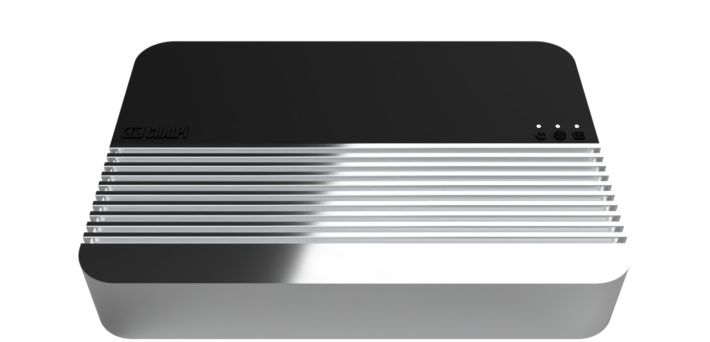

# ClodPi Labs (India) Private Limited
### Application to become an approved third party manufacturer as per [HIP19](https://github.com/helium/HIP/blob/master/0019-third-party-manufacturers.md)

## Summary

With LoRaWAN becoming the de-facto wide area network of IoT world. It demands multiple options and players who can provide the backbone infrastructure for varied product needs.
At ClodPi Labs, we have been exploring and pioneering this space over the last 5 years, serving our customer needs in India, Asia Pacific and Europe.

We are proposing our expertise to build light hotspots and miners (Indoor and Outdoor).

ClodPi Pro Hotspot (Indoor)

## Company Information

ClodPi Labs is a leading technology company in the IoT space specializing in products for long range, low power sensor network communication using LoRa and LoRaWAN. With the evolution of Internet of Things, organizations better understand the benefits these applications bring to various industries including Smart Cities, Manufacturing, Construction, Transport, Health, Oil and Gas. ClodPi Labs works in this space to build and enable these organizations with smarter solutions leveraging LoRaWAN for efficient, low power networking for application sensors.

Products : LoRaWAN Gateways, Network Server, IoT Platform and end devices like GPS Tracker, LoRa RS485 Adapter, etc.

Applications : Energy Meter, Water Meter, Industrial IoT, Machine/Site condition monitoring

**Recognised by**
https://www.semtech.com/company/press/semtechs-lora-devices-reduce-energy-waste-with-smarter-metering-applications

## Product Information

We are planning to make both Hotspot Miner and Light Hotspots - (Indoor/Outdoor)

**Hotspots Miner - Indoor**
* LoRa Concentrator (SX1302/1303)
* ARM 64 Bit Hexa-core (Quad-core ARM Cortex-A53 up to 1.4G Dual-core ARM Cortex-A72 up to 1.8G)
* 4GB Ram /64GB eMMC 
* Ethernet 
* WiFi 
* 12V Power adapter
* 3.5 dBi Rubber Duct Antenna 

**Hotspots Miner - Outdoor** - In Development
* LoRa Concentrator (SX1302/1303)
* ARM 64 Bit Hexa-core (Quad-core ARM Cortex-A53 up to 1.4G Dual-core ARM Cortex-A72 up to 1.8G)
* 4GB Ram /64GB eMMC 
* Ethernet and  4G Backhaul
* WiFi 
* GPS
* POE 802.3at
* IP67
* Lightning surge protection
* Outdoor fiberglass LoRa Antenna

Our existing gateways are suitable for Light Hotspots.

**Light Hotspots - Indoor** 
* LoRa Concentrator (SX1302/1303)
* MIPS24KEc (575/580 MHz) with   64 KB I-Cache and 32 KB D-Cache
* Ethernet
* WiFi 
* 12V Power adapter

**Light Hotspots - Outdoor** 
* LoRa Concentrator (SX1302/1303)
* MIPS24KEc (575/580 MHz) with   64 KB I-Cache and 32 KB D-Cache
* Ethernet and 4G Backhaul
* WiFi
* GPS
* POE 802.3at
* IP67
* Lightning surge protection
* Outdoor fiberglass LoRa Antenna

## Customer Support

* Discord Channel and Email
* Round the clock customer enquiry
* SSH Remote access to address Gateway issues
* 1 Year Warrenty for hardware
* Repair/Replacement : Defect due to manufacturing will be replaced at FOC , We do maintain 5% inventory for each batch. This would reduce the turn around time for replacement.
* Warranty Exclusion Tempering, Misuse, Fire, Maintenance by an unauthorized method and Product not used as per user manual recommendations.

## Hardware Security

All the miner variants features a secure element, powered by ATECC608B from Microchip. And the key data to be secured (swarm keys, API tokens, etc) are kept in a separate partition which is encrypted and secured by using the secure element.
In addition to that, the firmware upgrade process is also secured with encryption over the wire and at rest. And the firmware updates applied after verification of the authenticity of the payload.

## Manufacturing Information

We are in this business for the last five years working with number of trusted manufacturing partners across India and Asia Pac. We have successfully delivered multiple major projects including energy metering with more than 60,000 units and many other solutions in India, all completely designed and manufactured inhouse. We will continue leveraging our experience and our networks for manufacturing the Helium range of products.

## Proof of Identity

To be submitted in private.

## Budget & Capital

We are manufacturing up to 3000 units of similar gateways every month for the existing demand. And we are capable (interms of capital and manpower) of expanding it up to 3x based the market needs.

## Risks & Challenges

The main risks and challenges are the supply of the components and assembly of the associated electronics. Fortunately the sources which we are working with is one we have successfully used many times before and we know and trust they can deliver to schedule.
With our established network, we can supply 10000 units within 8 to 12 weeks of lead time. With the demand for our gateways, we have started the manufacturing already. 

## Other information
* Desired Discord channel - https://discord.gg/kP6u6pMGvT
* Twitter profile - https://twitter.com/clodpilabs
* Other social profiles - https://www.linkedin.com/company/clodpi-labs  /  https://www.youtube.com/channel/UCwvz3DAqbbXpYOY1laHBuUQ / https://t.me/ClodPiOfficial
* Website - https://clodpi.io/
* Payment methods available - Banks Transfer, Debit/Credit Card, Net Banking, UPI(Only for India)
* Regions covered / shipped to - India, EU, US, AS, AU and Asia
