# Deeper Network

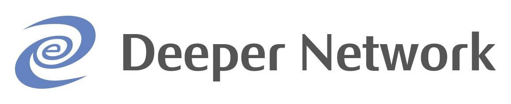

## Summary

Two sentences about who you are and what you’d like to build. Indicate if you are building a Light Gateway, or a Full Gateway. Bonus points to include photos and links.
  * We are creating a plug-and-play USB device that will serve as an all-in-one indoor gateway by simply plugging the USB device into our Deeper Connect hardware.

  
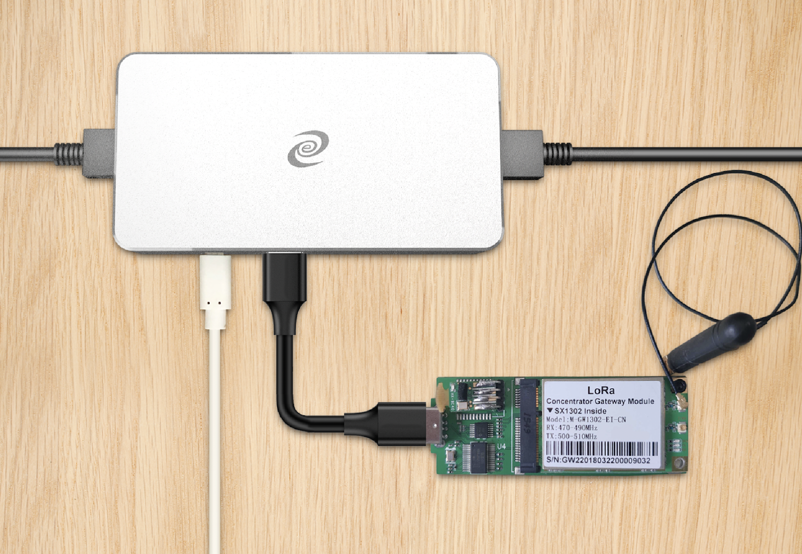

## Company Information

  * What is your company name?
    - Deeper Network Inc.

  * How long have you been in business?
    - Since 2019

  * What kind of products have you created?
    - Deeper Network leverages cybersecurity, network sharing, and blockchain technology to empower the real users of the internet. Our flagship product, Deeper Connect Mini, has created a crowdfunding record of $2.7M on Indiegogo. It is a top 10 project among 1M+ projects in Indiegogo history.

    
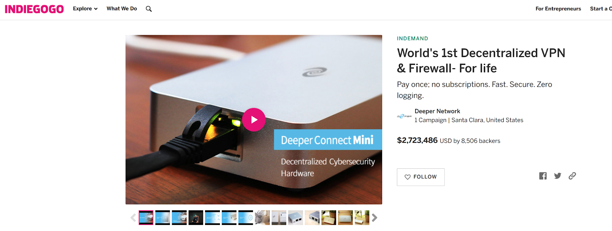

    - Deeper Network is building both the Web 3.0 infrastructure and the Web3.0 gateway for everyone. We have developed four generations of Deeper Connect:

    
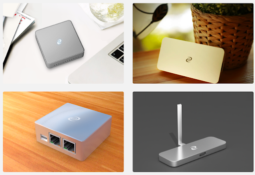

  * How many have you sold?
    - 20,000+ units

  * What brought you to Helium etc?
    - Deeper Network is a blockchain project with a very active community. Many community members have constantly asked the question if Deeper Connect will be able to support Helium's mining. Therefore, we have spent two weeks building a prototype and found that it is possible. We believe that it would be an exciting opportunity to combine cybersecurity and IoT, and that’s why we would like to apply for HIP19.

## Product Information

What are you building?
  - In order to incorporate cybersecurity into the IoT network, our plan is to integrate Deeper Connect with the Helium Miner. We packaged the Helium's LoRaWAN module in a USB extender and inserted this extender into the USB port of Deeper Connect. From there, Deeper Connect users just need to purchase a Helium LoRa extender and they will be able to mine HNT.

What’s so great about it?
  - Deeper Connect is also a mining rig itself. It uses the consensus mechanism of PoCr (Proof of Credit) to mine DPR, a cryptocurrency distributed by Deeper Network. It can be even more attractive to users, as well as a Win-Win opportunity for both Helium and Deeper, if the addition of a Helium LoRa extender will allow the mining of two cryptos (HNT+DPR). The combination of IoT + cybersecurity will also bring greater imagination to the cryptocurrency market.

  * What is your approximate price point?
    - $399

  * Detailed hardware designs, including relevant parts
    - The product is an analog LoRa gateway module developed based on Semtech's new generation LoRa gateway chipset SX1302, using standard USB interface hardware. (Additionally, we also integrated an ECC chip and a bluetooth chip.)
    - Deeper Connect Mini Spec
      - RK3328 SoC, Quad Core Cortex-A53
      - 2GB memory
      - 8GB emmc
      - 2 Gigabit Ethernet

  * Evidence of a functioning prototype - photos, videos. Renderings are OK but physical prototypes are much, much better.

  
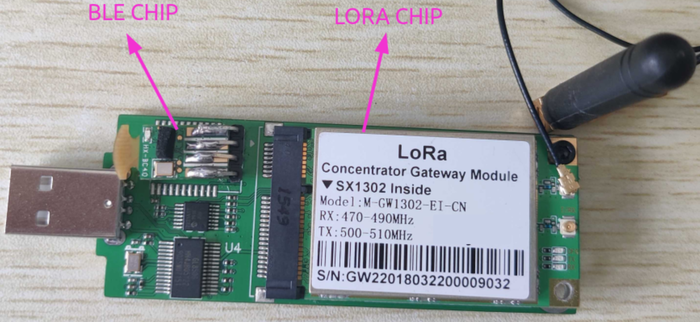

  
Figure 1. Helium module front side

  
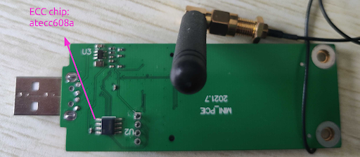

  
Figure 2. Helium module back side

  

  
Figure 3. Deeper Connect Mini + Helium hotspot USB module

  
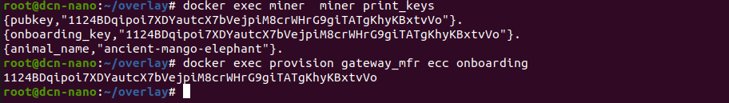

  
Figure 4. Ecc module test result

  
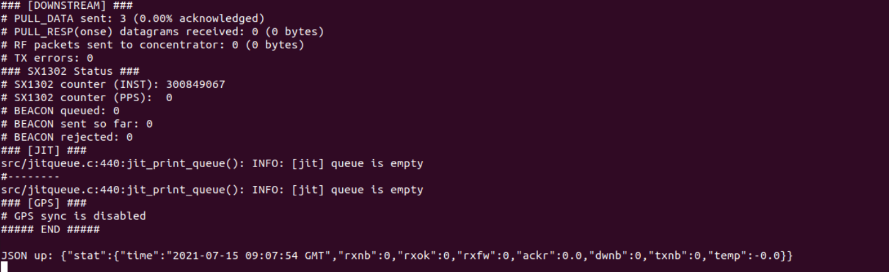

  
Figure 5. Packet forwarder test result

  

  
Figure 6. Start gateway_config

  

  
Figure 7. Hotspot was found

  
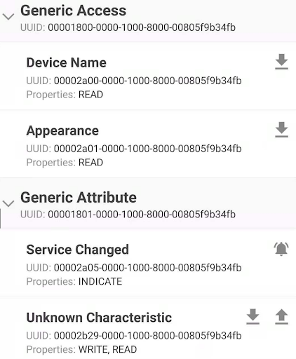

  
Figure 8. BLE test result with BLE tester APP

  
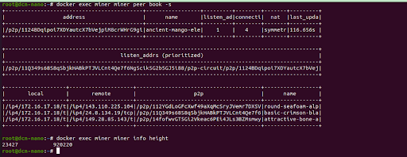

  
Figure 9. Miner test result

  * Your plan for software setup and configuration for the devices. This would presumably include remote updates and the ability for hosts to change wifi settings, via Helium's official app or otherwise.
    - We will use Helium Hotspot App + BLE to support configuration

  * What is your expected production and delivery timeline? Photos and videos are welcome.
    - We plan to start the production in August 2021

## Previous shipments

  * Have you shipped anything in the past?
    - Yes

  * Which countries have you previously shipped regulatory FCC or CE approved products?
    - We have sold our Deeper Connect products to more than 150 countries.

    
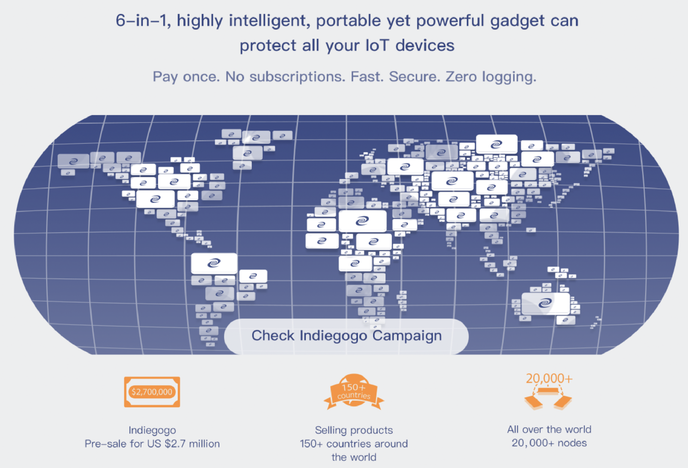

  * Which countries do you plan to ship to?
    - USA, China, European countries

## Customer Support

  * How will your customers be able to contact you for support for your products?
    - Our customer service team has 6 employees and we provide customer support by email at tech.support@deeper.network.

  * For how long? How are you planning to handle repairs and replacements?
    - We provide users with free consultation services for life and a one-year product warranty for quality assurance. If a quality defect occurs within a year, we will offer a new product for free.
    - For defective devices, we will return them to our warehouses located in Hong Kong, in the US, or in Europe, and then replace them with the latest devices for our users. The warehouse staff will then send the defective devices back to our factory in Shenzhen for testing and repair.

## Hardware Security Element

The community is concerned about devices that can be easily hacked, specifically by copying their swarm_key files. Applications should include plan for how the devices will be secured, potentially including:

  * Encrypted/locked-down firmware
    - Deeper Connect uses triple encryption technology to guarantee the security of the device storage. Even if the hardware device is lost, nobody can crack into the data stored on the device.
    - Triple encryption technology includes:
       - Block device encryption
       - File system encryption
       - File encryption
    - Please check Chapter 3.3 of our [Whitepaper](https://deeper.network/whitepaper_en.pdf) to find more details.
    - And you also can check the [VM version of Deeper Connect](https://dl.deepernetwork.org/Release-V2.zip), you will find you can’t mount the virtual disk because it is triple encrypted.

  * Encrypted storage of the miner swarm_key, either via disk encryption or hardware measures like an ECC chip, Encrypted buses, potting and other anti-tampering measures.
    - The swarm_key is stored in the ECC chip (ATECC608A).

  * Willingness to submit a prototype for audit, and sharing those audit results publicly (pass or fail)
    - Yes, we would provide a prototype for the audit and will publish the results.

## Hardware Information

Please let us know:
  * Which security (swarm) element are you using?
    - Atecc608a

  * Which LoRa chipset are you planning to use in your gateway?
    - SX1302

  * Where are you sourcing your components from?
    - Our vendor is Rejeee: http://www.njrjzn.com/

  * How many radio modules/ concentrators can you procure?
    - 10,000+

## Manufacturing Information

  * Have you built and delivered radio hardware products before?
    - Yes, we have built a wifi dongle from scratch. This wifi dongle is an extender for Deeper Connect.

  * Have you built gateways before?
    - Yes, the Deeper Connect device is a home gateway product.

  * How many gateways did you make?
    - 20,000+

## Proof of Identity

Per typical KYC/AML procedures, proof of identity for major shareholders (25%+ ownership) will be expected to be provided privately to representatives from Helium Inc or DeWi board members. This will be attested and publicly confirmed by those representatives, e.g. as GitHub comments.
  * To be submitted privately to DeWi.

## Budget & Capital

  * How many of these are you hoping to make and sell?
    - 10,000+

  * How much money will be required up-front?
    - $300,000

  * How much money do you have on-hand?
    - $10M+

  * and how much do you have access to?
    - $10M+

  * What is your plan for additional financing if required?
    This is the second biggest risk in new hardware ventures -- getting almost over the line and then running out of cash.
    - We can get more cash by selling our own products

Deeper has received $10M+ in investment funds and we have also accomplished over $1M in sales in the month of June. The company has achieved a steady cash flow from our own product sales.

## Risks & Challenges

Please tell us about some of the challenges that would prevent these products from becoming a reality, and how you might address them.

  * This is the first time for Deeper to encapsulate the Helium module fully into a USB device, which includes the LoRaWAN chip, an ECC chip, and a bluetooth chip. Additionally, since Deeper's AtomOS operating system uses IP multiplexing technology (similar to a transparent proxy), we need to modify AtomOS and allow remote connections from other Helium Miners. Other challenges come from the integration of Helium's own software, including Miner, gateway-config, and Helium Hotspot App.

  * We have a top-of-the-line hardware engineering team and they were able to design a suitable USB module within a tight schedule. Since we are familiar with the concept of blockchain as well as embedded development (Deeper Network is also a project of embedded device + blockchain), despite the few problems that we have encountered during the porting process, we were able to find a solution after some research in the source code and at docs.helium.com.

## Contact info

  * Email - russell.liu@deeper.network
  * White paper - https://deeper.network/whitepaper_en.pdf
  * Twitter profile - https://twitter.com/deeper_network
  * Facebook profile - https://www.facebook.com/deeper.network
  * Other social profiles - http://t.me/deepernetwork (telegram)
  * Website - https://deeper.network
  * Payment methods available - USDT, BTC, ETH, BoA checking account, PayPal
  * Regions covered / shipped to - USA/China/Europe
