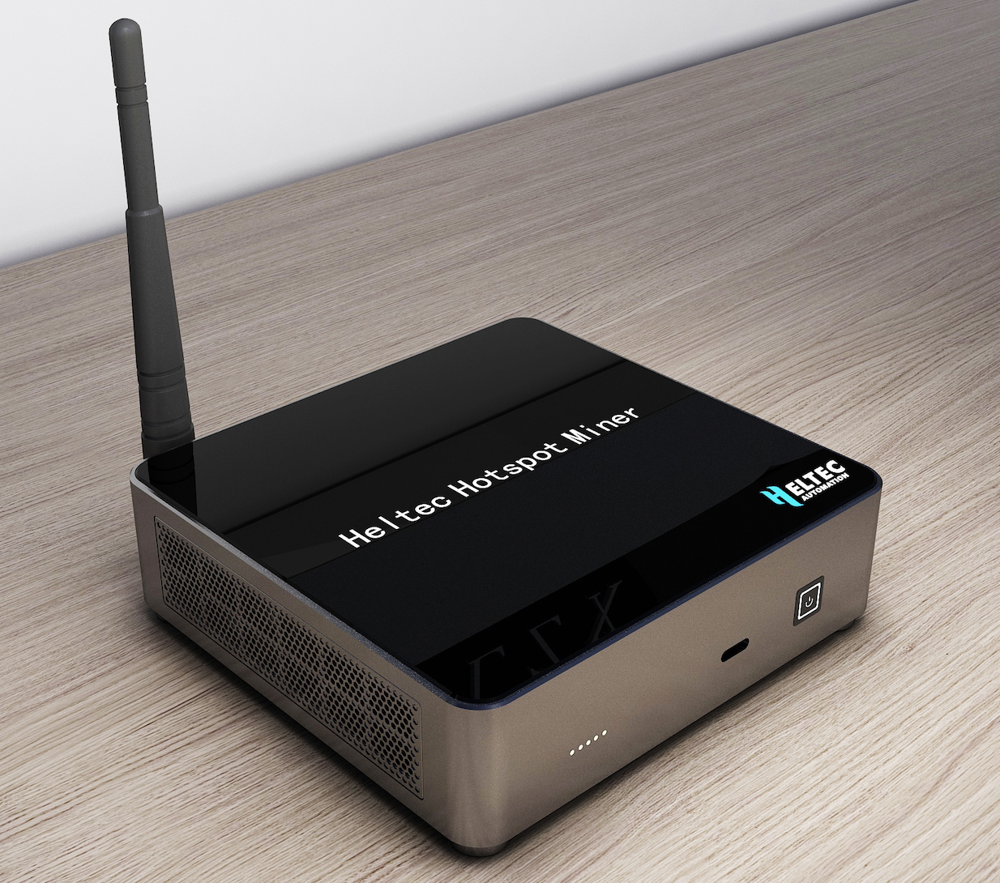
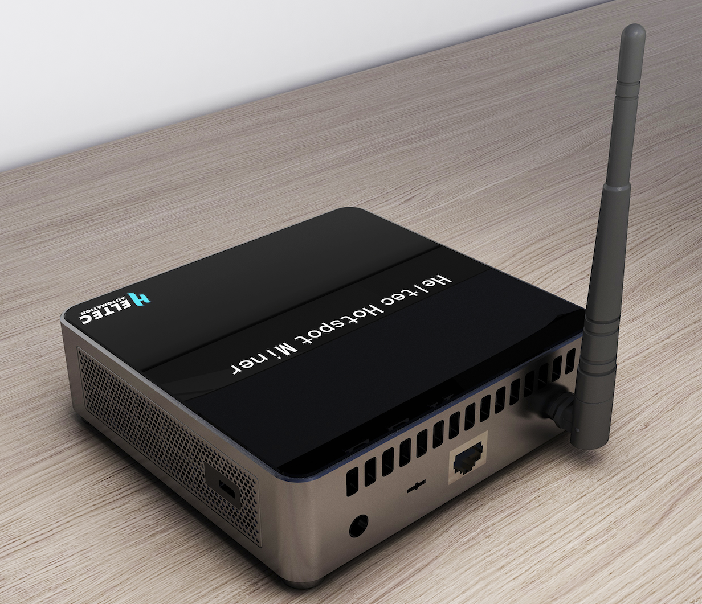
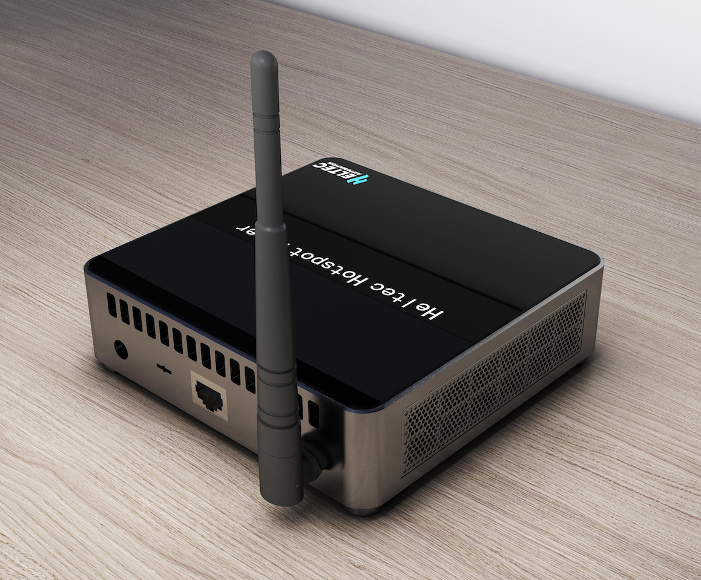
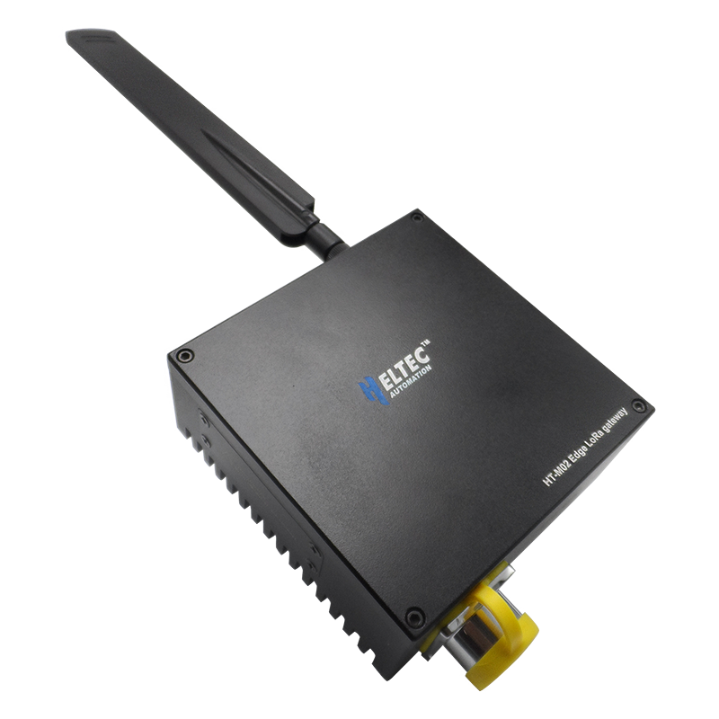
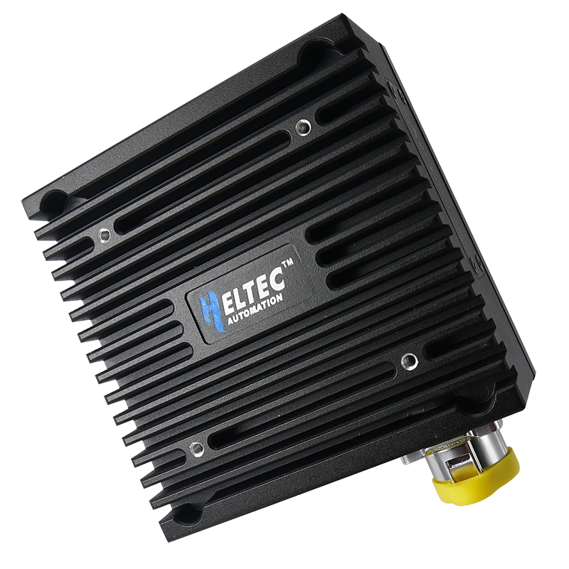
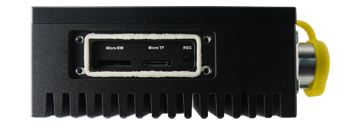

# Chengdu Heltec Automation Technology Co., Ltd.
### Application to become an approved third party manufacturer as per [HIP19](https://github.com/helium/HIP/blob/master/0019-third-party-manufacturers.md)

## Summary

The Heltec Automation is an all-in-one IoT solutions provider and manufacturer mainly based on LoRa/LoRaWAN. We provide systemized products line ranging from LoRa end nodes, LoRaWAN gateways, to LoRa cloud servers. Our aim is that all users can get a complete solution using any of our products.

It would be greatly appreciated that if two of our tailored regular Hotspots can be in the Helium family. One is "Heltec Indoor Hotspot", it's an exclusively designed product for the Helium network. The other one is "Heltec Outdoor Hotspot", this hotspot is an upgrade version of our current [HT-M02 Edge LoRa Gateway](https://heltec.org/project/ht-m02/). And a Light Hotspot based on [HT-M01S Indoor Gateway](https://heltec.org/project/ht-m01s/) is at the development stage.

## Company Information

Founded in 2014, We started to develop and sell LoRa/LoRaWAN products from Q3 2017. With extensive experience in developing LoRa devices and relevant cloud computing, In 2019, we made the Arduino and its relevant toolchain migration for ASR650X series SiP. This is the first time that PSoC series MCU can run Arduino perfectly (We call it [CubeCell Series](https://heltec.org/cubecell_overview/)). Our products are used by partners all over the world,  even can see our products in the remote Antarctica (Scott Base).

We have our own SMT processing factory. Therefore, the R&D, production, and testing process are all conducted by ourselves,  this enables us to have rigid control of producing process and product quality.

In our opinion, the Helium blockchain provides a decentralized public network that interacts with the blockchain. Everyone is a contributor to this network and benefits from it. This will be of great help with the large-scale deployment of LongFi/LoRaWAN networks, makes the Internet of Everything possible in the near future. This is the reason why we want to be one of the officially approved hotspot manufacturers.

Read more about us please refer to [this page](https://heltec.org/about_us/).

## Product Information

The following are our current LoRa related products:

- Heltec LoRa Gateway series: [Heltec Gateway Series](https://heltec.org/proudct_center/lora/lora-gateway/)
- Heltec LoRa Node series: [Heltec LoRa End Node List](https://docs.heltec.cn/#/en/products/lora/lora_node/heltec_lora_node_list)

In the process of R&D and production of LoRa products, we have accumulated a wealth of experience in product design, structural design, and manufacturing. In our design concept, market-oriented products come first. The "market-oriented" here shouldn't just be what users need, but it is decided by many factors like whether the upstream supply chain can meet the production needs or not, whether the chips, components, etc. required by the product have a sufficient life cycle or can they still be bought in the market?

### Heltec Indoor Hotspot

&nbsp;

&nbsp;

This is a brand new product for the Helium community. For the indoor deployment, We had finished hardware & software development and it runs smoothly during the test process, now we are making the sample of the shell. If all goes well, we can make the rigorous-tested machine before 10th, June.

**Estimated price:** 369 USD

**Hardware information:**

| Resource                 | Description                                                  |
| ------------------------ | ------------------------------------------------------------ |
| CPU                      | Quad core Cortex-A53 64-bit CPU 1.5GHz                       |
| RAM                      | 2G DDR4                                                      |
| ROM                      | 32G eMMC 5.1                                                 |
| Wi-Fi                    | IEEE 802.11a/b/g/n/ac 2.4G/5G double frequency with internal antenna |
| BlueTooth                | BT V5.0 EDR with internal antenna                            |
| Ethernet                 | 10/100M with PoE function (need external converter)          |
| Security                 | First choice ATECC608, if it's not enough in the market, use ATECC508, RJGT102WDP8 / RJGT102WDT6 instead. |
| LoRa Baseband Chip       | SX1308 + SX1255/7, 8 channels                                |
| LoRa Supported Bands     | RU864, IN865, EU868, US915, AU915, KR920, AS923, CN470.      |
| Cooling Fan 1 | System temperature detection and cooling fan management system. |
| Host Size (mm)           | 120 * 115 * 33                                               |

1* -- *According to our experience in the past, SX1308 will generate a lot of heat during work, and long-term overheating will affect the stability of the system, so we added a cooling fan to the system.*

**Interface:**

| Interface                            | Description                                                  |
| ------------------------------------ | ------------------------------------------------------------ |
| Power Source Input x 1               | 12V DC.                                                      |
| RJ45 Socket x 1                      | Ethernet connection.                                         |
| SMA Socket x 1                       | LoRa antenna with SMA socket.                                |
| Anti-theft Lock Hole2 x 1 | Fixing and anti-theft.                                       |
| Button x 1                           | Single trigger -- Network configuration via Helium APP; Long press -- System power off. |
| Type C Scoket x 1                    | Used to flash firmware during production.                    |
| LED x 5                              | System status (Power, System, Miner Satatus, LoRa TX, LoRa Rx). |

2* -- *With the popularity of the Helium network, we believe the hotspot will become valuable stuff, but it is entirely possible will be deployed in an unguarded place so we added a keyhole on the metal fuselage.*

**Time line:**

- Submit PR to HIP 19 -- Before June 1st. 2021
- Dewi KYC verification and Helium Hardware verification -- June 2021
- Hardware FCC/CE/IC etc. certifications -- June 2021
- Onboarding integration and manufacturing Heltec Indoor Hotspot while Helium Community approval -- Early July 2021
- Pre-sale -- Expected on July 10th, 2021
- Shipping to customers -- Early August 2021

**Hotspot config & upgrade:** The Heltec Indoor Hotspot will include OTA upgrade and auto-upgrade function, with the one-key configuration button, users can config the hotspot via Helium's official APP.

**Production capacity:** We plan 3000 sets to be produced for the first time, and according to market demand, 5000～10000 sets can be produced per month in the future.

### Heltec Outdoor Hotspot

&nbsp;

&nbsp;

The "Heltec Outdoor Hotspot" is an upgrade version based on [Heltec HT-M02 Edge LoRa Gateway](https://heltec.org/project/ht-m02/). This gateway already sold ~2000 sets since Q3 2019. It has an all-aluminum shell and a special heat dissipation structure (this structure has obtained a Chinese patent). But judging from our daily work and user feedback, this product has the following problems:

1. The internal structure is complicated, resulting in low assembly efficiency;
2. In harsh environments, the waterproof performance is not good enough, such as in the seaside of Indonesia, the continuous tropical high temperature and the humid, high-salt air, after a period of operation, the waterproof performance becomes very poor.

We will improve the above issues in this upgrade. In addition to the circuit upgrade, mainly improve the protective structure and strengthen lightning protection measures. The upgrade process already began and will end in August 2021. Mass production will begin in September. Monthly produce is expected to be 3000-5000 sets.

**Estimated price:** 469 USD

**Hardware information:**

| Resource             | Description                                                  |
| -------------------- | ------------------------------------------------------------ |
| CPU                  | Quad core Cortex-A53 64-bit CPU 1.5GHz                       |
| RAM                  | 2G DDR4                                                      |
| ROM                  | 32G eMMC 5.1                                                 |
| Wi-Fi                | IEEE 802.11a/b/g/n/ac 2.4G/5G double frequency with internal antenna |
| BlueTooth            | BT V5.0 EDR with internal antenna                            |
| LTE & GNSS           | SIM7600G-H with global LTE network support, and GNSS including BeiDou, Galileo, GLONASS, GPS |
| Security             | First choice ATECC608, if it's not enough in the market, use ATECC508, RJGT102WDP8 / RJGT102WDT6 instead |
| LoRa Baseband Chip   | SX1302 + SX1250, 8 channels                                  |
| LoRa Supported Bands | RU864, IN865, EU868, US915, AU915, KR920, AS923, CN470.      |
| Host Size (mm)       | 125 * 125 * 52                                               |
| Protection level     | IP67                                                         |

**Interface:**

| Interface               | Description                                                  |
| ----------------------- | ------------------------------------------------------------ |
| Power Source Input x 1  | 110V / 220V AC.                                              |
| Micro SIM Card Slot x 1 | SIM card.                                                    |
| SMA Antenna Socket x 4  | LoRa, Wi-Fi / BlueTooth, GNSS, LTE.                          |
| Button x 1              | Single trigger -- Network configuration via Helium APP; Long press -- System power off. |
| Type C Scoket x 1       | Used to flash firmware during production.                    |
| LED x 5                 | System status (Power, System, Miner Satatus, LoRa TX, LoRa Rx). |

**Time line:**

- Helium Hardware verification -- Middle August 2021
- Hardware FCC/CE/IC etc. certifications -- Middle August 2021
- Onboarding integration and manufacturing -- Early September 2021
- Pre-sale -- Expected on September 10th, 2021
- Shipping to customers -- End October 2021

**Hotspot config & upgrade:** The Heltec Outdoor Hotspot will include OTA upgrade and auto-upgrade function, with the one-key configuration button, users can config the hotspot via Helium's official APP.

## Customer Support

- Provide detailed documents and instructions in [Heltec Document Page](https://heltec-automation-docs.readthedocs.io/);
- [Heltec Community](http://community.heltec.cn/);
- [Discord Channel](https://discord.gg/QbWcMdUa);
- [Support Email](support@heltec.cn);
- WeChat and QQ for China mainland;
- Remote SSH access to issues Hotspot;
- 1 Year warranty for hardware;
- Defects due to manufacturing will be replaced FOC, naturally damaged or user damaged can be sent back for repair, the user will pay for the repair costs, freight, tariffs, etc.

## Hardware Security

All the miner variants feature a secure element, powered by ATECC608B from Microchip. And the key data to be secured (`swarm keys`, `API tokens`, etc) are kept in a separate partition which is encrypted and secured by using the secure element. In order to deal with the possible tension of the ECC608 chip, we reserve an alternative based on RJGT102WDP8 / RJGT102WDT6.

In addition to that, before the firmware upgrade process will perform the hardware and copyright verification process first. We are very experienced in this area. Beginning in 2020, every product we produce has a serial number binding, which is used to verify authenticity, and unlock software permissions, obtain corresponding technical information and support.

## Manufacturing Information

We sell more than 300,000 sets of LoRa devices each year, including LoRa gateways, LoRa end nodes, LoRa development boards and LoRa modules. And this data is constantly growing. All the products are produced in our self's SMT factory. Maximum to 600,000 components can be assembled every day. Therefore, while producing our own products, we also provide PCBA services to our customers. In this process, we have reached a good and stable cooperative relationship with many suppliers, which can ensure the stable supply of various devices.

If we have fortunate to become an approved hotspot manufacturer, we will stop provide PCBA services public. Our factory will fully produce, test, assemble hotspots and other products of Heltec. 

## Proof of Identity

To be submitted in private.

## Budget & Capital

We have enough funds available to produce large volumes. This money is independent of our daily working capital. 

## Risks & Challenges

From the perspective of Q3 2020, the shortage of chips globally become a barrier for most hardware manufacturers.

Through comprehensive assessment, we identified that the biggest challenge is since Q3 of 2020, the worldwide shortage of chips and electronic components, also the lead time cannot be guaranteed. I believe this is also a barrier for most hardware manufacturers.

As our accumulated experience in the area, when designing the products, we deliberately avoided devices that are very public. And we have a certain amount component in inventory to deal with the initial production.

## Other information

* Desired Discord support channel name - [Heltec Automation](https://discord.gg/QbWcMdUa)
* Twitter profile - [@HeltecOrg](https://twitter.com/HeltecOrg)
* Website - [https://heltec.org](https://heltec.org/)
* Payment methods available - Most credit cards including Visa, Mastercard, JCB, AliPay, Wechat Pay, Bank Transfer. Apple Pay is applying for activation.
* Regions covered / shipped to - We have [more than 20 agents / distributors worldwide](https://heltec.org/distributors-list/), products will ship worldwide to regions where product is certified.
