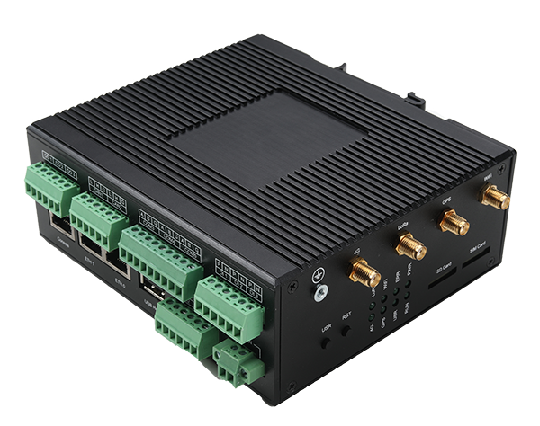
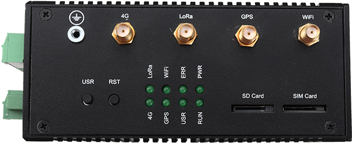

# Xi'an i2SOM Information Technology Co., Ltd.
### Application to become an approved third party manufacturer as per [HIP19](https://github.com/helium/HIP/blob/master/0019-third-party-manufacturers.md)

## Summary

Xi'an i2SOM is a professional industrial product solution provider, our team has many years of experience in industrial product design. We have developed products on several chip platforms, such as NXP iMX6/iMX7/iMX8, Ti AM335x/AM437x, ST STM32MP1, etc.

## Company Information

Founded in January 2019, i2SOM is a high-tech company focused on providing industrial products and services. i2SOM provides industrial control boards, System-on-Module boards, system development services and more for customers in the industrial sector.

i2SOM is located in Xi'an, China, with an office in Shenzhen for hardware production and supply chain management.

## Product Information

The standard gateway has been developed and is in mass production.The lite version of the gateway for the Helium light hotspot is still under development.

### Light hotspot Standard version (In mass production)

Product module is i2X-6UB-GW

* Single core ARM Cortex-A7 32bit 800Mhz
* DDR3 512MByte
* eMMC flash 4GByte
* 2x 100Mbps Ethernet
* 4x RS485 serial port
* 1x RS232 serial port
* 2x CAN
* 3x Digital Input
* 3x Digital Output
* 1x Serial Console (RJ45 holder)
* WiFi
* LoRa
    * Concentrator uses RAK2247 model from RAKwireless
* GPS
* 4G LTE
* Power: DC 9 ~ 36V
* ECC608: Not supported in the current product, later version will include

Figure 1: i2X-6UB-GW  Side view

Figure 2: i2X-6UB-GW  Antenna

### Light hotspot Lite version (In development)

* Single core ARM Cortex-A7 32bit 800Mhz
* DDR3 256MByte
* NAND flash 256MByte
* 1x 100Mbps Ethernet
* ECC608
* WiFi
* LoRa
    * Concentrator uses RAK2247 model from RAKwireless
* GPS
* Power: DC 9 ~ 36V

## Customer Support

We offer a variety of support options for our customers.

* Discord
* email
* QQ Group for Chinese users

In addition to the above mentioned support methods, we will also provide rich WiKi documentation for the product and record corresponding videos for uploading to youtube platform.

## Hardware Security

Our current product does not provide an encryption chip for now, but the next version will include an ECC608 chip for data security assurance.

## Manufacturing Information

We have extensive experience in production management and we rely on our partner factories to assemble and test our products.

## Proof of Identity

To be submitted privately to DeWi.

## Budget & Capital

Currently, our standard product shipments are at 4Kpcs/Year, so the lite version product shipments are expected to be at 2Kpcs/Year.

## Risks & Challenges

Due to the general price increase of chips and materials this year, the production cycle will increase.
Sourcing components continues to be challenging in the current market – several supply chain issues affecting the whole industry – but we have secured enough stock to produce the quantities listed above.

## Other information

* Twitter profile - https://twitter.com/i2somtech
* Website - https://www.i2som.com
* Regions covered / shipped to – Worldwide
