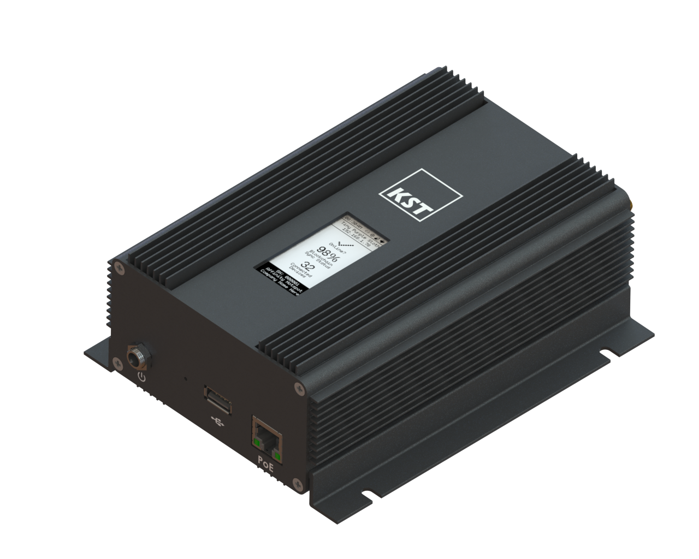
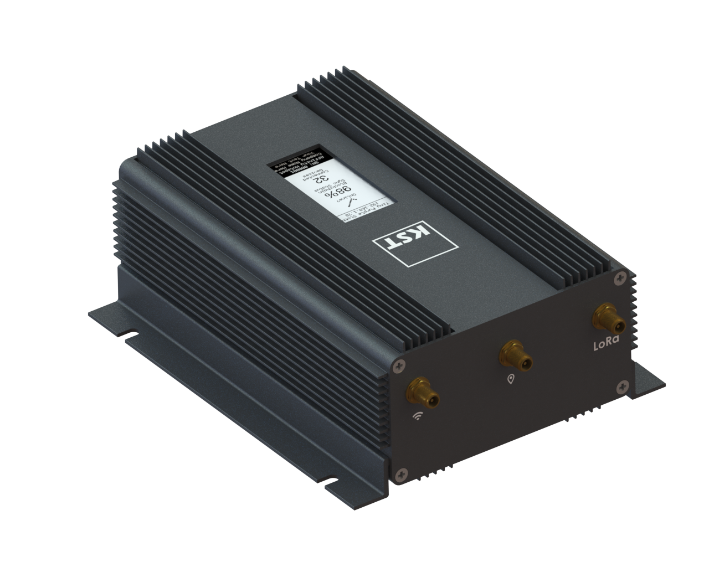
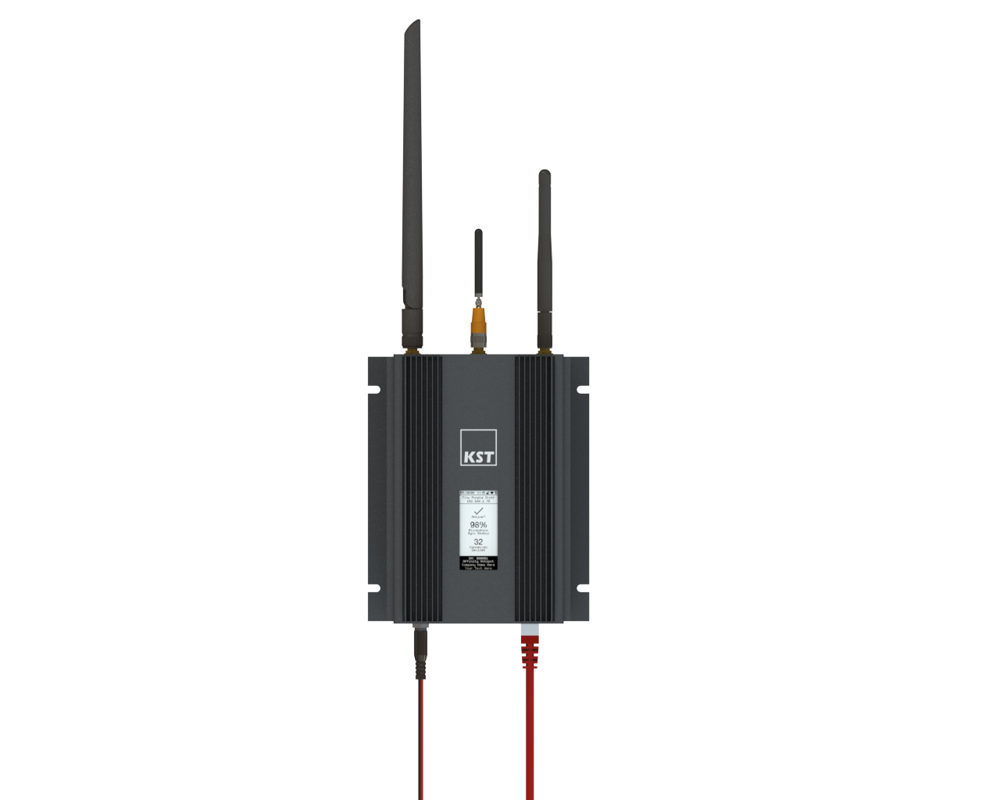

# KS Technologies, LLC
### Application to become an approved third party manufacturer as per [HIP19](https://github.com/helium/HIP/blob/master/0019-third-party-manufacturers.md)

## Summary

KS Technologies, LLC (KST) has built both the Light and regular Helium Hotspot. In fact, KS Technologies was one of the first companies to earn a Golden Ticket from Helium for our Light Hotspot. KST’s first product to market is a regular Hotspot, the KST Affinity Gateway, which will bring much-needed features to businesses that have multiple Hotspots in multiple locations. The KST Affinity Gateway will include disruptive features such as a wallet aggregator, remote health monitoring, PoE, and extended temperature ranges.

## Company Information

KST is an 18-year-old company located in Colorado Springs, Colorado. KS Technologies specializes in IoT products, test and measurement, private label products, and engineering services. Founded by a former Agilent IC engineer, KST utilizes Fortune 50 processes and procedures when developing both private label and in-house products. We bring a multidisciplinary approach to design and engineering. We have system architecture, hardware, firmware, mechanical, and UI/UX engineers on staff. KST develops products for other companies and ourselves. KST’s current product portfolio consists of IoT sensors and measurement products. We have sold thousands of products to Fortune 50 companies as well as small businesses and municipalities. Helium is well known to KST, we have participated in joint webinars together. KST recognized the need for a Helium hotspot that is more attuned toward business clients with multiple locations and hotspots. 

## Product Information

The Affinity Gateway includes an industrial-grade Compute Module combined with an 8 channel low-phase noise LoRaWAN concentrator card built by KST. We are not sourcing electronics from any third party.

The Affinity Gateway includes:
* Barrel jack for power
* Power-over-Ethernet (PoE)
* USB Type-A
* Embedded digital display
* WiFi
* Cellular
* GPS
* External Antennas

The Affinity Gateway is tamper-proof, offers tamper-detect, and can be wall-mounted securely.

The Affinity Gateway allows for:
* Enterprise-level commissioning and wallet aggregation for Affinity Fleets of Devices
* USB-based local configuration
* Store-and-forward during network downtime situations
* Deployment of custom edge applications by Enterprise
* Remote configuration and setup via Secure Dashboard
* Firmware Over-the-Air (FOTA) Updates
* Access to remote management and Affinity health data
* Cloud-based GPS in locations where hardware GPS is unavailable
* No App support will be available for the Helium App

KST has 30 lab prototypes currently in production. We will produce 300 production prototypes to be completed in Q4 2021 and expect to be in full production by Q1 2022.

## Previous shipments

KST ships thousands of devices to North America and Europe. We are well versed in the FCC and CE requirements and the approval process. KST plans to ship Affinity to North America.

## Customer Support

North American customer support will be handled in the following manner -
1. Immediate, 24-hour/7-day per week support via automated response
2. 9AM - 5PM Mountain Time (Colorado) Chat Support
3. US-based, dedicated KST Team Member Per Enterprise Customer

## Hardware Security Element

The Affinity Gateway includes an ECC608 Secure Element authentication chip. This critical component is glob-topped or similarly treated to heighten physical security.

The Affinity Gateway includes a Factory Bootloader, Factory Image, and a Factory ROM database that is non-volatile and not impacted during FOTA. All firmware images are key-signed, among other secure technologies.

The Affinity Gateway includes an Intrusion Detection System (IDS) to detect threats, access attempts or any unauthorized processes starting up or running.

The Affinity Gateway does not support the installation of any applications on the Gateway by the end customer/client.

Each Affinity Gateway has a unique key and secret, issued at the factory, that provides access to communications.

Cloud “alarms” exist for specified conditions reported by Affinity Gateways.

Prototype to be submitted to Helium for audit.

## Hardware Information

Swarm key will be stored on an ECC608 Secure Element authentication chip.

KST will use the SX1302/03 & SX1250 chipset. 

KST has long standing relationships with semiconductor companies and distributors and will procure parts from these channels.

KST will build our own mini-PCIe card. Components for 2021 quantities have been procured.  We are currently working on securing components for 2022.

## Manufacturing Information

KST has built and delivered hundreds of hardware projects. We have 18 years of experience in product development and manufacturing. KST engineers and builds products for Fortune 50 companies, private label products, and we have our own product portfolio.  KST has well-established processes and procedures for road mapping and delivering products. KST has long-term relationships with component manufacturers, board fabrication companies, semiconductor companies, and SMT houses. We use US-based companies for manufacturing, thus allowing complete control and visibility to the manufacturing and supply chain. KST owns all intellectual property and manufacturing rights.

## Proof of Identity

KS Technologies is a privately held company. Proof of identity will be provided separately. 

## Budget & Capital

KST plans to produce 300 units in Q4 2021. Our annual production in 2022 will be between 5,000 and 10,000 Affinity hotspots. Component sourcing is the largest upfront cost. KST is well-capitalized to take on the engineering and manufacturing efforts. Further, KST has well-established relationships with institutions that can provide debt financing should this be required.

## Risks & Challenges

This biggest challenge is key component availability. KST engineered Affinity using our own KST mini-PCIe card and using a non-Raspberry Pi Compute Module. This reduces our dependence on a volatile supply chain. 

## Other information
 
* Contact info - info@kstechnologies.com
* Desired Discord support channel name: #KSTechnologies
* Twitter profile: [@kstechnologies](https://twitter.com/kstechnologies)
* Facebook profile: [KS Technologies, LLC](https://www.facebook.com/pages/KS-Technologies-LLC/107015177588)
* Linkedin: [KS Technologies, LLC](https://www.linkedin.com/company/ks-technologies-llc)
* Website: [https://kstechnologies.com](https://kstechnologies.com)
* Payment methods available: Credit card for new customer evaluations. / Purchase Orders for Enterprise Customers.
* Regions covered/shipped to: North America