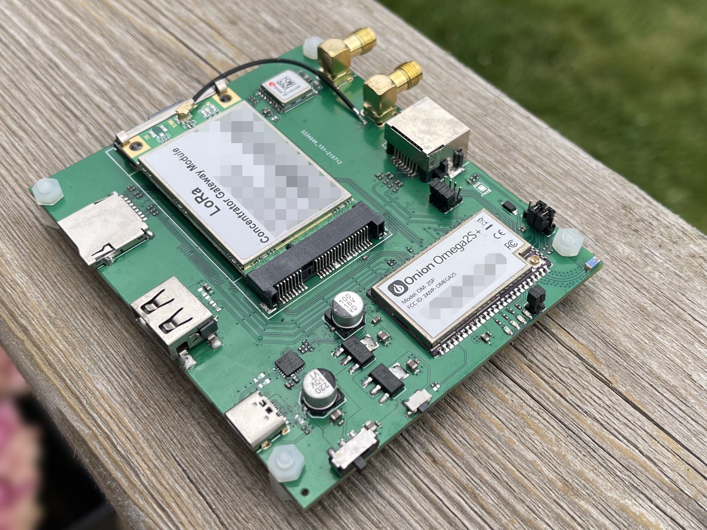
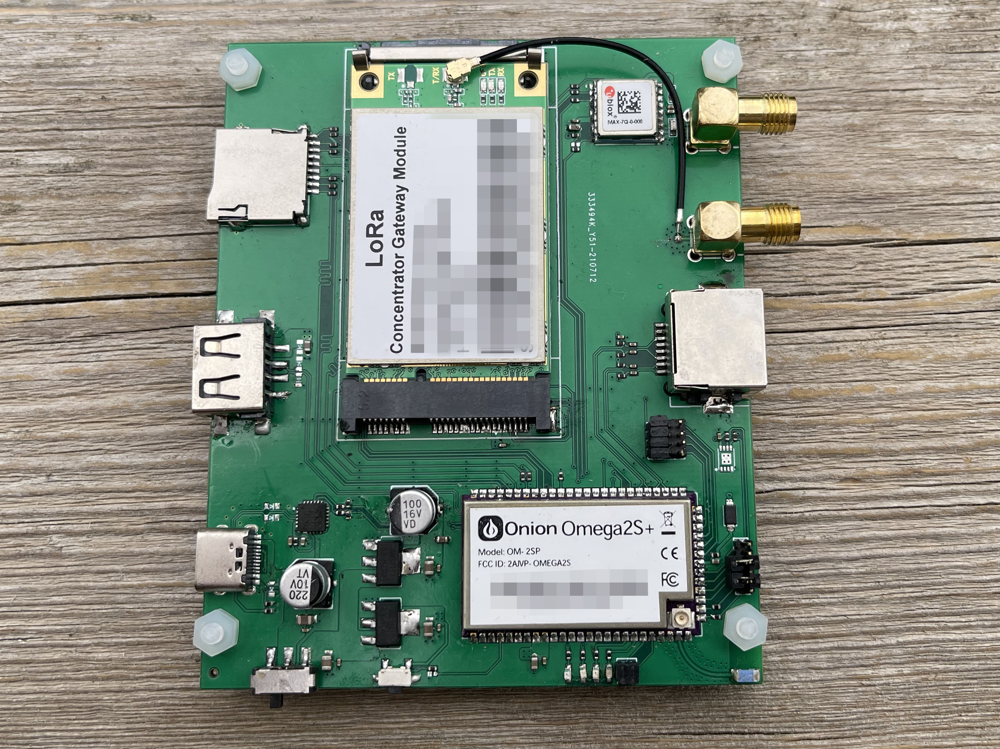
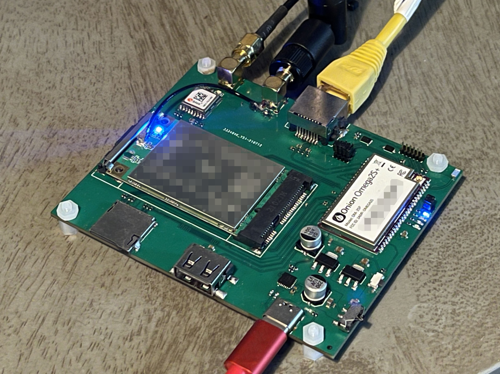
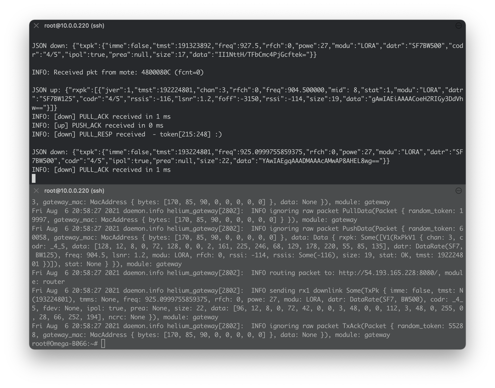

# Smart Harvest Instruments

### Application to become an approved third party manufacturer as per [HIP19](https://github.com/helium/HIP/blob/master/0019-third-party-manufacturers.md)

## Summary

Smart Harvest Instruments is a company focused on the Internet of Things and a provider of consulting services for this field.

We plan to use our expertise in hardware and IoT to build an Indoor Light Gateway for the Helium Network.

*Working prototype of Light Gateway. Design for manufacturing and enclosure design is underway.*

## Company Information

- What is your company name? **Smart Harvest Instruments Inc**
- How long have you been in business? **Operating since 2017**
- What kind of products have you created? **Smart Harvest Instruments has so far been focused on providing IoT consulting services. It is run by the same management team as Onion Corporation, where we have created WiFi + Linux modules and devices for IoT applications, the most popular being the Omega2S IoT module.**
- How many have you sold? **Onion Corporation has shipped over 500k devices worldwide since starting shipping in 2015.**
- What brought you to Helium etc? **Helium solves a real-world problem that we've encountered first-hand in our IoT consulting work. We believe an affordable and easily accessible global wireless network like Helium is the best way forward for IoT and want to help that network grow.**

## Previous shipments

> Have you shipped anything in the past?

The Helium Light Gateway will be the first product created and sold by Smart Harvest Instruments.

However, through our work at Onion Corporation we have years of experience designing, certifying, manufacturing, and shipping networking and RF products in the IoT space.

> Which countries have you previously shipped regulatory FCC or CE approved products?

Onion Corporation has shipped IoT products worldwide. The Omega2 and Omega2S product lines are FCC and CE certified.

> Which countries do you plan to ship to?

We plan to ship to North America to start. Will consider expanding to global availability in 2022.

## Product Information

**Indoor Light Gateway HL100**

- Powered by the Onion Omega2S+: 580 MHz MIPS processor, 32 MB flash, 128 MB RAM
    - Providing WiFi and Ethernet connectivity
- 8 channel SX1302 LoRa concentrator
- External LoRa antenna (3dBi)
- Microchip ATECC608 secure element for swarm key storage
- Ublox Max-7 GPS
- USB-C port (5V) for Power
- Approximate price point: $300 to $400
- Expected production timeline: Late 2021

Photos of working prototype below. Design for manufacturing and enclosure design is currently underway.

A setup wizard accessible through a web app can be used for software setup, configuration, and monitoring. The setup wizard will be available over the Light Gateway's WiFi and Ethernet connections. OTA firmware updates will keep the software up to date and secure.

After the introduction of the Indoor Light Gateway, we intend to work with the community to build additional products for the Helium ecosystem with features they deem desirable.

## Customer Support

> How will your customers be able to contact you for support for your products?

Customers can contact us through email (which will integrate with a ticket-based helpdesk) and Discord. Customers will be able to use these methods to get help with order status, shipping, and configuration issues. We also plan to create an extensive FAQ library and knowledge-base so customers can get self-served answers immediately.

> For how long? How are you planning to handle repairs and replacements?

Firmware updates and support will be offered for the lifetime of the product.

Each device comes with a 12 month full warranty - any devices that are produced with a defect or damaged during shipping will be immediately replaced within the warranty timeframe.

For devices damaged through user error, troubleshooting help and a replacement at a discounted price will be offered through email support.

Software issues will be resolved with OTA updates and help with configuration will be offered through email and the FAQ library.

## Hardware Security Element

The Indoor Light Gateway will use Microchip's ATECC608 ECC secure element chip to securely store the swarm key.

Happy to provide samples of the Indoor Light Gateway to Helium and DeWi for all testing required. We welcome all feedback and are happy to share the audit results publicly.

## Hardware Information

- Which security (swarm) element are you using? **Microchip ATECC608**
- Which LoRa chipset are you planning to use in your gateway? **SX1302**
- Where are you sourcing your components from? **We are currently working with two module makers based in China.**
- How many radio modules/ concentrators can you procure? **Between the two providers, we can procure 5k modules per month. This number is expected to scale up as the chip shortage continues to improve.**
  - **We intend to transition into making our own SX1302-based module in the second half of 2022. Will then source ICs directly from Semtech distributors.**

## Manufacturing Information

- Have you built and delivered radio hardware products before? **Yes, we have extensive experience building and shipping radio hardware products with Onion Corporation. Have shipped over 500k devices.**
- Have you built gateways before? **No. Our past work has been focused on IoT modules and devices.**
- If you have not built gateways before, are you using a third party manufacturer? **Yes, we will be using a combination of two trusted manufacturing partners for production of the Light Gateway. Both manufacturing partners specialize in making commercial and industrial network equipment. Over the course of working with these partners for 4 years, we have built a good relationship and are confident that, together, we can delivery a high quality final product.**

## Proof of Identity

Happy to provide proof of identity to DeWi and/or Helium

## Budget & Capital

The plan is to start small and then scale up as the manufacturing process is fine-tuned and depending on customer demand.

The initial run will consist of 300 to 500 units. In steady state production afterwards, we intend to produce 1,000 units per month. Our supply chain is ready to scale production up to 5,000 units per month if customer demand allows.

The company has existing service operations which are revenue-generating. A budget has been allocated for this project from this existing capital. Additional funds from within the business can be allocated to this project if needed. In case of large budget overruns, debt financing will be considered since the company has been operating for some time and has a healthy relationship with local banks.

## Risks & Challenges

Availability of components due to the on-going global chip shortage is the main challenge for this project. The key components of concern are the LoRa module and the ATECC608 ECC chip.

We believe that by starting conversations with key suppliers early, leveraging our strong relationship with our manufacturing partners, and keeping a surplus of key components on-hand will effectively de-risk production.

We believe transparency is the best policy and will keep our customers informed every step of the way. If we do encounter any hiccups, speed bumps, or road blocks, we will be open and transparent about the issues and how they affect our delivery timelines.

## Other information

- Contact info (* required) - **Lazar Demin** - helium@smartharvest.ca
- Website - [http://smartharvest.ca/](http://smartharvest.ca/)
- Payment methods available - Major credit cards (through Stripe)
- Regions covered / shipped to - USA/Canada (initially)
