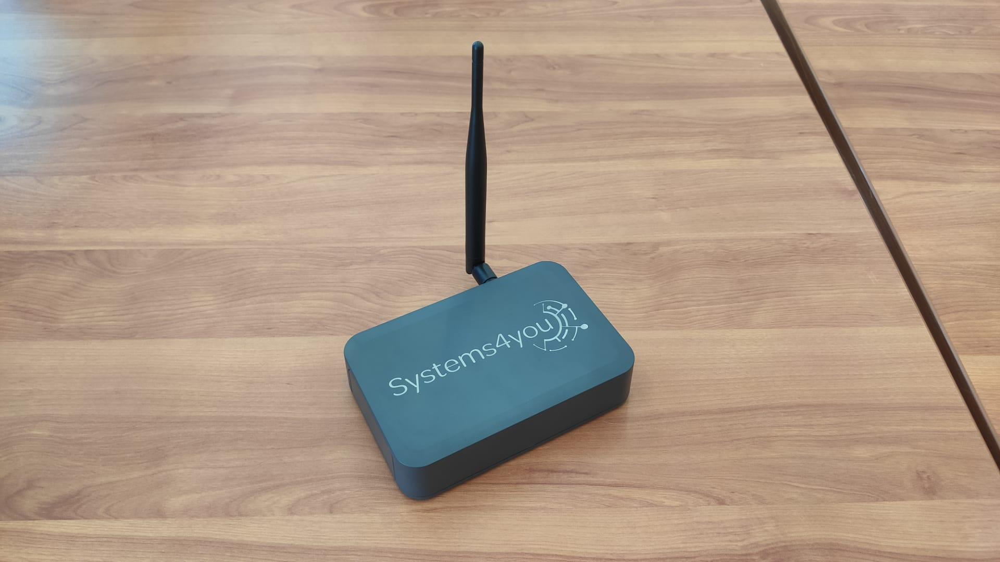
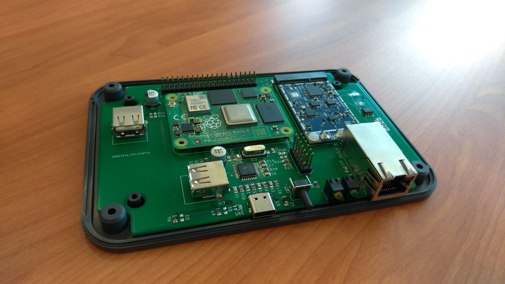

# Systems4you
### Application to become an approved third party manufacturer as per [HIP19](https://github.com/helium/HIP/blob/master/0019-third-party-manufacturers.md)

## Summary

We design Hardware / Software communication solutions according to the unique needs and characteristics of each of our customers.

## Company Information

Systems4you (https://systems4you.pt) is a company dedicated to the development and production of electronic systems and software, related to the internet of things and industry 4.0.

Our company was founded in 2012 and we are at the Sanjotec Business and Technological Center located in São João da Madeira, Portugal, Europe.

Our own most successful product is [SYSCNC](https://syscnc.io/en/), aimed at industry 4.0.

We believe we can add a lot when it comes to LoRaWAN communication on the Helium platform in an industrial and business environment.

## Product Information

Light Gateway:

* LoRaWAN Concentrator based on Semtech SX1302 with SX1250 radios
* CPU: Broadcom BCM2711 or Broadcom BCM2837
* 1x Ethernet port
* Wifi, BLE
* Voltage supply: 5V USB Type C
* Dimensions: 150x100x35mm
* Price: approximately 400€

Product renders:

Product photos:

The hosts will have the ability to change wifi settings, via Helium's official app.

Remote updates will be done by the Helium team.

## Previous shipments

* Have you shipped anything in the past? Yes.
* Which countries have you previously shipped regulatory FCC or CE approved products? Europe CE
* Which countries do you plan to ship to? Europe

## Customer Support

Systems4you will provide support via email and discord directly through our channels and through helium. We will offer a warranty on all hotspots sold.

Hardware Warranty:

* Hardware received by carrier: our commitment is to receive, sort and ship in less than 24 hours.

* Hardware personally received at our facilities in Portugal, Europe: our commitment is to repair in less than 4 hours.

## Hardware Security Element

To prevent cloning, modification and corrupt software, we will use EMMC storage soldered on the board. 

We will use ECC chip to store the swarm_keys.
If the security chips are not available on the market, we are available to develop one in partnership with the Helium team.

We are open to send a unit for audit if needed.

## Hardware Information

Security element: ATECC608 or a chip made by us.

Lora Chipset: SX1302 and SX1250.

We are sourcing your components from: Farnell, Mouser, TME, Semtech, Microchip.

We plan to build our own radio modules/concentrators based on the Semtech design.

## Manufacturing Information

* Have you built and delivered radio hardware products before? Yes.
* Have you built gateways before? Yes, but not using LoRa.
* How many gateways did you make? Small quantities directly to our industrial customers.
* If you have not built gateways before, are you using a third party manufacturer? No, we have our own production capacity in our facilities.

## Proof of Identity

To be submitted privately to DeWi.

## Budget & Capital

We aim to start with a lower volume and will be able to fund everything privately.

## Risks & Challenges

The chip shortage would be one of the only challenge that we can see coming up. 

We will plan accordingly and will never promise to deliver if we can’t.

We will have constant updates on our site.

## Other information

* Desired Discord support channel name - #systems4you
* Twitter profile - https://twitter.com/systems4youlda
* Facebook profile - https://pt-pt.facebook.com/systems4y
* Other social profiles - 
Linkedin: [Systems4you Linkedin](https://www.linkedin.com/company/systems4you-lda)
* Website - https://systems4you.pt
* Contact info - geral@systems4you.pt
* Payment methods available - Most credit cards including Visa and Mastercard. Bank transfer and cryptos.
* Regions covered / shipped to - Europe
