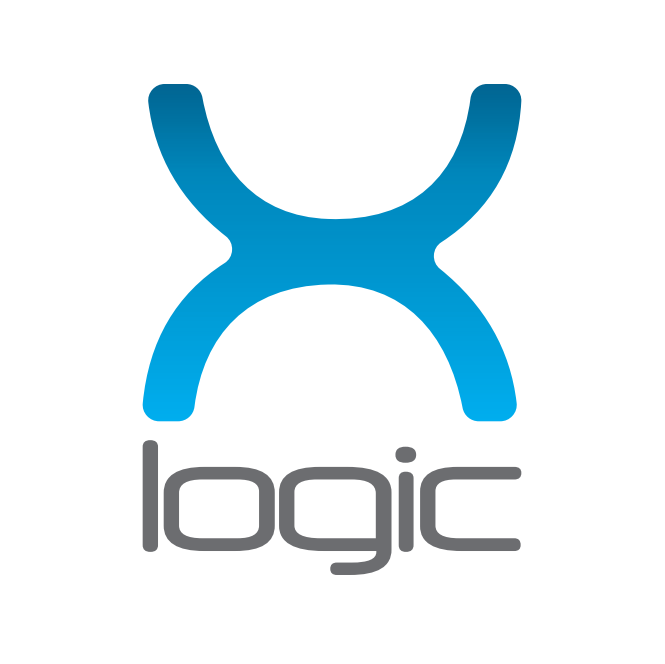
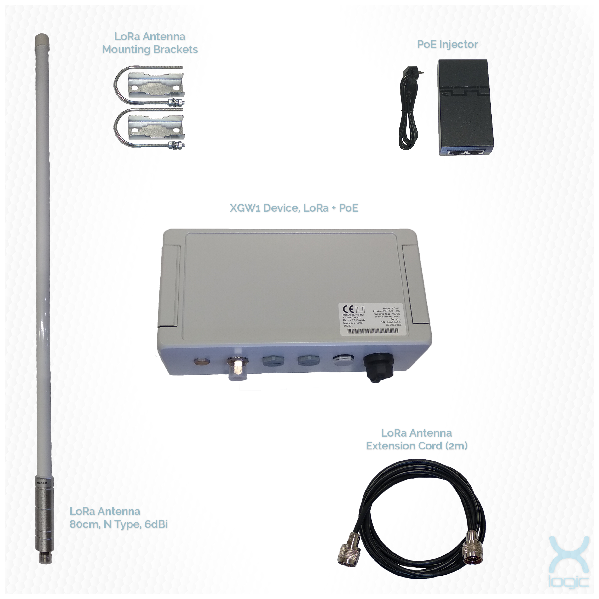

# X-LOGIC

## Summary

[X-LOGIC](https://www.x-logic.net) is an R&D hardware and embedded software company from Croatia, Europe. We have developed a full-featured LoRaWAN gateway model XGW1. 

We are proposing to use a new variant of this device as an outdoor Helium hotspot miner. The new variant is currently in the prototyping phase. It is basically the same hardware-based on Raspberry Pi Compute Module 3, but optimized for volume production and lower cost enclosure.

We can use two types of outdoor enclosures - aluminum and polycarbonate. We are building a regular hotspot. For assessment, the new hardware version will be submitted. Pictures show the current LoRaWAN gateway model XGW1, which presents a base for our hotspot device.

  

 <em>Figure 1: XGW1 gateway with 6dBi antenna and POE injector</em> </p1>
 
## Company Information

In 2013 the company X-LOGIC was founded by three professionals with experience in the field of professional electronic, telecommunication, facility management, electrical, and mechanical engineering. We currently manufacture a series of IoT devices, all are in-house developed and most products are CE certified. We also provide hardware and firmware development services for our clients. 

We are based in Zagreb, Croatia, European Union.

We were introduced to Helium by Glamos, a LoRa device creator.

## Product Information

# XGW1

Full-featured LoRaWAN gateway based on modular concepts.

## Gateway (indoor/outdoor) specification:
* RPi CM 3+, Quad-core ARM Cortex-A53 @ 1.2 GHz, 16 or 32GB eMMC storage
* Future version with RPi CM 4 already planned
* Semtech SX1301 concentrator or SX1302* concentrator *(when available in volume)
* Ethernet 10/100 with surge protection
* GPS and LTE options
* ATECC608A encryption chip or SLB9670 TPM2.0 (if ATEC608A not available in volume)
* POE or 5V DC power supply
* Temperature range -25°C ~ +60°C

## Outdoor variant:
* IP66 aluminum enclosure or polycarbonate enclosure
* Mountable on a wall
* N-type sealed antenna connectors
* 6dBi or 3dBi LoRaWAN fiberglass antenna for pole mounting
* Sealed Ethernet RJ-45 connector/cable 
* Dimensions 191 x 80 x 90 mm

**Product Status:** 

* Hardware is ready for production. Estimated price: 550EUR with 6dBi antenna and POE injector

## Software solution 

* Our software is 64 bit RaspiOS for RPi CM3+
* We provide a web dashboard (GUI) for configuration and administration, including also firmware updates.
* More advanced OTA is planned for future upgrades.
* QR code onboarding via local web dashboard

## Production and delivery timeline

* First batch of 100 pcs can be ready for shipment in 5 weeks after kick-off.
* Following successful preorders, a new batch will be started, with double the quantity. This way we ensure stability in production and gradual ramp-up
* Webshop is created but not released to the public yet. It shall be released immediately after hotspot miner approval.
* Device will be capable of outdoor installation with high-quality IP66 polycarbonate or aluminum (option) enclosure and sealed antenna, power, and ethernet connectors.
* Device will provide a better temperature range than typical RPi based hotspots which operate from 0 degrees Celsius.
* Good hardware security will be provided by using the encrypted filesystem, EMMC storage, and ATECC608A or SLB9670 TPM2.0 chip on board.
* LoRaWAN antenna options will be 6dBi and 3dBi fiberglass antennas for pole mounting, providing better performance than typical hotspot antennas.
* We target regional (EU and South-East Europe) customers. In this area, our shipping options are already solved and no customs are a good advantage.
* CE/RED certification is already in progress for the standard XGW1 gateway.
* Images of current gateway hardware are provided. Images of new redesigned hardware targeted for Helium hotspot miner shall be provided soon. Hardware documentation will be shared on request.
* New hardware for Helium hotspot miner will be running in X-LOGIC by 07/2021. 
* Next step is approval and following approval production of the initial batch, where serial production will be tested and tuned.
* Following is an estimation of demand, releasing preorders, and serial production. Our capabilities are few thousand pcs annually and can be multiplied in the next year if needed.

## Customer Support

* Customer support will be handled via e-mail, Discord, and via web form. A web page dedicated to our Helium hotspot miner will be created.
* We plan on providing support and updates for the lifetime of the product, a minimum of 3 years.
* Customer support will be handled by a team of young and enthusiastic employees that are also very knowledgeable in this device. 
* This team would be assisted as level 2 support by actual hardware designers of this device and by software developers.
* Needed personnel for support will be employed in Croatia with good English skills.
* Repairs/Replacements will be handled in-house.
* We have a very good track record with our customers and consider our customer support and satisfaction a major strength of our company.

## Hardware Security

* Swarm keys stored on an encrypted disk storage protected by the SLB9670 TPM2.0 encryption chip.
* We are willing to submit a prototype device for audit and share the audit results publicly (pass or fail).

## Manufacturing Information

* We manufacture a series of IoT devices, all are in-house developed and most products are CE certified. We also provide hardware and firmware development services for our clients. 
* We are based in Zagreb, Croatia, European Union.
* Our currently delivered volumes of production are in the range of up to 10k annually. With 2.5k of devices annually that are comparable in complexity to the Helium hotspot miner.
* For production we use local assembly partners in Croatia and Slovenia and PCB production in China or Croatia.
* Good example is delivered 4500 pcs of LTE/GSM Communicator - TCP server device for reading of DLMS capable electricity meters in 2019 and 2020.
* Our sources for components are major distributors (mostly Mouser) and EU-oriented distributors like TME and Rutronik, all very reliable regarding components originality. 
* LoRaWAN concentrators are supplied from RAK Wireless. With roadmap for developing and production of our LoRaWAN concentrator board based on Semtech reference design.

## Proof of Identity

We are prepared to share proof of owners identity. The company is owned by three partners: Zdenko Marincic, Pero Juric and Tihomir Protulipac. 

## Budget & Capital
* Considering our normal device volumes, we would be satisfied with a volume of 1000 pcs in 2022 and can handle this without major stress on our finance or human resources.
* Ramping up production in the following year will follow if demand continues.
* This production is 99% compatible with our plans for ramping up production of our standard LoRaWAN gateways.
* We can finance bi-monthly batches of up to 1k pcs with currently available cash and financing. Afterward, financing shall be a non-issue, as all profits would go to ramping up the production and customer support.
* We have access to a bank credit if necessary, and various EU sources of financing and subsidies for production ramp-up and certification.

## Risks & Challenges

* Appearance of extremely affordable hotspot miners with good customer support, quality, and ability to timely deliver orders. This will be handled by optimizing our product to be able to withstand some price pressure. 
* Also we intend to provide superior customer support, especially for clients in our region - SE Europe.
* Non-availability of critical components such as RPi CM3 modules. Currently, in design we have versions with CM3+ Lite and CM4 RPi modules, providing flexibility in the future if CM3+ remains problematic to source. We can also be very fast in releasing new versions with other compute modules.
* Replacing other critical chips and even using non RPi CPU if necessary.

## Other information

* Desired Discord support channel name - #X-LOGIC
* Twitter profile - https://twitter.com/iot_xlogic
* Facebook profile - https://www.facebook.com/xlogic.iot
* Other social profiles - https://www.linkedin.com/company/x-logic-ltd and https://www.instagram.com/xlogic.iot
* Website - https://www.x-logic.net
* Payment methods available - PayPal, credit cards and wire transfer
* Regions covered / shipped to - Europe and later worldwide

# HIP19 amendments for alternate security implementations

## What is the key's security model?

Swarm key is located on an encrypted disk partition protected by the SLB9670 TPM2.0 chip. The encryption is done by using cryptsetup block-level encryption, with encryption algorithm: aes-xts-plain64:sha256. Partition can be decrypted with the partition key stored in the SLB9670 non-volatile memory. The partition key can only be obtained if PCR (Platform Configuration Registers) are in a specific state. A PCR is a volatile memory location in the TPM chip. The PCR states are used as authentication for obtaining the partition key stored in the TPM chip. Every time the key is obtained, the PCR state is reset, which secures the partition key from nonauthorized access. Encrypted sessions are used to obtain the key - they protect the SPI data lines from physical attacks and reading plaintext. Additional partition key can be made, known only to us and DeWi, so the swarm key could be obtained in the case of SLB9670 malfunction.

For remote access, we will use ECDSA encryption keys protected with passwords. That way only users with private key pairs and passwords will have remote access to the miner. SSH default port will be changed to add an extra layer of security. All other unused ports will be blocked.

## How/where is the key generated?

After a successful authentication session, the partition key is generated in the TPM chip and piped to the cryptsetup command for decrypting the partition with the swarm key. The swarm key is located in a default folder with the rest of the miner data.

## What guarantees do we have about the key being extracted?

The TPM2.0 chip is a standardized hardware for securely storing data. Some of the certifications according to the [SLB9670 datasheet](https://www.infineon.com/dgdl/Infineon-SLB%209670VQ2.0-DataSheet-v01_04-EN.pdf?fileId=5546d4626fc1ce0b016fc78270350cd6):

* Hardware and firmware are validated according to FIPS 140-2 Level 2
* Meeting Intel TXT, Microsoft Windows and Google Chromebook certification criteria for successful platform
qualification
* CC EAL4+ certification

## Please provide datasheet and or link to relevant datasheet(s) when citing hardware based security features 

More about TPM2.0 can be read here:

https://trustedcomputinggroup.org/resource/tpm-library-specification/

TPM2.0 commands:

https://tpm2-tools.readthedocs.io/en/latest/

SLB9670 datasheet:

https://www.infineon.com/dgdl/Infineon-SLB%209670VQ2.0-DataSheet-v01_04-EN.pdf?fileId=5546d4626fc1ce0b016fc78270350cd6

## What are your plans for software integration with Full Hotspot (miner) and Light Hotspot (gateway-rs) codebases?

Software integration and updates will be handled via SSH remote access to the miners. Another option is to create a docker image with possibility of automatic updates.
