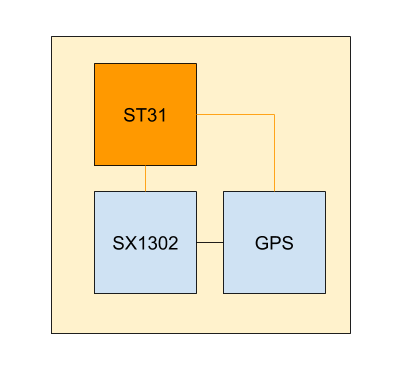

# HIP21: Anchor Gateways

- Author: [@lthiery](https://github.com/lthiery)
- Start Date: 2020-10-29
- Category: Technical
- Original HIP PR: [#68](https://github.com/helium/HIP/pull/68)
- Tracking Issue:

# Problem Statement
[probem-statement]: #problem-statement
In its current state, the Helium Blockchain does not allow permissionless adding of gateways. All gateways on the
blockchain have one of the following origins:

|Name|MSRP|Quantity|Shipping Dates|Keys Store|
|---|---|---|---|---|
|Genesis Hotspots|$0|45|2019-07-29|File|
|Helium Hospots|$500|~9k on-chain, 14.5k in staking server|2019-07-29-2020-10-01|ECC608|
|RAK Hotspots|$250|   |2020-10|File|
|Miner Pro Alpha(DIY ALPHA PROGRAM)|$0|339|2020-09|File|

This strategy has thus far prevented large-scale attacks of “virtual gateways” as permissionless adding has the proposed
 cost of $40 to add and $10 to assert location. Instead, attacks require buying hardware listed above with their
 respective costs; this means being a good actor is slightly easier as you are guaranteed to have LoRaWAN hardware and
 the cost of each node is at least 4x the cost of the permissionless model.

It is paramount to the network's growth in coverage to allow the permissionless adding of gateways to the network. In
 other words, anybody must be able to on a standard LoRaWAN gateway (or use already deployed hardware) and pay the
 $40 staking fee. With 1M deployed gateways worldwide (according to
 [Semtech marketing materials](https://www.semtech.com/lora)), the scale of the opportunity to convert existing
 infrastructure cannot be ignored.

It is a general consensus in the community, including Helium and DeWi, that Proof-of-Coverage (POC) does not yet do
 enough to instill confidence for permissionless adding of gateways to be enabled. There are many ideas for how to
 improve POC, but they all boil down to concepts of circular trust validation between gateways.

HIP-9 proposes a levelling scheme based on trustworthiness of the gateways based on origin; however, it is the opinion
 of this HIP that gateways, no matter the origin, carry no inherent trust. In particular, it is quite possible to
 “jailbreak” even a Helium Hotspot and to run an arbitrary Miner on the hardware. And over the months we have seen many
 question deployments of Helium Hotspot clusters which have proven to be quite difficult to snuff out using circular
 validation logic.

# The Root of Trust
[root-of-trust]: #root-of-trust

This proposal side-steps the inherent lack of trust in gateways by creating a special LoRa concentrator module that we
 can trust. Whereas today, RSSI, SNR and GPS timestamps cannot be inherently trusted, reports from these "Anchor 
 Gateways" will be a root of trust for physical information on the network.

The core of the proposal is to have a secure element, such as the ST31 run the packet forwarder application and to sign 
 the packets on-chip.
 

The ST31 (used in the Ledger Hardware Wallet, for example) can provide a guarantee that the firmware on-board is
 unchanged. Along with a secure key-store, you can guarantee that it only signs what you programmed the firmware to sign. 
 
The main attack vector would be tampering with the SX1302 and GPS modules. [In theory, the lines could be carefully
 measured](http://swarup.ece.ufl.edu/papers/C/C125.pdf) by the ST31 to detect PCB modification. In addition, potting 
 would make precise manipulation increasingly challenging.
 
Another attack vector would be GPS spoofing. Requiring many constellations and satellites would make this slightly more 
 difficult, but fundamentally, this would remain something to be wary of.
 
These modules would be designed by Helium and manufactured under the supervision of DeWi. As such, our trust in these 
 modules derives itself in trusting that process. In effect, modules with keys that have been provisioned by this 
 process will be a root of trust for physical information on the network.

# Potential Uses
[potential-uses]: #potential-uses

With a root of trust for physical information, we can refine Proof-of-Coverage and revisit levelling notions, as 
 proposed in HIP9. This module could be designed to retrofit into Helium and even RAK Hotspots, but fundamentally, we 
 must not depend on every gateway on the network to feature such a module; that would go against our principles of ease
 of growth especially by switching over existing infrastructure.
 
In addition, instead of focusing first on network-wide retrofits, we may consider first deploying in small quantity 
 mobile gateways featuring this trusted module. A staking and loan system would allow these to be deployed quickly, but
 then recovered by DeWi, potentially updated, and then re-deployed. With this experience, we could then address scaling
 the solution and the potential value of retrofitting gateways.
