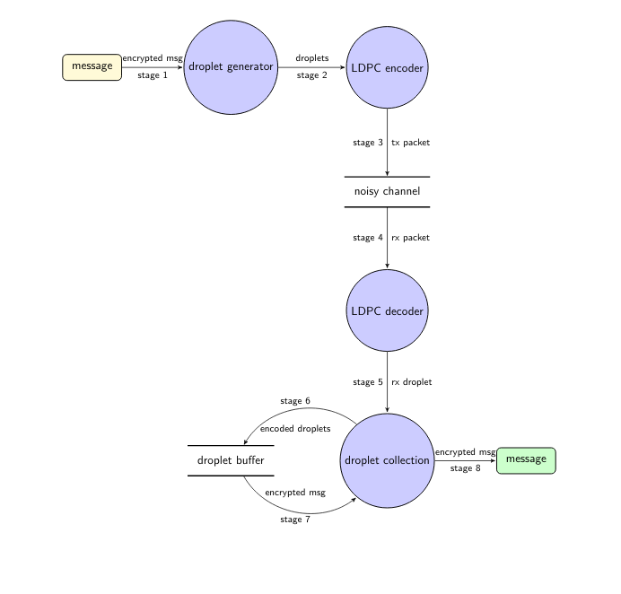

- Start Date: 06/26/2020
- HIP PR: <!-- leave this empty -->
- Tracking Issue: <!-- leave this empty -->

# Summary
[summary]: #summary
The link layer is the method by which information is send from one source to another. It sits directly above the PHY layer and below the MAC layer. For a
specific definition, please see the OSI model.

# Motivation
[motivation]: #motivation
In our current implementation the link layer is extremely simple. We encode and transmit a single PoC payload with no redundancy or any additional 
correction applied. We have an issue right now that a PoC packet is not very resistant to noise or collision. Additionally, and more importantly, 
sending one packet with one signal reading infrequently (say twice a day) is not very descriptive. We are looking to better describe coverage quality,
and a series of smaller packets to describe a larger payload will let us better know how strong a link is between many hotspots even if we are 
technically PoC'ing twice a day or so.

# Stakeholders
[stakeholders]: #stakeholders

* Hotspot owners
* Network users
* 3rd party Hotspot manufacturers
* DIY miners

# Detailed Explanation
[detailed-explanation]: #detailed-explanation

## Link Layer Modification
[link-layer-modification]: #link-layer-modification

### Modifications

The PoC link layer should attempt to provide reliable transmissions of
data without requiring high error correction overhead or the need for
numerous packet re-transmissions or acknowledgments. To accomplish this,
the first step in transmitting a message is creating fountain generator
from the encrypted source payload. Next, the fountain generator produces
small, fixed size packets, or "droplets", which are LDPC (low-density
parity check) encoded. Combining the two methods provides block erasure
and bit level error correction for transmissions in a noisy channel.
Additionally, the entire message will be received without
re-transmissions so long as the link remains active. A bit error rate
and connection quality can be derived by the receiver through the
decoding of each LDPC encoded droplet, and calculating the overhead of
droplets needed to receive the message relative to the distribution used
to generate droplets. If this is a standard distribution over the data,
the mean would be 1.5 times the minimum payload size.

The general implementation of the LDPC-LT encoding an decoding method
requires, known, shared LDPC encoding techniques, a sudo-random block
creation technique based on a normal probability distribution, and a
decoding buffer to attempt decoding payloads as the receive buffers are
filled via Gaussian reduction.



To begin, the Challengee braodcasts the PoC message stream and waits for
a response from any gateways in range, expiring on a percentage of
expected witnesses acknowledging recovery of the payload. The transmit
sequence by a gateway involves it transmitting droplets continuously
until it receives a single N/ACK from a gateway indicating the entire
message was received correctly or not. An alternative to the N/ACK
requirement could be to implement an expiry window. The expiry window
could align with a reasonable percentage overhead (200% - 250%). 

# Drawbacks
[drawbacks]: #drawbacks

- This method does require more spectrum utilization but at low impact to our regulatory ceiling.

# Rationale and Alternatives
[alternatives]: #rationale-and-alternatives

- Implementing a noise resistant link layer is critical to succssful PoC transmissions in increasingly crowded or 
  lossy environments. We will additionally be capable of increasing the data rate and lowering time on air without 
  sacrificing sensitivity. The advantage of a builtin BER test gives us an accurate measure of link quality truely 
  descriptive of a connection between two discrete devices which we have no other method of determining with any
  accuracy currently. RSSI and SNR alone for a single transmission sporadically over a day or days is far too low
  frequency to establish quality of a link, and network adopters should rightly question/doubt any claim of assumed coverage.

# Unresolved Questions
[unresolved]: #unresolved-questions

- Quantity and distribution of rewards is considered out of scope for this HIP.

# Deployment Impact
[deployment-impact]: #deployment-impact

- Deployment of this system will have a direct impact on current hotspot deployments, increasing number of transmissions during PoC.

# Success Metrics
[success-metrics]: #success-metrics

What metrics can be used to measure the success of this design?

- Successful PoC transmissions should increase with additional reports of BER.

# Glossary
[glossary]: #glossary

1\. (LT) Fountain Code Fountain codes are rate-less erasure codes,
encoding an undefined sequence of information into an unlimited number
of encoded symbols which can be recovered from any subset of encoded
symbols greater than or equal to the source information. The encoded
symbol creation is based on a known distribution and random seed, which
the receiver uses to iteratively decode collected samples.

2\. LDPC Coding Low density parity check coding is a linear error
correcting code utilizing a (sparse) parity-check matrix, ideally
constructed to be optimal for the data to be transmitted.

# Implementation Results
[implementation-results]: #implementation-results

These are a series of test results from Random and Systematic fountain encoders/decoders using both MinSum and BitFlipping LDPC decoders. Subtract 100 from the overhead number to get the actual overhead
sent over the air as the LDPC encoder implicitly doubles the size of the outgoing payload. There are verying degrees of loss, with Systematic encoders/decoders clearly outperforming any other option which
is the expected behavior.

```bash
running 8 tests
Success: Statistics { cnt_droplets: 10, cnt_chunks: 10, overhead: 100.0, unknown_chunks: 0  } | Loss: 0.05 | EncodeType: SysLdpc(TC512, 0) | Decoder Type: Bf | Lost: 0 | Total: 10 | Percentage: 0.0
Success: Statistics { cnt_droplets: 10, cnt_chunks: 10, overhead: 100.0, unknown_chunks: 0  } | Loss: 0.1 | EncodeType: SysLdpc(TC512, 0) | Decoder Type: Bf | Lost: 0 | Total: 10 | Percentage: 0.0
Success: Statistics { cnt_droplets: 10, cnt_chunks: 10, overhead: 100.0, unknown_chunks: 0  } | Loss: 0.0 | EncodeType: SysLdpc(TC512, 0) | Decoder Type: Ms | Lost: 0 | Total: 10 | Percentage: 0.0
test ldpc_test_enc_dec_systematic_minsum ... ok
Success: Statistics { cnt_droplets: 10, cnt_chunks: 10, overhead: 100.0, unknown_chunks: 0  } | Loss: 0.05 | EncodeType: SysLdpc(TC512, 0) | Decoder Type: Ms | Lost: 1 | Total: 11 | Percentage: 0.09090909
Success: Statistics { cnt_droplets: 22, cnt_chunks: 10, overhead: 220.0, unknown_chunks: 0  } | Loss: 0.05 | EncodeType: RandLdpc(TC512, 0) | Decoder Type: Bf | Lost: 1 | Total: 23 | Percentage: 0.04347826
Success: Statistics { cnt_droplets: 17, cnt_chunks: 10, overhead: 170.0, unknown_chunks: 0  } | Loss: 0.2 | EncodeType: SysLdpc(TC512, 0) | Decoder Type: Bf | Lost: 2 | Total: 19 | Percentage: 0.10526316
Success: Statistics { cnt_droplets: 16, cnt_chunks: 10, overhead: 160.0, unknown_chunks: 0  } | Loss: 0.1 | EncodeType: SysLdpc(TC512, 0) | Decoder Type: Ms | Lost: 1 | Total: 17 | Percentage: 0.05882353
Success: Statistics { cnt_droplets: 18, cnt_chunks: 10, overhead: 180.0, unknown_chunks: 0  } | Loss: 0.1 | EncodeType: RandLdpc(TC512, 0) | Decoder Type: Bf | Lost: 5 | Total: 23 | Percentage: 0.2173913
Success: Statistics { cnt_droplets: 18, cnt_chunks: 10, overhead: 180.0, unknown_chunks: 0  } | Loss: 0.25 | EncodeType: SysLdpc(TC512, 0) | Decoder Type: Bf | Lost: 5 | Total: 23 | Percentage: 0.2173913
Success: Statistics { cnt_droplets: 14, cnt_chunks: 10, overhead: 140.0, unknown_chunks: 0  } | Loss: 0.3 | EncodeType: SysLdpc(TC512, 0) | Decoder Type: Bf | Lost: 2 | Total: 16 | Percentage: 0.125
Success: Statistics { cnt_droplets: 16, cnt_chunks: 10, overhead: 160.0, unknown_chunks: 0  } | Loss: 0.2 | EncodeType: SysLdpc(TC512, 0) | Decoder Type: Ms | Lost: 2 | Total: 18 | Percentage: 0.11111111
Success: Statistics { cnt_droplets: 26, cnt_chunks: 10, overhead: 260.0, unknown_chunks: 0  } | Loss: 0.2 | EncodeType: RandLdpc(TC512, 0) | Decoder Type: Bf | Lost: 5 | Total: 31 | Percentage: 0.16129032
Success: Statistics { cnt_droplets: 19, cnt_chunks: 10, overhead: 190.0, unknown_chunks: 0  } | Loss: 0.5 | EncodeType: SysLdpc(TC512, 0) | Decoder Type: Bf | Lost: 18 | Total: 37 | Percentage: 0.4864865
Success: Statistics { cnt_droplets: 16, cnt_chunks: 10, overhead: 160.0, unknown_chunks: 0  } | Loss: 0.25 | EncodeType: RandLdpc(TC512, 0) | Decoder Type: Bf | Lost: 4 | Total: 20 | Percentage: 0.2
Success: Statistics { cnt_droplets: 20, cnt_chunks: 10, overhead: 200.0, unknown_chunks: 0  } | Loss: 0.25 | EncodeType: SysLdpc(TC512, 0) | Decoder Type: Ms | Lost: 9 | Total: 29 | Percentage: 0.31034482
Success: Statistics { cnt_droplets: 10, cnt_chunks: 10, overhead: 100.0, unknown_chunks: 0  } | Loss: 0.3 | EncodeType: SysLdpc(TC512, 0) | Decoder Type: Ms | Lost: 7 | Total: 17 | Percentage: 0.4117647
Success: Statistics { cnt_droplets: 57, cnt_chunks: 10, overhead: 570.0, unknown_chunks: 0  } | Loss: 0.0 | EncodeType: RandLdpc(TC512, 0) | Decoder Type: Ms | Lost: 0 | Total: 57 | Percentage: 0.0
test ldpc_test_enc_dec_random_minsum ... ok
Success: Statistics { cnt_droplets: 53, cnt_chunks: 10, overhead: 530.0, unknown_chunks: 0  } | Loss: 0.3 | EncodeType: RandLdpc(TC512, 0) | Decoder Type: Bf | Lost: 24 | Total: 77 | Percentage: 0.3116883
Success: Statistics { cnt_droplets: 38, cnt_chunks: 10, overhead: 380.0, unknown_chunks: 0  } | Loss: 0.5 | EncodeType: SysLdpc(TC512, 0) | Decoder Type: Ms | Lost: 50 | Total: 88 | Percentage: 0.5681818
Success: Statistics { cnt_droplets: 32, cnt_chunks: 10, overhead: 320.0, unknown_chunks: 0  } | Loss: 0.9 | EncodeType: SysLdpc(TC512, 0) | Decoder Type: Bf | Lost: 273 | Total: 305 | Percentage: 0.895082
test ldpc_test_enc_dec_systematic_lossy ... ok
Success: Statistics { cnt_droplets: 194, cnt_chunks: 107, overhead: 181.30841, unknown_chunks: 0  } | Loss: 0.1 | EncodeType: SysLdpc(TC512, 0) | Decoder Type: Bf | Lost: 17 | Total: 211 | Percentage: 0.08056872
test ldpc_test_enc_dec_systematic ... ok
Success: Statistics { cnt_droplets: 21, cnt_chunks: 10, overhead: 210.0, unknown_chunks: 0  } | Loss: 0.5 | EncodeType: RandLdpc(TC512, 0) | Decoder Type: Bf | Lost: 22 | Total: 43 | Percentage: 0.5116279
Success: Statistics { cnt_droplets: 24, cnt_chunks: 10, overhead: 240.0, unknown_chunks: 0  } | Loss: 0.9 | EncodeType: SysLdpc(TC512, 0) | Decoder Type: Ms | Lost: 162 | Total: 186 | Percentage: 0.87096775
test ldpc_test_enc_dec_systematic_lossy_minsum ... ok
Success: Statistics { cnt_droplets: 34, cnt_chunks: 10, overhead: 340.0, unknown_chunks: 0  } | Loss: 0.9 | EncodeType: RandLdpc(TC512, 0) | Decoder Type: Bf | Lost: 236 | Total: 270 | Percentage: 0.8740741
test ldpc_test_enc_dec_random_lossy ... ok
Success: Statistics { cnt_droplets: 488, cnt_chunks: 107, overhead: 456.07477, unknown_chunks: 0  } | Loss: 0.0 | EncodeType: RandLdpc(TC512, 0) | Decoder Type: Bf | Lost: 0 | Total: 488 | Percentage: 0.0
test ldpc_test_enc_dec_random ... ok
Success: Statistics { cnt_droplets: 480, cnt_chunks: 107, overhead: 448.59814, unknown_chunks: 0  } | Loss: 0.05 | EncodeType: RandLdpc(TC512, 0) | Decoder Type: Ms | Lost: 15 | Total: 495 | Percentage: 0.030303031
Success: Statistics { cnt_droplets: 550, cnt_chunks: 107, overhead: 514.0187, unknown_chunks: 0  } | Loss: 0.1 | EncodeType: RandLdpc(TC512, 0) | Decoder Type: Ms | Lost: 68 | Total: 618 | Percentage: 0.110032365
Success: Statistics { cnt_droplets: 644, cnt_chunks: 107, overhead: 601.86914, unknown_chunks: 0  } | Loss: 0.2 | EncodeType: RandLdpc(TC512, 0) | Decoder Type: Ms | Lost: 169 | Total: 813 | Percentage: 0.20787208
Success: Statistics { cnt_droplets: 486, cnt_chunks: 107, overhead: 454.2056, unknown_chunks: 0  } | Loss: 0.25 | EncodeType: RandLdpc(TC512, 0) | Decoder Type: Ms | Lost: 191 | Total: 677 | Percentage: 0.28212702
Success: Statistics { cnt_droplets: 441, cnt_chunks: 107, overhead: 412.14954, unknown_chunks: 0  } | Loss: 0.3 | EncodeType: RandLdpc(TC512, 0) | Decoder Type: Ms | Lost: 198 | Total: 639 | Percentage: 0.30985916
Success: Statistics { cnt_droplets: 406, cnt_chunks: 107, overhead: 379.43924, unknown_chunks: 0  } | Loss: 0.5 | EncodeType: RandLdpc(TC512, 0) | Decoder Type: Ms | Lost: 370 | Total: 776 | Percentage: 0.47680414
Success: Statistics { cnt_droplets: 643, cnt_chunks: 107, overhead: 600.9346, unknown_chunks: 0  } | Loss: 0.9 | EncodeType: RandLdpc(TC512, 0) | Decoder Type: Ms | Lost: 5624 | Total: 6267 | Percentage: 0.89739907
test ldpc_test_enc_dec_random_lossy_minsum ... ok
```
