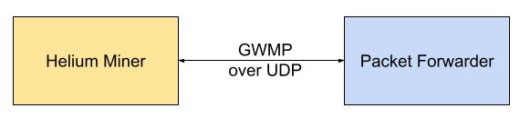
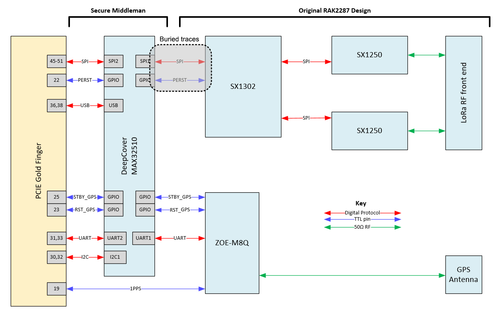

# HIP22: Anchor Gateways

- Author(s): @georgica, @lthiery, @Carniverous19/para1
- Start Date: 2020-11-16
- Category: Technical
- Original HIP PR: https://github.com/helium/HIP/pull/91
- Tracking Issue: https://github.com/helium/HIP/issues/94

# Problem Statement
[probem-statement]: #problem-statement

Bad actors may lie about radio packets. This is a problem as this enables various _POC gaming strategies_; that is to 
say efforts by bad actors may choose to spend time abusing POC reward mechanisms rather than providing useful coverage. 

Virtually all POC gaming strategies revolve around intercepting or entirely fabricating packets over the 
[Semtech GWMP Protocol over UDP](https://github.com/Lora-net/packet_forwarder/blob/master/PROTOCOL.TXT). 

It is hardly much work to put software between the packet forwarder and the Helium Miner, 
[as demonstrated by community member, para1](https://github.com/Carniverous19/helium-DIY-middleman).

This makes it easy for bad actors to feed packets that have no bearing to the Physical RF world to Miners.
In addition, it is easy for bad actors to share a single real packet to many other gateways.

# Physical Root of Trust: Value and Incentives
[physical-root-of-trust-value-and-incentives]: #physical-root-of-trust-value-and-incentives

By this end of January, 2021, the Helium Network consists of over 17,000 hotspots. These hotspots are all capable of 
being manipulated in the manner detailed above. 

We propose to create a special category of packet forwarders which cannot lie about what they physically perceive. As 
such, they provide the network with a **Physical Root of Trust**. They can still be "gamed" in various ways which will 
be detailed here, but these attack vectors all end up existing at the physical RF level instead of simply intercepting 
UDP packets.

Gateways equipped with these protected packet forwarders will be special citizens on the Helium Network, called **Anchor
Gateways**. Their name is such because they anchor the network's understanding of the physical RF world. We do not 
expect the network to ever consist 100% of such packet forwarders, but we believe having a proportion of the network 
with trustworthy packet forwarders provides value.

While they're role may grow and change as we gain confidence in their trustworthiness and as the network evolves, we 
propose their novel hardware design and trustworthyness should entitle them to a 3x multiple 
[to normal beaconing reward units](./0015-beaconing-rewards.md).

We believe this approach to be complementary to many other approaches to improving POC. What is unique about it is its 
scalability:
* even existing gateways could be retrofit to become anchor gateways
* after installation, these anchor gateways do not require human intervention

Moreover, while the blockchain and incentive impact is modest at this point, we believe this initial approach provides
extensibility: 
* actors capable of mobile auditing could be derived from the hardware
* more complex "trust score" and anti-gaming approaches could derive itself from this data (eg: GPS timestamping)

# Product Summary
[product-summary]: #product-summary

Almost every gateway on the network is currently compatible with the RAK2287.

These "concentrator cards" are effectively one of Semtech's SX130x front-end and optional GPS. Over SPI and I2C, they
communicate back to the main processor, such as a Raspberry Pi. Should this HIP pass, an "anchor concentrator" will be
available for purchase.

Insofar as the gateway vendor provide software support, they could adopt these radio front-ends, either after-market or 
in future products. While SyncroB.it initially proposes this design, other vendors who provide similarly secured
concentrators could also enable "Anchor Gateways."

# Hardware and Firmware Summary
[hardware-and-firmware-summary]: #hardware-and-firmware-summary

The Semtech GWMP Protocol over UDP communicates raw LoRa radio packets, which today become 
[Witness Receipts](https://github.com/helium/proto/blob/master/src/blockchain_txn_poc_receipts_v1.proto#L22).
The core of our problem is that all of those fields (RSSI, SNIR, GPS timestamps) may be lied about at the software 
layer.

The core of the proposal is to have a secure element, such as the MAX32510 run the packet forwarder application and sign
the packets on-chip.

The MAX32510 can provide a guarantee that the firmware on-board is unchanged. Along with a secure key-store, you can
guarantee that it only signs what you programmed the firmware to sign.

The main attack vector would be tampering with the SX130x and GPS modules either directly on-board or over RF. Many anti-
tamper mechanisms may be deployed to reduce ease of tampering. In coordination with DeWi and Helium, the final design
may feature the following such protections:
* existing tamper proof features on the MAX32510
* firmware on the MAX32510 could detect PCB modifications
* an out of band check by the concentrator on the antenna port, ensuring that the stock antenna is deployed

Although these modules would initially be designed by SyncroB.it, their design and security will be audited by DeWi. 

A critical detail to the security model is that the firmware initially loaded is, in fact, the audited firmware. From that
point onwards, after leaving custody of the party entrusted with loading the secured firmware, the security keys inside
cannot be compelled to sign anything that the firmware has not requested. Thanks for a secure firmware update process
built into the chip, updates may even be safely delivered as their origin is verified by the chip.

While we do not propose initial designing around this, it is worth noting that fine GPS timestamping on these front-ends
might eventually provide a powerful tool for RF auditing.

Due to the signature from the packet forwarder, either an alternative protocol will need to be developed or an additional
field must be provided with a signature to the 
[POC witness receipts](https://github.com/helium/proto/blob/master/src/blockchain_txn_poc_receipts_v1.proto#L22).

# Blockchain and Incentives Summary
[blockchain-and-incentives-summary]: #blockchain-and-incentives-summary

The key within the MAX32510 is a new "anchor concentrator" identity on the blockchain. Lists of these trusted concentrators
will be delivered by the trusted firmware loading process.

Concentrators may be added to gateways. This is similar to how a gateway is added to an account.

When a gateway has a concentrator added to it, 
[POC witness receipts](https://github.com/helium/proto/blob/master/src/blockchain_txn_poc_receipts_v1.proto#L22)
should have a `anchor_concentrator_signature` to be attributed the `anchor_reward_unit_multiple`. We propose setting 
this multiple to three (3) initially, but that to make it a chain var for tuning.

# Unresolved Questions
[unresolved]: #unresolved-questions

**Chain Variables**: Why a multiple of 3?

**Incentives**: Should we cap the slice of POC available to Anchor Gateways? Are there better ways we can incentivize 
operators of Anchor Gateways than a simple multiple?

# Deployment Impact
[deployment-impact]: #deployment-impact

Gateways wishing to maximize their return would equip themselves with anchor concentrators. This will lead to POC Witness
Receipts that we can trust. This will aid in our analysis of gaming, by having a root of trust.

Without capping the amount available to anchor gateways, their may become an arms race as other gateways need to equip
themselves with anchor concentrators to earn a meaningful slice of POC rewards. Perhaps that is desirable?

# Success Metrics
[success-metrics]: #success-metrics

If this HIP is successful, we will have higher confidence that POC rewards are going to legitimate operators, starting
with operators of Anchor Gateways who are now rewarded the multiple on witnessing. As mentioned previously, the 
scalability and extensibility of the approach should lead to further developments in anti-gaming strategies.