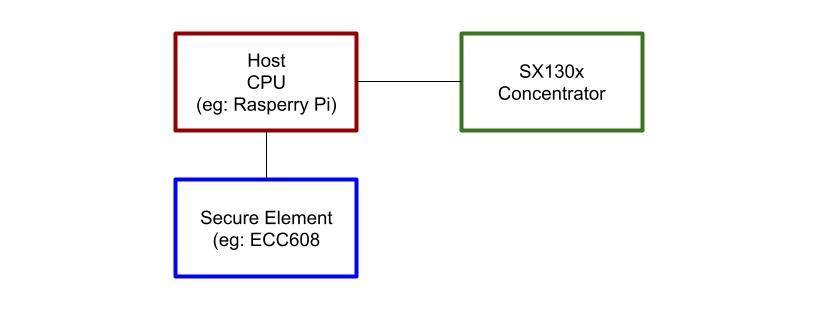
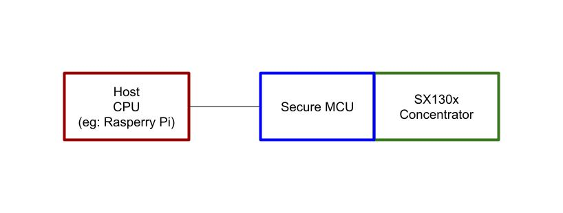

# HIP22: DIY Concentrators

- Author(s): @lthiery, @georgica
- Start Date: 2020-11-16
- Category: Technical
- Original HIP PR: <https://github.com/helium/HIP/pull/91>
- Tracking Issue: <https://github.com/helium/HIP/issues/94>

# Problem Statement

The `add_gateway` remains one of the few permissioned transactions relating to the network. Ideally,
`add_gateway` would be permissionless and any compatible hardware could be added to the blockchain
and mine HNT. However, this transaction has always been regulated due to a concerns with bad actors
creating virtual hotspots only to maximize mining rewards without truly providing coverage.

Initially, only gateways sold by Helium could be added to the blockchain, but
[HIP19](0019-third-party-manufacturers.md) expands this ability to approved vendors. One of the
principal requirements of HIP19 is that the hotspot identity be contained with a hardware security
module. Following the lead of the Helium "OG Hotspot", every hotspot on the market has the following
architecture:

The Hotspots identity, ie: the `swarm_key`, is contained in a secure element which is controlled by
the Host CPU. Therefore, the Host CPU pulls data from the SX130x concentrator, requests the secure
element (generally an ECC608) sign the transaction and then submits the transaction to the
blockchain.

The strength of this approach is that it requires bad actors to acquire hotspots and their secure
element and to maintain physical access to the hardware security module; thus the overhead of such
operations is increased and the scalability is hindered. However, this does not prevent bad actors
from lying about the packets they have seen.

The weakness of this approach is that it allows the Host CPU to request the secure element sign
anything it wants. A bad actor can "jailbreak" the Host CPU and run whatever software they want and
ask the ECC608 to sign anything.

Therefore, there is a plethora of POC gaming strategies revolve around intercepting or entirely
fabricating packets over the
[Semtech GWMP Protocol over UDP](https://github.com/Lora-net/packet_forwarder/blob/master/PROTOCOL.TXT).

It is not difficult to put software between the packet forwarder and the Helium Miner to manipulated
packets,
[as demonstrated by community member, Carniverous19/para1](https://github.com/Carniverous19/helium-DIY-middleman).

# Physical Root of Trust

We propose to create a special category of packet forwarders which cannot lie about what they
physically perceive. As such, they provide the network with a **Physical Root of Trust**. The new
hardware architecture would be as follows:

The change in this approach is that the SX130x data passes through a secure MCU which contains the
Hotspots identity (ie: `swarm_key`) and, therefore, signs the packets. Therefore, we are not
vulnerable to the Host CPU being compromised (ie: "jailbroken") and we can therefore trust packets
with these signatures.

This approach is not a silver bullet to end all of POC gaming, but it removes all purely software
based attack vectors. Instead, POC gamers will be forced to attack at the physical level, increasing
both the cost & complexity of gaming while also greatly hindering its scalability.

## Enabling DIY

Currently, every single gateway design must pass through [HIP19](0019-third-party-manufacturers.md).
However, DIY concentrators as detailed herein go above and beyond the security requirements detailed
in HIP19. Therefore, we propose that _any_ gateway assembly that features a DIY concentrator be
allowed on-chain.

## A Foundation for Improved Trust

While this proposal does not impact blockchain incentives at this point, we believe this approach
should be considered for a network-wide transition. We encourage approved vendors in considering
adopting HIP22 compliant designs moving forward.

Not only does this hardware module provide many potential avenues for preventing POC auditing, we
believe that a strong foundation of trust in the network's RF layer provides potential value to the
users of the network. With the Merkle roots in state channels, network users can already verify that
a specific data frame was communicated via the Helium Network at a certain time. With DIY
concentrators, we may certify a location in a much stronger way.

Finally, we believe this approach to have high extensibility in improving POC auditing:

- statistical models may use this data as "known good actors" and use it to compare to potentially
  dishonest actors
- actors capable of mobile auditing could be derived from this hardware
- more complex "trust score" and POC auditing approaches could derive itself from this data (eg: GPS
  timestamping)

# DIY Concentrator Definition

A DIY Concentrator provides additional hardware security insofar as only secure firmware may operate
the SX130x packet forwarder and sign the packets, thus proving packets have not been manipulated in
software. As such, suitable processors must provide:

- a tamper-proof hardware key store, guaranteeing that a key generated within may not be extracted
  (similar to the ECC608)
- secure boot features, guaranteeing that only firmware signed by DeWi may executed (unlike ECC608,
  which does not execute firmware)
- authentication of received packets from the SX130x by using the trusted firmware and tamper-proof
  hardware. Only actually received packets should receive a valid signature using the key stored.
- tamper-resistant non-removable binding of the secure processor to the SX130x such that simulating
  the RF-side is only possible by soldering or destruction.

Additional efforts should be made to reduce ease of tampering with the radio inputs, although these
solutions will be evaluated on a case-by-case basis.

Firmware will need to be released to DeWi for audit and signing of releases. Ideally, it should be
open-sourced.

Manufacturers may be trusted to provision the concentrators themselves (ie: load the firmware which
starts the chain of trust) if and only if they have staked 5 or more validators.

Alternatively, another party who meets the staking requirements could be engaged. In either case,
ownership of these validators must be proven to DeWi.

In the future, we believe an enhanced DIY concentrator with fine GPS timestamping should be
considered.

# Secure Firmware Requirements

The strength of this security model is that the Miner's `swarm_key` cannot be compelled to sign
arbitrary radio transactions. In particular, the Miner will only sign POC packets (`poc_witness_v1`)
if and only if the packet is something it read directly from the SX130x; this is why this physical
connection is the only physical tampering requirement specified herein.

A host processor (such as a Raspberry Pi) may still submit transactions for signing to the DIY
concentrator. Similar to a Ledger Hardware wallet, the signing request protocol will only enable
specific transactions to be signed (such as `add_gateway`). In other words, the protocol **must not
allow the arbitrary signing of transactions** as that would put this security on par with the
existing HIP19 secure element approach.

# Onboarding

The following onboarding specification requires no blockchain features.

DIY concentrators will be subject to the same onboarding fees as regular hotspots. The `swarm_key`
shall be stored in the secure firmware and will be the entity signing the transactions. As such, the
secure firmware will be responsible for signing the `add_gateway` transaction.

The downside of this approach is that retrofits of existing gateways will essentially replace the
previous identity with a new HIP22 identity (ie: `careful-pickel-squirrel` will be replaced with
`long-fuchsia-sloth`).

Provisioned concentrators will be provided to the DeWi-managed staking server, similar to
HIP19-approved hotspots. As such, the vendor of a DIY concentrator remains responsible for
onboarding fees and must have these priced in for the customer.

Vendors who are already approved via HIP19 shall manage a separate account for HIP22 concentrators,
so that we have some on-chain transparency of the different security models used for on-chain
hotspots.

# Syncrob.it Product Summary

Syncrob.it proposes a design which complies with this HIP based on the MAX32510 and a PCIe
compatible interface (eg: similar to the RAK2287), allowing it to be a potential retrofit for nearly
every gateway on the network.

These "concentrator cards" are effectively one of Semtech's SX130x front-ends paired with a secure
MCU. Over SPI, they communicate back to the main processor, such as a Raspberry Pi. Should this HIP
pass, a "DIY concentrator" could be available for purchase, pending DeWi review of the proposal.

Should existing gateway vendors provide software support, they could adopt these radio front-ends,
either after-market or in future products.

While Syncrob.it initially proposes this design, this HIP in no way precludes other vendors from
certifying designs that fit the definition above. Moreover, this HIP is not an implicit approval for
the Syncrob.it design, but it only details it as an example implementation which would appear to fit
the HIP22 specification. Final judgement of the suitability of the design would be made at a later
date by DeWi.

# Hardware and Firmware Summary

The MAX32510 can provide a guarantee that the firmware on-board is unchanged. Along with a secure
key-store, it also provide a secure bootloader, ensuring that only signed firmware is booted.

The main attack vector would be tampering with the SX130x either directly on-board or over RF.
Additional anti-tamper mechanisms may be deployed to reduce ease of tampering.

In coordination with DeWi, the final design may feature the following such protections:

- existing tamper proof features on the MAX32510
- firmware on the MAX32510 could detect PCB modifications
- an out of band check by the concentrator on the antenna port, ensuring that the stock antenna is
  deployed

Due to the signature from the packet forwarder, either an alternative protocol will need to be
developed or an additional field must be provided with a signature to the
[POC witness receipts](https://github.com/helium/proto/blob/master/src/blockchain_txn_poc_receipts_v1.proto#L22).

# Unresolved Questions

**HIP19 Transition**: Should HIP19 approved vendors be compelled to migrate to this increased
security model?

**Operator Incentives**: As these modules are more secure than currently deployed infrastructure,
should operators of these DIY concentrators be provided with a POC rewards multiple?

# Deployment Impact

The HIP19 process is fairly involved and requires case-by-case handling of each vendor. While this
HIP initially enables DIY gateways (therefore enabling hobbyists to source modules and build custom
gateways), we believe its possible that all future designs from large-scale vendors could comply
with HIP22 and thus bypass HIP19. This would provide a higher degree of trust in witness receipts
from gateways while also reducing the overhead of the HIP19 process.

# Success Metrics

If this HIP is successful, we should see the continued proliferation of a variety of gateways on the
network while also increasing trust in POC reports.
