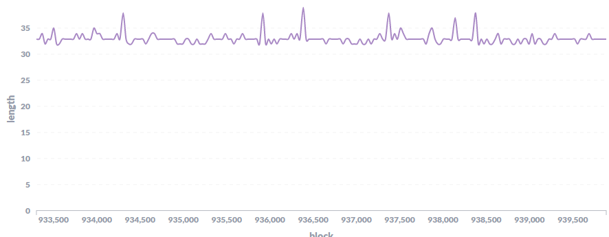

# HIP28: Consensus Rewards Adjustments

- Author(s): @PaulVMo (@PaulM on Discord)
- Start Date: 2021-03-11
- Category: economic
- Original HIP PR: https://github.com/helium/HIP/pull/136
- Tracking Issue: https://github.com/helium/HIP/issues/140
- Code PR: https://github.com/helium/blockchain-core/pull/922
- Status: [Approved](https://github.com/helium/HIP/issues/140#issuecomment-892848351)

# Summary
[summary]: #summary

This proposal updates the way that consensus rewards are calculated to reduce the under rewarding of consensus that occurs when epochs exceed the target length. Currently, consensus rewards are calculated assuming that each epoch has 30 blocks which is often not the case. However, Proof of Coverage (PoC) and Securities rewards are calculated based on actual duration of an epoch. This results in consensus receiving a smaller share of rewards than the 6% target.

While this was a deliberate design decision as rewarding consensus based on length of epoch (like with PoC and Securities) incentivizes consensus group members to delay elections, it can be improved upon.

This proposal includes a change to address the under rewarding of the consensus pool:
Add a grace period equal to the election restart interval to account for the time it takes for even successful elections to occur. This will avoid a shortfall in consensus rewards in most cases.

# Motivation
[motivation]: #motivation

The motivation behind this proposal is fairly simple – to correct the under rewarding of consensus members relative to the target of 6% of total earnings. The current approach is suboptimal for several reasons:
1. Reduces rewards for all validators not just poor performers - Long epochs can result for several reasons including the poor performance of one or more CG members, a software bug, or external factors such as reliability of Internet connections. While there should be penalties for poor performance of consensus group members, the current rewards calculation unfairly hurts the entire consensus group/pool.
2. Results in fewer total HNT minted - The current system creates variability in the monthly amount of HNT minted. While minting less HNT on a monthly basis may have positive effect due to lower supply, it is not predictable and also continuously impacts the max supply since the halvings are tied to blocks not epochs.
3. Over rewards other network participants - The relative allocation of rewards to community members (hotspot owners and consensus members) is reduced relative to investors (HST holders) any time epochs go long. The success of Helium depends on the cooperation of both groups and as such the relative earnings between the two should remain consistent.

In February 2021, for example, consensus group members received only 4.7% of all rewards – nearly 25% less rewards than expected. Other reward categories also varied from their target. Note, data credit rewards that are above the HNT value of the data transferred in the period are realllocated to PoC rewards per [HIP10](https://github.com/helium/HIP/blob/master/0010-usage-based-data-transfer-rewards.md) which accounts for the majority of the overage in PoC reward types
| Reward Type | Feb 2021 Total (HNT) | Percentage | Target Percentage | Difference |
| -- | ----- | ------ | ------ | ------- |
|securities|1,557,743.05|34.5%| 34.0% | +0.5% |
|poc_witnesses|2,123,097.89|47.0%| 21.24% | +25.76% |
|poc_challengers|94,959.66|2.1%| 0.95% | +1.15% |
|poc_challengees|530,774.47|11.7%| 5.31% | 6.39% |
|data_credits|125.74|0.0%| 32.5% | -32.5% |
|consensus|212,291.67|4.7%|6.0%|**-1.3%**|
|**Total**|**4,518,992.48**|**100.0%**|**100.0%**|**0%**|

While these metrics are likely to improve with the move to validators (see [HIP25](https://github.com/helium/HIP/blob/master/0025-validators.md) for more rationale behind validators and the expect improvements to block times and elections), it will not entirely correct for or ensure full consensus rewards. Epoch length is determined by the time it takes to elect a new consensus group. A new election is attempted after 30 blocks. Elections take time. Even successful elections may take more than a single block to complete, leading to greater than 30 block epochs. And, if an election fails for any reason, it is reattempted only after 5 blocks.

Even with validators, consensus elections can and will fail, leading to an average epoch duration of greater than 30 blocks. Even if successful on the first attempt, it often takes a block or more to conclude, again leading to epochs of >30 blocks.

With high investments required to become a validator, it will become more critical for the Helium Network to reward consensus accurately and fully.

## UPDATE: Actual results from Validators. 

Looking at blocks 923722 (switch to 43 member Consensus Group) to 940522 (time of HIP update, approx 1pm PT July 27 2021), validators were under rewarded relative to the target percentage by ~4% (.24% short of 6% target).

| Reward Type | Total HNT | Percentage | Target Percentage | Difference |
| -- | ----- | ------ | ------ | ------- |
|securities|596928.24|34.09%|34.00%|0.09%
|poc_witnesses|813590.00|46.46%|21.24%|25.22%|
|poc_challengees|203397.50|11.61%|5.31%|6.30%|
|poc_challengers|36389.38|2.08%|0.95%|1.13%|
|data_credits|25.87|0.00%|32.50%|-32.50%|
|consensus|100833.33|5.76%|6.00%|-0.24%|
|**Total**|**1,751,164.33**|**100.00%**|**100.00%**|**0.00%**|

Additionally, looking at epoch times for a 200 epoch period, we see that a typical epoch is ~33 blocks long with a shortest of 32 blocks and longest of 38. Only six epochs took more than 35 blocks to complete. This supports the rational that consensus rewards should be given a grace period. The 200 block period was choose as it represented more stable epoch times after initial validator issues and chain var settings were worked out.

Based on this data, we can also perform a comparison of earnings between current and what they would have been with HIP 28 implemented. The actual number of blocks covered by these 200 epoch is 6616 blocks (note, rewards/election blocks are not considered to be within an epoch per the rewards calculations). Based on current implementation, validators received rewards based on 6000 of those blocks (90.1%). Under HIP 28, 6598 (99.7%) blocks would have been rewarded. Only 18 blocks that were part of the six epochs that took more than 35 blocks were not rewarded.

# Stakeholders
[stakeholders]: #stakeholders

As an economic change, this proposal has far reaching impacts:
- Consensus group members will see an increase in rewards to more closely meet the original agreement of 6% of HNT mined.
- Hotspot owners will see a change of rewards dependent on epoch lengths. Adding the grace period will reduce the relative percentage of rewards given to PoC while the change to reallocate unearned consensus rewards will add to the PoC rewards.
- Securities holders will see a decrease in percentage of total rewards (absolute securities rewards are unaffected; however, percentage of total rewards will decline due to increased consensus rewards)

# Detailed Explanation
[detailed-explanation]: #detailed-explanation
Currently, consensus rewards per epoch are calculated using the Election Interval (a fixed target of 30 blocks) to determine what fraction of monthly rewards should be allocated to the current epoch. The following formula show how this works, in a simplified manner:

>Epoch Consensus Rewards = (Monthly Rewards x Consensus Percentage) x (Election Interval x Block Time / Seconds in a month)

Election Interval is defined in blocks and Block Time is defined in Seconds.

You will note in this formula, the Consensus Rewards do not change when the epoch length varies. As such, consensus rewards will be below their monthly target whenever there are fewer Epochs in a monthly due to long epoch durations.

This proposal introduces uses the `election_restart_interval` which is currently `5` blocks as the grace period. This grace period is added to the election interval and allows for rewards to be calculated on the actual epoch length up to this limit.

The revised calculation for consensus rewards will work as follows:
>Epoch Consensus Rewards = (Monthly Rewards x Consensus Percentage) x ( min(Actual Epoch Length, Election Interval + Election Resart Interval) x Block Time / Seconds in a month)

# Drawbacks
[drawbacks]: #drawbacks

There are a couple drawbacks to the proposal however none so significant as to outweigh the benefits:
1. Any change to rewards / token economics can be challenging from an adoption perspective. People do not like change. However, given that this proposal aims to correct rewards which most of the community already believe to be at 6%, I am confident in support of this proposal.
2. This proposal may slightly decrease the incentives for validator operators to maintain well performing validators. However, given that the incentive are already misaligned, namely the decrease in rewards for long epochs affects all validators and not just poor performers, this effect is expected to be minimal if at all.

# Alternatives
[alternatives]: #alternatives

Several alternatives were considered but ruled out in favor of this proposal.

### Adjust epoch rewards based on rolling average
A previous iteration of this proposal suggested using a rolling average of epoch length to adjust up consensus rewards. This would allow hitting the full 6% when averaged over a significantly long period of time. While this address many of the drawbacks of the existing approach, it is potentially suspect to gaming as validators could collude to increase the average epoch length.

### Use actual epoch duration
It is possible to adjust rewards based on the actual duration of an epoch. This is what is done for PoC and Securities rewards. However, this creates an undesired incentive for existing consensus group members to delay election of the next consensus group. Delaying an election would increase the rewards for current consensus members but hurting the security and performance of the network. This rationale is documented in the existing blockchain rewards transaction code and supported by me.

### Don’t Adjust PoC and Securities Rewards for epoch
Another alternative is to change PoC and securities rewards to no longer adjust them based on epoch duration. Instead, they would be calculated much like consensus rewards today, assuming that an epoch is always 30 blocks. This would have significant impacts to the token economics of HNT as it would alter the month mining totals as well as the max supply. And, for these reasons, I do not a recommend this as an option.

### Reallocate unearned consensus rewards
Reallocate unearned consensus rewards to the PoC rewards pool to help maintain the target HNT mined per month and the ratio of community rewards (PoC and Consensus) to Securities/HST. While I originally favored this approach in addition to the grace period, it was removed from this change due to the fact that it adds more complexity to the implementation and also there were other ideas shared by community members and core developers on how to handle when the epoch goes beyond the grace period.

### Reallocate slashed stakes to other consensus members
An ideal solution to consensus rewards both protects the 6% consensus reward pool while also penalizing poor consensus performers. It may be possible to design a reward structure that slashes poor performers and reallocates the slashed amount to the validator pool such that it compensates for lost rewards due to long epochs. However, as mentioned above, there are factors beyond any individual consensus members performance that could impact epoch duration. This means that slashing rewards alone may not be able to fully compensate under rewarding.

Additionally, by reallocating slashed rewards to other consensus group members, this may create an incentive to attacking validators to force slashing at the benefit of current consensus group members.

Finally, slashings will likely be a complex topic that will only be brought up after validators go live. Given the criticality of fairly rewarding validators, I believe that this proposal shall be implemented irrespective of slashing.

# Unresolved Questions
[unresolved]: #unresolved-questions

I seek input from the community on a couple open questions:
1. Any additional alternatives to achieve the same result based on what information is available on chain to adjust for long epoch times, especially when the epoch goes beyond the grace period.

# Deployment Impact
[deployment-impact]: #deployment-impact

Since this change is not backwards compatible with previous rewards calculations, this change will be implemented through incrementing of the `reward_version` chain variable to 6 or more. As such, all validators, hotspots, and other chain followers will need to be updated before enabling the change via chain variable.

Given the impact of this on return expected by operators of validators, I propose implementing this chain as quickly as possible once approved by the community.

# Success Metrics
[success-metrics]: #success-metrics

Success of this proposal is dependent on several factors including the performance of validators which is outside of this proposal’s control. However, a positive outcome will be getting closer to achieve the full 6% of consensus rewards as well as consistently maintaining the balance between community and investor rewards.
