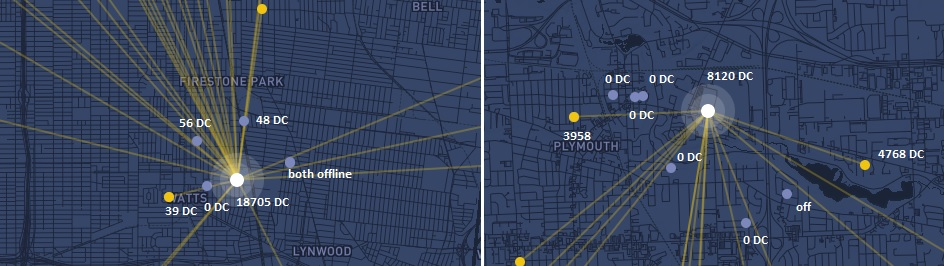
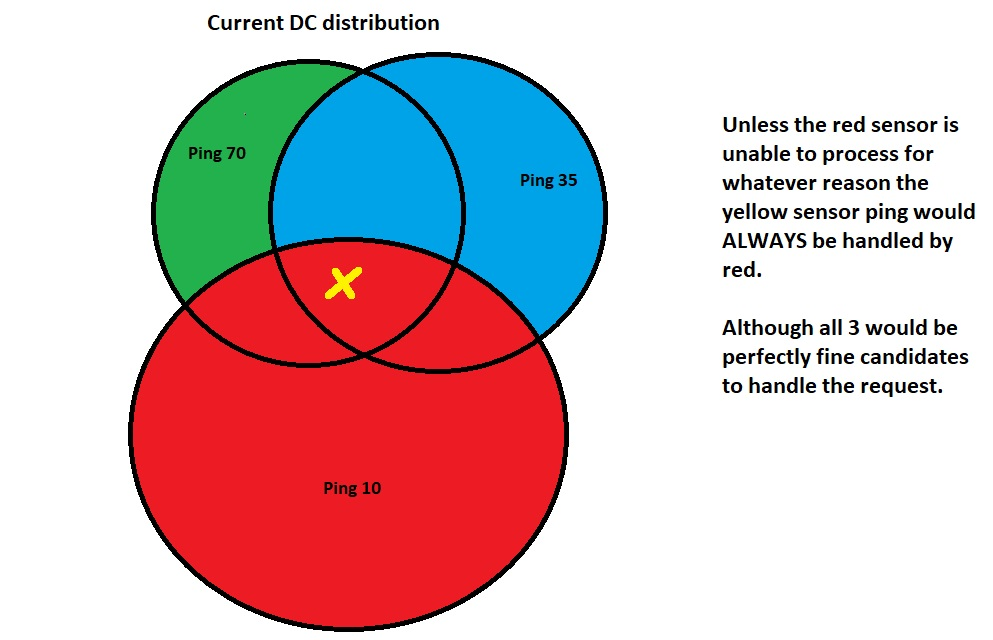
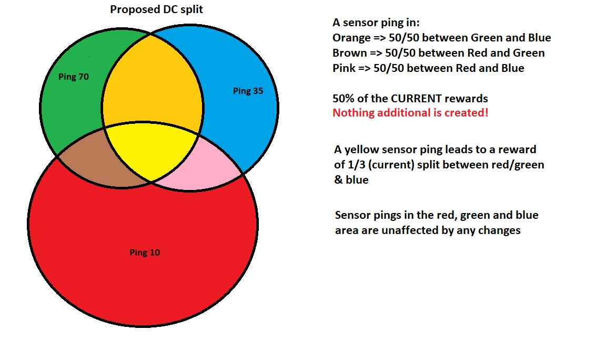

# HIP32: Split DCs Among All Transferers

- Author(s): @PapaOwl 
- Start Date: 2021-06-03
- Category: Economic
- Original HIP PR: https://github.com/helium/HIP/pull/194
- Tracking Issue: https://github.com/helium/HIP/issues/221
- Status: In Discussion

# Summary
[summary]: #summary

Currently DCs are rewarded to the fastest responder which mostly comes down to internet speed. Redundancy that is available and just as capable goes unrewarded and thus has little reason to exist.
**Thus I propose to change the DC reward from the fastest responder to all hotspots that could have performed this duty in a timely fashion.**
# Motivation
[motivation]: #motivation

I want us to transition from this:

or visually simplified:

Of course this picture doesn't even come close to describe the situation in densely populated areas where hotspots might have an effective coverage of 0, because hotspots with better latency are overlapping their entire coverage. This HIP doesn't aim to incentivise these densely populated areas, but solely aims at giving redudancy a reward that they are **due**. The density problem we are currently facing has to be resolved differently and this HIP assumes that this will happen.

So we go to something more like this:

in one simple step that will naturally adapt to the current situation without much code necessary.

This HIP does not have an affect to areas that have no other hotspots nearby. 

# Stakeholders
[stakeholders]: #stakeholders
All those already providing coverage
* Who is affected by this HIP?
All new "coverage" providers

# Detailed Explanation
[detailed-explanation]: #detailed-explanation

Currently only the fastest responder of a DC packet is rewarded. Hotspot 2,3 or how many there are have no way of knowing that Hotspot 1 will be faster, so they aswell will at least have tried to resolve it. Currently only Hotspot 1 would be rewarded for resolving. All others would not receive anything and be declined.

Physical proximity is largely meaningless as the signal of sensor propagates at the speed of light. To put it into terms the speed of light means you can circle the earth 7 times in one second. Due to this we can assume that hotspots will receive the request at the same time.

To resolve this we can simply have the server listen for a bit longer (e.g. 150ms) and then reward them all equally for the work. A hotspot that is too slow will not be rewarded.

As an example we have a use-case sending out a ping and there is 6 Hotspots that receive and try to act. Hotspot 1 was the fastest, but Hotspot 2-5 all reacted in under 150 ms aswell. Hotspot 6 only responded after 200 ms now the reward is going out to to Hotspot 1-5 in equal amounts. Hotspot 6 failed and is thus not rewarded.

**No new rewards or price increase is happening here. The reward that would go to one guy in full before would now be equally split to all that could have handled the request well. If there is no other hotspot to begin with, then this changes nothing.**

# Drawbacks
[drawbacks]: #drawbacks

The drawback is that the 6 dBi gangster on top of his highrise cannot farm an entire city by himself anymore. Although I believe that this never should have been allowed to happen to begin with. Helium needs growth and we can't have grwoth and redudancy as long as overlapping coverage is basically a latency war.

- Why should we *not* do this?

Honestly I see no reason. Good coverage is done by several miners and not by a single one.

# Rationale and Alternatives
[alternatives]: #rationale-and-alternatives
Alternative 1 by disk91.com: Put in a 100 ms delay and then raffle the work to any of those that made it in time including the full reward.

This is your chance to discuss your proposal in the context of the whole design
space. This is probably the most important section!

There is people out there that use the current hip 15 and 17 to the best of their abilities and plan accordingly. They try to provide redundancy in a reasonable fashion, but they all must fear the gigabyte gangster taking it all. A second look at the real life examples that are happening TODAY might be in order. Should one really earn 18.000 DC while others don't even total 200 just a few hundred meters further?

The answer is no. Especially not when Helium is moving the reward scheme to be mostly DC based. Sure we will still have PoC, but how much can there really be earned when we have a million or two million devices and two more halvings have happened.

I don't want to see an initial growth of helium to then collapse on the outskirts first down to very few devices that have supreme locations. If Helium is only after these supreme locations, then why bother asking the people? The people cannot all offer highrise & gigabyte connections. What about the people setting up in the outskirts with outdoor & LTE just to be deprieved from inside the city, because LongFi has tremendous range when you compare it to actual sized of cities including their outskirts.

# Unresolved Questions
[unresolved]: #unresolved-questions

Should we maybe set a limit like a witnessing limit of 25 exists. Magic number for Helium is 4 so we can tie that in here aswell.

# Success Metrics
[success-metrics]: #success-metrics

What metrics can be used to measure the success of this design?

Once we stop finding examples of single hotspots dominating a huge area in terms of DC earnings we know, that we have succeeded.

As a final note I want to greet Tim and re-offer poffertjes to be guaranteed a purchase of 5 longaps.
