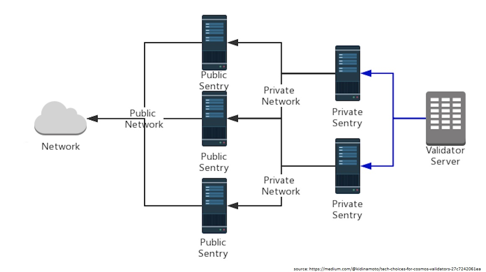

# HIP 34: Validator Node Security Implementation(s)

- Author(s): [@BFX](http://github.com/Bx64/), [@cryptomaniac](https://github.com/cryptomaniac79/)
- Start Date: 2021-06-01
- Category: Technical
- Original HIP PR: [211](https://github.com/helium/HIP/pull/211)
- Tracking Issue: https://github.com/helium/HIP/issues/223
- Status: In Discussion

# Summary
[summary]: #summary

Currently, validator node IPs are public and the testnet explorer show not only location, ISP and region but the API also discloses the IPs of validators, as can be seen [in the testnet explorer](https://explorer.helium.wtf/validators) and [testnet API](https://testnet-api.helium.wtf/v1/validators/elected). These IPs are also traceable on the network. This poses a security risk for network participants that choose to run a validator. Malicious actors can reap benefits by attacking benevolent actors in the validator pool, for instance by mounting DDoS attacks and increasing the chance of their validators being elected into CG, subsequently increasing their own earnings at the cost of other actors in the network. One does not need to target the nodes in the current consensus group, but can take out the competition (other validators waiting to be elected) and significantly increase the chances of having their own nodes elected. Due to the significant gains that can be made this way, it should be considered a critical issue and therefore be addressed as quickly as possible.

# Motivation
[motivation]: #motivation

As validators will take over all activities regarding consensus on the Helium network, the pool of actors in charge of validating transactions and creating blocks is significantly reduced from the current situation (72K+ hotspots and growing fast) to a small pool of (expected) several hundreds of nodes, which significantly decreases the targets that need to be interfered with in order to impact consensus in one's own favor. Having these nodes be publicly visible, traceable and targetable on the Helium network therefore poses a significantly increased security risk compared to the current situation. If the validator nodes are compromised, so is the progress of the chain meaning the chain could completely (and perhaps unrecoverably) stall.

# Stakeholders
[stakeholders]: #stakeholders

This change will not affect any current Hotspot owners or HNT holders as it is aimed to be implemented together with the release of the validator node CG implementation on mainnet.

For (testnet) validator operators, a series of private and/or public tests should be considered. If it is needed to increase activity or participation, it may be possible to consider bounties for finding security vulnerabilities in the implementation as this may help to attract security auditors or community developers to the private and/or public tests.

# Detailed Explanation
[detailed-explanation]: #detailed-explanation

## Option 1: Sentry Nodes

The risk of sharing node IP addresses (with validator nodes additionally opening port XXXXX to the internet) is well documented and a large number of different chains (DPoS & PoS) have approached protecting the delegate/validator nodes IP address from being published. A validator node could for example be attacked using the Distributed Denial of Service method, be the victim of a targeted hack attempt or its operator could see false charges made to their hosting privoder in an attempt to have their nodes taken offline.

One recommended way to mitigate these risks is for validators to carefully structure their network topology in a so-called single- or dual-layer sentry node architecture, which can be generalised as a sentry node operating as a proxy for its validator node.

Validator nodes should only connect to full-nodes they trust because they operate them themselves or are run by other validators they know socially. The validator is only going to talk to the sentry nodes, while sentry nodes have the ability to talk to the validator node on the private channel and talk to public nodes elsewhere on the Internet. A validator node will typically run in a data center. Most data centers provide direct links the networks of major cloud providers. The validator can use those links to connect to sentry nodes in the cloud. This shifts the burden of denial-of-service from the validator's node directly to its sentry nodes, and may require new sentry nodes be spun up or activated to mitigate attacks on existing ones.

Sentry nodes can be quickly spun up or change their IP addresses. Because the links to the sentry nodes are in private IP space, an internet based attacked cannot disturb them directly. This will ensure validator block proposals and votes are ensured to make it to the rest of the network as much as possible, other vulnerabilities or exploits aside. Sentry nodes may still need to sync a full copy of the blockchain; to remedy this, one could use a snapshot feature where the newly spun up sentry node receives a snapshot from the validator node. Any snapshot should come from a reliable source to protect its integrity.

It is important to mention for sentry nodes that they should be geographically separated as much as possible to avoid a single point of failure; for example, in case of a hosting provider outage.

## Option 2: Obfuscation through TOR

Using TOR circuits: all validator nodes should route their connections through a set of TOR circuits, obfuscating their IP whilst closing access to their P2P port. They should actively pull data from the network in order to stay in sync. The advantage here is that it is highly unlikely validator IP addresses are ever known to anyone besides their operator. They may still be known to TOR node operators, but cannot be pulled directly from the network/logs as is the current case.

This solution provides a powerful way of hiding the IP address from the network, enabling the validator nodes to fully focus on validation blocks and transactions.

An example implementation of this for a series of decentralised proof-of-stake networks can be found here: [Core Chameleon](https://github.com/alessiodf/core-chameleon). This implemenation is currently actively deployed by many validator node operators in several decentralized proof-of-stake networks and has a proven track record of keeping validator node IPs properly hidden from the network.

# Drawbacks
[drawbacks]: #drawbacks

The implementation of security improvements to the current protocol and codebase can incur a delay in the projected release of validators on mainnet, which was slated for Q2 2021. The importance of having a solid and secure implementation outweighs this aspect, in our opinion. As of the 29th of June, it has been announced that validators will activate on mainnet on the 7th of July. This drawback is therefore no longer relevant and can be replaced with requiring a set of private or public tests on testnet).

## Option 1: Sentry Nodes

While sentry nodes can improve validator security, there are multiple trade-offs involved. The notion of sentry nodes adds complexity to both the node implementation itself as well as the overall network topology, and operator cost may increase due to the fact of having to setup several nodes instead of just one. However, the improved security and the validators' earnings should still outweigh these costs as validators should be aware that downtime due to SVs or malicious actors will mean they would earn far less rewards, or none at all.

## Option 2: Obfuscation through TOR

A possible drawback is that miners in the network can no longer reach the validator nodes to submit RF data. We are not sure if this would be an issue as the validators can still pull data from hotspots; however a remedy for this should be found in case the Helium RF implemenation would not function properly when validator node IPs are obscured.

# Rationale and Alternatives
[alternatives]: #rationale-and-alternatives

## Option 1: Unchanged Architecture

All operators of validator nodes are required to make the TCP port of the P2P protocol of their validator nodes routable via the public internet, with the TCP port of the RPC endpoint unchanged and protected. While the P2P protocol port of a validator node needs to be publicly routable, one can still protect the endpoint on layer 4 (TCP) and downwards. Depending on your required security level you might want to put a mature TCP proxy in-front of your validator (e.g. Nginx). You can operate a stateful firewall yourself or use a hosted firewall / DOS protection service by your favorite cloud provider. You can consider reaching out to a large CDN. Follow operational best practices. Only expose a minimal amount of ports. Make sure to record logs. Setup monitoring for each machine and application involved. Configure alerting software, et cetera.

The issue with moving on without a security implementation to protect the validator node IPs from being publicly sourceable, the alternative of leaving security in the hands of validators themselves is less desireable as the network will be at the mercy of the skill and knowledge of validator operators. One should assume this is far below the average skill of a malicious actor, and therefore is not sufficient to prevent attacks.

## Option 2: Research Other Solutions

What may be important to understand, is that we do not necessarily want the network to pick either of the suggested options - we feel the issue of private validator IPs should be addressed, ideally sooner rather than later, but there may be other solutions available. By submitting this HIP, we hope to start a discussion within the community and team about having a proper implementation to safeguard the operations of validator nodes. If there were to be a different solution available that remedies this issue, which is not listed in this HIP, we welcome its application.

# Unresolved Questions
[unresolved]: #unresolved-questions

There are several questions still open, some of which have already been discussed:
1. What is the impact of the submission of RF data to validator nodes by the obfuscation of IPs?
2. What other alternatives would there be, to sentry nodes or obfuscation through TOR, to mitigate security risks for validators?
3. In what way can the participation in testing of any implementation be made as high as possible? Would a grant or security bounties be needed?

# Deployment Impact
[deployment-impact]: #deployment-impact

The extra hop for all traffic destined for a validator behind sentry nodes adds latency. This latency is not to be confused with the latency a commodity layer-4 proxy would introduce. Instead, as the sentry node operates as a full node, the additional latency does not only involve packet forwarding or transport-layer-security de- and encryption, but also things like block validation.

# Success Metrics
[success-metrics]: #success-metrics

The implementation will be considered succesful if it properly mitigates the described attack vectors on validator nodes and increases chain security in the coming months and years. A revision to keep up with industry standards may be required.

# Sources
[[1]](https://build.scrt.network/validators-and-full-nodes/sentry-nodes.html), [[2]](https://forum.cosmos.network/t/sentry-node-architecture-overview/454), [[3]](https://medium.com/@kidinamoto/tech-choices-for-cosmos-validators-27c7242061ea), [[4]](https://docs.binance.org/smart-chain/validator/security.html), [[5]](https://github.com/paritytech/substrate/issues/6845).
