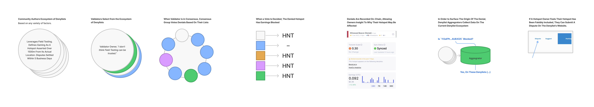

# HIP 40: Validator Denylist

- Author(s): @BFGNeil, @Anthonyra, @ElonTusk, @AP, @Joey, @jerm
- Start Date: 2021-09-27
- Category: Economic, Technical
- Original HIP PR: <https://github.com/helium/HIP/pull/284>
- Tracking Issue: <https://github.com/helium/HIP/issues/285>
- Status: In Discussion

## Summary

This HIP outlines a system of allowing Helium Network Validators to subscribe to one or many
denylists for the purposes of blocking HNT rewards to dishonest Hotspots while recording on-chain
records of the denied transactions. Proof of Coverage rewards have been, and continue to be, a
viable economic incentive to bootstrap global wireless coverage. Rewards gaming by dishonest actors,
even as a small percentage of the network, erodes network integrity. Ensuring that integrity
requires a multi-pronged approach including protocol changes, increased accountability for Hotspot
manufacturers, and increased security measures within the Hotspot itself. A denylist exists as
another tool in a broader range of tools to ensure Hotspots on the network are incentivized to
provide the most honest and accurate wireless coverage possible.

In the interest of keeping the network decentralized, denylists will be sourced from the community.
Credible decentralization ensures that no one entity can control the network. Any coordinated effort
to game rewards, block data transfer, or censor information to benefit one party while harming
another, undermines our mission of creating global, open wireless networks.

This proposal will not define the specifics of what “gaming” is. Helium Foundation’s role is to
provide a framework for community led decision-making and implementation. How “gaming” is defined is
left to denylist operators, members of the Helium Community, and ultimately the choice of inclusion
by Validators. The Helium Foundation has not and will never run its own denylist out of the interest
of decentralization.

## Motivation

Enabling Validators to deny earnings to a selection of Hotspots is one approach of many in the
effort to ensure proof of coverage security. Status quo in this domain is the
[denylist](https://github.com/helium/denylist/) operated by Nova Labs. The current implementation is
a carryover from the denylist that ran on Hotspots. As the current challenge creators, Validators
follow the Nova Labs denylist and prevent challenge creation and receipt for included Hotspots.
While effective, this method disallows continued analysis of Hotspots, since any record of their
Proof of Coverage activity does not appear on-chain. Additionally, the inclusion of this
functionality in Validators ensures that parties manipulating Hotspot software are not able to let
challenges through.

This proposal seeks to decentralize the decision making to the trusted pool of Validators and a
broader community of denylist authors. Previous drafts of this HIP called for a centralized
authority in the Helium Foundation to maintain and publish a denylist. The HIP specified a singular
committee to maintain and publish the denylist. This centralization was unpalatable and The Helium
Foundation feels the decentralized approach in this proposal is mandatory.

## Stakeholders

This specification affects all Hotspot owners, but particularly Validator operators and of course,
bad actors on the network.

**Hotspot owners:** For any well-asserted, appropriately compensated Hotspot; this proposal only
serves to benefit you. By denying HNT to dishonest Hotspots, that HNT is shared amongst honest
Hotspots. No action is required from Hotspot owners in the implementation of this HIP.

**Validators:** Validators will have the choice to subscribe to any denylist(s). The Validator will
ingest the denylist from the third party. Using the ingested list, it will cross-reference denied
Hotspots to inbound transactions while it is a member of a consensus group. For VaaS (Validator as a
Service) providers, we strongly urge that clients are able to specify their choice(s) of denylist.
However, this document makes no stipulations on how a Validator chooses a denylist (or not).

**Bad actors:** The message is simple: Stop. If your Hotspots are earning HNT without providing
coverage, now is the time to rectify that.


## Detailed Explanation

For clarity, this HIP is defined in three parts; we define the mechanics of a denylist, it’s
representation through the denylist aggregator, and ultimately how validators ingest the denylist
and mark a transaction as denied.

### Denylist

Conceptually, a denylist is a list of Hotspot public keys and a cryptographic signature over the
list to ensure that it cannot be tampered with and will only be ingested if the list is properly
signed by the operator. Because of this approach, a denylist can be distributed in any manner that
the provider sees fit.

Because Validators have the choice to subscribe to more than one list, they can select from
denylists with varying specialties. Some denylist operators may choose to work primarily off
community submissions, while others may work off in-field surveys, statistical analysis, machine
learning models, or other means. It is the responsibility of the denylist operator to clearly convey
methodologies and it is the responsibility of the Validator to choose a list that they feel is most
aligned with the network.

[](https://www.figma.com/file/CZxNpQJL55DdrfQYFAjiXv/Distributed-Denylists%2C-Illustrated?node-id=0%3A1)

#### Defining a List

This proposal intentionally avoids the definition of ‘gaming’, but some recommendations on best
practices of list maintenance can help the success of denylists as they apply to Hotspots on the
Helium Network. Generally speaking, denylist operators should:

- Have a strategy for continued maintenance of their list.
- Allow Hotspot owners to petition for removal in the scenario that Hotspots are erroneously
  included.
- Ensure the list is made available for ingest by the [denylist aggregator](#denylist-aggregator).
- Maintain secure practices such that your list is not taken over by bad actors.
- Invest in quality of additions over quantity. Erroneous additions of Hotspots are just as harmful
  to the network as gaming Hotspots.

#### Public Querying of the List

Denylist operators should give the community as much insight as possible as to why a Hotspot is
included in a particular denylist and how they might request for removal. Reasons may not always be
immediately clear with a raw display of information, so we recommend some form of in-page discussion
or explanation. Additionally, a denylist operator should make accommodations for disputes from
Hotspot owners who may have been incorrectly included. As an example of this in practice, Nova Labs
operates [crowdspot.io](http://crowdspot.io) as a frontend for their denylist.

The aggregator detailed below will act as a primary discovery tool for the community. Denylist
operators should ensure their list is included.

#### Validator Ingest of the List

A denylist should be published on a regular cadence with only the set of Hotspots to be denied. The
Validator will automatically handle removals if those Hotspots no longer appear in a Denylist. The
published list should be made available at a known endpoint, and provided to the Denylist Aggregator
for discovery purposes (as detailed below).

#### Denylist Generation

Denylist generation is handled by the open-source xorf-generator library. This tool both allows for
key signing of the denylist as well as the construction of the binary filter that Validators use to
check transactions against.

[https://github.com/helium/xorf-generator](https://github.com/helium/xorf-generator)

### Denylist Aggregator

In the interest of allowing denied Hotspot owners and community members alike to understand why a
given Hotspot was denied, we propose an aggregator of these distributed lists. In preparation for
this HIP, the Helium Foundation has opted to build and host this community resource.

The denylist aggregator will serve both as an interface to explore the state of Hotspots within
various denylists as well as an API to query for current and historical status of Hotspot denylist
inclusions. The aggregator will also serve as a discovery resource serving Validator operators
searching for denylists to leverage.

By querying a specific b58 hash or multiple hashes, the aggregator would return a response that
would allow for further inspection. As an example use case for this tool, denied transactions could
point to a particular denylist from Helium blockchain explorers like explorer.helium.com or
Hotspotty. This would allow a user to find the relevant list and dispute the denial in the case that
their Hotspot experienced denied reward transactions. Additionally, Hotspot Makers can consider
sending push notifications to Hotspot owners via their apps by leveraging this API.

|                    |
| :--------------------------------------------------------------------------------------------------------------------------- |
| Mock UI for representing a denied transaction in Helium Explorer. Denied transactions appear in the Hotspot’s activity list. |

|           |
| :------------------------------------------------------------------------------------------------------------------------------ |
| Mock UI for a Hotspot that has experienced a denied transaction. Warning would only appear if the Hotspot experienced a denial. |

```jsx
GET https://aggregator.domain.io/current/11xBfYCA24v9GpadmcP2ZQC4DVyfXsfSJ6J5983xebtysR8ZPCR

/* Response */
[
 {
  "id": "11xBfYCA24v9GpadmcP2ZQC4DVyfXsfSJ6J5983xebtysR8ZPCR",
  "name": "angry-purple-tiger",
  "last_denied_time": 1641331810,
  "last_denied_block": 810421,
  "sources": [
      {
        "identifier": "https://denylist.tld",
     "source": "https://api.denylist.tld/denylist.signed.bin",
        "last_ingest_time": 1641331705
      },
      {
        "identifier": "https://denylist.tld",
        "source": "http://d111111abcdef8.cloudfront.net/denylist.signed.bin",
        "last_ingest_time": 1641330491
      },
  },
  {...}
]
```

_[Example request/response from the denylist aggregator.]_

### Validators

As stated earlier, validators will have the ability to subscribe to one or many denylists and to add
or remove a subscription at any time.

In this section we outline one possible implementation that Validators could use to ingest these
third-party denylists. This implementation has the advantage in that it has already been coded
within the validator codebase.

A Validator cannot simply ignore a transaction from a given Hotspot without risk of being penalized.
The Honey Badger BFT consensus group demands that action must be taken for all transactions. In
other words transactions can’t slip through the cracks. The protocol will need to allow a
transaction to be marked as invalidated with a majority of the consensus group in favor while not
penalizing the opposing group members. As such, In order to execute a transaction denial, Validators
within consensus will vote to block rewards for individual witness receipts within a receipts
transaction. This vote is added to the block metadata on-chain, which allows for later analysis of
Hotspot activities. The on-chain data is important for the continued monitoring of denylisted
Hotspots for their possible removal or continued inclusion. In the current implementation, blocked
PoC activity does not appear on-chain, thus removing an important dataset for continued analysis.

Operators will specify their preferences for denylists in a configuration file. This configuration
will hold the URLs and public keys of the denylist(s) they choose. The Validator will fetch each
denylist on a regular schedule and check its authenticity using the `libp2p_crypto` routines. If the
list is authentic then the Validator will update its local store of denied Hotspots using this
fetched list.

Each denylist subscription is composed of three parts:

1. The URL of the denylist.
2. The denylist operator’s public key(s).
3. The denylist URL type for fetching purposes (currently only `github_release`)

Example:

```erlang
{miner,
  [
   {denylists, [
     %% Denylist #1
     {
       {keys, ["1SbEYKju337P6aYsRd9DT2k4qgK5ZK62kXbSvnJgqeaxK3hqQrYURZjL"] },
       {type, github_release },
       {url, "https://api.github.com/repos/helium/denylist/releases/latest"}
     },
     %% Denylist #2
     {
       {keys, ["1RnJgqeaxK3hqQrYURZjLbEYKju337P6aYsRd9DT2k4qgK5ZK62kXbSv"] },
       {type, github_release },
       {url, "https://api.denylist.tld/github/latest"}
     }
  ]
}
```

#### Initial Configuration

Validators already follow the existing denylist through the challenge prevention mechanism. In
keeping with status quo of denylist execution, the current denylist will be carried over into new
builds of the Validator software. Validator operators will be able to configure their systems to
include more lists or define `none`.

#### The github_release Type

In the `github_release` type, the URL returns a JSON object (`application/json`) with the following
properties:

| Property name                | Type         | Purpose                                                                                    | Example                                                                      |
| ---------------------------- | ------------ | ------------------------------------------------------------------------------------------ | ---------------------------------------------------------------------------- |
| `tag_name`                   | string       | Denotes current version of the list, for automated update checking.                        | `"2022040501"`                                                               |
| `assets`                     | list(object) | Describes the final download URL.                                                          | `[ { "browser_download_url" : "..." }]`                                      |
| `assets[0].browser_download` | string       | Contains the URL to the signed binary object representing the current version of the list. | `https://github.com/helium/denylist/releases/download/2022040501/filter.bin` |

#### Update Cadence

To get updated lists, Validators may perform an HTTP conditional get on some interval (defined in
`sys.config`) using the `If-Modified-Since` HTTP header, minimizing overhead of processing unchanged
files. Initially, The fetching and ingest of denylists should be recorded in logs or made otherwise
visible to the operator.

In the event that a denylist becomes stale or cannot be fetched due to any number of reasons,
Validators should clear the entries from that list. We propose Validators should clear these stale
entries after a period of 40 days, allowing margin for denylist operators who may update their lists
on a monthly cadence.

#### Voting Mechanism

Only Validators in an active consensus group are eligible to vote on an individual witness receipt
within a receipts transaction. In order to keep a PoC activity from being paid, a challenge or
receipt must accrue 2F+1 votes against. So for example, in a 43 member consensus, 29 votes must be
cast to block payment of a receipt.

#### Final Thoughts

As a last detail, the implementation of the denylist should exist with a controlling chain variable.
The proposition of denylists (outside of this specification) makes many efforts to avoid avenues for
exploitation or perverse incentives. However, if these issues should arise, the community should be
able to vote to disable this functionality. The community should continue to explore more
programmatic methods of network verification to minimize human subjectivity or opportunities for
coordinated control of rewards. The Foundation is eager to deploy resources to the cause as we
believe a denylist should be a temporary solution as the overall rewards scheme shifts to favor data
transfer.

## Drawbacks

Since the majority of Validators in consensus must agree to deny earnings, it is possible that a
particular consensus group does not hold enough voting power due to participation in a particular
Denylist. This would lead to a dishonest Hotspot still being able to earn enough to make their
falsified coverage financially attractive.

## Deployment Impact

This proposal offers a migration path for previous denylist functionality, enabling more diversity
in participation as well as greater visibility to the impact of denylists. Furthermore, because this
denylist is executed on Validators, it will be impossible for gaming Hotspots or manufacturers to
exclude the denylist from their devices.

This proposal expects Validator operators to evaluate and include denylists in their deployments. At
point of release, bundled deploys (Docker) would be updated to include at least the existing
Nova-operated denylist. Large publicly known Validator operators have already been notified and they
intend to support this functionality pending the approval of this HIP. For Validators leveraging
VaaS, your provider will be able to accommodate your specific denylist inclusion requests.

## Success Metrics

A sufficient number of Validators subscribe to denylists in order to block rewards for known gaming
Hotspots. Additionally, these denylists continue to be maintained with a minimal number of
false-positive inclusions.

Statistically speaking, between 50-80% of the overall Validator pool must list a Hotspot in order
for that Hotspot’s earning to be affected (on average). At approximately 66% of coverage, a denied
Hotspot would see 50% reward loss, on average. After ~80% inclusion, a Hotspot is effectively
entirely blocked.


## What If’s

**What if a Validator blocks all but their own Hotspots?**

In order to effectively block any transaction, a 2F+1 majority of Validators in a consensus must
agree. This means that 29 of the 43 members in a consensus group must agree. With over
[3600](https://explorer.helium.com/validators) Validators online and 43 randomly selected from that
pool for consensus, it would be prohibitively expensive for a bad actor to deny arbitrary Hotspots.

**What if a bad actor pays off a denylist owner to be removed?**

Due to the distributed nature of community-hosted denylists, a bad actor would have to remove
themselves from all the denylists that Validators subscribe to. For example, if a bad actor appeared
on six highly-used lists, they would have to pay off all of those services.

**What if the denylist doesn’t have all of the gaming Hotspots?**

The denylist is one disincentive of many to keep gaming at bay. Above all, Proof of Coverage and
more direct detection methods all work in concert to ensure the security of PoC.

**What if my Hotspot appears on a denylist and I’m not gaming?**

Denylist operators should manage a pipeline for reviewing Hotspots or otherwise removing them from
their lists. If a denylist operator does not maintain their service, Validators should remove them
or look to other services.

**What if not enough Validators sign up to use a denylist?**

If Validator operators don’t feel the need to run a denylist, then we must assume that the network
is in good health. Through the long-term staking of their HNT, network Validators are incentivized
to do what is in the best interest of the network.

**How will I see which Hotspots my Validator has denied?**

Individual Validator actions can be surfaced with queries from tools like
[https://etl.dewi.org](http://etl.dewi.org) or more specialized block explorers.

**Will the denylist have the ability to block data transfer or rewards for data transfer?**

No, any Hotspot considered ‘denied’ would still be able to act as a data-only Hotspot, providing
whatever network coverage possible. However, it is generally the case that these Hotspots did not
provide coverage in the first place, hence their inclusion. Is it important to understand the
uninterrupted data transfer ability in the case of errant inclusions.

**Will my Validator be penalized if it doesn’t vote for a particular Hotspot but the rest of the CG
does?**

No, whether your Validator casts a ‘yes or no’ vote, it will not be penalized.
