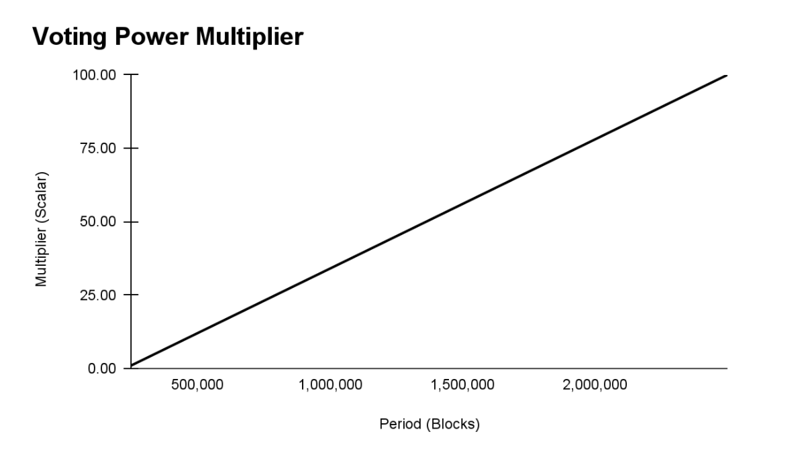

# HIP 41: Governance by Token Lock V2

- Authors: @tjain-mcc (tushar)
- Start Date: November 1, 2021
- Category: Governance
- Status: In Discussion
- Original HIP PR: <https://github.com/helium/HIP/pull/299>
- Tracking Issue: TODO
- Discord Channel: TODO

# Summary

This proposal specifies a governance mechanism to enable modifications to chain variables (on-chain
voting), and specifies an additional signaling mechanism for general purpose protocol improvements
(off-chain voting).

_Note: This HIP has been submitted In direct response to
["Rewrite HIP31 with Token Lock rather than Token Burn mechanism"](https://github.com/helium/HIP/pull/252)_

# Motivation

Sound governance models help networks develop in the direction that creates the most value for their
participants. Governance mechanisms must be designed such that decisions are transparent,
permissionless, and align incentives for the long term.

Most protocol governance in practice today relies on a one-token, one-vote system. This mechanism is
vulnerable to adversarial parties borrowing tokens for the solely for the duration of a given vote,
and steering the network in a potentially harmful direction. With historical precedent of low voter
turnout and low interest rates for short-term loans, this is an easily feasible attack vector.

One-token, one vote also concentrates voting power in the hands of large market makers and traders
who hold tokens for trading purposes but do not have long term commitment to the network. This can
lead to smaller holders becoming disenfranchised and disengaged from governance.

This proposal outlines a system that imposes a cost on voting such that only committed participants
are willing to vote.

# Stakeholders

All Helium Network stakeholders are affected by this HIP because governance impacts key parameters
in the network.

# Detailed Explanation

**Vote Power by Lock**

The core primitive of this proposal is “voting power”, the unit of support for either side in a
given vote.

Network participants can deposit HNT tokens to a “governance staking contract”, which are locked and
delegated to one or many validators of their choosing. Users have control over the number of tokens
they choose to stake, and the period they choose to stake them for. The minimum lockup period is
250,000 blocks and the maximum lockup period is 2,500,000 blocks (both the minimum and maximum time
thresholds can be decided by HNT governance).

A user’s voting power is determined by 1) the amount of HNT they vote with, and 2) the amount of
time they commit to locking up their tokens. The structure applies a linear multiplier of time to
the amount of HNT locked up in the voting contract. For the maximum amount of 2,500,000 blocks,
users receive 50x the voting power. For the minimum amount of a 250,000 block lockup, users receive
1x the voting power.

As a simple example, let’s imagine Alice, Bob, and Charlie all have 100 HNT:

1. Alice chooses to lock up her tokens for the minimum required 250,000 blocks, and thus her voting
   power is 100
2. Bob commits to locking up his tokens for 1,375,000 blocks, and thus his voting power is 25 \* 100
   = 2,500
3. Charlie commits to locking up his tokens for 2,500,000 blocks, and thus his voting power is 50 \*
   100 = 5,000

As the lockup burns down, so does the voting power. For example, if Charlie locked up his 100 tokens
for 2,500,000 blocks and 1,125,000 blocks have passed then Charlie would have 2,500 vote power.

| Period (Blocks) | Multiplier (Scalar) |
| --------------- | ------------------- |
| 250,000         | 1.00                |
| 500,000         | 12.00               |
| 750,000         | 23.00               |
| 1,000,000       | 34.00               |
| 1,250,000       | 45.00               |
| 1,500,000       | 56.00               |
| 1,750,000       | 67.00               |
| 2,000,000       | 78.00               |
| 2,250,000       | 89.00               |
| 2,500,000       | 100.00              |

Governance proposals can be called to a formal vote with a minimum of 1,000,000 voting power (“vote
minimum”), and users will be able to participate in each vote for a period of 7 days (“voting
period”). These thresholds are placed to mitigate risk of DDoS attacks, but both parameters will be
tunable by this same voting process at any time.

Note that the voting power used to call a vote is eligible to vote, so the user that calls for a
proposal to be voted upon can allocate their stake to either side. At the end of the voting period,
the governance staking contract looks at how many tokens a voter has and how long they are locked
for. Voters can always extend their lockup period just prior to voting. Locked tokens can vote as
many times as they want, and all earnings from staking are earned by voters as normal staking
rewards.

**Commit-and-Reveal**

One of the challenges with the locking mechanism proposed here is that most participants will wait
until the last minute to vote. This is because there is a cost—namely, giving up liquidity—to vote.
As such, if a vote is going someone’s way, they may not want to participate and lock up tokens.

In order to incentivize honest voting and maximal participation, we propose that Helium governance
adopt a commit-and-reveal scheme. With this feature, votes would be submitted in a concealed
fashion. Upon the completion of the voting period, we propose a 3 day reveal period in which voters
can review the results of the vote, including who voted.

Commit-and-reveal can be implemented by having voters hash together their address, vote, and salt.
Once the reveal period begins, voters can reveal their votes by publishing the unhashed data. If
voters don’t reveal their vote before the reveal period, their vote is not counted.

The result of this should be maximal participation for important decisions because voters won’t know
whether their vote will matter or not.

**Voting Mechanics**

The minimum threshold to win a vote is 66%. We believe that chain variables in networks should only
change when there is broad consensus amongst stakeholders and seek to avoid giving too much power to
narrow majorities. There are three classes of variables going forward:

- **Network Controlled Variables**: These, typically economic or social variables, are controlled by
  this HIP. This is the default class for most chain variables.
- **Operational Variables**: These variables are issued dynamically by the core developers and
  primarily control chain performance.
- **Long-term Operational Variables**: These variables are potentially hard-coded and height
  activated for non-economic protocol evolution. For example, activating a new transaction type.

Since voting by token lock has meaningful liquidity implications for holders, vote results should be
binding and simple to deploy quickly. Chain variable changes fit this criteria.

The Vote Power by Lock mechanism is designed for proposals to automatically modify chain variables
at the end of the voting process, but can also be utilized for general purpose network changes. This
proposal requires that code be presented prior to the vote for any general purpose network changes.

# Drawbacks

1. **High barrier to entry:** Network participants must part with liquidity to vote, so the barrier
   to entry is higher than one-token, one-vote systems

2. **Incentives:** For a holder to vote against a proposal, the expected cost of the passed proposal
   must exceed their cost of voting, and they must have conviction that their votes will lead to the
   proposal failing

3. **Change inertia:** We assume all voters prioritize winning a proposal over their HNT staked in
   voting. This may limit the development of the protocol as minor changes may be contentious, and
   therefore expensive and unlikely to be proposed in the first place

4. **Payoff ambiguity:** It is difficult to calculate the payoff for participation in any given
   vote.

# Rationale

1. **Incentivizes consensus:** In this structure, having a contentious vote is expensive (in terms
   of lost liquidity) if a network participant is on the losing side, so it is worth building
   consensus on a proposal

2. **Fights concentration of governance power via concentration of economic power:** This structure
   is much less oligarchic than one token, one vote, partially preventing whales from de facto
   control of governance proposals because votes are private and one side cannot take the lead
   publicly thereby dissuading the other side from voting

# Alternatives

1. Governance by token
   burn:[<https://docs.google.com/document/d/1aTla9U4JLPTQ-mRyUB28VPOHkm4USK36uafOig6IJ_w/edit>#]

# Deployment Impact and Timeline

The Helium core team will have to prepare a complete product and engineering roadmap to put this
proposal into action. Timeline is to be determined.
