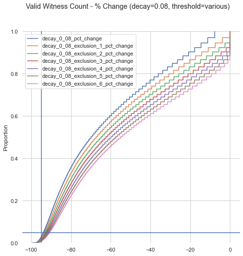
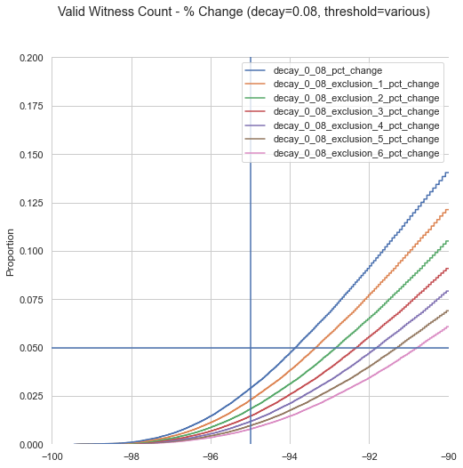

# HIP 44: Witness Reward Decay

- Author(s): [@abhay](https://github.com/abhay)
- Start Date: 2021-10-07
- Category: Technical, Economic
- Original HIP PR: <https://github.com/helium/HIP/pull/292>
- Tracking Issue: <https://github.com/helium/HIP/issues/310>

## Summary and Motivation

As Proof-of-Coverage continues to be improved, the community has proposed several improvements to
continue to incentivize wide rollout of new Helium Hotspot coverage while addressing over-rewarding
due to density and or arbitrage. One effective way to address over-rewarding is create soft limits
on witness earnings through decaying witness reward units.

## Stakeholders

All Hotspot owners are affected by this proposal. Specifically, those with extremely high witness
rates per epoch would be most affected and rewards would be more evenly distributed to other
Hotspots that are witnessing within those epochs. Other network participants (Validators, Routers,
etc) are not affected.

### Detailed Explanation

Witness reward decay rates provide a soft economic limit to over-witnessing. As the number of
witness events per epoch increases, a Hotspot will gain subsequently fewer reward units for each
event.

This decay rate can be defined as a chain variable and modified over time. The initial proposal for
`witness_reward_decay_rate` is `0.08` which can be modified over time as the impact is understood.
In addition, a `witness_reward_decay_exclusion` of `4`, also a chain variable, would be used to only
affect witness rewards at and above the value. Practically speaking this could be seen as the
following.

```erl
1> f(DecayRate), f(Exclusion), DecayRate = 0.08, Exclusion = 4, lists:sum([ case Count < Exclusion of true -> 1; _ -> math:exp((Count - Exclusion) * -1 * DecayRate) end || Count <- lists:seq(1, 20)]).
12.668364965907838
2> f(DecayRate), f(Exclusion), DecayRate = 0.08, Exclusion = 4, lists:sum([ case Count < Exclusion of true -> 1; _ -> math:exp((Count - Exclusion) * -1 * DecayRate) end || Count <- lists:seq(1, 15)]).
11.02650609098551
3> f(DecayRate), f(Exclusion), DecayRate = 0.08, Exclusion = 4, lists:sum([ case Count < Exclusion of true -> 1; _ -> math:exp((Count - Exclusion) * -1 * DecayRate) end || Count <- lists:seq(1, 10)]).
8.577140471334872
4> f(DecayRate), f(Exclusion), DecayRate = 0.08, Exclusion = 4, lists:sum([ case Count < Exclusion of true -> 1; _ -> math:exp((Count - Exclusion) * -1 * DecayRate) end || Count <- lists:seq(1, 5)]).
4.923116346386636
5> f(DecayRate), f(Exclusion), DecayRate = 0.08, Exclusion = 4, lists:sum([ case Count < Exclusion of true -> 1; _ -> math:exp((Count - Exclusion) * -1 * DecayRate) end || Count <- lists:seq(1, 4)]).
4.0
6> f(DecayRate), f(Exclusion), DecayRate = 0.08, Exclusion = 4, lists:sum([ case Count < Exclusion of true -> 1; _ -> math:exp((Count - Exclusion) * -1 * DecayRate) end || Count <- lists:seq(1, 3)]).
3
7> f(DecayRate), f(Exclusion), DecayRate = 0.08, Exclusion = 4, lists:sum([ case Count < Exclusion of true -> 1; _ -> math:exp((Count - Exclusion) * -1 * DecayRate) end || Count <- lists:seq(1, 2)]).
2
8> f(DecayRate), f(Exclusion), DecayRate = 0.08, Exclusion = 4, lists:sum([ case Count < Exclusion of true -> 1; _ -> math:exp((Count - Exclusion) * -1 * DecayRate) end || Count <- lists:seq(1, 1)]).
1
```

At `20` witness events, the Hotspot would only be elgible for `12.66` reward units (assuming no
other scaling) but at `5` witness events, the Hotspot would be eligible for almost the full amount
of reward units (`4.92`). No decay occurs up to 4 events.

Seen differently across the network, 5% of the network would be scaled by almost 92% on their
witnesses and this would incentivize the remainder of the network to grow and expand organically.
This is based on analysis of all witness receipts between blocks 1032738 and 1040915.
[data](https://gist.github.com/abhay/8b75824c3b7cc27009f2a76f56fa9bc1)




The fortunate coincidence about this feature is that it's already built and is just two chain
variable away from being activated. We are able to enable it at the same time as PoCv11 is activated
(or sooner).

## Open Questions

- Are these proposed values the correct starting
- How do we verify that the proposed limits are right for the network?
- How could these limits be adjusted in the future?

## Success Metrics

Success here means that a Hotspot witnessing provides sufficient data to the blockchain to reward
coverage and incentives continue to be aligned to create new and wide coverage on the Helium
network.
