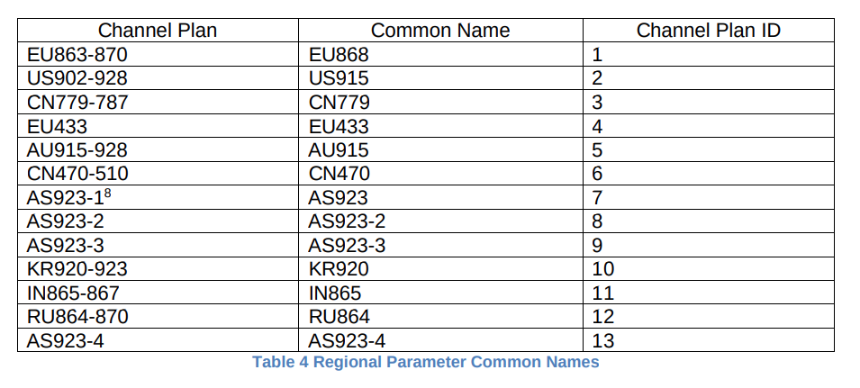
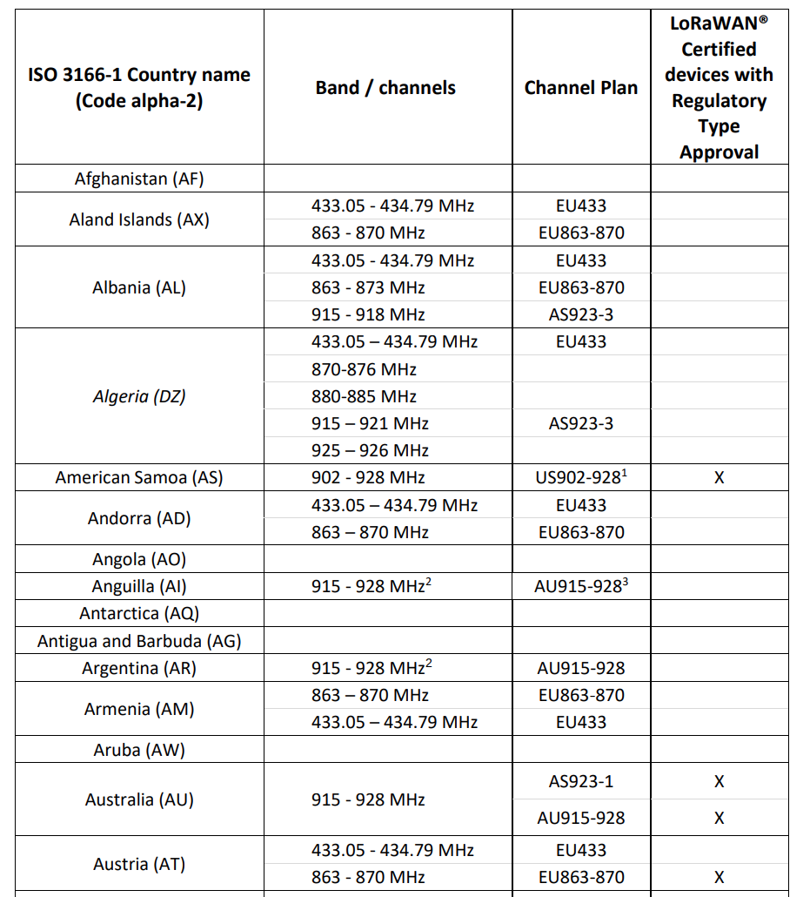

# HIP 45: LoRaWAN Frequency Plan Selection

- Author(s): [@lthiery](https://github.com/lthiery), [@ivandigiusto](https://github.com/ivandigiusto)
- Start Date: 2021-10-25
- Category: Technical
- Original HIP PR: <https://github.com/helium/HIP/pull/298>
- Tracking Issue: <https://github.com/helium/HIP/issues/311>
- Status: Withdrawn

# Problem Statement

There are over a dozen of officially recognized LoRaWAN channel plans cited in
the [LoRaWAN Regional Specification](https://lora-alliance.org/wp-content/uploads/2021/05/RP002-1.0.3-FINAL-1.pdf):

The same document also provides guidance for eligible channel plans and
"LoRaWAN® Certified devices with Regulatory Type Approval":

In each region, the Helium Network must select one and only one frequency plan
(based on current design constraints). In cases where only one channel plan is
possible (eg: Anguilla) or where only one has regulatory type approval (eg:
American Samoa), the selection for the Helium Network may default to that one.

From the snippet above, you can see a few cases where selection is not so
straightforward:
- **Afghanistan, Angola, Antartica, Antigua and Barbuda, Aruba**: there is no
channel plan suggestion nor is there one support for regulatory type approval
- **Aland Island, Albania, Algeria, Armenia**: there are multiple potential
plans but not support for regulatory type approval
- **Australia**: there are _two_ potential plans and both have regulatory
type approval

These cases each special consideration which requires deep technical expertise
and local knowledge. This same reasoning also extends to countries that may
not yet have ISO 3166 recognition.

These configurations are currently encoded within the [`helium/miner` project](https://github.com/helium/miner/blob/master/priv/countries_reg_domains.csv);
this encoding may sometimes have mismatches even for even the easily defined
and those may often be implemented quickly as "bug fixes". However, for the
more ambiguous regions, disambiguation lacks rigor and process.

# Solution

This HIP strives to solve the problem of choosing a _single_ frequency plan
per region. We believe this is an important assumption as while the network
is growing rapidly, providing core coverage on a specific frequency plan and
sub-band is critical in providing predictability for users. In other words,
fragmenting a nascent network would leave to both confusion and difficulty
roaming within even the same region.

Upon [joining the LoRaWAN Alliance as contributing member](https://www.webwire.com/ViewPressRel.asp?aId=278878),
DeWi also formed a LoRaWAN Technical Committee "to help steer the Helium
Network’s LoRaWAN infrastructure towards maximizing value for the LoRaWAN
community at large." The membership of this committee includes many other
contributing (and founding) members of the LoRaWAN Alliance and as such,
includes deep technical and business knowledge of the ecosystem.

**This HIP proposes that the DeWi LoRaWAN Committee may call for an initial
assignment or change of frequency plan per region and/or country**.

1. Upon doing so, the DeWi LoRaWAN Committee will open a Pull Request (PR)
to the [`helium/docs`](https://github.com/helium/docs) repository marking the
change and providing the reasoning for the change. The announcement should
also be made on the local Discord channel(s) and any other standard DeWi
announcement channels.
2. There will be a minimum four-week window during which a public commentary
will be open under the PR. During this period, anyone can propose a formal
dissenting opinion with counter-arguments to the proposed change and must
provide alternate solutions if possible.
3. Should the discussion have any _formal_ dissent, a live virtual public
forum will be in attempt to reach consensus. The author of the dissenting
opinion must be ready to take the floor to represent their position.
4. If the change remains contentious, the decision will go to on-chain
voting. Currently, that would be implemented using [Helium Vote](https://www.heliumvote.com/)
mechanism where 1 hotspot in the concerned region equals 1 vote. Votes are
cast by doing a DC burn transaction towards the appropriate wallet. A hotspot
must be asserted in the concerned region for the entire duration of the vote,
which must last at least seven days.

After steps 2 and 3, before proceeding to the next escalation, DeWi's LoRaWAN
Committee may withdraw their proposal and reissue a new proposal at anytime.
This would effectively restart the process at step 1.

# Rationale and Alternatives

An alternate approach would be to allow any hotspot operate to choose any legal
frequency plan. For example, operators in Australia could select AU915 _or_
AS923-1 when they assert location. We believe this to be problematic as it will
lead to fragmentation of coverage and confusion on behalf of network users.
Instead, we believe such mechanisms would be useful for expanding into
additional subbands.

# Deployment Impact

A change in frequency plan could potentially cause certain devices to not be
eligible for operation under the new frequency plan, either due to  hardware
or legislative constraints (ie: lack of certification to transmit on the new
frequencies).

Assuming a device is physically and legally capable of adopting the new plan,
the adjustment will only be possible if the vendor's firmware reads the
frequency plan indicated from the Miner or Light Gateway client and applies
the new frequency plan to the packet forwarder utility which configures the
SX130x front-end.
