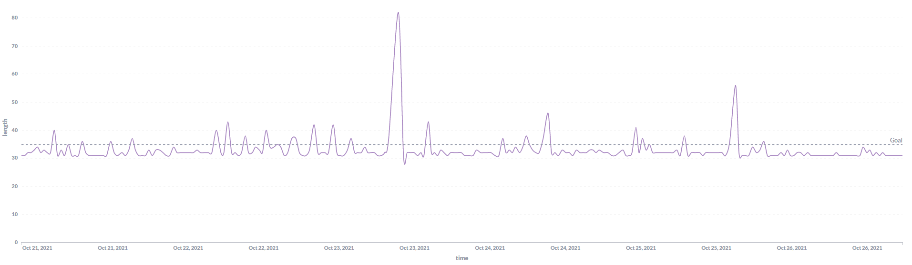

# HIP 47: Increase DKG Failure Penalty

- Author(s): [@PaulVMo](https://github.com/PaulVMo)
- Start Date: 2021-10-26
- Category: Technical
- Original HIP PR: <https://github.com/helium/HIP/pull/306>
- Tracking Issue: <https://github.com/helium/HIP/issues/313>
- Status: Approved

# Summary

Increase the DKG penalty amount from the current value of 1.0 to 5.0. The DKG penalty is assessed
when a validator fails to complete the distributed key generation (DKG) that is required for a
consensus group election to complete. A failed election is reattempted 5 blocks later with another
set of validators. Repeated election failures are bad for the network and bad for the validator
pool. The current DKG failure penalty amount is not significant enough to drive change in behavior
for misconfigured and poor performing validators. By tuning the penalty amount in this way, failed
validators should be more quickly removed from eligibility for consensus group and hopefully provide
greater incentive for operators to improve the performance of their validators.

# Motivation

### What is a DKG penalty?

At the end of every epoch (every 30 blocks), an election takes place to select the next consensus
group. Approximately one quarter of the existing group is selected to be removed from the group and
then validators from among the validator pool are selected as replacements.

For an election to be successful, the resulting selected group must complete distributed key
generation (DKG) within 5 blocks. The resulting key is required for the consensus protocol to work.
A DKG failure occurs when one or more members of the selected group are not reachable by the others
or otherwise fail to complete their portion of the DKG. 100% of the group must complete DKG. The
members that cause the DKG to fail are assessed with the DKG penalty.

DKG penalties add to a validator’s overall penalty score. Validators with a higher penalty are less
likely to be selected to join consensus group and to stay in consensus group once in.

### Why should the community care about DKG failures?

If an election has not succeeded including the DKG, a new election is reattempted every 5 blocks
until one succeeds. Failed elections cause epochs (the time between consensus groups) to run long of
their nominal target of 30 blocks. This is bad for the network as well as for validators
specifically.

First, from a network perspective, long epoch times lead to less frequent rotation of validators in
and out of the consensus group. In general, frequent rotation is good for the network as it creates
less predictability of which validators will be in consensus at a given time and thus provides
greater security. Also, from a performance perspective, long epochs lead to longer reward block
times. Rewards are calculated once per epoch at the end of the epoch. When there are more blocks in
an epoch, there are more transactions to be processed in the reward block. This leads to more time
to compute the rewards. Some rewards blocks can take up to 10 minutes. During this time, other
transactions are not being processed leading to delays on the network.

Second, from validators’ perspective, failed elections lead to fewer rewards for the validator pool
which will decrease the incentive to run a validator. In general, more validators are better because
it increases the barrier to a single, malicious actor controlling a large portion of the consensus
groups as well as great reliability. However, rewards for validators in the consensus group are
capped at 35 blocks (which is the 30 block interval plus one 5 block election interval). If the
election fails on the first try, then validators stop being rewarded until an election succeeds.
This can be seen in the spikes above 35 blocks in the graph of epoch length (source: DeWi ETL).

# Stakeholders

This HIP impacts both the validator group as well as all network participants and users in general.
By tuning the validator penalties, operators will be encouraged to properly configure their
validators and keep them online which is beneficial for the network.

Feedback on this tuning of the penalty amounts was solicited in the #validator Discord channel.

# Detailed Explanation

Implementation is done by processing of a var transaction to update the value of the `dkg_penalty`
chain var to 5.0. No code changes are needed for this value.

### Why 5.0?

Several factors justify a higher dkg failure penalty. The most significant is looking at the harm
caused to others (aka lost rewards for the validator pool) vs. oneself when failing DKG.

Based on current reward rates, a single DKG failure causes the consensus pool to miss out on 5
blocks worth of rewards or 17.36 HNT (6% of 2.5 million HNT / 43,200 blocks per month \* 5 blocks).
For the validator that failed to get elected, their expected rewards that they are missing out on
had they been elected is ~10 HNT based on current variables (~2.5 HNT per validator per epoch
multiplied by an average of tenure of 4 epochs per election).

It is reasonable to assume that the pain felt by the failing validator should at least match the
pain felt by the other validators. This means that not only should the failing validator miss out on
the 10 HNT expected had they been elected on that attempt, but also on average should miss one more
election such that the missed opportunity to them is >17.36 HNT. With the average validator penalty
currently at 4.4, adding a DKG penalty of 1.0 to their score only decreases relative odds of being
elected by 18% (i.e. a score of 5.4 vs. 4.4 is 82% as likely to be elected). This is far short of
reducing the odds of election such that the failing validator on average will miss out on another
entire election. Setting the DKG penalty to 5.0 will mean that the failed validator will then be
about half as likely to be elected after receiving the penalty.

Lastly, one can look at the DKG penalty relative to the tenure penalty which is 0.5. Based on the
average validator staying in consensus groups for 4 epochs upon election, then the total tenure
penalty expected for an election is 2.0 (4 rounds \* 0.5 tenure penalty / round). However, based on
the logic above, the penalty for causing an election failure should be at least twice that, or at
least 4.0 which is more closely aligned to the proposed value of 5.0 than the existing 1.0.

# Drawbacks

One drawback to increasing the penalty is that it can be seen as unfair in some cases since not all
DKG failures are currently explainable. Based on validator operator feedback on Discord, well
configured and adequately performing validators have experienced DKG failure penalties without
sufficient information (such as logging) as to why the failure occurred.

However, given the fact that all penalties decay to zero over time (currently approximately 2 weeks’
time) and the average time between elections for any individual validator is 5 to 6 days, the risk
should be seen as acceptable in order to improve the performance of the network as a whole..

# Rationale and Alternatives

The rationale for this change is explained above in the motivation. The objective of this change is
to adjust the value of an existing penalty to improvement the performance of validators and the
blockchain.

As this solution leverages tuning of the existing penalty system, alternatives were deprioritized.
The authors felt it was prudent to first attempt to tune the existing system rather than suggest a
new one, especially as this will be the first adjustment to penalties since validators went live on
mainnet.

It should be noted that several novel ideas to improve the system were suggested by the community.
One such that should be reserved for future iterations, if warranted, is the idea of a progressive
penalty for repeat DKG failures by the same validator to help ensure they are more quickly
deselected from the consensus group.

# Unresolved Questions

No unresolved questions.

# Deployment Impact

This will be deployed as var transaction which requires no code changes or other impacts. All
validators and other node types can already accept this value for the `dkg_penalty` chain var.

# Success Metrics

Success of this change will result in fewer epochs that are exceed 35 blocks and fewer repeat
failures in the same election cycle when there is a failure..
