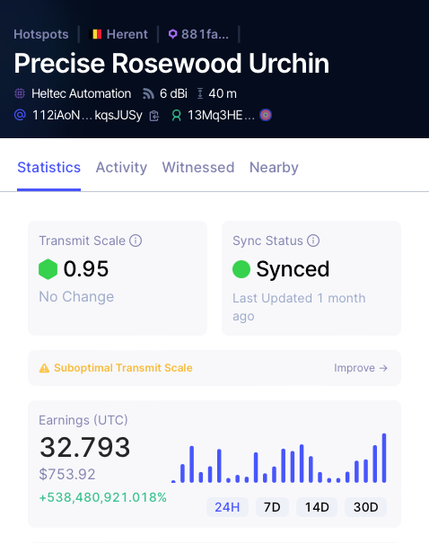

# HIP 57: PoC Rewards Establishment Period

- Author(s): [@Scottsigel](https://github.com/Scottsigel),
  [@starwatcher](https://github.com/mrpatrick1991), [@jthiller](https://github.com/jthiller)
- Start Date: 2022-03-16
- Category: Technical
- Original HIP PR: <https://github.com/helium/HIP/pull/375>
- Tracking Issue: <https://github.com/helium/HIP/issues/376>
- Status: In Discussion

# Summary

In order to combat PoC rewards gaming, the process of ‘spoofing’ or ‘gaming’ a Hotspot to earn
disproportionate rewards must be economically unsound. Among a range of solutions, the existing
denylist and HIP-40 offer a means to remove Hotspots that don’t provide legitimate coverage.
However, there is sufficient time after onboarding a Hotspot where it remains economically viable to
spoof a location and game PoC rewards before a Hotspot in question can be confidently identified and
added to a denylist.

If approved, this proposal would introduce a Hotspot ‘establishment period’ such that the network
can better learn about a Hotspot’s deployment immediately following a location assertion. This
period would be defined initially as 15 days and 10 successful witnesses, as set by a chain
variable. A Hotspot’s PoC rewards and witnesses of its beacons would be throttled to 10% of what
would be its normal earnings until both of these conditions are met. Data rewards would be
unaffected. As the network improves its ability to understand a Hotspot’s location or as reliance on
denylists are reduced, these chain variables could be adjusted.

This establishment period would only have a short-term impact on a host’s overall payback period.
This proposed change to the rewards scheme would have a significantly negative impact on gaming
economics thus redirecting the disproportionate gamed rewards back to hosts providing legitimate
coverage. This also meaningfully improves coverage integrity for existing and prospective network
users – core to the thesis of the ‘Helium Flywheel’. Further details on the implications to the
Helium Flywheel are detailed in the following section.

| **Precise Rosewood Urchin**                                                                                            |
| ---------------------------------------------------------------------------------------------------------------------- |
|                  |
| In this example, a Hotspot has arbitraged delays in denylist action in order to accrue disproportionate gamed rewards. |

# Background

Proof-of-Coverage (PoC) rewards have been an incredibly successful economic incentive to bootstrap
Helium wireless infrastructure for LoRaWAN at a global scale. Hotspots deployed by Helium’s global
community of hosts grew over 25X in 2021. This rate of growth is already supporting increased
network use and roaming from the largest LoRaWAN network operators. Continuing this journey to
ubiquitous coverage, combined with improvements to scalability such as Light Hotspots coming this
year, meaningfully supports demand-side such as sensor deployments and the ability to reliably embed
Helium into commercial connectivity.

However, with the current rate of growth, mining HNT exclusively with PoC rewards becomes more
difficult as more Hotspots join the network. In order for the economic incentive to remain sound and
the [flywheel](https://multicoin.capital/2021/03/17/the-helium-flywheel/) for Helium Network growth
to remain intact, two things must hold true:

1. The price of HNT remains positively correlated with network growth.
2. PoC rewards are fairly distributed and favor hosts providing the best coverage.

Under normal circumstances, and for the majority of 2021, the token price has positively correlated
to coverage growth. Unfortunately geopolitical risk has negatively affected all markets including
crypto. This should be viewed as a temporary concern as crypto investors shift their focus to value
investing and strong fundamentals, which benefit HNT holders. The second issue is the fair
distribution of PoC rewards, which is currently compromised by dishonest hosts spoofing coverage and
gaming rewards. The best way to combat gaming on the network is to make the process economically
unsound.

# Motivation

Anti-gaming efforts should have an advantage over gamers themselves. These dishonest actors in the
ecosystem only seek personal advantage at the expense of the community and the Network’s potential.
Their activity creates an imbalance in the allocation of PoC rewards and erodes coverage integrity.

Today, the time required to identify illegitimate Hotspots gives spoofers enough time to
sufficiently mine HNT and profit before being added to the denylist. In the worst cases it would
appear that gamers have access to swarm keys from Hotspot manufacturers without the overhead of
buying all new hardware. Current anti-gaming mechanisms rely on data collected from the chain. By
setting this 15 day window with a set number of PoC activities, we ensure these mechanisms have
enough data to act before rewards surpass onboarding and assertion fees.

Throttled rewards of 10% for the first 15 days (10 witnesses are almost always recorded within this
period) severely impact the economic incentive for gamers, albeit at a modest increase to the
current payback period for a Hotspot. The following model compares the payback periods of (a) 10% of
PoC rewards siphoned off to gamers, compared with (b) 10% throttled rewards for 15 days and those
rewards returned to honest Hotspots.

| **Today**                         | **Network With No Gaming** | **With Gaming (assuming 10%)** | **With Throttled Rewards** |
| :-------------------------------- | -------------------------: | -----------------------------: | -------------------------: |
| Total HNT per month               |                  2,500,000 |                      2,500,000 |                  2,500,000 |
| % to miners                       |                        60% |                            54% |                        60% |
| HNT to miners                     |                  1,500,000 |                      1,350,000 |                  1,500,000 |
| # of Hotspots                     |                    625,000 |                        625,000 |                    625,000 |
| Average HNT per Hotspot per month |                        2.4 |                           2.16 |                        2.4 |
| Average HNT per Hotspot per day   |                       0.08 |                           0.07 |                       0.08 |
| HNT price                         |                     $22.50 |                         $22.50 |                     $22.50 |
| $ per day                         |                      $1.80 |                          $1.62 |                      $1.80 |
| Cost of Hotspot                   |                       $550 |                           $550 |                       $550 |
| Payback in days                   |                    **306** |                        **340** |                    **321** |

To broaden the illustration, we run the same model with different assumptions of the gaming on the
network.

| **Gamed % (Hypothetical)** | **$/Day** | **Days to Payback with Gamers** | **Days to Payback Payback with Throttle** |
| -------------------------- | --------: | ------------------------------: | ----------------------------------------: |
| 15%                        |     $1.53 |                             359 |                                       321 |
| 10%                        |     $1.62 |                             340 |                                       321 |
| 5%                         |     $1.71 |                             322 |                                       321 |
| 0%                         |     $1.80 |                             306 |                                       321 |

A ramp up period favors long-term commitment which is good for commercial grade use of the network
which in turn bolsters the value of the network. For the long-term aligned community, this is a
small sacrifice that will ultimately raise rewards for all honest hosts.

Looking ahead, the payback period comes back down significantly as Light Hotspots become available
and the market value of HNT recovers – currently modeled as $550/Hotspot and $22.50/HNT in the table
above. As always, Hotspot deployments that provide meaningfully better wireless coverage will earn
more than the average Hotspot. This group is likely the most motivated to reduce gaming given their
efforts to optimize the Network.

# Stakeholders

All Hotspot hosts mining HNT.

# Detailed Explanation

Every Hotspot on the Helium Network will earn 10% of its normal earnings for its first 21,600 blocks
(15 days assuming 60s blocks) AND until it has witnessed 10 Hotspot beacons following any location
assert or reassert. Thereafter it will earn 100% of its full potential PoC rewards.

## Application to All Location Asserts

It is important to scale reasserts in addition to the initial location assert and/or onboarding
since if left to initial assert only, we must also expect that gamers may “age” their Hotspots by
correctly asserting them all in one hex before reasserting and falsifying their locations. Hotspot
location asserts prior to the deployment of this HIP would not be affected.

## Use of Timeframe & Witness Count

The combination of time (specified in blocks) and witness count allows for analysis in both dense
and sparse deployment areas. In dense areas, Hotspots will rapidly accrue enough information to
offer clear signal as to the validity of their deployment. However, in areas with fewer Hotspots it
will take more time to witness other Hotspots. In analysis of witness activity, even the smallest
deployments of Hotspots gather at least 10 witnesses within 15 days when properly deployed. It is
worth noting that this proposal does not mandate witnesses from unique Hotspots – one will do.

Removing the time window or witness count while leaving the other would open opportunities for
abuse. Configuring this proposal to track time without witnessing would allow a gamer to simply wait
out the period while the Hotspot is shielded from PoC activity. Configuring the proposal to track
only witnesses would allow a gamer to flood the new Hotspot with activity before denylist processes
have had an opportunity to write a new list or deploy it – either through deployment in a dense area
or packet stuffing.

## Scaling Beacon Receipts

In addition to scaling the PoC rewards for the Hotspot in the establishment period, the witness
reward for the Hotspots receiving its beacons would also be scaled. This is relatively the same
mechanism we see today with reward scaling. By scaling beacon receipts in addition to the Hotspot’s
PoC activity, we effectively future proof this proposal for opportunities in accelerating the
establishment period.

For example, there may be a scenario in the future where the establishment period of a Hotspot could
be reduced by increasing the beacon frequency during this time. Doing this in an unthrottled manner
would introduce an incentive for gamers to frequently reassert their Hotspots in order to ‘harvest’
the higher beaconing rate.

# Drawbacks

The payback period has already been extended by the global market correction’s negative effect on
HNT price and the chip shortage affecting Hotspot cost. This is further exacerbated by Hotspot
shipment delays related to global chip shortages. The community may not wish to add additional
delays to rewards.

# Deployment Impact

No impact to currently deployed Hotspots. All Hotspots will be subject to scaled rewards for new
location asserts following the deployment of this HIP.
