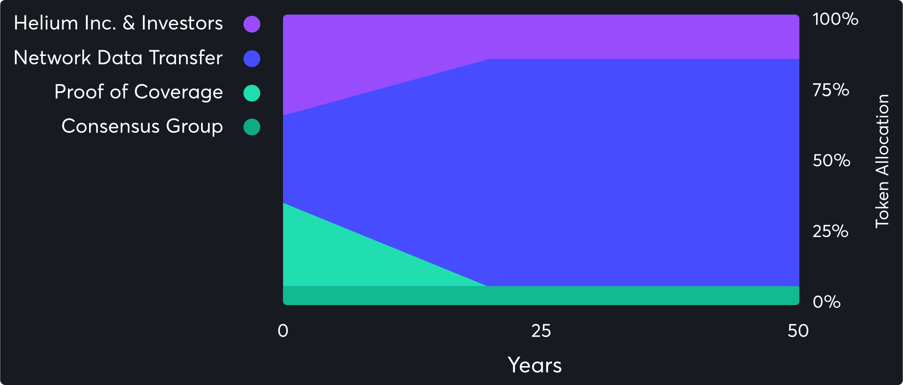

# HIP63: Helium Hub

- Author(s): [@anthonyra](https://github.com/anthonyra)
- Start Date: 2022-05-26
- Category: Economic
- Original HIP PR: <https://github.com/helium/HIP/pull/419>
- Tracking Issue: <https://github.com/helium/HIP/issues/423>

# Summary

This HIP is an alternative to the one being presented as [HIP-51 Helium DAO](0051-helium-dao.md). This HIP will take the goverance proposal with slight modifications from that HIP but drastically changes the economic and technical implementation. As Helium Hub the Helium blockchain will become the center/hub of a web of wireless protocols all of which have the ability to leverage the Helium Ecosystem.

# Motivation

The purpose of this HIP is to simplify the proposal of Helium becoming the center of multiple wireless protocols (omniprotocol access layer).

- Provide the minimum requirements needed for the sub-protocol to earn;
  - data transfer rewards
  - Proof-of-Protocol-Service (PoPS) rewards

- Describe how rewards are distributed to eligible sub-protocols

- Describe how goverance is used within the Helium Hub to include scope

# Stakeholders

- The Helium Community as a whole. This will drastically change the way Helium operates.

# Detailed Explaination

This explaination will describe the following in regards to Helium Hub and sub-protocols.

- Sub-protocols
- Rewards
- Governance

## Helium Hub - Sub-protocols

### Minimum Requirements

For the sub-protocol to be eligible for data transfer rewards it needs to;

1) Have a public immutable ledger for attestation purposes with Helium Hub

2) Have the capability to inform Helium Hub of it's epoch statistics (Oracles/Validators/IBC/etc) as a minimum would be the following;

    - Data Credit (DC) Usage

3) Must operate a bonding pool. This bonding pool is made up of two parts HNT and DC like a "normal" Helium wallet
   - DC is used to fund the DC usage (data transfer) of the sub-DAO
   - HNT is used to back the sub-protocol token via the programmatic treasury

4) Must use DC's for data transfer. DC's can only be minted upon burning HNT. The HNT being burnt is from the sub-protocols bonding pool.

5) All sub-protocol tokens need to be backed by HNT via the bonding pool. The ratio is up to the sub-protocol and set upon creation. For example, 1 HNT can equal 1 sub-protocol token (SPT) or 1 HNT can equal 1000 SPT. This is used for SPT to HNT exchanges via the treasury.

For the sub-protocol to be eligible for Proof-of-Protocol-Service (PoPS) it also needs to;

1) Maintain 21,000,000 USD of DC in its bonding pool. Up to 10% of this amount can be used as a cold start bucket. This bond can be crowdfunded. In the funding phase, HNT accumulates until the 21,000,000 USD valuation is reached. At this point the HNT is burnt to DC and the sub-protocol then becomes eligible for PoPS. If the sub-protocol doesn't reach this valuation within the set timeframe those who bonded HNT to this fund are allowed to redeem their HNT.

## Helium Hub - Rewards

The bonding pool functions both as an eligibility requirement and as the source of the HNT for the programmatic treasury and the DC's used for the sub-protocol. In doing so it's also the location where the Helium Hub will deposit any epoch rewards.

The amount of rewards that a sub-protocol will receive per epoch is based on two factors;

1) The age of the sub-protocol and,

2) The amount of DC being used by the sub-protocol

The current network relies on Proof-of-Coverage and Data Transfers to reward hotspot operators for the service that they provide. This HIP will keep these reward pools and percentages the same but will suggest that Proof-of-Coverage to be renamed to Proof-of-Protocol-Service (for LoRa this is done using PoC but for a future sub-protocol it might not be coverage based).

> **NOTE** DC overage ([HIP-10](0010-usage-based-data-transfer-rewards.md)) and the current schedule for % allocation changes will also remain the same as described in the graphic below.

### Current Reward Models

| Reward Type | Percentage HNT | Earned by Reward Type |
| --- | --- | --- |
| PoC Challenger | 0.90% - 2.11% | 15.6250 - 36.6319 |
| PoC Challengees | 5.02% - 11.78% | 87.1527 - 204.5139 |
| Witnesses | 20.08% - 47.11% | 348.6111 - 817.8819 |
| Consensus Group | 6% | 104.1666 |
| Security Tokens | 33% | 572.9166 |
| Network Data Transfer | Up to 35% | Up to 607.6389 |

### ⬇

### New Reward Models

| Reward Type | Percentage HNT | Earned by Reward Type |
| --- | --- | --- |
| Proof-of-Protocol-Service | 26% - 61% | 451.3887 - 1059.0276 |
| Network Data Transfer | Up to 35% | Up to 607.6389 |
| Consensus Group | 6% | 104.1666 |
| Security Tokens | 33% | 572.9166 |

With the reward pools adequately redefined each sub-protocol will be rewarded per epoch based on it's age and amount of DC it submits (this value can be attested by the Helium Hub at anytime).

The base equation for PoPS is an equal distribution between all eligible sub-protocols. This distribution is affected by the age of the sub-protocol. The reward percentage is reduced upon exceeding the maturity date of the sub-protocol, 3 years after creation. The reduction will be equally redistributed to the remaining sub-protocols that haven't reached their maturity date yet.

3 years after reaching maturity date the sub-protocol will earn 0% of the PoPS reward pool per epoch.

| TODAY | $IOT | $MOBILE |
| --- | --- | --- |
| Date Created | Jul 29th, 2019 | May 25th, 2022 |
| Maturity Date | Jul 29th, 2022 | May 25th, 2025 |
| PoPS % | 50% | 50% |

### ⬇

| Jan 27, 2024 | $IOT | $MOBILE |
| --- | --- | --- |
| Date Created | Jul 29th, 2019 | May 25th, 2022 |
| Maturity Date | Jul 29th, 2022 | May 25th, 2025 |
| PoPS % | 25% | 75% |

### ⬇

| Jul 29, 2025 | $IOT | $MOBILE |
| --- | --- | --- |
| Date Created | Jul 29th, 2019 | May 25th, 2022 |
| Maturity Date | Jul 29th, 2022 | May 25th, 2025 |
| PoPS % | 0% | 94% |

Once the amount of HNT based on PoPS above is calculated the amount of HNT needed to be rewarded for DC usaged is calculated. If the sub-protocol reported DC usage > 1.5x the amount of PoPS that was going to be rewarded for that epoch the amount of PoPS is reduced propotionally from 100% - 0% (1.5x - 3x). The removed/reduced PoPS would be redistributed equally among the remaining eligible sub-protocols.

| Today | $IOT | $MOBILE |
| --- | --- | --- |
| Initial PoPS | 217.88 | 217.88 |
| DC usage | 0.32 | 132.86 |
| DC Overflow | 237.2257128 | 237.2257128 |
| Final PoPS | 217.88 | 217.88 |
| Total | 455.43 | 587.97 |

### ⬇

| Today | $IOT | $MOBILE |
| --- | --- | --- |
| Initial PoPS | 217.88 | 217.88 |
| DC usage | 0.17 | 607.47 |
| DC Overflow | 0 | 0 |
| Final PoPS | 435.76 | 0 |
| Total | 435.93 | 607.47 |

This reward structures sets an age on how long a sub-protocol is rewarded for building it's network. This reward is dependant on the sub-protocols age and amount of data the sub-protocol is moving. Which in turn will ensure no one is incentived to move dummy data to affect rewards thus preventing "Data Races".

To help make sense of how this all works together, I've created a spreadsheet that shows how the network would react if the switch was flipped this second. [spreadsheet](https://docs.google.com/spreadsheets/d/1fRZvUAvp6WfAhHx4TDVpsNDs7vndtAHqfTFiPbqiklM/edit#gid=462165445)

## Helium Hub - Goverance

Vote Escrowed HNT - veHNT are non-fungible tokens that aren't transferable. The only way to get veHNT is to lock up HNT on the recieving account.

Entities that can have custody of veHNT:

- Individual HNT owners

- Sub-protocols and the HNT used for their bond to Helium Hub. The DC amount is converted to HNT via current Oracle Price. The "total" HNT is considered to be equal to a maximum lockup as described below.

### Examples

The amount of veHNT received is determined by:

> 1) the amount of HNT
> 2) how long that HNT is locked up for

A linear multiplier is applied based on the amount of time the HNT is locked up for;

- For the maximum veHNT amount you must lock up your HNT for 2,102,400 blocks ~four years, users receive 100 times the HNT they locked up

- For the minimum veHNT amount you must lock up your HNT for 267,840 blocks ~ six months, users receive 1 times the HNT they locked up

> **NOTE** The above graph shows time in months compared to blocks for scale considerations

For example, suppose A, B, and C all choose to lock up 1000 HNT:

1. A chooses to lock up tokens for the minimum required duration of six months, and thus receives 1000 veHNT
2. B chooses to lock up tokens for twenty-seven months, and thus receives 50 * 1000 = 50,000 veHNT
3. C chooses to lock up tokens for forty-eight months, and thus receives 100 * 1000 = 100,000 veHNT

### Governance Reach

veHNT is used during the goverance of the Helium Hub. The only control the Hub has over the sub-protocols is the requirements that make a sub-protocol eligible for HNT rewards. If these requirements are deemed inadequate the Hub can vote to change them. In this regard sub-protocols are expected to handle all internal workings (ie governance, tokenomics, and technical concerns).

### Sub-protocols

As stated above, one of the requirements for becoming a sub-protocol is to maintain 21,000,000 USD worth of DC in their bonding pool. This is the bare minimum requirement, that being said the sub-protocols "total" HNT is considered to be equivalent to the sub-protocols veHNT in regards to voting power. The individuals making up the sub-protocol will form a yes or no vote based on their own governance. This vote will be backed with the sub-protocols voting power.

Further details on the vote-escrow weighted governance model can be found in [Curve governance documentation](https://resources.curve.fi/governance/understanding-governance) and [https://docs.tribeca.so/electorate/voting-escrow](https://docs.tribeca.so/electorate/voting-escrow).

# Drawbacks

This drastically changes how Helium as a blockchain functions. The amount of development work is far greater then anything proposed to date. If Helium and all sub-protocols decide to use the Cosmos SDK it'd also shift the programming language of Helium to Go and Rust. Making most Erlang work to date obsolete. The migration process that will be proposed later will try to maintain the current chain as the LoRa sub-protocol but that sub-protocol wouldn't be locked into such an agreement. It's just proposed for an easier transition.

# Rationale and Alternatives

This is your chance to discuss your proposal in the context of the whole design
space. This is probably the most important section!

- This proposal is meant to prevent the same issue that lead to [HIP-10](0010-usage-based-data-transfer-rewards.md) by ensuring that data transfer doesn't directly influence rewards aside from the service of providing data. It also redefines the length of which a sub-protocol is eligible to earn from what used to be called Proof-of-Coverage.

- This is a direct alternative to [HIP-51](0051-helium-dao.md)

# Unresolved Questions

- How will the above be implemented techinically speaking.

# Deployment Impact

Describe how this design will be deployed and any potential impact it may have on
current users of this project.

- This HIP will have a follow up HIP that will describe an means of switching to this model with the use of the Cosmos SDK. Since the technical implementation is not important it's not included here.

# Success Metrics

What metrics can be used to measure the success of this design?

- Community vote passes this HIP compared to HIP-51
