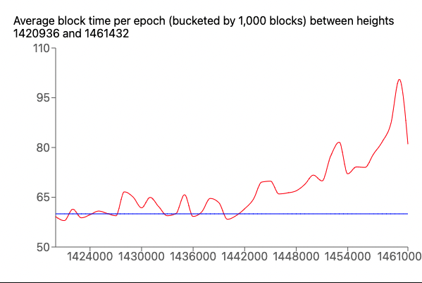

# HIP 70: Improve Validator Incentives

- Author(s): @mbthiery
- Start Date: 2022-08-01
- Category: Validator
- Original HIP PR: <!-- leave this empty; maintainer will fill in ID of this pull request -->
- Tracking Issue: <!-- leave this empty; maintainer will create a discussion issue -->

# Summary

[summary]: #summary

Slow blocks lead to reduced emissions and reduced rewards. Reduced rewards lowers the incentive for network deployments which slows the advance of the Helium Network in its core mission.

We propose to increase non-tenure validator penalties, which will increase the likelihood of low performing validators to be ejected. Furthermore, we propose to increase the penalty decay period, so that highly penalized validators have a harder time getting re-elected. This will improve the odds that a Consensus Group consists of "high performing" validators, aka: validators that have a low ratio of non-tenure penalties vs tenure penalties.

Specifically, we propose:

- BBA penalty be increased from 0.1 to 0.2
- Seen penalty to increase from 0.33 to 0.66
- DKG will be increased from 5 to 10
- Penalty decay period will increase from 20,160 (~2 weeks) to 40,320 (~4 weeks)

# Motivation

[motivation]: #motivation

In recent weeks, block times have significantly strayed from the target average of 60 seconds. We are currently at 81 for the past week and 68 for the past month. Slow blocks lead to slow epochs that leads to low emissions and low rewards.

All epochs are, however, not uniformally long. Namely, when the CG has a large amount of "high performing" validators, block speeds improve.

The changes summarized above will widen the probability gap between "high performing" validators and others. In other words, the likelihood of having a CG with a large number of "high performers" will increase and, therefore, we expect block times to improve and, therefore, emissions and rewards will revert back to their target rates.
While we hope that long-term, there may be software optimizations to address some of these performance issues, we believe increasing penalties will motivate validators to improve their hardware allocations. Even if they don’t, these penalties will allow high performers to participate in more Consensus Groups and, therefore, improve block times.

As software optimizations roll out and/or validators improve their configurations, the effect of these penalties will be softened and the earnings gap between validators should close.

# Stakeholders

[stakeholders]: #stakeholders

While the network as a whole should see the rate of rewards tend towards the targeted rate, the most impacted stakeholder are validators, who will see increased non-tenure penalties. This will lead to higher earnings for “high performing” validators and decreased earnings for others. This should encourage all validators to become “high performing”, thus closing the earnings gap.

# Detailed Explanation

[detailed-explanation]: #detailed-explanation

The values above are all chain variables which control the penalty dynamics of Validators; as such, their deployment requires no engineering effort but simply the issuance of a new chain var.

Validators only earn when they are present in the Consensus Group, so they are motivated to be part of as many Consensus Groups as possible. The main dynamics that these chain variables influence are “the likelihood of election” and the likelihood of ejection”.

To be eligible for consensus, a validator needs to be online and have a score below 10. The lower the score, the higher their odds of election. Every epoch, a quarter of elected validators are ejected based on their score. Similarly, the higher their score, the higher their odds of ejection.

Currently, 93.7% of online validators are eligible while the median score is 3.61. Currently, the penalty filter is only keeping the absolute worst performers out and is still allowing relatively bad performers to be consistently eligible. Due to this large pool of eligible validators, a well performing validator with a score of 0 can wait up to a month to be elected.

Increasing the amount of penalties issued and expanding the penalty history will filter out a higher percentage of badly performing validators from the eligible pool of validators. This should improve block times while also improving rewards for high performing validators.

The current network variables for penalties have been in place since validator launch, with the exception of HIP47 which increased DKG from 1 to 5. Unlike other PoS systems, there is no concept of slashing on the Helium blockchain and increasing these penalties is the only way to reward good performance and penalize low performance.

# Drawbacks

[drawbacks]: #drawbacks

## Block Speed Disagreement

Although penalties are now a year old and many improvements have been made since launch, there is one penalty scenario that is still difficult to control. The issue stems from a disagreement between elected validators in deciding block times. The “appropriate” block time is decided by taking the average block time of the last 50,000 blocks and trying to move that average back to the target of 60 seconds. Validators who have loaded a snapshot will sometimes not have that history and will come up with a different idea of what the block speed should be.

That being said, validators who currently have a long block history will currently all agree to “go fast”. They will never try to make blocks faster than every 50 seconds. In addition, the difficulty in managing these penalties is “equal opportunity”, and all validators will be impacted equally. Finally, there is already an effort to resolve this disagreement with a CG upgrade. Therefore, this drawback seems like a worthwhile trade off in an attempt to get earnings back on track.

## Eligible Validators

Increasing average penalties naturally reduces the amount of electible validators, since only validators with a score under 10 are eligible for election. If penalties get too out of hand, there is a risk that there are no electible validators or that the amount of electible validators is dangerously small and makes too many sequential elections too predictable.

With over 3,600 validators though, the numbers are in our favor and we can monitor the total number of electible validators and make adjustments to the `validator_penalty_filter`as needed. By increasing this chain_var, we can instantly correct course, albeit, we begin mitigating the effects of this HIP.

# Rationale and Alternatives

[alternatives]: #rationale-and-alternatives

There are many possible numbers that could be chosen for these penalties. Changing them precisely is difficult to argue without real world deployment or advanced Monte Carlo simulations.

That being said, slow blocks lead to low emissions and low rewards. Without rewards, network deployments cannot be appropriately rewarded and the Helium Network does not advance in its mission.

While these adjustments are coarse and based on what “feels” right, there is little cost and downside risk to this HIP and the result is without a doubt, a higher likelihood of faster block times.

There are likely other ways to achieve this, but we believe that we need to throw hardware at the problem until other improvements may be made. As other improvements are made, the relevance of this HIP will naturally subside.

# Unresolved Questions

[unresolved]: #unresolved-questions

How quickly will this impact block times? How significant will it be?

# Deployment Impact

[deployment-impact]: #deployment-impact

This will be deployed as a var transaction which requires no code changes or other impacts. All validators and other node types can already accept this value for the dkg_penalty chain var.

Given the amount of validators on the network, if all else is equal with penalties, their expected rate of election to CG is a little under a week. Therefore, we think it will take about one to three weeks for the full impact of these changes to be made.

# Success Metrics

[success-metrics]: #success-metrics

The success of this change will be measured by whether block times decrease in the days and weeks following this change. This success should be related to a greater percentage of well configured validators in CG and a stronger incentive on validator operators to improve their builds.
