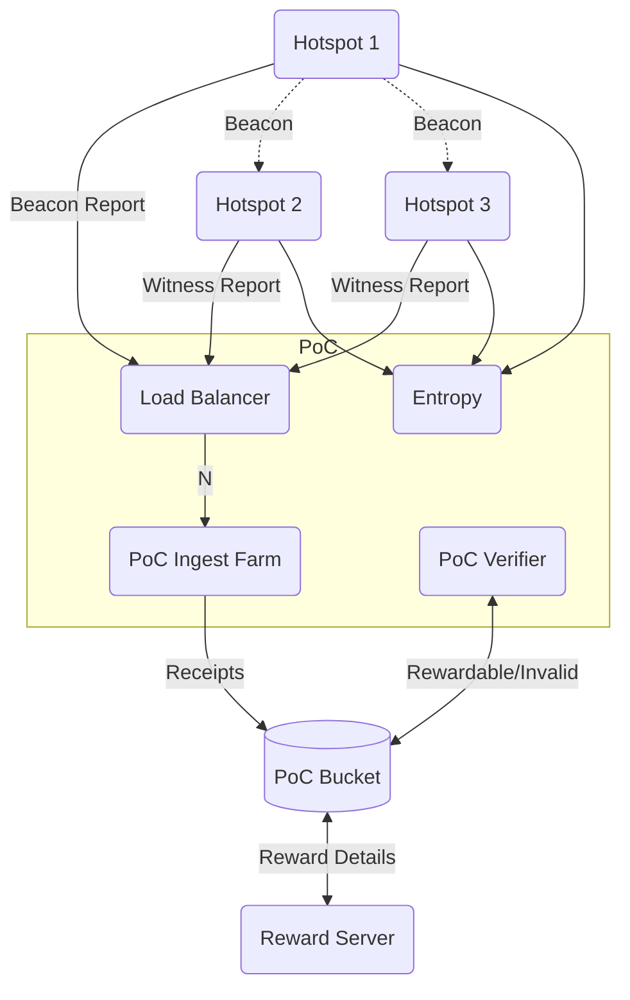
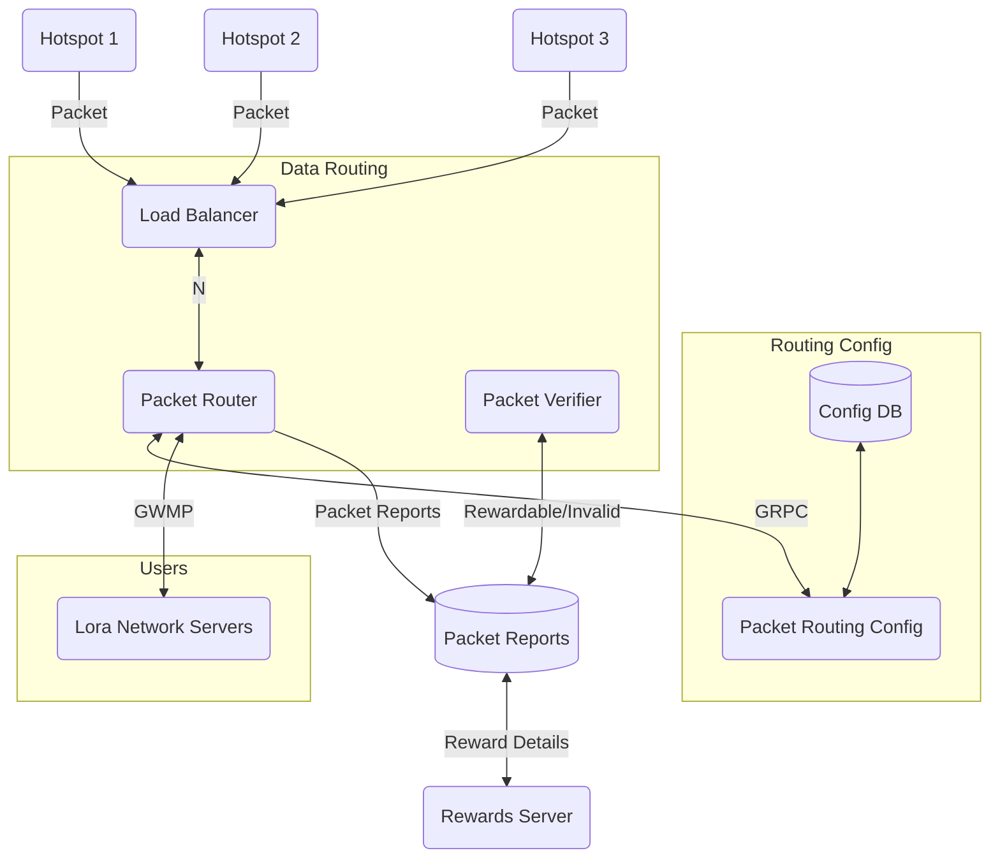

# HIP 70: Scaling the Helium Network

- Author(s): Helium Core Developers
- Start Date: 2022-08-30
- Category: Technical
- Original HIP PR: <https://github.com/helium/HIP/pull/470>
- Tracking Issue: <https://github.com/helium/HIP/issues/471>
- Status: In Discussion

# Summary

In this HIP, we propose a new approach to Proof-of-Coverage and Data Transfer Accounting by moving
this responsibility to oracles and, thereby, reducing the complexity required for operating a
blockchain that supports the Helium Network. Through these actions, we believe we can allow for more
reliable data transfer and more consistent and predictable Proof-of-Coverage activity.

With the move to more “oracled” activity on chain, we believe that the simplification allows us to
select a more scalable Layer 1 for the Helium community, specifically Solana. Integration of the
Helium tokens (HNT, DC, IOT, and MOBILE, initially) into the Solana ecosystem additionally provides
Helium wallet holders access to a variety of applications, governance mechanisms, and other
utilities not available natively on our sovereign L1.

We acknowledge that this change removes the need for staked validators operating block production
and challenge creation as they do today. That said, we expect that HNT stakers will migrate their
positions towards securing current and/or future subDAOs and participating in governance through the
vote-escrow token based system proposed in [HIP 51][hip 51]. Removal of the staked validator reward
also returns the full 6.85% of HNT emissions back to the rewards pool, benefitting Hotspot owners on
all subDAOs. In the first year alone, this is estimated to be over 2 million more HNT rewarded.

We consider these changes as complementary to the changes proposed in [HIP 51][hip 51] and a
necessary set of changes to more easily implement some of the redemption and governance mechanisms
proposed in [HIP 51][hip 51], [HIP 52][hip 52], and [HIP 53][hip 53]. We additionally expect that
more protocols will be attracted to participate in the Helium ecosystem because of the move to a
more widely used Layer 1 blockchain.

# Motivation

The Helium Network has grown incredibly quickly with close to 1 million Hotspots deployed around the
world, with increasing data usage through an ever expanding list of use cases. While scaling up the
network, the core developers and members of the community have spent countless hours supporting this
unprecedented growth. As we look towards the implementation of [HIP 51][hip 51] (and the subsequent
subnetworks with new use cases), the core developers believe it’s important to evolve the design of
the Helium Network to meet the demands of current and future users.

We believe that the two most important goals of the Network should be to ensure the following:

- Reliable Data Transfer activity (and consistent accounting)
- Reliable Proof-of-Coverage activity (and proportional and fair rewards distribution)

In the last several months of the network, both have been challenging for network participants with
much reduced Proof-of-Coverage activity due to network size and blockchain/validator load and packet
delivery issues due to complexities related to managing routing and packet purchasing data on the
Helium blockchain.

# Stakeholders

This HIP has a direct impact on all stakeholders on the network. We believe that overall, Hotspot
owners and Users of the network will see more consistent and reliable data transfer as discussed
above.

One set of stakeholders, namely validator stakers, staking pool operators, and
validator-as-a-service providers, may be negatively impacted by this change but we believe these
parties will continue to be able to participate in network activities. Stakers will be able to more
actively participate in governance by staking their HNT into veHNT as described in [HIP 51][hip 51]
and earn subDAO tokens like IOT or MOBILE by assigning their veHNT to a network they “vote” for.

# Detailed Explanation

## Implementing Proof-of-Coverage Oracles

Re-designing PoC activity to be implemented as Oracles introduces some new services and changes the
way beacons are constructed and reported, as well as how witnessed beacons are detected and
reported. Although a final design of this system is still in development, there are a few key
concepts that are significant changes to the design of Proof-of-Coverage as it exists today.

### Predictable Beaconing

Today, the Proof-of-Coverage system depends on Hotspots to be informed by their connected Validator
that they are being challenged. This system depends on all Validators generating potential challenge
keys, those keys being selected by the Consensus Group, the connected Validator staying in sync and
connected, and the creating Validator being reachable). This complexity was introduced to improve
the on-chain scalability of Proof-of-Coverage and to limit the amount of activity on the Helium
blockchain as the network grows (making it not need to scale as the number of Hotspots increases).
While well-intentioned, the reduction of activity this causes makes it more difficult for individual
Hotspot owners to understand their performance and usefulness to the network and reduces
Proof-of-Coverage activity rates in the network at the scale of many millions of Hotspots.

We propose, instead, that Hotspots themselves are responsible for beaconing regularly; with the
initial proposed beacon rate to be once per hour. With a predictable beacon rate, a Hotspot owner
can be assured that they are “alive” on the network, are eligible for Proof-of-Coverage rewards, and
potentially providing useful coverage for devices on the network.

### Scaling PoC Activity

The beacon itself is simplified to leverage difficult-to-forge entropy data from an oracle. This
entropy can be combined with random data generated by the Hotspot and included in beacon receipts.
The entropy data can be sourced from non-deterministic sources and can be used to limit replay and
premature beaconing. For example, a block hash from another chain can be used as it is hard to
predict and therefore hard to precompute a valid beacon. These Entropy Oracle services can be scaled
independently using traditional methodologies (i.e., CDNs and regional data centers).

The beacon receipt can be reported, once transmitted, directly to the PoC Ingestion Oracle. This
oracle can also receive witnessed beacon receipts from witnessing Hotspots. All these receipts will
be signed by the emitting Hotspot and, instead of immediately processing this data, the Oracle’s job
is to write the data to durable storage after simple validations to prevent structurally invalid
data from being collected. Full validation can be deferred to a later data pipeline. Today, this
function is served by a single Staked Validator that could be offline or unable to process receipts
at scale. With this new model of collecting PoC receipts, the PoC Ingestion Oracle can be scaled
horizontally both to increase reliability and reduce latency of beacon/witness delivery. Storage can
also be scaled independently although this raw dataset need not be stored permanently in high
availability storage as once it is processed, it can be archived.

From here, the PoC Verifier Oracle is introduced to the data pipeline. This oracle is responsible
for analyzing receipt files, correlating beacons with witnesses, and analyzing entire events for
validity. This Oracle can be scaled by sharing time buckets, and this task is extremely
parallelizable.

Using traditional data pipeline techniques, this architectural change to Proof-of-Coverage will help
scale the network to millions of Hotspots across multiple subDAOs. This technique can be adapted for
the IOT and MOBILE network today and could be considered for the WIFI subDAO as well in the future.

### Faster Iteration of Proof-of-Coverage

In addition to improving the scalability of processing data and sustainability as the number of
Hotspots increase in the network, the PoC Verifier Oracle introduces an opportunity to quickly
iterate on new models for Proof-of-Coverage validation. We are no longer limited by the 14 receipts
per beacon as we have today due to limitations of the chain. We can also iterate more quickly on
improvements proposed by the community including introducing oracles of location validation, secure
concentrators and mappers, and using oracles to model the “Graph” of Hotspots.

### Oracling Rewards

By moving to this data pipeline of Proof-of-Coverage, we propose introducing a final Oracle to the
network, the Rewards Oracle. Although the Verifier Oracle can produce rewardable and invalid receipt
reports for analysis, this Oracle will be responsible for combining this data with emissions
requirements for both Proof-of-Coverage and Data Transfer and issue appropriate subnetwork rewards
(for both IOT and MOBILE) for each subDAO.

A diagram of this new set of oracles is below.

## Data Transfer Accounting Oracles

It’s equally important to scale data delivery and the associated rewards as the network grows.
Today, the complexity of scaling Hotspots, Routers, and reimplementing LoRaWAN primitives has made
it difficult to provide a usable network for the scale of activity we expect on the enormous network
built by Hotspot owners.

We introduce a very similar structure as the updates to Proof-of-Coverage with some additional
details around what data needs to be tracked. The fundamental goal is that any existing LoRaWAN
Network Server (an LNS, e.g., Chirpstack), can be brought to the Helium network and, once onboarded,
immediately be able to receive data from Helium Hotspots. Instead of buying OUIs on chain, and
writing transactions to the blockchain to specify routing rules, a coordination layer with
configuration is maintained along with a scalable Load Balancers and Packet Routers that forward
packets from Hotspot to LNSs.

### Scaling Data Delivery

Today, Data Delivery can be dependent on Validators, Routers, and other chain-following entities on
the network. This often causes failures in delivery and affects applications that use the LoRaWAN
network. This is frustrating for device users. Although we have made significant improvements to
stability, there still often are cases where a Router may not be able to scale appropriately, a
Validator may not be ready to serve a Hotspot, etc.

In this proposal, we also introduce a few new pieces of infrastructure and return to using
traditional LoRaWAN network servers with our new architecture. Hotspots will speak directly to Load
Balancers which are traditionally easier to scale horizontally. These Load Balancers are paired with
Packet Routers that have up-to-date information on how to route packets and are able to stream
packet details like hashes, sizes, and originating Hotspots to a scalable storage layer, similar to
the PoC Ingestion Oracle as described above.

These Packet Routers can stream packets directly to LNSs based on routing information stored in a
Config Service and can make decisions on whether or not packets should be routed based on the rules
of the network.

These architectural changes are summarized in the following diagram.

## Moving Chains and Removing Staked Validators

The Helium Network is primarily intended to incentivize and develop the largest community-oriented
wireless and data networks and enable utility in a way that has never been built before. With
Proof-of-Coverage and Data Accounting moved to oracles, the consensus rules become somewhat
commoditized as they are focused simply on payments (p2p and rewards) and identities (Accounts,
Hotspots, Routers, etc.). As such, we believe that it’s in the best interest of the network to move
to a more scalable architecture. We propose that the Helium tokens, governance, and economics around
HNT, IOT, and MOBILE emissions be moved to the Solana blockchain.

There are a variety of advantages of integrating with the Solana ecosystem including fast and cheap
transactions and native governance primitives, but it also brings a whole host of new developers
into our ecosystem. The ecosystem’s development of the new Solana Mobile Stack (and the Solana Saga
phone) brings a closer connection to the Helium ecosystem which can enable connectivity and access
for these devices.

A more thorough analysis of the variety of options considered is forthcoming but to briefly
summarize our reasoning, we evaluated several options. We considered scaling our existing L1 and
bridging to other ecosystems. This would involve continuing to invest in our Erlang-based
architecture that currently doesn’t have support for bridging, smart contracts, and other important
features that we’d need as the network grows to many millions of Hotspots and new cohorts of users.
We also considered running a new app chain on another platform (like Cosmos or an EVM L2 chain) but
this also comes with the burden of maintaining a chain. Ultimately, it’s important for the
developers in this ecosystem to focus on the most important thing: enabling building of data
networks. Specifically, the core innovation of this network is incentivization through
Proof-of-Coverage and enabling data transfer. When we started this journey, there wasn’t a viable
blockchain that would scale in costs and would support the primitives this network needed so we went
down the road of building our own. Over the last few years, this community has managed chain halts,
consensus rule updates, and a tremendous amount of firefighting.

With the move to Solana, we propose that the Consensus and Challenge Construction Reward portions of
HNT emissions (6.85%) are allocated to the subDAOs as proposed in [HIP 51][hip 51], increasing the
allotment of rewards to Hotspot owners. This should continue to incentivize deployment of the IOT
and MOBILE network.

The Helium Validator community is robust. At the time of writing, almost 38% of all HNT is staked in
Validators. And the over 3,700 validator nodes are supported by a deep ecosystem of custodial
(pooled) and non-custodial (dedicated) hosting providers. Though the transition to Solana would
remove the need for staked HNT as we know it today, we believe the proposed subDAO structure allows
for current HNT validators to redeploy their HNT and resources in ways that will earn comparable
yield while playing a similarly important role in the growth of the network, with this role moving
from mining blocks to subDAO governance.

### Reduce the cooldown period of Staked Validators

In order to prepare for this change, we propose, at the time of HIP approval, that the cooldown for
staked HNT in Validators (`stake_withdrawal_cooldown`, as defined by [HIP 25][hip 25]) immediately
be reduced on the Helium blockchain to 125,000 blocks (currently set at 250,000). This would
effectively reduce the cooldown period to less than 3 months. Any existing staked HNT holder or
mining pool operator can release their stake if they choose to do so. Note that this is a one time
adjustment and does not affect the minimum veHNT lockup of 6 months as defined in [HIP 51][hip 51].
Our goal for completing this migration is the end of this year (2022) at the earliest so this should
provide sufficient time for current Validators to unstake before this deadline.

At the time of transition a snapshot will be taken of the Helium blockchain state in order to import
account balances to the new L1. For any stake that has cooled down at least 125,000 blocks (as
adjusted above), the full stake will be released back to the account owner.

Any remaining staked HNT will be immediately converted to veHNT with the minimum lockup period. This
enables all staked HNT holders to continue to participate in the ecosystem by assigning their veHNT
to a subDAO (IOT or MOBILE) in order to influence the DAO’s Utility Score, participate in new
Subnetwork Proposals, or participate in overall governance of the Helium Network.

According to [HIP 52][hip 52] and [HIP 53][hip 53] veHNT stakers will earn both IOT and MOBILE
tokens, respectively, by staking their veHNT in support of these subDAOs and participating in their
governance. The IOT subDAO sets aside 6% of all emissions as does the MOBILE subDAO. A further
elaboration of veHNT is also available in [HIP 51][hip 51]. It's important to note that the current
minimum staking requirements of 10,000 HNT are no longer necessary for veHNT.

### Encourage initial veHNT staking

We believe that there should be an additional incentive for staked HNT holders to become veHNT
holders at the transition. With veHNT staking, any holder of HNT can stake any amount of HNT and are
not restricted to the 10,000 HNT limit imposed by current Validator staking.

We propose that a 3x veHNT bonus is applied to any wallet that stakes HNT in the introductory
period. To be explicit, a minimum lock up of 6 months would give an initial 10 HNT staker a total of
30 veHNT (instead of 10 veHNT). A maximum lockup of 4 years would give the same inital staker a
total of 3000 veHNT (instead of 1000 veHNT). Both of these values still represent the 10 HNT that's
released at the end of the staking period.

This should apply to any wallet that has a staked HNT from a Validator and any new staker in the
first seven days after the account state is transferred to the Solana blockchain. This bonus grants
these "genesis" stakers an increased opportunity to earn subDAO tokens if they stake their veHNT to
the IOT or MOBILE subDAO.

The core developers will work with the community to build an application to help stakers signal
intent to stake their HNT to veHNT. We will also explore ways to allow multiple staking periods as
has been requested by community members.

### Enable Hotspot and Validator Participation in the Solana Ecosystem

The Solana ecosystem enables HNT, MOBILE, and IOT holders to participate in a whole host of
activities outside of staking in veHNT within the Helium ecosystem. We would like to enable all
Hotspot and Validator owners to engage in this wide ecosystem as it continues to develop. We also
recognize that most Helium wallet holders are new to the ecosystem. In order to facilitate wallet
migration and usage, the core developers will work with applications teams to help all wallet owners
to access their assets whether they are on the Helium Wallet (black icon) mobile application, the
Rust-based helium-wallet CLI, or the Ledger application.

In addition, the Helium core developers will "seed" every new address on the Solana ecosystem that
contains a Hotspot or a Validator with at least enough SOL to process about 100 transactions on the
Solana ecosystem. This will be done at the snapshot time when the Helium blockchain state is
imported into Solana Mainnet. This should allow all new Solana wallet holders the ability to
transact immediately and not need to buy SOL.

## Multiple Oracle Operators

Initially, we propose that the aforementioned oracles be built and operated by the Nova Labs team on
behalf of the Helium Foundation. We believe that this will help the Helium network scale in the
short term and immediately address concerns with scaling Proof-of-Coverage and Data Delivery. This
will be revised in the long term to enable multiple Oracle operators to participate in these
activities and ensure decentralization.

We propose that as this infrastructure is deployed, the core developers and community introduce new
HIPs that enable subDAOs to have multiple oracles, the specific coordination rules (consensus, etc),
and discuss the potential of incentivizing these actors. Today, [HIP 52][hip 52] and [HIP
53][hip 53] propose such oracle rewards but do not specify the responsibility of those oracles or
how they come to agreement. We propose that until a time that multiple oracle providers are online,
this reward is not issued to the single oracle, Nova Labs, or the Helium Foundation.

While this process completes, the deployed oracle code and raw event data used by the discussed data
pipeline will be made available for analysis in order to replicate and verify rewardable
Proof-of-Coverage and Data Transfer activity. This dataset and codebase(s), in conjuction with L1
chain data, can be used to construct an ETL framework that provides similar results to that seen in
the Helium network today and is the same dataset used to generate on-chain Oracle output.

# Drawbacks

The primary drawbacks of this proposal are discussed above in the Moving Chains, Removing Staked
Validators, and Multiple Oracle Operators sections. Although there are some concerns, we believe
that this is the best move forward in order to scale the network, align incentives to Hotspot
owners, and enable HNT, IOT, and MOBILE holders more utility in the future.

[hip 25]: https://github.com/helium/HIP/blob/main/0025-validators.md
[hip 51]: https://github.com/helium/HIP/blob/main/0051-helium-dao.md
[hip 52]: https://github.com/helium/HIP/blob/main/0052-iot-dao.md
[hip 53]: https://github.com/helium/HIP/blob/main/0053-mobile-dao.md
