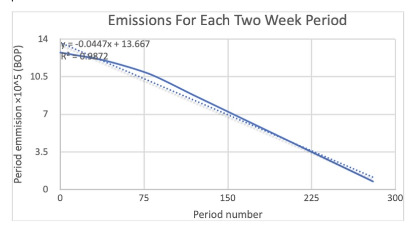

<h1> # HIP 71: dVPN subDAO: Boring Protocol </h1>

- Author(s): [@vers_laLune](https://github.com/vers-laLune?tab=overview&from=2022-09-01&to=2022-09-22) [@tanny](https://github.com/ilovespectra) [@FOMOBY](https://github.com/FOMOBY) [@franswan](https://github.com/franswan) 
- Start Date: 2022-07-31
- Category: Economic, Technical 
- Original HIP PR: 
- Tracking Issue: TO DO 
- Status: In Discussion 

<h2> Summary </h2>

[HIP 51: Helium DAOs](https://github.com/helium/HIP/blob/main/0051-helium-dao.md) provides a general structure for onboarding new Decentralized Network Protocols (DNPs) to the broader Helium Network, with mechanisms in place to ensure that protocol-specific attributes such as Proof-of-Coverage rules, Data Credit pricing, and consensus-driven rules are within control of the emergent DNP DAO.

In this proposal, we specify the implementation of the structure proposed through a detailed onboarding proposal for the Boring DVPN Network. We propose initial configurations of the Boring Protocol economics layer as well as governance mechanisms within the DAO through Boring Protocol (BOP) token voting. The objective of this proposal is to outline a SubDAO dVPN facilitated by Boring Protocol and the Helium network as it pertains to privacy access for the broadcast layer, both entities' economic model and the ecosystem as a whole.

In response to HIP-51, this proposal outlines construction for the integration of Boring Protocol dVPN into Helium network as a subDAO with its own DNT (decentralized network token) known as BOP.

<h2> Stakeholders </h2>
                                                                                                           
This proposal impacts all current and future participants in the Helium Ecosystem as well as all current BOP holders.

The objective is to provide greater growth to both networks while equally providing opportunity to the economics of Helium hardware operators, simultaneously creating privacy access to Helium network infrastructure. The Helium token model is described in the HIP’s presented previous to this proposal. 

The BOP token utility is mainly a settlement between “clients” of the dVPN and “operators” of nodes which are used to privately access the internet. Apart from this primary function the token is staked by node operators to present loyalty to the network and financial incentive to act in “good faith” as they operate exit nodes. As nodes remain connected they increase their opportunity for traffic/data to be directed through their node and increase their profitability as the token is settled on a data consumption rate.

Continued participation and discussion is greatly encouraged to ensure the proposal is in line with the needs of both communities.
                                                                                                           
## Motivation

The drivers for this proposal are as follows:

-   Privacy and Security for Helium “subscribers” and internet users as a whole
-   Security and Scalability of the L1 as proposed in HIP-51
-   Additional mechanisms for profitability to Helium Network infrastructure operators
-   Proving a model of multi chain redundancy to further secure network economics and participant profitability
-   Sustainability in manufacturing and distribution of hardware
-   Increased Utility and Security for EVM mechanisms like wHNT

A dVPN implementation would be an immediate and relevant re-purpose,  of the no longer needed processing power of ~1 million LoRa Hotspots sitting online, into the largest dVPN network right out of the box. Which provides the customer ability to switch client/ server modes in-app and add the dVPN service and BOP/dVPN token as another subDAO along with IoT and MOBILE. 

The Boring Protocol code should be able to be added as a firmware update to run along the kernel in a container similar to the LoRa packet processing and forwarder. The existing hotspot network is ideal for supporting this type of tunneling traffic—as most hotspots have gigabit ethernet connections with private IPs and have adequate bandwidth, processing power and storage already. The RAK and MNTD are based on PI4s and should make a perfect mirror to test run in our distributed environment.
                                                                                                           

## Background

For the Helium Network to grow globally in number of active devices and users it is necessary to develop economic incentives and opportunities for the infrastructure operators participating in supporting the network. Adding utility and profitability to the hardware involved now and in the future will solidify the Helium network as a major player across many types of networks. 

HIP 51 outlines basic requirements for existing models of the SubDAOs within the Helium Network.                                                                                           

## Detailed Description

Boring Protocol is privacy and security at its foundation but can be grown to generate subDAOs of its own network models ie. Proxy networks, distributed storage etc.

Boring Protocol will add utility and value to the Helium token ecosystem by allowing customers to pay using SPL wrapped HNT and eventually HNT via cross chain bridges to fund their usage of the dVPN. This provides two distinct advantages to the Helium community: 
- Potential further dispersal of HNT to the SPL wrapped HNT Liquidity pool and utility beyond market trading for the token itself. 
- The ability for certain Helium infrastructure operators to continue profiting from their equipment in the event of a Helium network outage.
                                                                                                           
<h2> DVPN subDAO core jobs-to-be-done </h2>

As proposed in HIP 51, each DNP subDAO should operate as a sovereign economics and governance layer. The Boring Protocol DVPN subDAO has six core functions

1. **Emissions Curve** The DVPN subDAO handles all BOP mining rewards and programmatic treasury operations. The economic responsibilities around this involve managing the token issuance and distribution. BOP is not currently being minted, and a schedule is being developed for if/when users begin to burn it in exchange for HNT to use DC.
2. **Treasury Reserve DNT Market Making Curve** subDAOs have full control over the prices at which the subDAO treasury provides quotes to holders of DNT who wish to redeem their holdings for underlying HNT. This can be a flat bid or a more complex curve.**
3. **Oracle Specification** perform work including providing a virtual private network and data transfer. The oracles are also responsible for distributing DNT mining rewards to the appropriate parties. Responsibilities here include definition of oracle software, minimum stake amounts, and rewards for participation.
4. **Data Transfer Mechanism and Pricing** Data transfer within subnetworks occurs via the process of procuring and burning data credits in the name of the hotspot or set of hotspots that provide DVPN. Responsibilities here include Organizationally Unique Identifier (OUI) registration, state channel creation, and bandwidth capacity per data credit definition.
5. **Boring Protocol Mechanism** Most other subnetworks will utilize a Proof of Coverage algorithm, however the DVPN subDAO will rely on the accuracy of PoC performed by IoT Oracles and instead provide a virtual private network available to web and mobile users.
6. **Governance Structure** subDAOs retain control over critical components of the network, and subDAO members can propose and vote for changes to core parameters and mechanisms. Responsibilities here include specification of a formal on-chain voting process that is resistant to attacks.

The remainder of this proposal defines initial values for the subDAO given the aforementioned set of responsibilities.
                                                                                                           
                                                                                                           
<h2> Emissions Curve </h2>

There will be a max supply of 250,000,000 BOP.

The proposal is to have halvenings of BOP issuance every 2 years aligned with the HNT issuance halvenings. This requires a 1 year “stub” period from August 1, 2022 to August 1, 2023. We also propose a veBOP airdrop to DVPN subDAO Oracles.

At launch of the DVPN subnetwork, 2.5% of the total supply of BOP tokens (6.2M tokens) are issued and airdropped to oracles and hotspots on the existing BOP network. This airdrop is intended to bootstrap the network, and is distributed to oracles and validators in the following proportion:

Oracles: 50% of 6.2M tokens, distributed in proportion to HNT staked at the snapshot

Hotspots: 50% of 6.2M tokens, distributed to all active hotspots (rewarded in the past 30 days) and not on the denylist at the time of snapshot

At the end of a given epoch, the DVPN subnetwork oracles relay start balance, current balance, and total amount of DVPN Data Credits created and relay to the L1 HNT emissions contract. The emissions contract subsequently distributes the determined amount of HNT as per the Protocol Score to the BOP subDAO multi-signature wallet, the addresses of which comprise the set of oracles of the DVPN Network.

The subDAO operations fund is intended to allow the DNP to perform bespoke operations to create and sustain network growth. The primary use case of the operations fund is to fund all state transition transaction fees to the L1, but can be deployed in any manner of ways as per subDAO governance. Such incentives could include

1. One-time DNT bonuses for hotspots providing continuous coverage in new regions deemed to be economically valuable by governance
2. Bonus rewards for hotspots and OUIs that are consistent in network activity and meet certain good actor conditions such as surge-pricing style dynamic multipliers based on data transfer activity for individual regions or bespoke incentives for oracles and manufacturers on the basis of changing network demands.

Once emissions are distributed to hotspots and oracles, BOP owners can either redeem their holdings for underlying HNT against the treasury reserve automatically, hold for redemptions at a later time, or lock up their BOP for veBOP in a process similar to the veHNT mechanism described in HIP 51.

A user’s veBOP lockup power is determined by 1) the amount of BOP they lock up with, and 2) the amount of time they commit to locking up their BOP. The structure applies a linear multiplier of time to the amount of BOP locked up in the voting contract. For the maximum period of four years, users receive 100x the veBOP. For the minimum period of six months, users receive 1x the veBOP. Note that veBOP is **non-transferable**, and represented as a non-fungible coupon in the user’s BOP address.

Users can choose to delegate their veBOP for three core purposes:

1. *Oracle Delegation*: veBOP holders can delegate their holdings to oracles as per the reward agreements set in order to earn future emissions.
2. *Governance*: veBOP can be used to participate in subDAO proposals that impact core protocol parameters, mechanisms, and operating procedures.

<h2> Treasury Reserve DNT Market Making Curve </h2>

The DVPN subDAO sets the programmatic treasury formula in order to provide quotes to holders of DNT who wish to redeem their holdings for underlying HNT. The programmatic treasury defines the floor price for BOP, but holders always retain the ability to exchange at the prevailing rate on open markets.

We propose a constant function market making formula for the DVPN subDAO programmatic treasury defined as per the following specification.

$H: \text{BOP in Reserve}$

$S: \text{Outstanding Supply of BOP}$

$P: \text{Price of BOP}$

At epoch T, we denote the value of H, S, and P as $H_T$, $S_T$, and $P_T$. The programmatic treasury formula at epoch T is a function in two variables, HT, ST defined as follows:

$P_T = \frac{H_T}{S_T}$

For example, consider at epoch #125, the total outstanding supply of tokens for the dVPN subDAO is 225M BOP and the total amount in the treasury reserve is 152,671.75 HNT. The programmatic treasury formula is given as follows

$$P_{125} = \frac{H_{125}}{S_{125}} = \frac{152,671}{225,000,000} = 0.00067854$$

This implies that at epoch #125, any number of BOP can be redeemed at a unit price of 0.000067854 HNT.

Now consider at epoch #225, the total outstanding supply of tokens for the dVPN subDAO is 200,025,000 and the total amount in the treasury reserve is 164,885 HNT. The programmatic treasury formula is given as follows

$$P_{225} = \frac{H_{225}}{S_{225}} = \frac{154,579}{240,458,015} = 0.00064285$$

This implies that at 100 epochs after #125 at #225, any number of BOP can be redeemed at a unit price of 0.00064285$$ HNT.

In epoch #225, the total outstanding supply of BOP has increased, and given inflows to the treasury reserve in HNT the resulting unit price has decreased. If the rate at which HNT flows into the treasury reserve outpaces the emission of BOP tokens, the unit price of BOP increases.

Between epoch #125 and #225, a similar repricing takes place in each individual epoch given the amount of HNT in the treasury reserve and the outstanding supply of BOP tokens.

Clarifications:

- The supply of BOP tokens for the purposes of calculating the BOP/HNT price includes all locked veBOP tokens.
- The subDAO updates the limit order price every epoch **before** any new BOP are distributed out to stakeholders for their activity during that epoch.

<h2> Oracle Operations </h2>

BOP oracles confirm proof of coverage, data transfer, and add blocks to the DVPN subnetwork. They serve state data around Proof-of-Coverage challenges and data transfer events between DVPN node providers and users.

## Platform Incentives

45% of the total supply of Bop has been set aside for a 10 year distribution to node operators based on key factors that will reward uptime, specific region and bandwidth availability for node operators. This will subsidize growth of the network in key regions that have been identified as desirable to VPN users. This distribution is outlined in the [platform incentives documentation](#link) 

Early supporters operating V1 nodes are rewarded at 1.5X rates.

V2 operators are rewarded at 1.25x standard rates.

These nodes are identified for their rewards through a given transferable NFT they stake to their node. 

### Bandwidth Exchange

All node operators who incur dvpn customer traffic are rewarded 95% of the proceeds from consumed data measured in KB as data is consumed on the network, and 5% is delegated the Boring treasury.

We have projected a single node with a standard internet connection of X can earn as much as $24-240 per month from this one earning method given consistent traffic and data consumption across their node. This projection is further detailed here: Basis & Core

veBOP holders can choose to delegate their holdings to oracles of their choice or run their own oracles.

<h2> Boring Virtual Private Network Specification </h2>

BOP Transactions involve two distinct roles:

1. Boperators (Providers) - The node that provides dVPN service to Users.
2. Users - The individual or entity utilizing the anonymity provided by the decentralized virtual private network.

<h2> Data Usage and Pricing Specification </h2>

Abstract: To create a decentralized and high performance virtual private network, node operators must be rewarded. There are three main components which dictate the value that a node operator provides to the network. These are uptime percentage, bandwidth, and location. Additionally, to avoid overestimation of node rewards, we can allocate a maximum number of tokens a node can receive per time period, then multiply by a value between zero and one to determine their reward.

Reward Emissions: 122,500,000 BOP tokens are allocated to reward nodes over 10 years. Part of this total will be emitted every 14 days, so nodes will receive a biweekly payout. Each period’s emissions decay exponentially. The function is as follows:

𝑦 = −68.1282 ∗ 𝑥𝑥 + 1250000

Where y is the total emission per period, and x is the period number from 0 to 129. This is 130 two-week periods, for a total of five years.

Each node is then allocated a maximum portion of these emissions. If n is the number of nodes, and e is the number of BOP tokens emitted for a period, then each node has a maximum allocation of . This is the maximum number of tokens that a node can receive for that period.

Reward Multipliers: Not all nodes are created equal. Nodes that provide higher amounts of bandwidth and uptime should be rewarded accordingly. Additionally, to avoid centralization of the network, an additional bonus is given to nodes operating in countries with an average bandwidth below the worldwide average. There are three functions which calculate the respective multipliers for uptime, bandwidth, and country. These three multipliers will be multiplied together, then multiplied by the node’s maximum token allocation to determine their rewards for that period. Unclaimed rewards will be used for the referral system.

Time Multiplier: A node that provides the highest percentage of uptime is desirable. Therefore, the time multiplier is an exponential function. The function is as follows, where t is the time multiplier, and x is the percent uptime for the period.

𝑡𝑡= 𝑥𝑥2 10000

Bandwidth Rewards: The difference between 1 and 2 megabits per second is much greater in application, than the difference between 100 and 101 megabits per second. Therefore, the bandwidth rewards multiplier increases logarithmically. At 1096 Mbps, this multiplier caps out at 1. The function is as follows, defined a domain from 0 to 1096, where b is the bandwidth multiplier and x is the download bandwidth in Mbps.

𝑏𝑏 = log (𝑥𝑥 + 1) 7

Country Rewards: It is not ideal to have all the nodes running in first world countries. To achieve a healthy level of decentralization, a bonus is provided to countries that have an average bandwidth that is at or below the worldwide average bandwidth. This bonus ranges from 0 to around 23%. For countries which are above the average worldwide bandwidth, their multiplier is a flat 0.8, or 80%. Average bandwidth data was obtained from speedtest.net. The equation is as follows, defined on a domain from 61 to 180, where c is the country multiplier, x is the country number according to the data set.

𝑐𝑐 = (𝑥𝑥 − 61)2 + 0.8 80000

Referral System: Node operator A can refer another person B to become a node operator. Operator A will receive 5% of the reward that operator B receives each period. The referral system starts on period number two, or two weeks after launch. It is funded from the unused emissions from the previous period. Any tokens leftover after referral rewards are distributed, are added to the emission of the next period.

Node Operators can refer Consumers and receive 2% of consumer revenue.

Note that it is possible to support both metered and unmetered networks. For an unmetered network, an OUI can choose to pay a fixed rate for an indefinite period of time which involves the purchase and burn of some number of data credits per minute, and attribution to hotspots after consumption occurs pro rata network traffic under the unmetered plan.

<h2> Governance Specification </h2>

The BOP Network is under the control of the subDAO. All subDAO proposals must come attached with code to be approved.

We propose that veBOP governance is constructed in a manner identical to veHNT governance as specified in HIP51.

Users can choose to delegate their lockup power in veBOP to all dVPN DAO governance proposals. Proposals are assessed using majority and quorum thresholds defined in veBOP terms, initially proposed to be 67% and 100K BOP respectively.

## Rationale and Alternatives

As it stands, the dVPN space has a very limited alternative models and none of which run on Solana (as is the case with [HIP 70](https://github.com/helium/HIP/blob/main/0070-scaling-helium.md)). The closest competitor [Orchid Protocol](https://www.orchid.com/), built on the Ethereum blockchain, is plagued by the network issues it inherits from its L1. 

## Unresolved Questions

Prior to the merge of this HIP, we expect to have completely resolved economic questions regarding the best method for settlement. Currently, the alternatives are a DEX, CEX or a smart contract for easy HNT/USDC swaps. We also intend to make sure the economics of Boring are in-line with the values and goals of the Helium community. The economic incentives of Boring should benefit the community as well as reward early adopters.

Beyond the economic questions, we need to resolve strategic deployment of the network. We hope to determine who from the Helium team will work alongside us in order to properly incorporate Boring as a Helium subDAO. The current centralized model for dVPNs is quickly failing as the services exchange information on user traffic, fail to meet security standards (e.g. keeping users passwords in text files) and increasingly the cVPN IP addresses are being blacklisted. A functional dVPN in the marketplace would extend beyond the scope of the Helium Network and have far reaching positive consequences for privacy and security. 

## Deployment Impact

Boring Protocol acts as an obfuscation layer for the main Helium Network. Our current objective is to work side-by-side with the Helium foundation in order to implement Boring Protocol in a manner that is aligned with the goals of L1 Security and Scalability as proposed in HIP-51. The goal of this would be to properly build layers alongside Helium to ensure the compatibility of our networks across 3G, 5G and LoRaWAN. 

This proposal would primarily impact HIP-51 as we are altering the implementation of the subDAO. We are proposing a multi-chain interoperable solution with settlements in HNT as opposed to using the current Data Credit system. Since we will not be broadcasting to the Helium Network, there is no need for a Data Credit. Additionally, BOP already acts with the same functionality as a Data Credit eliminating the need. This change will simplify the process for the end-user as there will immediate settlement.  As previously stated we can either implement a DEX or CEX or run a smart contract with HNT/USDC settlement. This will also serve as on on-ramp for users to the Helium Network as there is a growing public need for a functional dVPN beyond the needs outlined in the scope of this proposal. 

This proposal would affect HIP-51 as it explicitly references the Data Credit system for subDAOs and we are proposing alterations to the subDAO implementation. Should HIP-70 pass there should be few continuity issues as Boring Protocol is currently on the Solana Network. However, should the proposal be rejected, a migration of Boring Protocol would be necessary. 

Our proposal is largely backwards compatible outside of the incongruity with HIP-51.

## Success Metrics

The success of the design can be determined simply by the number of active nodes within the Boring Protocol as well as the amount of bandwidth being traded for HNT. 

As stated earlier, our initial tests have generated a balance of 10 simultaneous clients per node operated. The number of nodes operated works as a good indication of total clients and the amount of bandwidth being trafficked on the subDAO serves to further solidify these estimates. The number of nodes operated additionally acts as a measure of network stability. More nodes provides more effective obfuscation. 

For the sake of simplicity, we can discuss complexity as a measure of user friction and as a measure of technological misallocation of resources. The addition of nodes to the network while adding more complexity in a strict sense, allows for network redundancy and increased security. Additionally, the operation of Boring as a multinetwork interoperable subDAO allows for failsafe in the case of network outage(s). The increased network complexity in this case allows for decreased end-user complexity. Additionally, off-chain metrics such as customer service tickets and sales metrics for our simpler improved hardware serves as a proxy for end-user complexity being appropriately managed. These off-chain metrics as well as active holders of BOP, smart contract interactions and increases in number of operational nodes will serve as a metric of user acceptance of this HIP. 

To prove performance increase, you would measure the bandwidth being utilized on Boring Protocol as well as the amount of nodes currently implemented. Each additional node $n$ in the graph adds ${(n-1)}$ options for a user's traffic to be redirected through. For bandwidth usage $B$, the increase in performance would be:

$B_{n}$ ${n}\choose{2}$ / $B_{(n-1)}$ ${(n-1)}\choose{2}$ 

This is the quotient of the bandwidth $B_{n}$ and  ${n}\choose{2}$ other nodes for traffic to be redirected to and the previous bandwidth $B_{(n-1)}$ and ${(n-1)}\choose{2}$  previous amount of nodes for traffic to be redirected to. Which simplifies to: 

${.5B_{n}}n{(n-1)} /{.5B_{n-1}}{(n-1)}{(n-2)}$  

=> $B_{n}n/B_{(n-1)}(n-2)$ 

This formula would represent the incremental improvement of an additional node added to the network and the additional bandwidth increase relative to the former node and bandwidth. 

### Subscriber Model

To further reach VPN users outside of the crypto economy Boring will allow fiat payment from subscriber model users. A fixed monthly and discounted yearly rate will be applied to these types of users and 95% of the income from this earning method will be equally distributed to all node operators according to uptime and connection bandwidth during the given period. It is proposed that these earnings be distributed monthly or quarterly. 

The remaining 5% of revenue from this model will be directed into the Boring Protocol treasury for future development and operational costs.

By limiting the total number of nodes allowed on the network Boring can ensure the existing operators remain profitable and servicing clients with quality connections. As the consumer demand grows the ability to add nodes to the network will be both desirable to new participants and be able to be completed quickly as this balance is maintained.

## Future Integration

Other possible integrations we envision for 5G and WIFI clients on the Helium network is to have Boring dVPN as an optional product for their users to select and these nodes could offer this at a higher access cost than typical. We propose this be included in a future proposal to reduce the complexity of the current proposal and allow time to research and explore this topic. Boring Protocol can later provide proxy network and data storage infrastructure within the Helium ecosystem and is currently exploring potential proposals for such.

With the potential for a Helium 5G network to service the Solana Mobile phone or SAGA platform we also wish to explore Helium SubDAO migration to Solana as a whole with this proposal providing some “first steps” in bringing Helium liquidity to the Solana chain.

## Drawbacks/Challenges

The primary directive of the development team is currently to provide a secure and decentralized virtual private network. The current architecture does not account for absorption by the larger Helium ecosystem, and the team at Boring understands there may need to be a dVPN treasury established, and redenominate HNT emissions based on each network's relative DAO Utility Score. We do not intend to propose this HIP without the code required to implement it, and are working together with core developers within both ecosystems to build a bridge to onboard existing tokens into the flywheel proposed in HIP51.

The implementation of this HIP would come with the changing of the subDAO structure and subsequently create precedent for other subDAOs to stray away from the initial model within HIP-51. Removing the Data Credits system from our implementation of Boring as a subDAO streamlines the user experience but also hinders the incentive structure the Data Credit system was designed to implement across multiple subDAOs. We believe that given BOP is already an SPL token, the Data Credit system is redundant in our implementation. 
