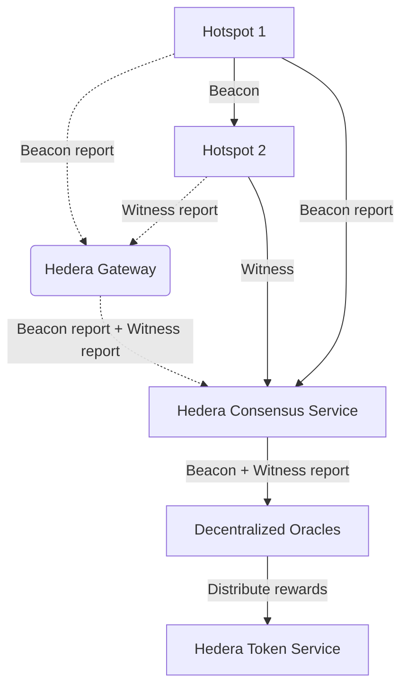
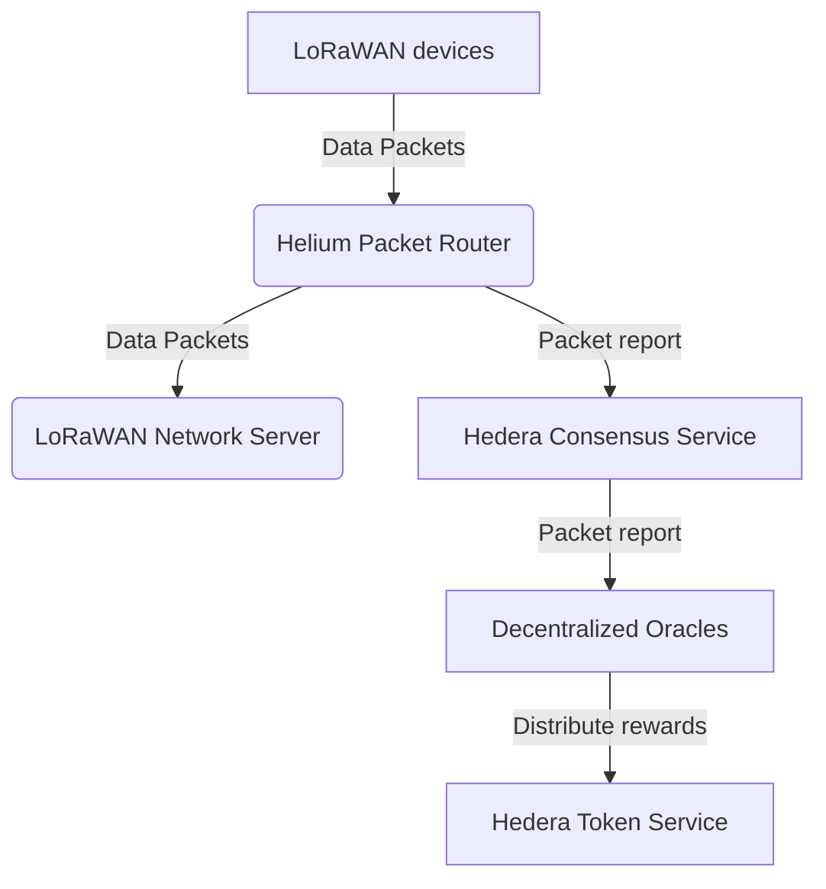

# HIP 71: Scaling the Network with Governance & Hedera

- Author(s): [@leogaggl](https://github.com/leogaggl),
  [@gregscullard](https://github.com/gregscullard), [@pathornteng](https://github.com/pathornteng),
  [@jamesmeikle](https://github.com/jamesmeikle), [@tonysmith55](https://github.com/tonysmith55)
- Start Date: 2022-09-12
- Category: Technical
- Original HIP PR:
  [#480](https://github.com/helium/HIP/blob/main/0071-scaling-with-governance-hedera.md)
- Tracking Issue: [#486](https://github.com/helium/HIP/issues/486)
- Status: In Discussion

# Summary

This HIP which builds on the excellent work done by the creators of [HIP-70][hip-70] is focussed on
delivering important structual changes to the Helium network as proposed in HIP-70. However it aims
to improve on some of the shortcomings such as further centralisation (rather than decentralisation)
of network activities. It also aims to introduce more formal governance structures which have been
absent from prior proposals and will allow more predictable operation which is critical for
enterprise adoption of the utility scale network we are all aiming to build.

Another difference to the original Helium Scaling Proposal is the use of an enterprise distributed
ledger technology (DLT) as an alternative example. **It is important to note that unlike the
original HIP-70 this is more as an example how this technology can be used. This HIP proposes a
formal evaluation and comparison phase (and some evaluation criteria) to ensure the best tool is
eventually chosen** (see Governance section).

This focus on governance has to be more than just superficial. By including representatives of all
stakeholder groups - most importantly Hotspot owners and operators that have put up their time and
money to build this network - it will ensure a stable and sustainable network for all.

In this HIP, we propose an alternative architecture for the Helium network to use the Hedera network
as a layer 1. The new architecture is built to meet the number of requirements that we believe are
critical to the network’s success. Our new design goals include network scalability, strong network
governance, transparency in data reporting and rewards distribution, and decentralization.

As per [HIP-70][hip-70] we also acknowledge that this change removes the need for staked validators
operating block production and challenge creation as they do today. However, we would expect (some)
validators to be ideal candidates for operators of decentralised oracles.

That said, we expect that HNT stakers will migrate their positions towards securing current and/or
future subDAOs and participating in governance through the vote-escrow token based system proposed
in [HIP-51][hip-51]. Removal of the staked validator reward also returns the full 6.85% of HNT
emissions back to the rewards pool, benefitting Hotspot owners on all subDAOs. In the first year
alone, this is estimated to be over 2 million more HNT rewarded.

Similar to the [HIP-70][hip-70] proposal these changes are complementary to the changes proposed in
[HIP-51][hip-51] and a necessary set of changes to more easily implement some of the redemption and
governance mechanisms proposed in [HIP-51][hip-51], [HIP-52][hip-52], and [HIP-53][hip-53]. We also
expect that more protocols will be attracted to participate in the Helium ecosystem because of the
move to a more widely used Layer 1 blockchain.

# Motivation

The Helium Network has grown incredibly quickly with close to 1 million Hotspots deployed around the
world, with increasing data usage through an ever expanding list of use cases.

During this expansion governance structures of the network have not kept pace with the technical
developments. [HIP-70][hip-70] introduces several structural changes that are necessary and not
contested at all.

It fails however to improve on the governance side of the equation and in fact increases
centralisation and reduces transparency (due to moving the most critical network functions
off-chain).

We believe that the most important goals of the Network should be to ensure the following:

- Open, predictable and consistent governance of "the people's network" to ensure long-term
  enterprise adoption
- Reliable and Transparent Data Transfer activity (and consistent accounting)
- Reliable and Transparent Proof-of-Coverage activity (and proportional and fair rewards
  distribution)
- Scalability - ensure the chosen architecture as well as the chosen L1 DLT can scale with the
  network

In the last several months of the network, both have been challenging for network participants with
much reduced Proof-of-Coverage activity due to network size and blockchain/validator load and packet
delivery issues due to complexities related to managing routing and packet purchasing data on the
Helium blockchain.

In these last months it has become apparent that seperation of resposibilities and transparency on
all fronts is a critical factor. Currently the separation between the Helium Foundation is at best a
grey area with lots of vague statements over time in Discord or blog entries. But very little has
actually documented, formally agreed upon and published. Let alone has progress on some of these
things been tracked and reported.

# Stakeholders

This HIP has a direct impact on all stakeholders on the network. We believe that overall, Hotspot
owners and Users of the network will see more consistent and reliable data transfer as discussed
above.

One set of stakeholders, namely validator stakers, staking pool operators, and
validator-as-a-service providers, may be negatively impacted by this change but we believe these
parties will continue to be able to participate in network activities. Stakers will be able to more
actively participate in governance by staking their HNT into veHNT as described in [HIP-51][hip-51]
and earn subDAO tokens like IOT or MOBILE by assigning their veHNT to a network they “vote” for. As
mentioned above and covered below we do believe there is a need for those skills to operate
decentralised oracles.

# Detailed Explanation

## Design Goals

### Scalability

As the number of IoT devices has grown significantly in the past few years, the new proposed
architecture must be scalable and able to support millions of IoT devices. The underlying layer-1
network must be able to support thousands of TPS in the real production environment.

### Network Governance

The new architecture must be built on a layer-1 network that has good governance. Good governance
means no one in the network should be able to significantly influence the direction of the network
by acquiring a large number of tokens. The governance body of the network should be periodically
rotated to prevent the usurpation of power by a group of members.

### Transparency

The rewards calculation and distribution must be done in a transparent way in which anyone should be
able to verify the rewards calculation and distribution algorithm and able to detect and/or prevent
any mistake or malicious attempt to distribute rewards unfairly.

### Decentralization

The new architecture must be decentralized to ensure that no single entity is responsible for the
network's availability, integrity, and performance.

## Formalising Governance Structures and Transparency

Currently the network is supposedly governed by the Helium Foundation (after renaming from DEWI in
March 2022). However the lines between the Helium Foundation and Nova Labs as the company behind the
core development of the network are at best blurred as it stands. The Helium Foundation (unlike
similar bodies) still has not published any bylaws and/or terms of reference. There does not seem to
be any transparency on who current office holders are and/or if any (perceived or real) conflict of
interests are disclosed.

## Governance

This HIP proposes the creation of an oversight body under the auspices of the Helium Foundation that
has proper representation of all stakeholers in the Helium ecosystem as well as regional
representation recognising that Helium now is a world-wide network.

The suggested model is a 'Governing Council' which operates in a transparent manner under agreed
terms of reference and proper recording and governance procedures. This oversight body should have
the capacity to independently steer and oversee the direction and governance of the Helium Network.
Independent oversight of the selection process of the new L1 would be one of the first tasks for
such a body. Major decisions will remain subject to HIP proposals.

An [early example of such terms of reference](https://github.com/helium/HIP/pull/378) has already
been presented at the April 2022 Helium Foundation Community Call (it currently references the
Helium LoRaWAN committee - but can be adapted and extended for this purpose). It was agreed by the
foundation that this was going to be implemented in work undertaken by the Foundation.

As far as it is possible to determine (requests in the foundation channel in the official Helium
Discord) there has been nothing published or shared to date.

# Proposed Architecture

The above architecture shows the high-level overview of components of a new Helium ecosystem built
on the Hedera network.

Re-designing PoC activity to be implemented as Oracles introduces some new services and changes the
way beacons are constructed and report activity, as well as how witnessed beacons are detected and
reported. Although the final design of this system is still in development, there are a few key
concepts that are significant changes to the design of Proof-of-Coverage as it exists today.

### Goodbye Validators - Hello (descentralised) Oracles

Today, the Proof-of-Coverage system depends on Hotspots to be informed by their connected Validator
that they are being challenged. This system depends on all Validators generating challenge keys,
those keys selected by the Consensus Group, the connected Validator staying in sync and connected,
and the Validator being reachable. This complexity was introduced to improve the on-chain
scalability of Proof-of-Coverage and to limit the amount of activity on the Helium blockchain as the
network grows (making it not need to scale as the number of Hotspots increases). While
well-intentioned, the reduction of activity this causes makes it more difficult for individual
Hotspot owners to understand their performance and usefulness to the network and reduces
Proof-of-Coverage activity rates in the network at the scale of many millions of Hotspots.

However, the valuable services of the Helium validator community could and should be used in running
decentralised oracles (see below).

As for any 'cooldown periods' and process of unstaking no changes would be needed from the original
proposal in HIP-70.

### New PoC data reporting mechanism

We propose, instead, that Hotspots themselves are responsible for beaconing regularly; with the
initial proposed beacon rate to be once per day. With a predictable beacon rate, a Hotspot owner can
be assured that they are “alive” on the network, are eligible for Proof-of-Coverage rewards, and
potentially providing useful coverage for devices on the network. The Hotspots will send the beacon
report periodically to Hedera Consensus Service, a low-cost, high-performance, service on the Hedera
network. The hotpots also submit witness reports to HCS directly. Reporting those beacon reports
directly on-chain increases transparency, removes intermediaries and increases decentralization.
Hotspots could submit these beacon reports directly to Hedera via a Consensus Service transaction
signed by the Hotspot, alternatively, Hotspots could perform this activity via a gateway. The
gateway would be a lightweight open source component which would accept a beacon report from a
Hotspot and forward it to Hedera as a Consensus Service transaction. Gateways could be hosted by
Helium as part of their infrastructure, alternatively current validator operators could be
incentivised to operate their own gateway for complete decentralization of the beacon reporting
activity.

### Scaling Data Delivery

Today, Data Delivery can be dependent on Validators, Routers, and other chain-following entities on
the network. This often causes failures in delivery and affects applications that use the LoRaWAN
network. This is frustrating for device users. Although significant improvements to stability have
been made, there still often are cases where a Router may not be able to scale appropriately, a
Validator may not be ready to serve a Hotspot, etc. In this proposal, we also introduce a few new
pieces of infrastructure and return to using traditional LoRaWAN network servers with our new
architecture. Hotspots will speak directly to Load Balancers which are traditionally easier to scale
horizontally. These Load Balancers are paired with Packet Routers that have up-to-date information
on how to route packets and are able to stream packet details like hashes, sizes, and originating
Hotspots to Hedera’s Consensus Service. Packets themselves may be streamed to a scalable storage
layer for subsequent hash verification. These Packet Routers can stream packets directly to LNSs
based on routing information stored in a Config Service and can make decisions on whether or not
packets should be routed based on the rules of the network

### Rewards calculation, distribution, and verification

Oracle nodes are responsible for reading PoC and Package reporting from Hedera Consensus Service
periodically, calculating and distributing rewards based on information from HCS. There are two
types of oracle nodes, consensus oracles and verifier oracles.

Consensus oracles are, in the first phase, run by a group of authorized entities that have the
treasury keys to distribute rewards to the members of the network. The consensus oracles will run a
consensus algorithm that allows the consensus nodes to agree upon the rewards calculation and
distribution and then sign transactions to distribute rewards. Verifier oracles, on the other hand,
can be run by anyone who wishes to verify the rewards calculation and distribution algorithm.

Depending on how distribution token treasury is managed, if a single key is able to sign
distribution transactions, a single Oracle may take care of distribution.

However, Hedera supports native multi-sig on accounts meaning that the account holding tokens to
distribute could be subject to a N of M key (threshold key) requiring at least N signatures out of M
keys. In this instance, several consensus Oracles would independently analyze on-chain data (beacon
and packet reports), generate distribution transactions and collaborate on signing these
transactions.

This further decentralizes the distribution of tokens by ensuring that a minimum number of Oracles
have to agree on the same distribution, a single malicious Oracle would not impact the overall trust
in the system.

A first step could be to start with a single key and consensus Oracle for reward distribution, the
single key can later be upgraded to a threshold key and multiple consensus Oracles deployed (one per
key). This would simplify the development of the first version of the consensus Oracle, allowing for
time to build and test a more decentralized consensus Oracle network.

In any case, verifiers can check these distributions are accurate meaning that any illicit
distribution activity would quickly be detected by the community.

## Decentralizing Consensus Oracles

As previously mentioned, the role of the Oracle(s) is not to directly receive beacon and activity
reports, but to process those reports which have been recorded on chain. The role of the Oracle(s)
is therefore to aggregate and analyze on-chain data (such as matching a beacon report to one or more
witness reports in the same time period) and transfer tokens accordingly.

If a single Oracle is deployed, it is possible for that Oracle to be malicious and that could be
detected by independent validation. A separate concern might be that if this single Oracle is unable
to process reports through hardware failure for example, then no rewards would be paid, however,
this would not necessarily be the result of malicious activity.

We can consider a number of options with the proposed architecture that alleviate some of the
centralization concerns, each can be implemented over time as desired.

### More Oracles

Assuming the token distribution can be controlled via multi-signature, a number of Oracles could be
deployed such that a minimum threshold of Oracle reward approvals are met before a payment is made,
this ensures that no Oracle is a single point of failure and also ensures that a malicious Oracle is
unable to distribute tokens by itself.

### Even more Oracles

Beaconing reports and activity could be performed on a continent, region or even state basis.
Reports for beacons in each geography would be recorded separately on-chain and would be processed
by geographical oracles. Any malicious activity would be restricted to a particular geography and
would unlikely be possible on a world scale. The allocation of tokens to distribute by regional
Oracles could be limited such that any malicious activity would also be limited in impact

### Oracles per service

Further breaking down the responsibilities of Oracles could include recording beacon and activity
reports on-chain per service (LoRaWAN, 5G, etc…), further reducing any attack vectors by potentially
malicious Oracles.

### Rewarding Oracles

Operating an Oracle need not be an extensive investment, however, thanks to on-chain visibility of
the Oracles’ participation in approving rewards, a reward model may be considered such that the
Oracles that participate the most are rewarded accordingly. The network of Oracles can monitor
itself and issue Oracle rewards that correlate with activity, all of which - being on chain - is
verifiable by independent third parties.

### Rotating Oracles

Truly decentralizing the Oracle capacity could include a methodology through which Oracles are only
able to approve rewards for a given period of time (or epoch) which could be measured in weeks or
months. The community could decide on the duration of an epoch and the rules governing an Oracle’s
ability to participate in consecutive epochs, for how many epochs and how many epochs would
constitute an acceptable break or holiday for an Oracle.

### Having something at stake

Moving away from technical implementation options, we can also consider some economic aspects such
that Oracles have to stake a number of tokens in order to participate, the staked tokens would be
held in escrow and in the event of an Oracle being discovered to be malicious, the stake would not
be returned to the Oracle. In addition to penalizing malicious activity, a proportion of stake could
be held back in the event an Oracle has not sufficiently participated in reward allocation.

### Oracle Governance and DAOs

Many of the above proposals could finally be managed via DAOs, whether per service or per geography
such that being able to operate an Oracle is up to a governance vote by the DAO, per epoch or on a
continuous basis.

## Implementing Proof-of-Coverage Oracles

Re-designing PoC activity to be implemented as Oracles introduces some new services and changes the
way beacons are constructed and reported, as well as how witnessed beacons are detected and
reported. Although a final design of this system is still in development, there are a few key
concepts that are significant changes to the design of Proof-of-Coverage as it exists today.

### Predictable Beaconing

Today, the Proof-of-Coverage system depends on Hotspots to be informed by their connected Validator
that they are being challenged. This system depends on all Validators generating potential challenge
keys, those keys being selected by the Consensus Group, the connected Validator staying in sync and
connected, and the creating Validator being reachable). This complexity was introduced to improve
the on-chain scalability of Proof-of-Coverage and to limit the amount of activity on the Helium
blockchain as the network grows (making it not need to scale as the number of Hotspots increases).
While well-intentioned, the reduction of activity this causes makes it more difficult for individual
Hotspot owners to understand their performance and usefulness to the network and reduces
Proof-of-Coverage activity rates in the network at the scale of many millions of Hotspots.

We propose, instead, that Hotspots themselves are responsible for beaconing regularly; with the
initial proposed beacon rate to be once per hour. With a predictable beacon rate, a Hotspot owner
can be assured that they are “alive” on the network, are eligible for Proof-of-Coverage rewards, and
potentially providing useful coverage for devices on the network.

## Data Transfer Accounting Oracles

It’s equally important to scale data delivery and the associated rewards as the network grows.
Today, the complexity of scaling Hotspots, Routers, and reimplementing LoRaWAN primitives has made
it difficult to provide a usable network for the scale of activity we expect on the enormous network
built by Hotspot owners.

We introduce a very similar structure as the updates to Proof-of-Coverage with some additional
details around what data needs to be tracked. The fundamental goal is that any existing LoRaWAN
Network Server (an LNS, e.g., Chirpstack), can be brought to the Helium network and, once onboarded,
immediately be able to receive data from Helium Hotspots. Instead of buying OUIs on chain, and
writing transactions to the blockchain to specify routing rules, a coordination layer with
configuration is maintained along with a scalable Load Balancers and Packet Routers that forward
packets from Hotspot to LNSs.

# Reasons for choosing Hedera Hashgraph as the DLT for this HIP

Hedera is an enterprise grade network which was built upon several key foundations. If the Helium
Network wants to achive enterprise adoption (ie. becoming the telecoms infrastructure of the future)
it has to start acting like a stable and reliable partner.

One of the core reasons to use this DLT as the example is the long-term thinking and focus on good
governance along with stable technology.

## Governance

Hedera separates Governance which is the act of making decisions on behalf of the network from
Consensus.

From a governance perspective, the [Hedera Global Governing Council](https://hedera.com/council)
which will ultimately be made of up to 39 blue chip companies oversees the evolution of Hedera as a
public network, making decisions on roadmap, regulatory stance, marketing, crypto economics and
membership. The council is broken into several committees that look after specific verticals
(TechCom considers the roadmap for example) which make recommendations to the council itself which
then votes on decisions. All votes are equally weighted across council members making for a fair
decision process.

Council members are invited from many different industry verticals (with limits on membership from
any one vertical,) different countries or jurisdictions and include non profit organizations such as
universities. This approach ensures that decision making is decentralized across various industries
with no one industry having the lion’s share of decision making and also across geographies to
ensure no single jurisdiction can unduly influence decision making.

Finally, council positions are limited to three years (renewable once) to ensure that
decentralization of decision making also happens across time.

Hedera heralded this model of governance for a public network (others have copied it since) and
believe that it provides the best model for the decentralization of decision making by experts in
their respective fields (IT, Legal, etc…) and whose financial incentives are not tied to the
network’s crypto economics or the speculative nature of crypto currencies.

## Security

Hedera uses the Hashgraph consensus algorithm which provides proven
(<https://www.hedera.com/blog/coq-proof-completed-by-carnegie-mellon-professor-confirms-hashgraph-consensus-algorithm-is-asynchronous-byzantine-fault-tolerant>),
best-in-class asynchronous Byzantine fault tolerant (ABFT) security that's resistant to DDoS and
Sybil attacks.

As public DLT networks grow to manage significant value - we expect this to grow from Billions to
Trillions over time - security against all kinds of attacks will no longer be a feature for the
future but an absolute requirement to ensure value secured on DLT is indeed safe.

## Scalability

As usage of DLT grows beyond experimentation, networks will need to scale infinitely. Hedera and
Hashgraph were designed from the ground up with sharding in mind. Sharding when implemented will not
sacrifice security, indeed the ABFT properties of individual shards will carry over to the
collection of shards. A sharded Hedera network will be as secure as a single shard Hedera network,
not less.

Hedera is currently throttled to 10,000 TPS for the types of transactions that matter to this HIP
(Consensus and Token Services).

## Stability

Hedera considers stability across four separate domains, Stability of governance, Stability of
Consensus, no forking and Stability of fees.

## Consensus

From a consensus standpoint, Hedera currently operates 26 consensus nodes which are all run by
members of the Hedera governing council, this permissioned approach to a public network is initially
necessary to ensure the stability of the network isn’t compromised by rogue actors and constitutes
phase 1 of Hedera’s path to decentralization consensus. Phase 2 starting in 2023 will introduce
permissioned non-council member nodes, followed by Phase 3 opening up node operation to anonymous
nodes when the governing council is comfortable that the security and stability of the network will
not be compromised by anonymous nodes.

Consensus is by proof of stake, the governing council collectively holds a majority stake for now
which protects the network. This will be distributed over time through various incentives aimed at
expanding network usage and in line with the overall decentralization strategy.

Individual council members do not physically hold the hbar they are staking, the council as a whole
is proxy staking the current treasury to nodes on the network for POS purposes, a single council
member is therefore unable to unilaterally affect consensus. Individual council members may
independently purchase and hold hbar for their own development purposes just like any other member
of the community.

## No forking

Hedera promises never to fork. Having seen the evolution of distributed ledger technology (DLT), it
is clear there are numerous options already out there for developers who want to build on platforms
that can frequently fork. Hedera’s goal is to provide developers another option, never before
available to them — the ability to develop on a stable DLT platform, without having to worry that it
might fork. This stability increases the range of options available to developers and users.

Hedera recognizes that not all developers will want to build on a non-forking platform, but Hedera
believes firmly in the value of stability for those who choose to spend significant time and effort
to develop applications.

Hedera believes there are fundamental developer concerns to address before distributed ledgers can
be widely accepted and adopted. One of those concerns is the chaos and uncertainty caused by
forking. Hedera’s goal is to provide a platform that provides industry-leading governance, and both
technical and legal controls to ensure the stability of the platform, while concurrently providing
full transparency.

## Fees

A key component of adoption is low fees, low transaction fees are no longer a unique proposition,
however no network known to date expresses transaction fees in fiat, preferring a free fee market
which results in volatility, lack of predictability when it comes to transaction costs and
ultimately lack of stability.

Stable transaction fees, independent of crypto currency value or network activity are necessary when
planning a long term and sustainable business or operation.

Hedera’s transaction fees are expressed in USD such that at the time a transaction is executed the
current USD/hbar exchange rate is used to determine the cost of the transaction in hbar.

In the context of the services proposed to be used in this HIP, we can provide an indication of
transaction fees as follows:

| Operation                                                  | Transaction Fee |
| ---------------------------------------------------------- | --------------- |
| Submit a message (up to 1 kbytes) to the consensus service | 0.00001 USD     |
| Transfer tokens from one wallet to another                 | 0.0001 USD      |
| Transfer tokens from one wallet to 9 others                | 0.0007 USD      |
| Topic Creation (one off)                                   | 0.01 USD        |
| Topic Rent (quarterly)                                     | 0.00002 USD     |
| Token Creation (one off)                                   | 1 USD           |
| Token Rent (quarterly)                                     | 0.001 USD       |
| Token Mint/Burn                                            | 0.001 USD       |
| Token Association (one off per wallet)                     | 0.05 USD        |
| Wallet Rent (quarterly)                                    | 0.0002 USD      |

Consensus messages are sent to a topic, the solution may call for 1 or more topics (to be
determined), each topic can carry 1^64 messages.

In order to accept transfers of a token from other wallets, a wallet has to first associate with the
token. This only needs to be done once and exists to prevent malicious airdrops.

### Practical fee examples

These examples assume that each report results in a payment and a single Oracle (per Geography)
approving payments.

| Description                                       | Fee    | Calculation          |
| ------------------------------------------------- | ------ | -------------------- |
| 1M hourly beacon reports                          | $10    | 0.00001 \* 1,000,000 |
| Yearly (per Hotspot)                              | $0.087 | 24 _7_ 52 \* 0.00001 |
| 1M hourly individual payments                     | $100   | 0.0001 \* 1,000,000  |
| 1M daily individual payments                      | $4.1   | 100 / 24             |
| 1M aggregated hourly payments (9 per transaction) | $78    | 0.0007 \* 111,111    |
| 1M aggregated daily payments (9 per transaction)  | $2.24  | 78 / 24              |

In the event multiple Oracles are approving payments (assuming 2 of 3), there is an increase in the
transaction fees owing to the multi-signature verification ($0.0001 for the schedule fee and $0.0006
for the second signature per operation)

| Description                                       | Fee   | Calculation                             |
| ------------------------------------------------- | ----- | --------------------------------------- |
| 1M hourly individual payments                     | $800  | (0.0001 + 0.0001 + 0.0006) \* 1,000,000 |
| 1M daily individual payments                      | $34   | 800 / 24                                |
| 1M aggregated hourly payments (9 per transaction) | $155  | (0.0007 + 0.0001 + 0.0006) \* 111,111   |
| 1M aggregated daily payments (9 per transaction)  | $6.45 | 155 / 24                                |

## Fairness

Fixed transaction fees mean that for any given transaction type, being willing to pay more does not
provide priority access to the network.

However, the inherent properties of the Hashgraph algorithm add further fairness properties to
Hedera.

Hashgraph is a leaderless protocol, all consensus nodes participate in consensus equally and are
accepting transactions, submitting them to consensus and validating others in real time.

Hashgraph never has a temporary leader or single node taking ownership of a specific activity such
as choosing transactions to include and in which order, which timestamp to associate to each
transaction or any other activity that is necessary to reach consensus as is seen in other
algorithms.

Besides increasing the security of the network and protecting it against DDoS attacks, nodes
representing ⅓ of stake would have to be attacked simultaneously to merely stop consensus, this
leaderless property adds other valuable features to the Hedera network.

The lack of a leader means that at no point can a single actor decide whether a transaction should
be submitted to the network or not. While a node could technically choose not to gossip someone’s
new transaction, they would be unable to prevent other nodes from doing so. As a result, a user can
choose any (or multiple) node(s) to submit their transactions to, enabling them to bypass a node
they believe to be maliciously holding onto their transaction.

This also infers that transaction ordering is up to consensus and not one temporary actor choosing
which transactions to include into a block (often a choice made based on rewards to the node,
leaving lesser value transactions in a holding pattern) and in which order to include them in the
block.

Consequently, transaction ordering is based on “first seen by a majority stake of the network” and
the timestamp for each individual transaction is the result of nodes collaborating on consensus (the
median time at which each node witnesses a transaction is used), not one node’s decision.

These fairness properties are unique to Hedera and Hashgraph and further improve upon the
decentralization of consensus since no single actor is ever responsible for the eventual outcome of
consensus in terms of transaction inclusion, ordering or timestamping.

## Energy efficiency

Hedera is carbon negative, so are many other networks, however Hedera arguably has the lowest energy
consumption of any public DLT. According to reports from 2021, Hedera’s network operation were less
than 100 metric tonnes of CO2 for its mainnet, two test networks and Hedera operated validator nodes
(known as mirror nodes).

This compares favorably with Ethereum whereby one Ethereum transaction’s energy consumption
corresponds to 787 529 Hedera transactions (133.88 / 0.00017).

(<https://hedera.com/blog/going-carbon-negative-at-hedera-hashgraph>)

Being energy efficient is good, being more energy efficient is better.

# Technical compatibility with the current Helium ecosystem

## Keys

ECDSA keys are commonly used in public DLTs which would have been a challenge here since Helium uses
ED25519 keys, fortunately Hedera also chose ED25519 keys for transaction signing meaning that
transitioning wallets from Helium to Hedera is trivial and many wallets are available.

## Rust

Historically Hedera has focussed on mainstream language SDKs such as Java, Javascript and GoLang
which while technically not an issue, this may seem like a hurdle to Helium developers with a Rust
and Erlang background.

Fortunately, Hedera has a Rust SDK (<https://github.com/hashgraph/hedera-sdk-rust>) which is in
active development as a core component of the Hedera Swift SDK.

In any case, there is no secret sauce in the Hedera APIs and the SDK is open source, community
contributions to areas lacking support if any would be welcome by the SDK development team.

Hedera's APIs are defined using Protocol Buffers and invoked via gRPC, there are library compilers
for protocol buffers for both Rust and Erlang.

# Discussion of Potential Drawbacks

## A different approach

This HIP likely proposes a very different approach to solving Helium’s desire to switch to another
L1. Indeed, the proposal here is to notarize beacon and packet reports on ledger, providing
transparency to the reporting and ensuring all Hotspots and routers are able to record reports on
the ledger without a third party being involved.

The proposal also suggests the use of off-ledger Oracles (named consensus Oracles in this HIP) that
process the notarized reports into reward and usage payments. This could be considered a point of
centralisation, however, this task can be delegated to several consensus Oracles collectively
approving reward transaction and readonly validators would be able to perform the exact same work as
the consensus Oracles and verify that they did indeed behave as expected, they just wouldn’t be able
to approve token payments. This further increases transparency.

## How many nodes ?

It is true that there are not many Hedera consensus nodes today, however you don’t need to run a
consensus node to verify and persist the result of consensus.

Hedera’s mirror nodes are open source transaction validators that can persist any or all of the
transaction history, in fact Hedera not being a blockchain is a significant advantage here, every
transaction reaches 100% finality in consensus meaning that in the context of a series of messages
sent to the Hedera Consensus Service, anyone can operate a mirror node, persist just the messages
related to the Helium topic(s) and optionally reward and usage token transactions and ignore the
other 99.999% of the ledger data and transactions that are of no relevance to Helium, why carry all
that luggage if you don’t need to?

Hedera will soon release state proofs which will enable a periodic snapshot of any entity to be
taken from the network (for example a topic and its running hash) such that the veracity of the
state of the topic at the time of the state proof can be verified off ledger, forever.

## Hedera is for enterprises

Exactly, and this should be a reason for choosing Hedera as an L1 for Helium. Hedera is not in fact
for enterprises, but enterprise grade and what is enterprise grade is good enough for everyone else.

A network such as Helium, seeking to become a building block of the future of telecommunications
should strive to build upon a strong foundation with as much enterprise grade-ness as possible.

There is no license fee associated with building on Hedera. Anyone can build open source
applications, closed source applications, or use any licensing model they choose. They don’t have to
contact Hedera for a license, and Hedera won’t know what you’re building, unless you choose to tell
them.

Hedera’s vision for a 100 year public distributed network, built upon a best in class ABFT consensus
algorithm from a security standpoint, which also happens to be fast, cheap, fair, energy efficient,
carbon negative and capable of sharding to infinite throughput while maintaining the same ABFT
security guarantees, coupled with the most decentralized and stable governance model there is
appears on paper to be aligned with Helium’s long term objectives.

[hip-51]: https://github.com/helium/HIP/blob/main/0051-helium-dao.md
[hip-52]: https://github.com/helium/HIP/blob/main/0052-iot-dao.md
[hip-53]: https://github.com/helium/HIP/blob/main/0053-mobile-dao.md
[hip-70]: https://github.com/helium/HIP/blob/main/0070-scaling-helium.md
