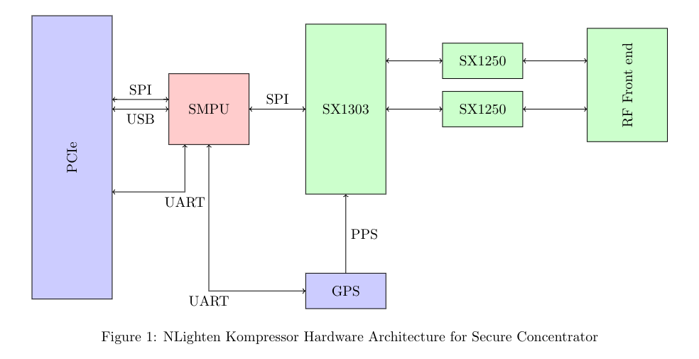
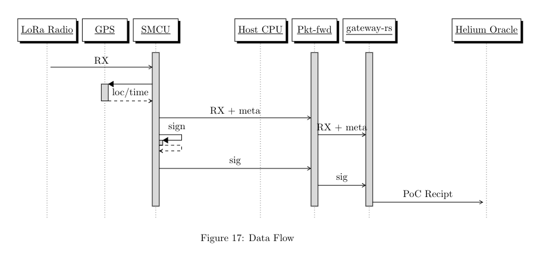

# HIP 72: Secure Concentrators

- Author(s) @Dinocore
- Start Date: Oct 1, 2022
- Category: Technical
- Original HIP PR: #484
- Tracking Issue: #489

## Summary

In this HIP, we propose a new type of IoT network actor: the Secure Concentrator Card (SCC). Secure
Concentrator Card is similar to standard LoRaWAN concentrator cards, but with additional Secure
Microcontroller Unit (SMCU) and onboard GPS receiver. The SMCU digitally signs LoRa data packets as
they are received from the radio. In this way, packet data and its corresponding metadata (RSSI,
Frequency, GPS location and time) can be verified to be authentic.

- Secure Concentrators are _optional._ There is **no** requirement to upgrade or purchase new
  hardware. Helium Hotspots without Secure Concentrator will continue functioning as normal.
- Helium Hotspots with Secure Concentrators will earn **1.25x** rewards. (See _Proof Of Coverage
  Rewards_ section)

## Motivation

Today's Helium Hotspot have a large security flaw. Anyone can modify the software running on a
Hotspot and generate fake LoRa packets. This is a big problem because PoC rewards are based on these
packets. The new Secure Concentrator Card solves this problem by digitally signing packets in
hardware. Secure Concentrators make it _prohibitively_ difficult to game the PoC system by also
utilizing tamper-resistant design elements (routed traces, hard cured potting material, etc). The
end result is a more secure Physical Root of Trust for the Helium IoT system and fair PoC earnings
for all.

The proposed SCC design allows existing Helium miners to upgrade by swapping out existing
concentrator cards with new secure card. In addition, SCC would enable the DIY community to build
their own hardware, greatly increasing the diversity and proliferation of Hotspots.

## Stakeholders

The entire IoT Helium network will be affected by this HIP as the introduction of SCC will make
gaming the network very difficult to perform and scalable.

## Detailed Explanation

### Design Goals

- Increase security level of Helium's Proof-of-Coverage (I.E. make gaming much more difficult).
- Ability to replace/upgrade existing Miner's concentrator card with secure concentrator card
- Turn off-the-shelf LoRaWAN gateways into full PoC Helium miner (DIY Hotspot)
  - Secure Concentrators effectively replace the need for ECC806 security chip as mandated in
    HIP 19.
- Enable new class of Helium nodes that can provide additional functionality (LoRa PoC Mapper?
  Mobile Hotspot?)
- Enable new level of Proof-of-Coverage verification (possibly using Time Difference of Arrival
  (TDOA))

### Hardware Architecture

 The new hardware architecture for SCC is
based on Semtech's LoRa Corecell Gateway reference design. The major change involves the addition of
a Secure MCU (**SMCU**) placed in between the communication path of the Host CPU and the SX1303. The
SMCU's primary job is to cryptographically sign RF data received over the air such that other nodes
participating on the Helium network are able to verify the data is authentic and unaltered from it
original form. It is important the SMCU has exclusive access SX1303's SPI bus to eliminate the
possibility of spoofing incoming RF packets. The hardware design will consider several techniques to
make it physically difficult to access the SMPU and SX130x including using buried traces, placing
the components under a metal shield, and/or using potting material.

### Hardware Key

The SMCU stores a unique ED25519 keypair generated at manufacturing time in its non-volatile memory
known as the **Hardware Key**. Note: the Hardware Key is not the same as the `swarm_key`. This is an
important concept as it allows existing Miner's to upgrade their existing concentrator card with new
SCC. The Hardware's private key is considered a secret and stored in a special section of the SMCU
non-volatile memory used for secure storage. Secure storage can not be read-out and is not
accessible to the Host CPU or via hardware debugging tools.

The Hardware Key can also be used to sign other types of transactions beyond RF data. However, it
does not allow signing _arbitrary_ data. Doing so would put the security on par with existing HIP-19
secure element approach and thus defeat the purpose of this HIP. Note: If the SMCU's firmware
allowed for signing arbitrary data with its Hardware Key, an attacker could jailbreak the Host CPU
and craft a signing request that contained fake RF data.

### Semtech SX1303

The Semtech SX1303 is a new generation of LoRa baseband processor for gateways. It is size and pin
compatible with SX1302 and like SX1302, it excels in cutting down current consumption, simplifying
thermal design, lowering Bill Of Materials cost, and reducing overall size of gateways. In addition
to supporting all the features of SX1302, SX1303 introduces a new Fine Timestamp capability that
enables Time Difference of Arrival (TDOA) network-based geolocation. The new TDOA feature could
potentially enable another layer of Proof of Coverage. For example, Helium Hotspots using SX1303
chipset could coordinate together to assert that another Helium Hotspot's beacon signal actually
originated from the stated geo-location.

### GPS Receiver

The GPS receiver is a required component. GPS provides geolocation and timestampling of every
received packet. GPS is also needed to provide precise timing required for the Semtech SX1303 TDOA
feature.

### RF Data Signature



Semtech's open-source LoRa packet forwarder is traditionally the software that runs on the Host CPU
and reads data from the SX130x hardware via SPI or USB. The packet forwarder produces output JSON
formatted data when RF data is received. We propose modifying the packet forwarder software to
include an additional key/value pair containing the RF data cryptographic signature.

```
{
  "rxpk": {
    "tmst":20900514000,
    "chan":2,
    "rfch":0,
    "freq":866.349812,
    "stat":1,
    "modu":"LORA",
    "datr":"SF9BW125",
    "codr":"4/6",
    "rssis":-108,
    "rssic":-45,
    "lsnr":-12.8,
    "size":23,
    "data":"AMy7qgAAAAAATYMmmnj6AADl6YP1Jrw",
    // New fields below
    "hw_sig": "HsOIwoZaHB8Iw4LDq1QTwqV0w7HDqcOOHRxvdQ8vwobDjsO2Jg7CnRrDtHLDtA==",
    // optional fields below
    "gps_time_s": 465465,
    "gps_time_ns": 322983,
    "gps_lat": 48.858288,
    "gps_long": 2.294479,
    "gps_alt": 10,
  }
}
```

### Sign Non-RF data

The SMCU can also sign non-RF data with its Hardware Key upon request. The signature will always
include the string prefix `nonrf` in its message creation to distinguish from RF data.

```
payload_hash = sha512(payload | int32_msb(payload size))
msg = 'nonrf' | payload_hash | int32_msb(tmst)
signature = ed25519_sign(msg, pubKey, privKey)
```

## Secure Firmware

The firmware running on Secure Concentrator is open-source. The firmware itself has a bootloader
that checks the cryptographic signature of the application image at each power up to ensure it is
unaltered from its original form. The Helium Foundation manages the cryptographic key used by
bootloader. The Helium Foundation is also responsible for auditing the firmware.

## Proof of Coverage Rewards

In order to incentivize adoption of Secure Concentrators, we propose increasing the earnings of PoC
Witness packets received by Secure Concentrator by a factor of **(1.25x)**. We believe this is
justified due to the increased security benefits the entire Helium network will enjoy with the
addition of Secure Concentators.

## Onboarding

Manufacturers will purchase unique ED25519 keypairs for installation onto Secure Concentrator
devices from the Heilum Foundation for a fee of 4,000,000 DC ($40 USD) each. Each Manufacturer will
be required to purchase a minimum quantity of 1000 key pairs. This rule serves as a type of
proof-of-stake mechanism ensuring only serious manufactures are allowed access to keypairs. Keypairs
are intended for installation on Secure Concentrators produced by that Manufacturer only. Any
Manufacturer found to be re-selling keypairs or otherwise using them as unintended, will have their
keypairs revoked.

Helium Foundation will make publicly available the list of public keys purchased by all
Manufacturers. This ensures that any 3rd party can verify PoC transactions produced by Secure
Concentrators. Oracle verifier nodes will use the public key list to verify every PoC packet signed
by a Secure Concentrator.

## Reference Hardware Design

NLighten Systems has developed Open-Source hardware and firmware Secure Concentrator reference
design. The design files can be found here: https://gitlab.com/nlighten-systems/kompressor/

## Drawbacks

## Rationale and Alternatives

The proposed architecture of SCC is the best possible design because it cleanly and securely
decouples low-level RF packet data from high-level Helium network protocol and constructs. This
decoupling is important because we expect the Helium network protocol to continue to grow and evolve
in the future and it would be prohibitively difficult to maintain SMCU firmware to keep up. This
architecture also enables potential new class of Helium nodes that can provide additional future
functionality. For example, a SCC could be used in a PoC Mapper device to securely verify coverage
in remote locations. Perhaps most importantly, this architecture can be used to upgrade existing
Helium miners hopefully one day eliminating wide spread network gaming.

## Unresolved Questions

## Deployment Impact

Changes to the blockchain code will need to be made and tested on the `testnet`. When ready, these
changes can be merged to `mainnet` but should have no impact on existing nodes. These changes are
backwards compatible. Upgrading an existing miner with new SCC should not require any action on the
Hotspot owner's part.

## Success Metrics

The central thrust of this HIP is to eliminate widespread network gaming/cheating. Success will be
determined by less reported network gaming.
