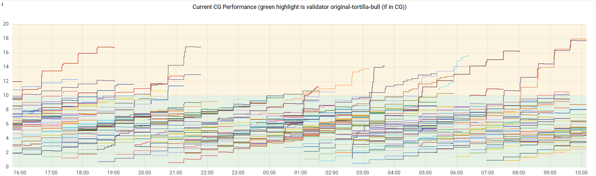

# HIP 73: Consensus Deselection Weighting

- Author(s): [@PaulVMo](https://github.com/PaulVMo)
- Start Date: 2022-10-03
- Category: Technical
- Original HIP PR: [#490](https://github.com/helium/HIP/pull/490)
- Tracking Issue: [#491](https://github.com/helium/HIP/issues/491)
- Code PR: [helium/blockchain-core#1468](https://github.com/helium/blockchain-core/pull/1468)

# Summary

[summary]: #summary

This change introduces a new, tunable, chain variable that improves performance of the current
Helium L1 by changing the selection algorithm of new Consensus Group members. This change
specifically adjusts the weight given to historical penalties when selecting existing Consensus
Group members to be removed. By reducing (or even zeroing out) the previous penalties of Consensus
Group members, performance penalties earned in the current epoch have a larger impact on the
selection. This will help eject poor performers from the Consensus Group more quickly and maintain
overall high performance of the chain.

The core developers will have discretion to set this new chain var
(`election_penalty_history_percentage`) as they see fit in order to promote performance of the
blockchain. Because it does change election dynamics which have a direct impact on validator
operators, the core devs and I fell it is best to bring this change as a HIP with a vote amongst at
least validator operators as they are the ones primarily affected.

The code for the change is already merged and tagged for release. However, it will be activated only
upon HIP approval by setting of `election_version` >= 7.

# Motivation

[motivation]: #motivation

The motivation for this change is to enable quicker removal of low performing validators from the
consensus group. With the current election system, we often see obvious low performers with high
total penalties continue to remain in the consensus group. For example, the screen shot of CG member
total penalty over time shows clear outliers who persist in the group despite amassing penalties 4x
to 5x higher than average.

This change will help to remove these poor performers more quickly, by giving higher weight to
performance penalties in the current epoch.

# Stakeholders

[stakeholders]: #stakeholders

- Validator operators / owners - This change largely impacts validators as it directly impacts their
  likelihood of remaining in CG based on their performance
- Other network participants - If successful in achieving its goals, this change has the potential
  to improve the overall performance of the Helium blockchain, for example, allowing a higher PoC
  rate without impacting block production times

# Detailed Explanation

[detailed-explanation]: #detailed-explanation

This change enables additional tunability in the election process. Specifically, it controls how
much previous versus current epoch penalties are used in selecting validators for removal from the
current group. This change has two components:

1. Introduce new chain var `election_penalty_history_percentage` which is used during scoring of
   existing group members before selecting members for removal. This value controls whether and how
   much the previous penalties (those in the ledger and thus earned outside of the current epoch)
   contribute to the score.\
   \
   Score for selecting to remove is thus:\
   `[election_penalty_history_percentage] * [total existing penalty]) + [current epoch performance penalties] + [current epoch tenure penalty]`
   \
   Currently, score for deselection is\
   `[total existing penalty] + [current epoch performance penalties]`

2. Change the tenure penalty from being applied at the beginning of the round to being applied at
   the end of the round. This makes it so that the tenure penalty for the current group is not part
   of the previous penalties and instead is counted in the current epoch. This change is necessary
   because if the `election_penalty_history_percentage` is zero, we still want to count the current
   round's tenure penalty in the score for deselecting (i.e. validators must have a non-zero score
   for the inverse cumulative distribution function selection algorithm to work).

These changes are guarded behind `election_version` = 7. No changes are made in the logic for
selection of new validators into CG. That continues to be weighted randomly based on the total
penalty score at time of the election.

Note that when `election_penalty_history_percentage` is 1.0, the behavior of consensus member
deselection is nearly identical to the existing behavior. There will be a miniscule difference in
total penalty as the tenure penalty starts decaying at the end of the epoch versus the beginning of
the epoch.

To achieve the goal of more quickly removing low performers, election_penalty_history_percentage
should be kept at or near 0.0. This causes the deselection to be based mostly/entirely on
performance in the existing group which is one of the most important considerations for a well
functioning CG. In the long-run, this will still provide equal rewards for equal performance. If all
validators perform perfectly during an epoch, the odds of being removed are equal and thus on
average will spend 4 consecutive epochs in CG.

# Drawbacks

[drawbacks]: #drawbacks

### DKG penalties scaled down

As part of this change, any DKG penalties will be considered as part of penalty history since they
are added to the ledger at the time of the consensus election failure transaction. Thus, these
penalties will also be scaled down. One could argue that any DKG penalties should instead be counted
in the current epoch penalties. This is impractical given the way these penalties are stored. The
benefit of this change however will still outweigh this potential drawback. Validators that fail
DKGs are typically offline and also hit with large missed seen and BBA penalties which will far
outweigh their tenure penalty and give them a large probability of being ejected. Also, the DKG
penalties accrued will still contribute to the total score which will reduce the odds of being
elected into future CGs until the penalties decay.

### Lower total penalties for poor performer

If poor performing validators are ejected from the CG more quickly, this means that they will also
accrue lower total penalties. This could result in a poor performing validator becoming eligible for
a new election sooner or with higher probability. While this might be a bad thing for consistent
poor performers, it also helps limit the damage that occurs from occasional poor performance or
penalties caused by factors out of the control of operators (e.g., bugs in code, temporary issues
with colo provider/ISP, etc.). By ejecting them from CG sooner, this gives an opportunity for the
operator to mitigate the penalties accrued for a normally high performing validator such as by
rolling back the validator version, resolving a hardware or hosting provider issue, etc.

# Rationale and Alternatives

[alternatives]: #rationale-and-alternatives

An alternative that was considered was to incorporate an exponential component to the deselection
scoring. For example, total penalty score could be squared before using for deselection probability.
Higher total penalty would have an exponentially higher probability of being removed. While this
would limit poor performers to some extent, the effect is not as strong as the proposed one because
long-tenure validators regardless of performance will have increasing scores as well. To really
focus on current performance, the solution in this HIP is favored.

# Deployment Impact

[deployment-impact]: #deployment-impact

Deployment is controlled by setting `election_version` -> 7 and by setting a value of
`election_penalty_history_percentage` between 0.0 and 1.0, inclusive.

# Success Metrics

[success-metrics]: #success-metrics

Success will result in shorter tenure for validators that are incurring significant performance
penalties as well as the ability to increase the PoC rate without impacting the block rate / HNT
emissions.
