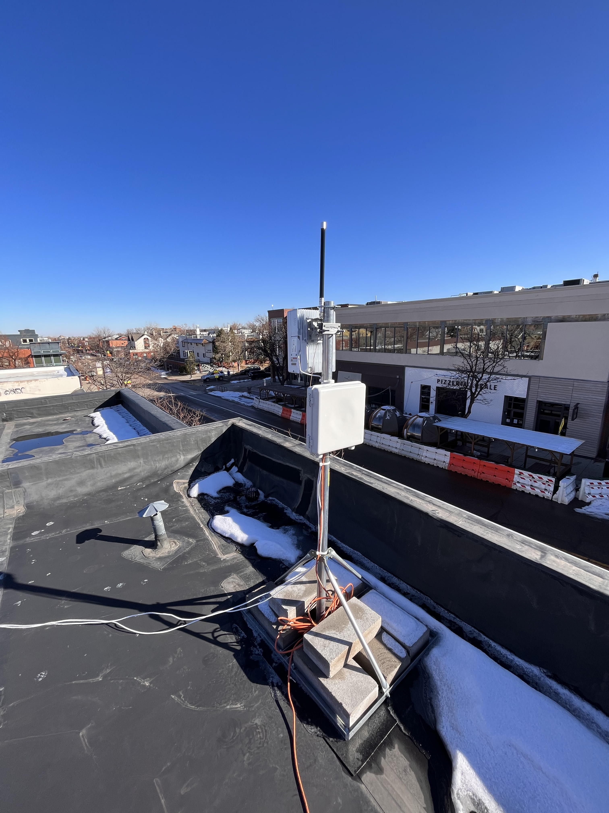

# HIP 74: MOBILE PoC - Modeled Coverage Rewards

- Author(s): @thehardbits, @zer0tweets, @jpad-freedomfi, @meowshka
- Start Date: 2022-11-29
- Category: Technical & Economic
- Original HIP PR: <!-- leave this empty; maintainer will fill in ID of this pull request -->
- Tracking Issue: <!-- leave this empty; maintainer will create a discussion issue -->

# Summary

This HIP proposes the first Proof-of-Coverage reward scheme for the MOBILE network and the method it will use to govern rewards in the current Genesis Phase, and beyond. This coverage scheme, known as _Modeled Coverage_, attempts to predict the coverage that a MOBILE radio provides to a surrounding area using radio characteristics, location data provided during the CBRS CPI registration process, and a public topographical database. This calculation will be performed by a new entity known as an Obstruction Data Oracle, which is an automated process that can predict how a signal will propogate into the surrounding area.

This scheme replaces the current Genesis Phase scheme that relies solely on self-reported Hotspot parameters such as Radio Heartbeats and network Speed Tests. While these items are hard to spoof, they are not verified by external sources and provide limited information about the quality of coverage that a Radio provides. Modeled Coverage improves upon the current scheme by taking into account the directionality of Radios and environmental obstructions that prevent the propagation of the signals they generate.

Once implemented, Modeled Coverage will be a significant milestone in introducing the Proof-of-Coverage concept in the Mobile Network. It's covered in a detailed MOBILE PoC roadmap in the blog post MOBILE Proof-of-Coverage: The Road Ahead [MOBILE Proof-of-Coverage: The Road Ahead](<https://blog.helium.com/mobile-proof-of-coverage-the-road-ahead-73a25601a13d>) as Obstruction Data.
Combined with other parameters like uptime (Heartbeats) and backhaul (Speed Test), it allows for more fair rewards and incentivizes high-quality deployments of Radios.

# Motivation

Building the MOBILE Network began with the Genesis Period, during which 5G Hotspot owners with Radios had to send just one Heartbeat in 24 hours to prove they were online. This was a necessary starting point to kickstart the deployments. However, to be successful, any network must be reliable, always available, and meet the expectations of its users. Using Modeled Coverage is an important step to measure the quality of coverage beyond self-reported data. In the future, it will be complemented and cross-checked by the data provided by Mobile Mappers.

Additionally, Modeled Coverage lays a foundation to introduce more data sources like zoning and population density to measure the usefulness of coverage and motivate deployments in places where it matters the most. The addition of the location-based incentive points will also be possible once the Modeled Coverage is introduced in the Mobile Rewards calculations.

# Stakeholders

This HIP affects only MOBILE SubDAO, particularly 5G Hotspot owners with Radios and users of the MOBILE Network.

5G Hotspot owners: 5G Hotspot owners with Outdoor Radios will need to meet new quality coverage requirements to earn maximum MOBILE rewards. Some owners might need to adjust the locations and/or angles of their Outdoor Radios to optimize for coverage. It is possible that in some places, it won't be possible to earn max rewards due to environmental obstacles that are not possible to mitigate. This HIP also proposes to consider rewarding those deployers who were among the first to provide quality coverage in a given Hex.

There will be three possible outcomes for owners of Radios:

1. Increase in earnings. Because some Radios on the MOBILE Network won't be able to meet minimum quality requirements, part of the rewards will be re-distributed proportionally to those who qualify based on all PoC criteria.
2. Earnings will stay the same.
3. Less or no earnings.

Hotspot owners will be able to evaluate their performance with the Modeled Coverage map. Depending on the location and time of deployment in the particular hex, there might be an opportunity to improve coverage and earn more. Changing the location and angle of the Radio requires resubmission of the CPI registration. In addition to compliance, this registration ensures new data is used for Modeled Coverage data calculations.

More information about the proposed reward changes is in the Detailed Explanation section below.

# Detailed Explanation

This HIP replaces the current algorithm for MOBILE rewards that was initially introduced during the Genesis phase and was based on Radio Type multipliers with a new algorithm that uses the location of the radio to calculate rewards based on the hexes the radio actually covers, as modeled by the obstruction data oracle. Below is a detailed explanation of the proposed rewards algorithm and new requirements for scaling MOBILE rewards based on the Modeled Coverage data.

## Reward Mechanics

### Hex Size

With this HIP, we propose to use resolution 12 as defined by [H3](<https://h3geo.org/docs/core-library/restable/>) for Hex sizes. H3 geo coordinates system has proven to perform well and provide all the necessary features in the IoT Network. You can read how H3 Data is currently used for the IoT Network in [The Helium Blog](<https://blog.helium.com/mapping-the-world-with-hexagons-49f57d8b3df5>).
Analysis of the coverage by a single Outdoor Radio with Modeled Coverage data showed that resolution 8 hex currently used in the IoT Network is too large to represent Radio's coverage. Hexes with resolution 12 better align with what an Outdoor Radio can reasonably cover, with an average area of 0.0003071 km² and an edge length of 9.4 m, which is slightly bigger than the size of an average single-family home.

This HIP introduces a fundamental difference in the use of hexes for Mobile Network compared to IoT. In IoT, hexes are used to determine the locations of the Hotspots and the number of Hotspots in the given hex. On the contrary, in Mobile Network, hexes are used to determine where the coverage exists. The Radio doesn't have to be in a given hex to provide coverage there. The use of Modeled Coverage data allows us to un-tie the device's location from its signal strength and propagation. To sum up, the hexes in Mobile Network are used to identify the level of coverage in a particular hex from all the different radios. A Radio can earn rewards by providing coverage in multiple hexes.

To help visualize the significant difference between these two resolutions, below is a map with green hex resolution 8 and a small dot inside it - purple hex with resolution 12.

Image 1. Hex res 12 and hex res 8 map overlay

### Reward Tiers

The Heartbeat frequency requirement and backhaul test requirements will remain unchanged. However, instead of assuming a fixed reward based on Radio Type multiplier, MOBILE rewards oracle will calculate a coverage model for each radio, taking into account its physical location, antenna direction, radio max transmit power and obstruction data oracle inputs. This coverage model (aka Modeled Coverage) of a radio will cover a certain number of res 12 hexes for each radio. Depending on the number of res 12 hexes and the resulting signal power in each of the hexes, the radio will earn reward points that will be used towards calculating its MOBILE rewards.

#### Outdoor Radios
This HIP proposes four tiers of potential signal power - High, Medium, Low, and None. Reward points for Obstruction Data will replace Radio Type multipliers, but will retain a similar proportion between them because the more powerful radios, if placed correctly, will have the ability to cover and get rewarded for more res 12 hexes.

Table of reference signal received power and corresponding reward multipliers for Outdoor Radios:

|  | Tier 1 | Tier 2 | Tier 3 | Tier 4 |
|---|---|---|---|---|
| **Potential Signal Power** | $P > -90 dBm$ | $-90 dBm \ge P > -105 dBm$ | $-105 dBm \ge P > -130 dBm$ | $P \le -130 dBm$ |
| **Potential Signal Level** | High | Medium | Low | None |
| **Estimated coverage points** | 16 | 8 | 4 | 0 |

Table 1. Signal power tiers, corresponding signal strength and estimated coverage points for Outdoor Radios.

#### Indoor Radios

Since there are no sufficient and reliable data sources about obstacles in indoor spaces, Obstruction Data Oracle cannot be used to evaluate coverage by Indoor Radios. Instead, we propose to use an approximation based on the data gathered during the testing of certified Indoor Radios in various indoor settings. Based on the test data, we assume that Indoor Radios provide max signal strength coverage in the hex where they are physically located and low signal level in all adjacent hexes. To ensure indoor radios are fairly compensated, our algorithm errs on the side of generosity. The reward tiers will be as follows:

|  | Tier 1 | Tier 2 |
|---|---|---|
| **Location** | Inside hex | All adjacent hexes |
| **Potential Signal Level** | High | Low |
| **Estimated coverage points** | 400 | 100 |

Table 2. Signal power tiers, corresponding signal strength and estimated coverage points for Indoor Radios.

Like Outdoor, Indoor Radios will be able to collect rewards from providing coverage in multiple hexes.

Estimated coverage points for Indoor Radios are significantly higher than the per hex points awarded to Outdoor Radios. This was done on purpose and is to balance the importance of Indoor Radios in the network and their relatively smaller coverage footprints.

These values were chosen by taking all the Outdoor Radios in an example market and analyzing the distribution of estimated coverage points per radio based on the algorithm described in this HIP. We then chose estimated coverage point values that result in Indoor Radios getting roughly ¼th the estimated coverage points as the 95h percentile Outdoor Radios. The chosen points scheme also results in Indoor Radios getting about ½ the points of the average Outdoor Radio. Both of these results are aligned with the ratios used during genesis rewards where Indoor, Low-power Outdoor, and High-power Outdoor were rewarded at a ratio of 1 to 2.5 to 4 respectively. Figure 1 below is the CDF plot of the sample market Outdoor Radio estimated coverage points.

Figure 1. CDF of Outdoor Radio estimated coverage points for 904 radios in the L.A. market area.

## Reward Algorithm

The proposed new algorithm for MOBILE Reward calculation in the MOBILE Oracle is as follows:

1. Supply declared transmitter power of each Radio and its location to the Obstruction Data Oracle.
1. Get all hexes that have coverage from Outdoor Radios based on the information returned by Obstruction Data Oracle.
1. Based on the location of Indoor Radios, get all hexes with Indoor coverage and all adjacent hexes to the hex where Indoor radios are located.
1. Use projected signal loss information from Obstruction Data Oracle to determine the potential signal strength level of each Outdoor Radio in each hex.
1. For each hex, get at most 5 Outdoor Radios with the top signal strength of the same level. If there are more than 5 Radios with the same signal strength level, use the *coverage_claim_time* value to determine the top 5 oldest installations. *coverage_claim_time* is the time when the Radio received the spectrum access grant for the first time. To prevent rewarding “dead” Radios, we propose to reset *coverage_claim_time* if the Radio was not heartbeating for more than 72 hours, and use the time of the last Heartbeat as new *coverage_claim_time*.
1. Get max 5 Indoor Radios using the same approach as above for Outdoor Radios.
1. Based on Tables 1 and 2, sum up all estimated coverage points earned by each Radio in all hexes and multiply that by *speedtest_multiplier* for each Radio.
1. Divide the total number of MOBILE emitted during the Rewards Period by the sum of multiples of *estimated_reward_point* and *speedtest_multiplier* for each Radios to determine reward per one estimated_reward_point for Radio with Acceptable Speed Test.
1. Sum up all the points for each Radio and multiply that number by the MOBILE per one *estimated_reward_point* to determine the reward for each Radio.

The new formula for Reward calculation per Radio:

$$
W = k_H \times k_S \times C_E \times W_p
$$

| Variable | Description |
|---|---|
| $W$ | Total rewards |
| $k_H$ | Heartbeat multiplier |
| $k_S$ | Speedtest multiplier |
| $C_E$ | Estimated coverage points |
| $W_p$ | Epoch rewards per coverage point |

### Calculation Example

For simplicity, assuming that total MOBILE Rewards per period is 10,000.

| Radio  | Heartbeat | Heartbeat multiplier $k_H$ | Speed Test | Speedtest Multiplier $k_S$| Hex 1 - Hex 10 | Hex 11 - Hex 20 | Hex 21 - Hex 220 | Total Coverage Points | Total Reward Points |
|---|--|---|---|---|---|---|---|---|---|
| 1 (Outdoor) | Ok | 1 | Acceptable  | 1    | 160 | 80 | 800 | 1,040 | 1,040 |
| 2 (Outdoor) | Ok | 1 | Poor        | 0.25 | 80  | 40 |     | 120   | 30    |
| | | | | | | | | Points| 1,070 |

Table 3. Simplified data for two Outdoor Radios with Heartbeat, Speed Test and Estimated Coverage Points for one Reward Period.

| Radio  | Heartbeat | Heartbeat multiplier $k_H$ | Speed Test | Speedtest Multiplier $k_S$| Hex 1 | Hex 2 | Hex 3 | Hex 4 | Total Coverage Points | Total Reward Points |
|---|--|---|---|---|---|---|---|---|---|---|
| 3 (Indoor)  | Ok | 1 | Degraded    | 0.5  | 100 | 100 | 100 | 400 | 700 | 350 |
| | | | | | | | | | Points| 350 |

Table 4. Simplified data for one Indoor Radio with Heartbeat, Speed Test and Estimated Coverage Points for one Reward Period.

*R x (1x1x1040 + 1x0.25x120 + 1x0.5x700) = 10,000,*

Where R is the reward per one estimated coverage reward point.

*R = 6.54*

| | Total MOBILE Rewards |
---|---
| Radio 1 (Outdoor) | = 6.54x1x1x1040 = 6,806.3 |
| Radio 2 (Outdoor) | = 6.54x1x0.25x120 = 903.14 |
| Radio 3 (Indoor) | = 6.54x1x0.5x700 = 2,290.58 |

## Data Visualization

All members of the MOBILE SubDAO need to see real-life coverage provided by 5G Radios. Modeled Coverage data will play a key role in providing information to visualize it. More data will be added as additional external sources like Mobile Mappers come into play.

This HIP proposes the creation of a new Explorer dedicated exclusively to MOBILE Network. As we grow with more features and data for rewards, combining it with information about the IoT Network becomes practically impossible.

A basic map overlay of 5G data coverage with signal strength is proposed to be the first iteration of the Mobile SubDAO Explorer. Below is the visualization of signal propagation for the Outdoor Radio, directed along the street and installed on a pole on the two-story building roof.

Image 2. Baicells Outdoor Radio 430 installed on the two-story building roof on the pole.

Image 3. Modeled coverage of the Radio pictured on Image 2.

## Implementation Timeline

Launch of the Modeled Coverage in the PoC Rewards calculation is planned for Q1 2023.
However, to make sure the transition to the new PoC system, which replaces static, power-based multipliers, is smooth, Hotspot owners will be able to evaluate the coverage they provide before the switch takes effect.
We propose to show Mapped Coverage information in the Mobile Explorer for at least four weeks before switching to the new PoC model.

# Drawbacks
Setting a maximum of 5 Indoor Radios might not work for multi-story or high-rise buildings. Compared with Outdoor Radios, no data is accessible about the elevation of Indoor Radios, and no other data sources are available immediately to model such information. However, by adding more external sources like zoning and population density to PoC in the future, we will be able to evaluate the usefulness of coverage provided by Indoor Radios more precisely. In the meantime, 5 radios in a given hex is sufficient to cover up to a 10 story building, making Multi-Dwelling Unit deployments feasible under the current limits while we work on further improvements.
