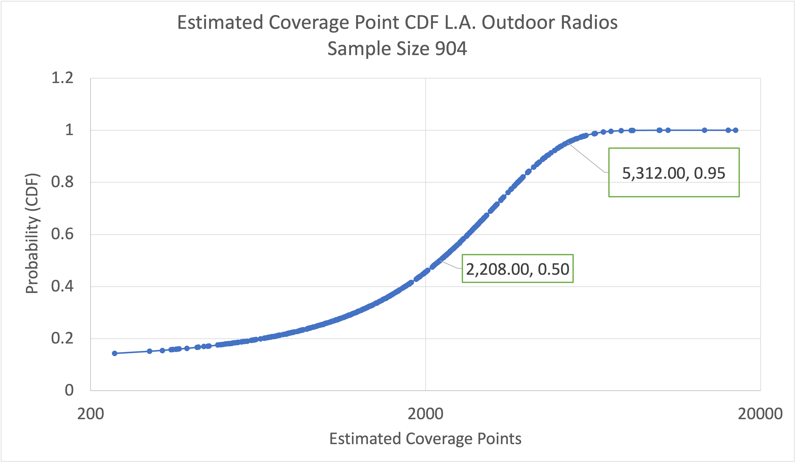

# HIP 74: MOBILE PoC - Modeled Coverage Rewards

- Author(s): @thehardbits, @zer0tweets, @jpad-freedomfi, @meowshka
- Start Date: 2022-11-29
- Category: Technical & Economic
- Original HIP PR: <!-- leave this empty; maintainer will fill in ID of this pull request -->
- Tracking Issue: <!-- leave this empty; maintainer will create a discussion issue -->

# Summary

HIP-74 proposes the first Proof-of-Coverage scheme for the MOBILE Network and the method it will use to govern MOBILE Rewards in the current Genesis Phase and beyond. This coverage scheme, known as _Modeled Coverage_, attempts to predict the coverage that a MOBILE Radio provides to a surrounding area using radio characteristics, location data provided during the CBRS CPI registration process, and a public topographical database. A new entity known as an Obstruction Data Oracle, an automated process that predicts how a signal will propagate into the surrounding area, performs these calculations. This HIP impacts only Helium 5G Hotspot owners with Radios and does not affect the IoT rewards.

This scheme replaces the current Genesis Phase scheme that relies solely on self-reported 5G Hotspot parameters such as uptime (Radio Heartbeats) and backhaul (Speed Tests). While these items are hard to spoof, external sources do not verify them and provide limited information about the quality of coverage that a Radio provides. Modeled coverage improves upon the current scheme by considering the directionality of Radios and environmental obstructions that prevent the propagation of the signals they generate.

Once implemented, Modeled Coverage will be a significant milestone in introducing the Proof-of-Coverage concept in the Mobile Network. The blog post [MOBILE Proof-of-Coverage: The Road Ahead](https://blog.helium.com/mobile-proof-of-coverage-the-road-ahead-73a25601a13d) provides a detailed MOBILE PoC Roadmap. Combined with other parameters like uptime and backhaul, Obstruction Data allows for more fair rewards and incentivizes high-quality deployments of Radios.

# Motivation

Building the MOBILE Network began with the Genesis Phase, during which 5G Hotspot Owners with Radios had to send just one Heartbeat in 24 hours to prove the Radios were online, a necessary starting point to kickstart the deployments. However, to be successful, any MOBILE Network must be reliable, always available, and meet the expectations of its users. Using Modeled Coverage is an important step to measure the quality of coverage beyond self-reported data. In the future, it will be complemented and cross-checked by the data provided by Mobile Mappers.

This HIP lays the groundwork for rewarding Helium Mobile Hotspot operators based on coverage vs. just existence (status quo) Specifically:

1. Proposes a framework to count coverage using res12 hexes;
2. Proposes a framework to start incorporating external data sources for calculating coverage, starting with the Obstruction Data Oracle. We expect this to be the first in a series of HIPs that will incorporate other data sources, such as zoning and population density, feedback from carrier members of the MOBILE subDAO, Network users and Mappers, etc.

Additionally, Modeled Coverage lays a foundation to introduce more data sources like zoning and population density to measure the usefulness of coverage and motivate deployments in places where it matters the most. With Modeled Coverage, location-based incentive points in the Mobile Rewards calculations will also be possible.

# Stakeholders

This HIP affects only the MOBILE SubDAO, particularly 5G Hotspot Owners with Radios and users of the MOBILE Network. This HIP does not have an impact on the IoT Network or IoT Rewards.

5G Hotspot Owners with Outdoor Radios must meet new Quality Coverage requirements to maximize potential MOBILE Rewards earnings. Some Owners may need to modify their Outdoor Radio locations, orientations, or both to optimize for Quality Coverage. Additionally, environmental obstacles that are impossible to mitigate may reduce the maximum Rewards a Radio can earn. HIP-74 also proposes rewarding deployers among the first to provide quality coverage in a given hex.

There will be three possible outcomes for owners of Radios:

1. Increase in earnings. Because some Radios on the MOBILE Network won't be able to meet minimum quality requirements, part of the MOBILE Rewards will be re-distributed proportionally to those who qualify based on all PoC criteria.
2. Earnings will stay the same.
3. Less or no earnings.

5G Hotspot Owners can evaluate their performance with the Modeled Coverage map. Depending on the location and time of deployment in the particular hex, there might be an opportunity to improve coverage and earn more. Changing the location and orientation of a Radio requires resubmission of the CPI Registration. In addition to compliance, Modeled Coverage data calculations use this updated registration.

# Detailed Explanation

HIP-74 replaces the current algorithm for MOBILE Rewards initially introduced during the Genesis Phase based on Radio Type multipliers with a new algorithm that uses the location of the Radio to calculate Rewards based on the hexes the Radio covers, as modeled by the Obstruction Data Oracle. Below is a detailed explanation of the proposed rewards algorithm and new requirements for scaling MOBILE Rewards based on the Modeled Coverage data.

## Reward Mechanics

### Hex Size

With HIP-74, we propose to use res12 as defined by [H3](https://h3geo.org/docs/core-library/restable/) for Hex sizes. The H3 geo coordinates system has proven to perform well and provide all the necessary features in the IOT Network. You can read how the IOT Network uses H3 data in [The Helium Blog](https://blog.helium.com/mapping-the-world-with-hexagons-49f57d8b3df5).

Analysis of the coverage by a single Outdoor Radio with Modeled Coverage data showed that the res8 hex currently used in the IOT Network is too large to represent a Radio's coverage. Res12 hexes better align with what an Outdoor Radio can reasonably cover, with an average area of 0.0003071 km² and an edge length of 9.4 m, slightly bigger than an average single-family home.

HIP-74 introduces a fundamental difference in using hexes for the Mobile Network compared to the IOT Network. In the IOT Network, hexes determine the locations and number of Hotspots within the given hex. In the Mobile NETWORK, hexes determine where the coverage exists. Modeled Coverage data allows us to un-tie a Radio's location from its signal strength and propagation.

To summarize:

- Hexes in the MOBILE Network identify the level of coverage from all the different Radios providing coverage to each hex.
- A Radio can provide coverage for a hex it is not located within.
- A Radio can earn rewards by providing coverage in multiple hexes.

To help visualize the significant difference between these two resolutions, below is a map with green hex res8 and a small dot inside it - purple hex with res12.

**Figure 1.** Hex res12 and res8 map overlay

### Reward Tiers

In addition to uptime and backhaul requirements, the MOBILE Rewards Oracle will calculate a coverage model for each Radio. This Radio coverage model will consider the physical location, antenna direction, radio max transmit power, and Obstruction Data Oracle inputs to calculate the number of res12 hexes receiving coverage from each Radio.

Depending on the number of res12 hexes and the resulting signal power in each, the MOBILE Rewards Oracle will allot coverage points to a given Radio for calculating its MOBILE Rewards instead of assuming a fixed Radio Type multiplier Reward.

#### Outdoor Radios

HIP-74 proposes to replace Radio Type multipliers with coverage points represented by four tiers of potential signal power as modeled by the Obstruction Data Oracle - High, Medium, Low, and None.

Table of reference signal received power and corresponding reward multipliers for Outdoor Radios:

|                               | Tier 1        | Tier 2                     | Tier 3                      | Tier 4           |
| ----------------------------- | ------------- | -------------------------- | --------------------------- | ---------------- |
| **Potential Signal Power**    | $P > -90 dBm$ | $-90 dBm \ge P > -105 dBm$ | $-105 dBm \ge P > -130 dBm$ | $P \le -130 dBm$ |
| **Potential Signal Level**    | High          | Medium                     | Low                         | None             |
| **Estimated coverage points** | 16            | 8                          | 4                           | 0                |

**Table 1.** Signal power tiers, corresponding signal strength, and estimated coverage points for Outdoor Radios.

#### Indoor Radios

Like Outdoor, Indoor Radios can collect MOBILE Rewards by providing coverage in multiple hexes.

The Obstruction Data Oracle cannot evaluate coverage by Indoor Radios are no sufficient and reliable data sources about obstacles in indoor spaces. Instead, we propose to use an approximation based on the data gathered while testing certified Indoor Radios in various indoor settings.

Based on the test data, we assume the hex in which an Indoor Radio is physically located receives maximum signal strength coverage, and all adjacent hexes receive lower signal strength. Therefore, our algorithm errs on generosity to ensure equitable potential MOBILE Rewards for Indoor Radio coverage.

The reward tiers will be as follows:

|                               | Tier 1     | Tier 2             |
| ----------------------------- | ---------- | ------------------ |
| **Location**                  | Inside hex | All adjacent hexes |
| **Potential Signal Level**    | High       | Low                |
| **Estimated coverage points** | 400        | 100                |

**Table 2.** Signal power tiers, corresponding signal strength, and estimated coverage points for Indoor Radios.

Estimated per-hex coverage points for Indoor Radios are intentionally significantly higher than the per-hex coverage points awarded to Outdoor Radios to balance the importance of Indoor Radios in the MOBILE Network with their relatively smaller coverage footprints.

These values we chosen by taking all the Outdoor Radios in an example area and analyzing the distribution of estimated coverage points per Radio resulting from the algorithm described in HIP-74. We then chose estimated coverage point values that result in Indoor Radios getting roughly ¼th the estimated coverage points as the 95th percentile Outdoor Radios and about ½ the points of the average Outdoor Radio.

These results align with the ratios used during the `1:2.5:4` Genesis Phase rewards ratio for Indoor Radios, Outdoor Radios, and High-Power Outdoor Radios. Figure 2 below is the cumulative distribution function plot of the sample market Outdoor Radio estimated coverage points.

**Figure 2.** Cumulative distribution function of Outdoor Radio estimated coverage points for 904 Radios in the L.A. market area.

## Reward Algorithm

The proposed new algorithm for MOBILE Reward calculation in the MOBILE Rewards Oracle is as follows:

1. Supply the declared transmitter power of each Radio and its location to the Obstruction Data Oracle.
2. Get all hexes that have coverage from Outdoor Radios based on the information from the Obstruction Data Oracle.
3. Based on the location of Indoor Radios, get all hexes with Indoor coverage and all adjacent hexes.
4. Use projected signal loss information from the Obstruction Data Oracle to determine the potential signal strength of each Outdoor Radio in each hex.
5. For each hex, get at most 5 Outdoor Radios with the top signal strength of the same level. If there are more than 5 Radios with the same signal strength level, use the `coverage_claim_time` value to determine the top 5 oldest installations where `coverage_claim_time` is the timestamp when the Radio received the spectrum access grant for the first time. To prevent rewarding "dead" Radios, we propose to reset `coverage_claim_time` if the Radio was not generating a Heartbeat for more than 72 hours and use the time of the last Heartbeat as the new `coverage_claim_time`.
6. Get max 5 Indoor Radios using the same approach as above for Outdoor Radios.
7. Based on Table 1 and Table 2, sum up all estimated coverage points earned by each Radio in all hexes and multiply that by `speedtest_multiplier` for each Radio.
8. Divide the total number of MOBILE Rewards emitted during the Rewards Period by the sum of multiples of `estimated_reward_point` and `speedtest_multiplier` for each Radio to determine MOBILE Rewards per `estimated_reward_point` for Radio with a passing Speed Test.
9. Multiply the MOBILE per `estimated_reward_point` by the sum of each Radio's reward points to determine the MOBILE Rewards for each Radio.

The new formula for Reward calculation per Radio:

$$
W = k_H \times k_S \times C_E \times W_p
$$

| Variable | Description                      |
| -------- | -------------------------------- |
| $W$      | Total rewards                    |
| $k_H$    | Heartbeat multiplier             |
| $k_S$    | Speedtest multiplier             |
| $C_E$    | Estimated coverage points        |
| $W_p$    | Epoch rewards per coverage point |

### Calculation Example

For simplicity, assume that the total MOBILE Rewards per period is 10,000.

| Radio       | Heartbeat | Heartbeat multiplier $k_H$ | Speed Test | Speedtest Multiplier $k_S$ | Hex 1 - Hex 10 | Hex 11 - Hex 20 | Hex 21 - Hex 220 | Total Coverage Points | Total Reward Points |
| ----------- | --------- | -------------------------- | ---------- | -------------------------- | -------------- | --------------- | ---------------- | --------------------- | ------------------- |
| 1 (Outdoor) | Ok        | 1                          | Acceptable | 1                          | 160            | 80              | 800              | 1,040                 | 1,040               |
| 2 (Outdoor) | Ok        | 1                          | Poor       | 0.25                       | 80             | 40              |                  | 120                   | 30                  |
|             |           |                            |            |                            |                |                 |                  | Points                | 1,070               |

**Table 3.** Simplified data for two Outdoor Radios with Heartbeat, Speed Test, and Estimated Coverage Points for one Reward Period.

| Radio      | Heartbeat | Heartbeat multiplier $k_H$ | Speed Test | Speedtest Multiplier $k_S$ | Hex 1 | Hex 2 | Hex 3 | Hex 4 | Total Coverage Points | Total Reward Points |
| ---------- | --------- | -------------------------- | ---------- | -------------------------- | ----- | ----- | ----- | ----- | --------------------- | ------------------- |
| 3 (Indoor) | Ok        | 1                          | Degraded   | 0.5                        | 100   | 100   | 100   | 400   | 700                   | 350                 |
|            |           |                            |            |                            |       |       |       |       | Points                | 350                 |

**Table 4.** Simplified data for one Indoor Radio with Heartbeat, Speed Test, and Estimated Coverage Points for one Reward Period.

$$
R  \times (1 \times 1 \times 1040 + 1 \times 0.25 \times 120 + 1 \times 0.5 \times 700) = 10,000
$$

Where R is the reward per one estimated coverage point.

$$
R = 6.54
$$

|                   | Total MOBILE Rewards        |
| ----------------- | --------------------------- |
| Radio 1 (Outdoor) | = 6.54x1x1x1040 = 6,806.3   |
| Radio 2 (Outdoor) | = 6.54x1x0.25x120 = 903.14  |
| Radio 3 (Indoor)  | = 6.54x1x0.5x700 = 2,290.58 |

## Data Visualization

All members of the MOBILE SubDAO need to see real-life coverage provided by 5G Radios. Modeled Coverage data will play a key role in providing information to visualize it. More data will be added as additional external sources like Mobile Mappers come into play.

HIP-74 proposes the creation of a new Explorer dedicated exclusively to the MOBILE Network as adding more features and data for MOBILE Rewards to the IOT Network Explorer becomes practically impossible as the MOBILE Network grows. The first iteration of the MOBILE Explorer proposes a basic map overlay of 5G data coverage with signal strength.

Below is the visualization of signal propagation for the Outdoor Radio, directed along the street and installed on a pole on the two-story building roof.

**Figure 3.** A Baicells Outdoor Radio 430 installed on a two-story roof.

**Figure 4.** Modeled coverage of the Radio shown in Figure 3.

## Implementation Timeline

Launch of the Modeled Coverage in the PoC Rewards calculation is planned for Q1 2023.
However, to make sure the transition to the new PoC system, which replaces static, power-based multipliers, is smooth, Hotspot owners can evaluate the coverage they provide before the switch takes effect.
We propose to show Mapped Coverage information in the Mobile Explorer for at least four weeks before switching to the new PoC model.

# Drawbacks

Setting a maximum of 5 Indoor Radios might not work for multi-story or high-rise buildings. In contrast to Outdoor Radios, no data is accessible about the elevation of Indoor Radios, and no other data sources are available immediately to model such information.

By adding more external sources like zoning and population density to PoC in the future, we will be able to evaluate the usefulness of coverage provided by Indoor Radios more precisely. In the meantime, 5 Indoor Radios in a given hex are sufficient to cover up to a ten-story building, making Multi-Dwelling Unit deployments feasible under the current limits while we work on further improvements.

# Rationale and Alternatives

MOBILE PoC requires many external sources of information to evaluate uniqueness, usefulness, and quality of coverage. Any incrementally built product requires a solid foundation that can be implemented quickly, have an immediate impact, and can be extended with future improvements.
As initially planned, Mobile Mappers were supposed to be the primary sources of coverage verification for the MOBILE PoC. However, as with any hardware, it takes time and resources to have enough devices in the field to map all areas with coverage. Not to stall the progress with the PoC development, we've decided to evaluate Obstruction Data sources to model the Mobile coverage.

While analyzing the results, it was determined that Obstruction Data could complement information scanned by Mobile Mappers to cross-check and confidently verify signal levels, while immediately helping evaluate quality of Mobile coverage.

# Deployment Impact

This HIP affects only MOBILE SubDAO, particularly 5G Hotspot owners with Radios and users of the MOBILE Network. It does not have an impact on the IoT rewards.

## Impact on Rewards

There will be three possible outcomes for owners of Radios:

1. Increase in earnings. Because some Radios on the MOBILE Network won't be able to meet minimum quality requirements, part of the rewards will be re-distributed proportionally to those who qualify based on all PoC criteria.
2. Earnings will stay the same.
3. Less or no earnings.
   This HIP proposes to limit five oldest Radio deployments with the highest signal strength in a given hex for reward eligibility. The duration of the deployment will be calculated based on the time of the latest SAS grant received. Please see the Rewards Algorithm section for more details.
   Due to the lack of reliable data sources regarding obstacles in the indoor spaces, an approximation based on the data gathered during the testing of certified Indoor Radios will be used to determine the signal strength of the Indoor Radios. Please see the Reward Tiers section for more information. The proposed reward points for Indoor Radios will align with the ratios used during the Genesis rewards period.

Detailed information about proposed reward points can be found in the Reward Tiers section of this HIP.

## Mobile Explorer

This HIP proposes the launch of a new Mobile Explorer to display Modeled Coverage and other data of MOBILE Network. Before the launch of Modeled Coverage data in the Rewards calculation, Radio owners will be able to view the signal strength and hex coverage by their Radios in the new Mobile Explorer. We propose to give at least four weeks from the launch of the new Mobile Explorer for any necessary adjustments to the Radio locations before we consider Modeled Coverage data in the Rewards calculations.

Besides potential Radio location adjustments, no other actions related to this HIP will be required to be eligible for MOBILE Rewards.

## Proof-of-Coverage Roadmap

This HIP is one of the important milestones in the MOBILE PoC Roadmap. It lays the foundation for addition of other external data sources to evaluate the usefulness of coverage. HIPs that propose to use zoning, population density and allow location based optimization are coming as next steps. You can check out the MOBILE PoC Roadmap [here](https://blog.helium.com/mobile-proof-of-coverage-the-road-ahead-73a25601a13d/)

# Unresolved Questions

Finding reliable sources of information about indoor obstruction data is challenging. Until we incorporate data like population density and zoning to better understand the unique specifics of locations where Indoor Radios are located, we'll continue rewarding them for meeting Genesis PoC requirements but will have a limit of 5 rewardable Indoor Radios per hex. Indoor Radios will need to continue meeting Heartbeats and Speed Tests requirements but will receive increased rewards to keep the Genesis-period ratio of Indoor vs. Outdoor rewards.

# Success Metrics

The main success metric will be improvements to MOBILE coverage. We expect to see more distributed coverage and less clusterization of Outdoor Radios as their owners improve placements to optimize for maximum MOBILE rewards.
Improvements to coverage will be measured by the number of effectively covered hexes and the change in that number over time.

At a glance, changes to coverage can be easily visualized by comparing snapshots of the Modeled Coverage map for different periods. Mobile Explorer might include the functionality to retrieve snapshots for a given period of time.
