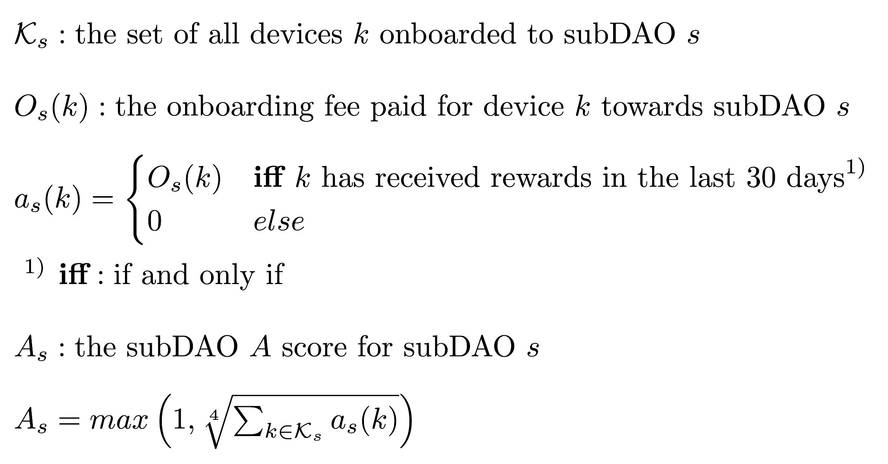

# HIP 88: Adjustment of DAO Utility A Score

- Authors: [Gateholder](https://github.com/gateholder), [Andy Zyvoloski](https://github.com/heatedlime), [Groot](https://github.com/mawdegroot)
- Start Date: 2023-06-15
- Category: Technical & Economic
- Original HIP PR: [#702](https://github.com/helium/HIP/pull/702)
- Tracking Issue: [#707](https://github.com/helium/HIP/issues/707)
- Voting Requirements: veHNT

## Summary

This HIP proposes to make the $A$ factor of the subDAO utility score more granular by using the individual onboarding fee of an active device paid instead of relying on a homogeneous onboarding fee. This will allow subDAOs to change their onboarding fee without either negatively affecting their subDAO utility score.

## Motivation

The current definition of the subDAO utility score as specified in HIP51 is shown below. The definition does not allow the changing of the onboarding fee without significantly affecting the $A$ factor of the score. The community has expressed the preference to change the onboarding fee; however, lowering the onboarding fee will significantly lower the subDAO utility score and thus subDAOs are disincentivized to do so. At the same time, increasing the onboarding fee will artificially inflate the subDAO utility score, an offense punishable by slashing as written in HIP51. This HIP proposes to change the $A$ score to align with the original intention of HIP51 while still allowing a subDAO to change their onboarding fee via their internal governance.

$\text{DAO Utility Score} = V \times D \times A$

where

$V = \text{max}(1, veHNT_{DNP})$

$D = \text{max}(1, \sqrt{\text{DNP DCs burned in USD}})$

$A = \text{max}(1, \sqrt[4]{\text{DNP Active Device Count} \times \text{DNP Device Activation Fee}})$

## Stakeholders

This change will impact the entire ecosystem as it alters the interpretation of the HIP51 subDAO utility score that is directly responsible for the distribution of HNT between subDAOs.

## Detailed Explanation

This HIP proposes to change the $A$ factor to only count the onboarding fees paid by each active device. The $A$ factor will _only_ take into account fees paid in DC. If a device has paid 40 USD but the current onboarding fee is 10 USD the device will still be counted as 40 USD Conversely a device that has paid 10 USD while the current onboarding fee is 40 USD will still be counted as 10 USD. This change will allow subDAOs to change their onboarding factor without affecting the $A$ factor of subDAO utility score that it had been awarded for previous onboarding fees.

An active device is any rewardable entity that has been onboarded and has received rewards in the past 30 days. This definition of what an _active device_ entails allows any subDAO to use their own definition of _device_ without requiring Helium DAO oversight. The use of the actual onboarding fee that was paid for a device removes the ability to onboard devices for a low onboarding fee and later game the subDAO utility score by increasing the onboarding fee for new devices.

The exact and explicit specification of the proposal is shown below. It is important to note that the remaining factors of the subDAO utility score, namely $V$ and $D$ remain unchanged.

### examples

Example 1: subDAO A has 450k active devices of which 448k devices have paid $40 and 2k devices have paid $10 onboarding fees.

$A_{\text{A}} = max\left(1, \sqrt[4]{\sum_{k \in \mathcal{K_\text{A}}}A_{\text{A}}(k)}\right) = max\left(1, \sqrt[4]{448 000 \cdot 40 + 2 000 \cdot 10}\right) = max\left(1, \sqrt[4]{17 940 000}\right) \approxeq 65.08$

Example 2: subDAO B has 4000 active devices of which 3800 have paid no onboarding fees and 200 have paid $10 onboarding fees.

$A_{\text{B}} = max\left(1, \sqrt[4]{\sum_{k \in \mathcal{K_\text{B}}}A_{\text{B}}(k)}\right) = max\left(1, \sqrt[4]{3 800 \cdot 0 + 200 \cdot 10}\right) = max\left(1, \sqrt[4]{2 000}\right) \approxeq 6.69$

Example 3: subDAO C has opted not to pay any onboarding fees and have 100k active devices.

$A_{\text{C}} = max\left(1, \sqrt[4]{\sum_{k \in \mathcal{K_\text{C}}}A_{\text{C}}(k)}\right) = max\left(1, \sqrt[4]{100 000 \cdot 0}\right) = max\left(1, \sqrt[4]{0}\right) = 1$

## Drawbacks:

This HIP would negatively impact any subDAOs in which have not paid onboarding fees for each active device.

## Alternatives

There are two alternatives to this HIP, the first is leaving the $A$ factor as is; however, this would allow any subDAO to artificially set an onboard fee to increase their $A$ factor, without requiring them to retroactively pay any unpaid fees.

The second is a major revamp of the subDAO utility score. A major revamp of the subDAO utility score takes months of discussion and modeling whereas several actors within the ecosystem have voiced their wish to change the onboarding fee sooner rather than later. Without this change the changing of a subDAOs onboarding fee is either artificially inflating the subDAO utility score (punishable by slashing) or very disincentivized by losing part of the $A$ factor.

## Deployment Impact

The implementation of the `active-devices` will have to be altered. The `active-devices` oracle uses a database in which it stores key metrics such as `lastReward` that it can use to correctly determine the number of active devices. The `distribution` oracle uses this information to distribute HNT to the treasuries of the different subDAOs. This proposal proposes to add paid onboarding fee to this database in order to provide the `distribution` oracle with the correct values to use for the $A$ factor of the subDAO utility score.

It is also suggested that the [Helium Network Stats](https://explorer.helium.com/stats) webpage be updated after implementation to include the sum of onboard fees paid for all active devices within each subDAO.

The specific implementation of the proposed changes will be determined by the Helium Core Developers while conforming to the intent of the proposal in the fullest extent possible.

## Success Metrics

This proposal is a success when the `distribution` and `active-devices` oracles can correctly determine the $A$ factor of the subDAO utility score based on the amount of active devices and the corresponding onboarding fee that was paid. As a consequence, this will allow the subDAOs to set the onboarding fee via their internal governance without requiring a veHNT vote.
