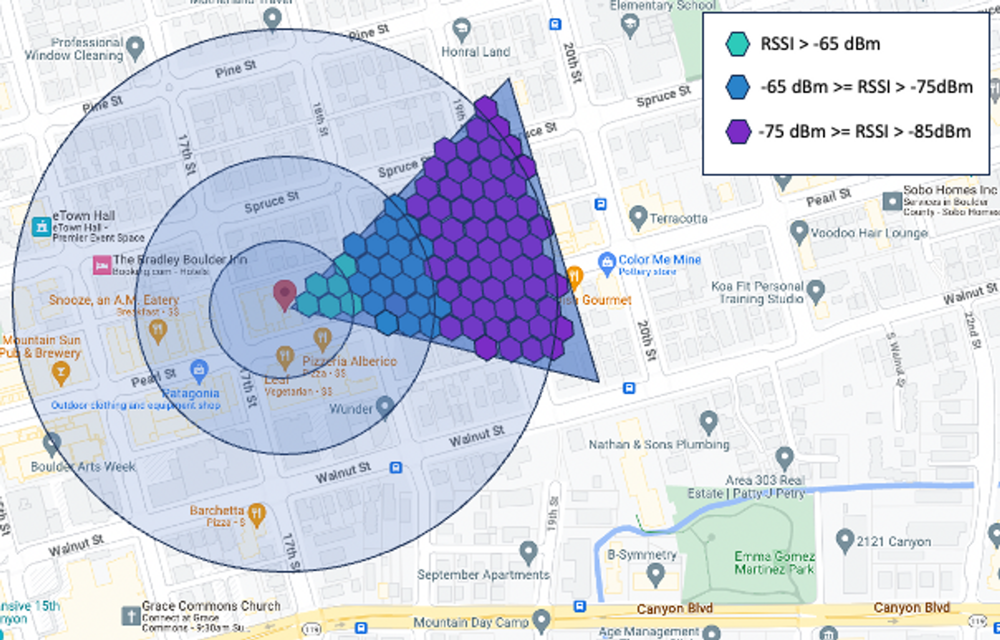

# HIP 93: Addition of Wi-Fi Access Points to the Helium Mobile SubDAO

- Author(s): [@italiandude](https://github.com/mario-novalabs) (Nova Labs, Inc.)
- Start Date: 2023-07-17
- Category: Economic, Technical
- Original HIP PR: [746](https://github.com/helium/HIP/pull/746)
- Tracking Issue: [754](https://github.com/helium/HIP/issues/754)
- Vote Requirements: veMOBILE Holders

## Summary

This HIP outlines important aspects of adding Wi-Fi access points to the Helium Mobile Network. It describes location verification during onboarding for indoor access points and suggests approaches to continuously verify the locations of such access points.

Additionally, the HIP proposes an algorithm and reward structure for Wi-Fi access points similar to what is defined in [HIP-74](https://github.com/helium/HIP/blob/main/0074-mobile-poc-modeled-coverage-rewards.md) but adjusted for the technical specifics of Wi-Fi compared to CBRS radios.

## Motivation

We believe one of the most effective ways to meet the data demand of Service Providers [as defined in HIP53](https://github.com/helium/HIP/blob/main/0053-mobile-dao.md#economics-overview) on the Mobile subDAO is to lower equipment costs and simplify the installation process.
We believe that Wi-Fi access points can help achieve both of those goals.

Wi-Fi access points will belong to the Hotspot category; owners of these devices are classified as Hotspot Owners; Nova Labs is classified as Hotspot Vendor [as defined in HIP53](https://github.com/helium/HIP/blob/main/0053-mobile-dao.md#economics-overview).

Wi-Fi access points qualify as DNP devices as specified in [HIP51](https://github.com/helium/HIP/blob/main/0051-helium-dao.md).

## Stakeholders

All stakeholders are defined in accordance with [HIP53](https://github.com/helium/HIP/blob/main/0053-mobile-dao.md#economics-overview).

- Subscribers would benefit from faster-growing people-powered coverage.
- Service Providers would be able to provide cheaper services and thus acquire more Subscribers by relying on the Helium Mobile Network for offloading data.
- Hotspot Vendors such as Nova Labs will be able to manufacture a new type of equipment and earn MOBILE tokens as outlined in HIP53.
- Hotspot Hosts might see more data traffic as Service Providers bring more Subscribers to the Network. However, the share of PoC rewards per radio would decrease as more access points join the Network.
- Holders of MOBILE tokens would likely benefit from the increased utility of MOBILE attributed to the growth of the Helium Mobile Network.

## Detailed Explanation

### 1.0 Background and Rationale

Wi-Fi is an IEEE standard that has been widely adopted worldwide because it addresses spectrum sharing of unlicensed bands at 2.4GHz, 5GHz, and 6GHz. Wi-Fi is based on Carrier Sense Multiple Access/ Collision Avoidance (CSMA/CA) also known as “listen-before-talk”, which has a direct impact on RF sensitivity thresholds that determines the “coverage” of a Wi-Fi access point. While more recent releases of Wi-Fi have better and improved performance, typical Wi-Fi coverage is characterized by a steep cliff in network performance at the cell edge as opposed to a more gradual performance degradation that 3GPP protocols, like LTE or 5G, deliver.

HIP74 describes the rewards mechanism used for estimating coverage and allocating rewards based on estimated PoC. However, HIP74 defines methods and thresholds that are tailored to CBRS devices and RF sensitivity parameters that are specific to 3GPP protocols (i.e., LTE, 5G). To define a rewards scheme that applies to Wi-Fi, those methods and thresholds must be adjusted to account for the different nature of the protocol.

### 1.1 Assumptions for Wi-Fi Radio Equipment

This HIP has been written with the working assumption that the Wi-Fi access point equipment has been manufactured, tested, and approved in accordance with relevant HIPs issued by the Manufacturer Compliance Committee. The objective of those guidelines is to guarantee the maximum level of trust in the information that is signed and communicated by the access point and to minimize the probability of information tampering. On the other hand, within the scope of this HIP, user equipment Wi-Fi devices are considered to have a lower level of trust with regard to the information they sign and communicate; hence, the need to validate that information with an external source of data that can come from the access points, the network or 3rd party solution providers.

Indoor and Outdoor Wi-Fi access points are standalone devices that include a radio and a gateway and do not require an external gateway for their operation.

### 2.0 Radio Bands Usage in Wi-Fi and PoC

The majority of Wi-Fi access points are capable of transmitting and receiving in two RF bands: 2.4 GHz and 5 GHz. The most recent releases of the protocol (i.e., Wi-Fi6E) allow access points to also transmit on the 6 GHz band while defining some radiating power limitations given the presence of incumbents in some parts of the 6 GHz band.

2.4 GHz has historically been the most used Wi-Fi band. However, it has also become the most congested Wi-Fi band, with only three non-overlapping 20 MHz channels. On the other hand, 5GHz and 6GHz bands can leverage much greater bandwidth, and therefore less congestion, but with the downside of reduced coverage due to the higher frequency.

For the purpose of evaluating coverage, we are going to assume that the access point is using 5GHz as the central frequency because that band will more likely produce the best and most consistent connectivity experience.

Wi-Fi access point must support 5 GHz band. Wi-Fi access point could support 2.4 GHz and 6 GHz. For the purpose of calculation of modeled coverage we will consider the coverage provided by the 5GHz band.

### 3.0 Reward Tiers

In accordance with HIP74, we are proposing to continue using res12 as defined by [H3](https://h3geo.org/docs/core-library/restable/) for hex sizes. Additionally, the HIP proposes a new instance of an algorithm and reward structure for Wi-Fi access points based on what is defined in HIP-74 but adjusted for the technical specifics of Wi-Fi compared to CBRS radios.

Res12 is the building block for evaluating geographical coverage and the scale that it provides to CBRS can be successfully ported to the Wi-Fi 5 GHz band. It’s also important to differentiate between indoor deployments and outdoor deployments because the deployment models are significantly different (antenna patterns, placement, etc.) and they will contribute differently to the Mobile Network.

Similarly to CBRS, a Wi-Fi access point can:

- provide coverage for a hex even if it is not located within that hex; and
- is not restricted from earning rewards by providing coverage in multiple hexes.

Below we will discuss the mechanisms used to estimate how many hexes are covered by a Wi-Fi access point and how those hexes contribute to the rewards earned by that access point.

### 3.1 Indoor Access Points

Indoor access points are devices that are usually not outdoor-rated and they are deployed inside buildings and venues to provide Wi-Fi coverage to Subscribers that are inside those facilities.

#### 3.1.1 Asserting Location

##### 3.1.1.1 Onboarding Location Assertion

Indoor Wi-Fi access points are usually not equipped with a GPS receiver that can be used to establish the location of the access point. This is because GPS has poor outside-in RF penetration and, with the exception of the upcoming Wi-Fi6E protocol called Standard Power, Wi-Fi access points are not required to report their location. Conversely, CBRS radios must talk to a SAS before they can operate in the CBRS band.

In the case of indoor Wi-Fi access points, we are proposing an automatic self-assertion method where the access point owner will be required to be in close proximity to the Wi-Fi access point and to utilize an app in a mobile phone enabled with GPS assisted technology to onboard the Wi-Fi access point into the blockchain.

Mobile phones use Assisted GPS (A-GPS) to determine location. Relying simply on GPS would not be sufficient due to poor penetration of GPS signal inside buildings. A-GPS utilizes a combination of information from the mobile network that the mobile phone is connected to and Wi-Fi database information available to the phone manufacturer to provide accurate location information in almost every condition.

During the onboarding procedure, the app will gather the location from the mobile phone in the background and use that information as the location of the nearby Wi-Fi access point. This self-asserted location will be validated later according to one of the methods described below.

It is important to make sure that the mobile phone running the app is in close proximity to the Wi-Fi access point in order to reduce the probability of deployers misreporting the actual location of the access point deployment. The network could implement several methods (including, but not limited to, latency measurement, RSSI measurement, and physical proof of location, among others) in order to validate the access point’s location asserted by the mobile app. The MCC (Manufacturing Compliance Committee) will review and approve those methods during the hardware audit process.

The onboarding flow description will be reviewed by the MCC and made available by Nova Labs to other vendors.

##### 3.1.1.2 Location validation

After an initial assertion of the location during the onboarding using the app as described above, the system must periodically reassert location. This will prevent situations in which the Wi-Fi access point is onboarded in one location and then moved into a different location. The periodicity used by the system will be subject to review and approval by the MCC during audit of the access point.

There are multiple and possibly concurrent ways to implement subsequent location validation:

1. The network can leverage 3rd_party location services (e.g., Google Cloud Location Services, Skyhook, etc.) to estimate location based on Wi-Fi neighbor scans that will come directly from the access point and will be signed using secure mechanisms (e.g., TrustZone, disk encryption, etc.) as assumed in section 1.1.
2. The network can implement algorithms that leverage inter-access point communication for the purpose of probing the RF environment and gathering statistics that can be used for detecting significant changes in the environment correlated to a change of location.

#### 3.1.2 Modeled Coverage

Given the poor inside-out RF propagation performance of 5GHz Wi-Fi, we are proposing a simplified coverage model where an indoor Wi-Fi access point is only eligible to earn rewards for the hex corresponding to the location asserted during onboarding.

#### 3.1.3 Capping per Hex

We are proposing a maximum of 1 Indoor Wi-Fi access point in one hex for the PoC reward eligibility. In order to establish seniority, we will use the same algorithms for calculation of `coverage_claim_time` described in [HIP74](https://github.com/helium/HIP/blob/main/0074-mobile-poc-modeled-coverage-rewards.md#reward-algorithm). Additional access points will still be able eligible to earn rewards for data transfer activity.

### 3.2 Outdoor Access Points

Outdoor access points are devices that are rated for operating in outdoor conditions with certain operating ranges (usually defined by IP65/IP67 ratings). They are either wall- or pole-mounted, deployed outside buildings or venues, stationary or semi-stationary within those facilities and provide Wi-Fi coverage to Subscribers.

#### 3.2.1 Onboarding Location Assertion and First Installation Setup

All outdoor units will be required to be equipped with a GPS module that will be used to securely assert location during the onboarding process and that will be sent to the blockchain as part of the onboarding process.

To estimate the usefulness and uniqueness of the coverage, the system will require more information regarding the actual deployment. This process will be defined in a subsequent community-driven HIP. In the absence of which the current CBRS CPI process will be used.

#### 3.2.3 Modeled And Templated Coverage

Using the information gathered during the installation process, the Modeled Coverage oracle will estimate the coverage provided by the access point.

How the system calculates the modeled coverage will depend on the type of information available at the geographical placement location.

If obstruction and/or terrain data is available for the deployment location, the system will calculate the estimated coverage using propagation models applied to the data and mark hexes as “covered” when the RSSI is above a certain threshold (-85 dBm).

If obstruction and/or terrain data is not available for the deployment location, the system will use a static templated coverage map to calculate the covered hexes.

##### 3.2.3.1 Templated Coverage Map

If obstruction and/or terrain data is **not available,** we propose a templated coverage map based on a combination of access point and/or antenna assumptions and real-world propagation testing that has been performed at 5GHz.

We are assuming a configuration/antenna pattern with the following characteristics:

- Conducted power: 24dBm
- Max Antenna Gain: 5dBi
- Antenna Height: 8m (AGL)
- Adjusted Horizontal Beam: 60 degrees (urban propagation scenario limits the effective beam width of the antenna due to building obstructions, shadowing, etc.). We are making the assumption that an original, wider beam typical of Wi-Fi access points will be limited by the presence of buildings.

The figure below shows the proposed templated coverage map and estimated RSSI levels in a typical urban propagation scenario.

#### 3.2.4 Capping per Hex

We are proposing a maximum of 3 Outdoor Wi-Fi access point in one hex for the PoC reward eligibility. In order to establish seniority, we will use the same algorithms for calculation of `coverage_claim_time` described in [HIP74](https://github.com/helium/HIP/blob/main/0074-mobile-poc-modeled-coverage-rewards.md#reward-algorithm). Additional access points will still be eligible to earn rewards for data transfer activity.

### 3.3 Coverage Events

We propose using “mapping coverage events” as one of the mechanisms to validate the location of the Wi-Fi access point itself. A mapping validation event is an event where a Service Provider confirms that at least one or more mapping event has been witnessed in the coverage of a Wi-Fi access point. Those events will be carried on by spot mappers and phone-based mapper and will validate the coverage provided by the access point.

### 3.4 Rewards calculation

We propose using the same heartbeat and speed test multipliers used with the Mobile Genesis approach. We are also introducing a location trust score that will act as a multiplier to the total amount of potential coverage points that an access point can earn. In that sense we are modifying the formula for rewards calculation defined in HIP74, as follows:

$$
W = k_H \times k_S \times k_T \times C_E \times W_p
$$

| Variable | Description                      |
| -------- | -------------------------------- |
| $W$      | Total rewards earned             |
| $k_H$    | Heartbeat multiplier             |
| $k_S$    | Speedtest multiplier             |
| $k_T$    | Location Trust score multiplier  |
| $C_E$    | Estimated coverage points        |
| $W_p$    | Epoch rewards per coverage point |

Finally, given the nature of 5GHz band propagation and the shared spectrum nature of the Wi-Fi standard, we are proposing different thresholds for assigning estimated coverage points.

#### 3.4.1 Indoor Access Points Rewards

We are proposing rewarding indoor Wi-Fi access points with a maximum of 400 coverage points within the hex that they have been assigned to during onboarding.

In addition to the estimated coverage points, heartbeat and speed test multipliers defined in HIP74 we are using the values of the location trust score multiplier for indoor access points, as follows:

- 0.25 - the device has successfully self-asserted its location via the mobile app
- 0.75 - the device has successfully self-asserted its location via the mobile app and the location has been successfully validated by the network using a 3rd party service as described in section 3.1.1.2
- 1.00 - the device has successfully self-asserted its location via the mobile app, the location has been successfully validated by the network, and at least one mapping validation event on the access point has been successfully registered in the past 7 days.

In order for the Wi-Fi access point to be eligible for boosted hex rewards as described in [HIP84](https://github.com/helium/HIP/blob/main/0084-service-provider-hex-boosting.md) the location trust score needs to be 0.75 or higher.

Note that until mappers are launched, there will be only two possible trust scores:

- 0.25 - the device has successfully self-asserted its location via the mobile app
- 1.00 - the device has successfully self-asserted its location via the mobile app and the location has been successfully validated by the network using a 3rd party service as described in section 3.1.1.2.

#### 3.4.2 Outdoor Access Points Rewards

Given the nature of 5GHz band propagation and the shared spectrum nature of the Wi-Fi standard, we are proposing calculating MOBILE rewards based on a table similar to that used in HIP74:

|                               | Tier 1           | Tier 2                       | Tier 3                       | Tier 4             |
| ----------------------------- | ---------------- | ---------------------------- | ---------------------------- | ------------------ |
| **Potential RSSI**            | $RSSI > -65 dBm$ | $-65 dBm \ge RSSI > -75 dBm$ | $-75 dBm \ge RSSI > -85 dBm$ | $RSSI \le -85 dBm$ |
| **Potential Signal Level**    | High             | Medium                       | Low                          | None               |
| **Estimated Coverage Points** | 16               | 8                            | 4                            | 0                  |

**Table 1.** Potential received signal strength indicator (RSSI), corresponding signal level, and estimated coverage points for
Outdoor Radios.

The actual number of earned coverage points will be calculated based on:

1. Modeled coverage, if obstruction and/or terrain data is available (similar to HIP74). In this case, the total amount of coverage points will be based on the model and will vary by location.

2. Templated coverage, if obstruction and/or terrain data is not available. Based on the template set forth in section 3.2.3.1, the total amount of coverage points assigned to a templated coverage would be 500 (i.e., 6 Hexes@Tier 1 - 21 Hexes@Tier 2 - 59 Hexes@Tier 3).

The values of the location trust score multiplier for outdoor access points are as follows:

- 0.75 - the device has successfully self-asserted its location via internal GPS
- 1.00 - the device has successfully self-asserted its location via internal GPS and at least one mapping validation event on the access point has been successfully registered in the past 7 days.

Note, that until mappers are launched, the trust score will be 1.00 when the device has successfully self-asserted its location via internal GPS.

### 3.5 Rewards calculation prior to launch of HIP-74

Prior to the launch of HIP-74, we propose that Wi-FI access points will be rewarded according to the currently implemented PoC algorithm for CBRS radios based on the heartbeat requirements, speed test, and radio reward scaling, adjusted to add the location trust score multiplier (3.4.1, 3.4.2) specifically for Wi-Fi.
Speed test tiers and heartbeat requirements will be the same as the ones for CBRS radios. More info about heartbeat and speed test requirements can be found [here](https://docs.helium.com/mobile/proof-of-coverage/#uptime-heartbeats).
Following the 40% scaling factor compared to CBRS that we are proposing in 3.4.1 (400 pts vs 1000 points) for HIP-74 coverage points, we propose a 0.4 radio reward scaling for Wi-Fi indoor and 1.0 radio reward scaling for outdoor Wi-Fi access points. More info about reward scaling tiers in the section ”Small Cell Radio Reward Scaling” [here](https://deploy-preview-985--helium-docs.netlify.app/5g-on-helium/mining-5g/).

For reference, the updated model radio rewards scaling will be:

| Device Type             | Reward Weight |
| ----------------------- | :-----------: |
| High Power CBRS Outdoor |    `4.000`    |
| CBRS Outdoor            |    `2.500`    |
| CBRS Indoor             |    `1.000`    |
| Wi-Fi Outdoor           |    `1.000`    |
| Wi-Fi Indoor            |    `0.400`    |

Please also note that prior to HIP-74 launch the cap described 3.1.3 and 3.2.4 cannot be enforced because the establishment of seniority is part of the HIP-74 implementation.

After the implementation of HIP-74 rewards scheme described in this section will be ceased, and rewards will be allocated following the scheme described in 3.1 and 3.2

## Drawbacks

Addition of new device type will increase the complexity of Mobile Network as it requires support of the infrastructure, ecosystem of apps, and extension of the Proof-of-Coverage algorithm.

## Rationale and Alternatives

The alternative is to continue to rely on the addition of new CBRS radio deployments for the expansion of the Helium Mobile Network. This approach is viable but will require more time to build nationwide coverage due to the cost of CBRS radios and the complexity of their installations.

## Unresolved Questions

Wi-Fi devices are expected to retail for significantly less than CBRS, which makes the $40 onboarding fee currently adopted for CBRS radios prohibitively high. The onboarding fee will be defined by subsequent HIP, in absence of which the onboarding and location assertions fee will be set to $0.

## Deployment Impact

Many network components and third-party apps will need to be updated to support this HIP. This is not an exhaustive list but rather a minimum checklist that needs to be implemented:

- Solana smart contracts will need to be updated to support onboarding and rewarding of Wi-Fi access points;
- Mobile Oracle will need to be updated to support the proposed rewards algorithm;
- Dev docs will need to be updated with technical details about Wi-Fi access points and the applicable reward algorithm;
- Helium Mobile app will need to be updated to support the onboarding of Wi-Fi access points;
- Helium Mobile Coverage Planner will need to be updated to support visualization of Wi-Fi access point coverage and planning of Wi-Fi deployments; and
- Helium Mobile Hotspot Dashboard will need to be updated to support diagnostics, basic troubleshooting actions for Wi-Fi access points, and registration with Wi-Fi Professional Installer for outdoor access points.

The Helium Foundation will validate the Hotspot Vendors to ensure viability of the Network. Specifically they will attest to the Network that Hotspot Vendors have the technical competencies and business processes to correctly support the Network including but not limited to Hotspot Owners and Service Providers. The MCC will review the deployment impact and coordinate with Hotspot Vendors to ensure that new Hotspot Vendors can be successfully enabled to manufacture and deploy devices into the Mobile Network. The Helium Community will review the information disclosed by the Hotspot Vendors to the MCC including but not limited to architecture diagrams and security assessments of the devices. The MCC will reserve the right to not publicly disclose material that can be used to attack and threaten the Network.

## Success Metrics

- Increase of the total area covered by Helium Mobile Network due to deployments of Wi-Fi access points;
- Increased speed of growth of Network coverage (as compared to historical growth attributed to the deployments of CBRS radios); and
- Increase in the amount of data being offloaded to the Helium Mobile Network.
