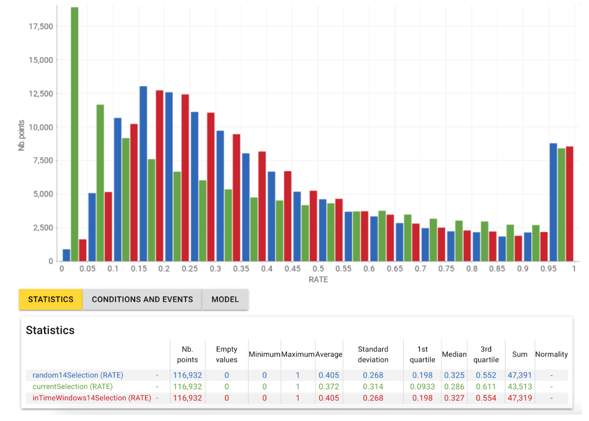
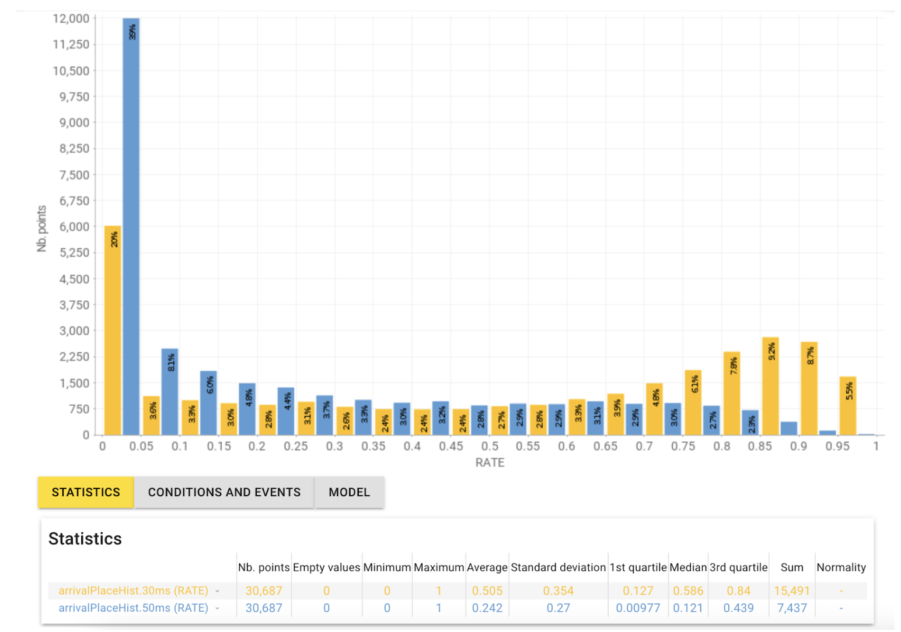
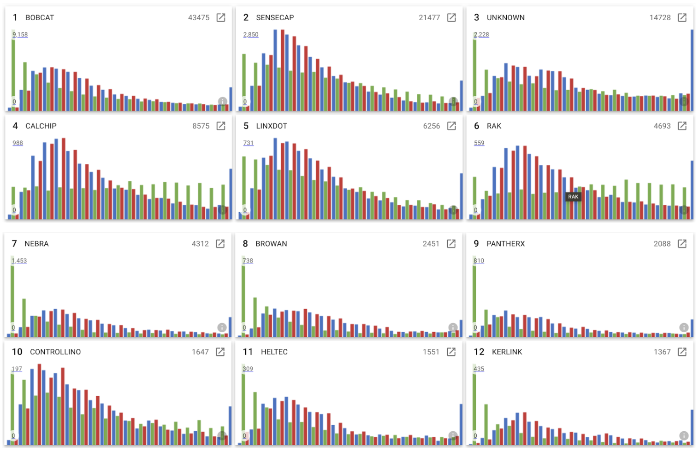
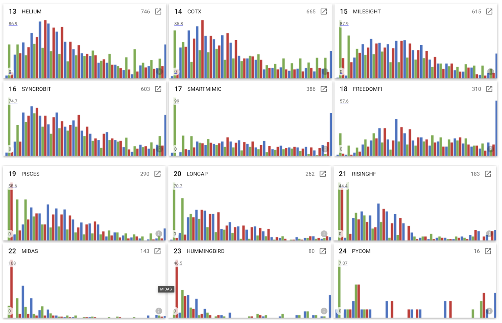
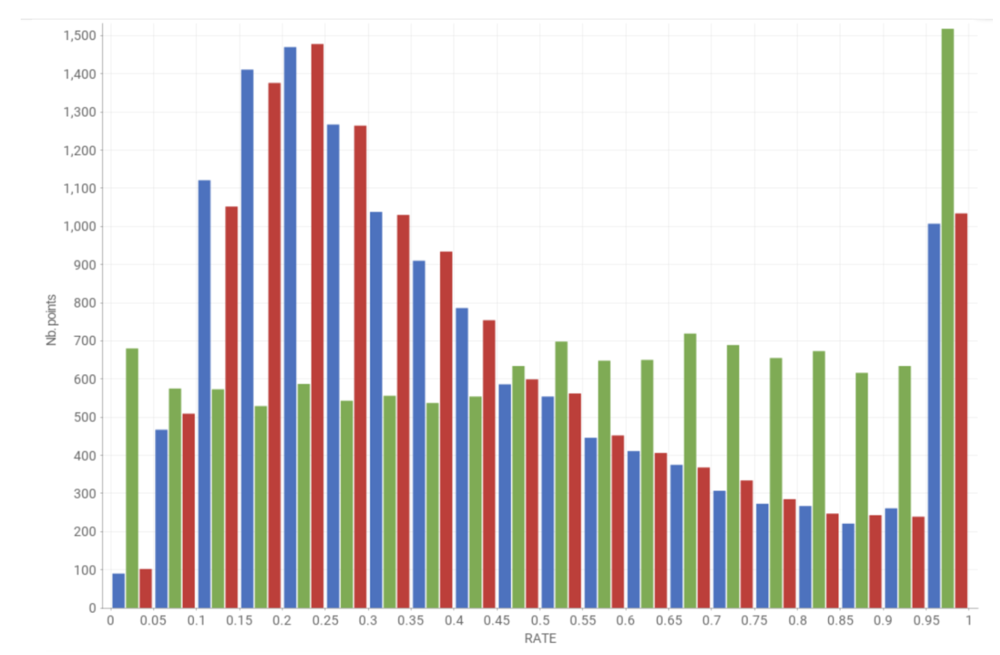
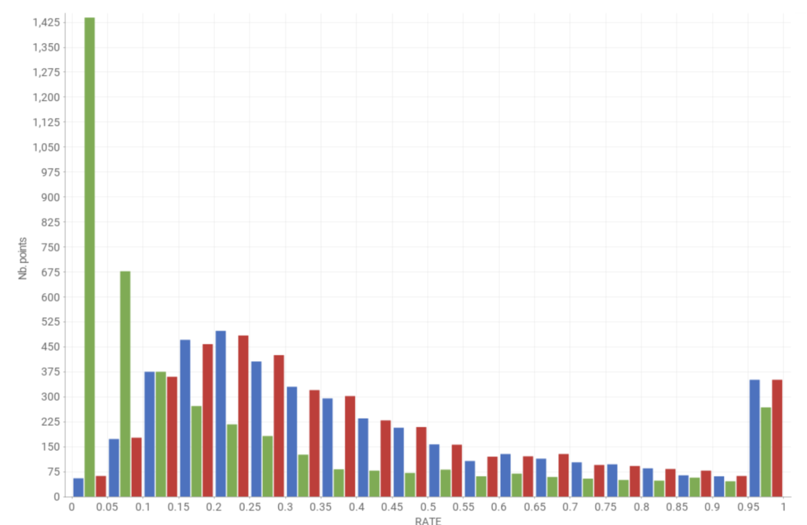
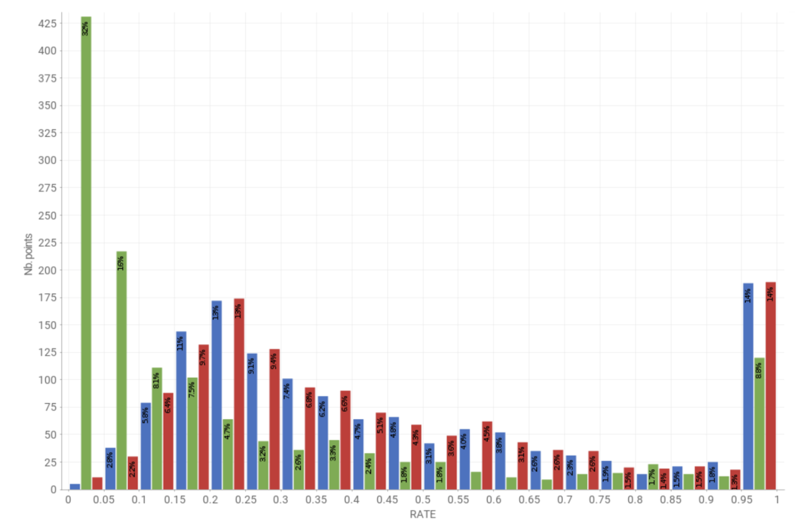
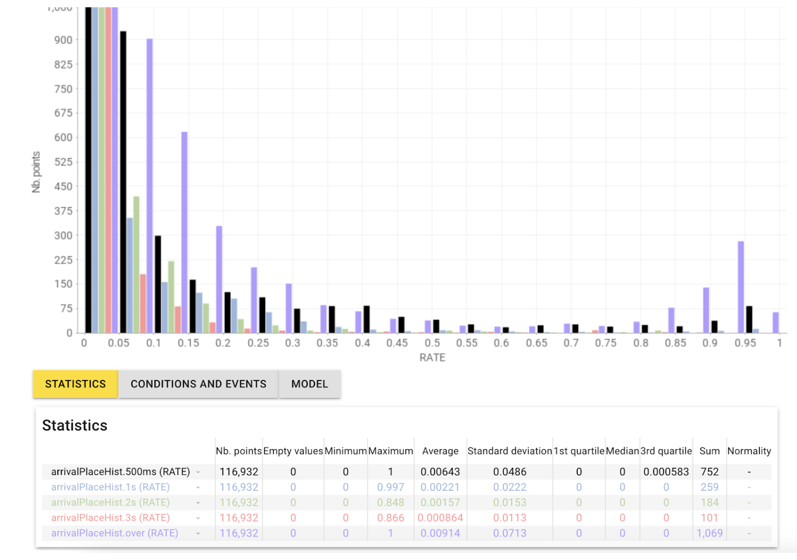

# HIP 94: Response Time Windows for Witness Rewarding

- Author(s): [@disk91](https://github.com/disk91), [@jmarcelino](https://github.com/jmarcelino)
- Start Date: 2023-07-20
- Category: Economic, Technical
- Original HIP PR: [#749](https://github.com/helium/HIP/pull/749)
- Tracking issue: [#764](https://github.com/helium/HIP/issues/764)
- Voting Requirements: veIOT Holders

# Summary

Currently, the reward system in place selects the first 14 hotspots that received a Beacon. This system was implemented with HIP-83 and replaced the previous system, which randomly chose 14 hotspots among all those that received the Beacon. The system prior to HIP-83 was egalitarian, but it was criticized for favoring hotspots whose response time could be too long to be involved in data transmission, which is the primary objective of the Helium network.

Packet reception is indeed based on the following principle: the first packets received are transmitted by the HPR (Helium Packet Router) to the LNS (LoRa Network Server), which then acquires them. This is within the limit of the number of packets the LNS chooses to acquire, as defined in the max_copies parameter of its route. The packets are acquired without a time limit on the HPR side (effectively 30 minutes) and, generally, within several hundred milliseconds by the LNS. The LNS must adhere to time constraints, in the case of an uplink with acknowledgment or a downlink of 1 or 2 seconds, to comply with the LoRaWAN standard.

When connecting a device (OTAA), the number of packets acquired can be maximized to enhance the possibility of connecting within a timeframe of 5 to 6 seconds, again according to the LoRaWAN specification.

For use cases such as object triangulation, a scenario in which Helium's density presents a distinguishing advantage, it is beneficial to maximize the number of packets purchased within the LNS's reception window. 

A regional LNS would benefit from using windows of about 300 to 700 ms to maximize packet reception without disturbing its capacity to respond within the time constraints imposed by the protocol. A global LNS generally uses a window of 200 to 300 ms for packet reception, allowing time for packets to reach and return from and to a distant area.

Therefore, after several months of rewards based on response speed to Beacons, it is now time to assess if the current system meets the reason for its implementation and whether there might be a more suitable solution that is closer to the expected goal of offering rewards linked to coverage and the ability to transfer useful data on the network.

This HIP-94 aims to propose an alternative solution to HIP-83, offering to distribute rewards randomly to 14 hotspots that have received a Beacon and responded within a given time window in cases where more than 14 hotspots have responded, and up to an extended time-windows when fewer than 14 hotspots have responded.

# Motivation

- Analyzing the selection rate of hotspots under different systems, we observe that the current system excludes a large number of hotspots. The chart below is interpreted as follows:
  - In blue, the random selection of 14 participants in a Proof of Coverage (POC) is represented.
  - In green, the current system of selecting the 14 fastest participants is shown.
  - In red, the proposed system is depicted, which selects 14 participants who responded within a 200ms window.

  For all the analyses that follow, 116,932 hotspots from all zones, having participated in at least 10 POCs, were analyzed over a period of 15 days. The following chart indicates the number of hotspots whose selection rate is 100% (1 on the right), from hotspots that are selected in every POC they participate in, to those selected 0%, meaning never, even though they participate.

  

  We observe that the current system more frequently selects a portion of the hotspots, with more hotspots selected in the 95% to 60% selection rate zone. This system shows a huge difference compared to others by having a very large share of hotspots very infrequently selected, despite participating in POCs, with about 20% of hotspots being selected less than 10% of the time they participate.

  The random and window-based reception systems are quite similar, implying that the majority of hotspots respond within an acceptable time for packet processing on the network. There is a slight peak in the 0-5% zone, indicating the elimination of certain hotspots that do not meet the requirements. 

- A more detailed analysis of hotspots that are selected at a rate lower than 10% shows that their response time is predominantly acceptable for a LoRaWAN network. Only 20% of them never respond within 30ms, and 52% respond within 30ms at least half of the time.

   

  To delve deeper, we can analyze the rate of response times over 250ms in this cohort and observe that very few of these hotspots have a response time in this range. 25000+ hotspots on 30000+ total hotspot are never in this range of response time. This supports the analysis that the majority respond within an acceptable time, which is also illustrated by the first figure indicating a small difference between selection within the 200ms window and random selection without a time limit.

  

  This analysis suggests that while the current system of selecting the fastest hotspots might exclude some that are capable of adequate performance, the majority of the hotspots, even those selected less frequently, still manage to respond within a reasonable time frame for LoRaWAN network operations. This finding points to the potential effectiveness of a more inclusive selection criterion, such as the proposed 200ms window, which could better balance the need for timely responses with broader hotspot participation.

- When analyzing the impact of the hotspot brand on the selection rate, it's observed that with the proposed HIP-94, the brand does not influence the selection compared to random selection. (Note: the peak on the right only shows one of the systems, but they are at similar levels). 

  
  

  In contrast, the current system appears to favor certain brands, as indicated by a higher selection rate on the right side of the graph, showing that more hotspots from these brands are selected with a higher frequency. This is particularly true for brands like RAK, CALCHIP, (similar ones), Senscap to a lesser extent (due to the mix of full and light hotspots), and COTX. A common characteristic of these brands is the use of faster hardware (like RPI4). Here you see the detail of Calchip + RAK hotspot selection rate:

   
  
  Conversely, brands like NEBRA or Kerlink, which utilize slower hardware, are seen to have lower selection rates and are more frequently not selected. As illustrated by Nebra:

   

  And Kerlink:

   

  This observation suggests that the current system might inadvertently favor hotspots with faster hardware, leading to an unequal playing field for different brands. Brands with slower hardware are disadvantaged in the selection process, potentially impacting the overall inclusiveness and diversity of the network. The proposed HIP-94, by not being influenced by the brand, could offer a more balanced and equitable approach to hotspot selection, allowing a wider range of hardware to participate effectively in the network.

- The current system does not prevent rewarding slow hotspots that do not meet the expectations of a LoRaWAN network. As illustrated in the graph mentioned, a small portion of the hotspots, 500 out of 116,000 in the panel, are rewarded with a 35%+ selection rate, even though their response time is predominantly (between 85% and 100% of the time) beyond 3 seconds. HIP-94  excludes such hotspots from rewarding.

     

# Stakeholders

This HIP potentially affects the earnings of all hotspot owners: It positively benefits hotspot owners negatively affected by HIP-83, whose hotspots due to configuration or vendor are the slowest to respond and received less witness rewards.
It negatively affects hotspot owners positively affected by HIP-83, whose hotspots due to being the fastest to respond always got selected for witness rewards.
It positively affects hotspot vendor designs that were slower than other hotspot vendor designs but still within LoRaWAN specifications.
Nova Labs is the entity requested to implement the changes in the HIP.

# Rationale and Alternatives

This HIP proposes to select a valid witness from the ones arriving in a time window of MAX_WITNESS_WAIT_WINDOW_MS starting
from the first received witness by the Oracle.

The MAX_WITNESS_WAIT_WINDOWS_MS parameter will be initially set to 200ms (0.2 seconds).
It could be later adjusted from 100ms to 300ms by Helium Foundation to optimize the network quality without a need for a new vote. The purpose of this adjustment is to push hardware manufacturers to optimize their solutions in a scheduled way. 

When less than **default_max_witnesses_per_poc** Witnesses (Currently 14) have been received within the MAX_WITNESS_WAIT_WINDOWS_MS, the Oracle accepts Witnesses up to EXTENDED_WITNESS_WAIT_WINDOWS_MS, fixed at 500ms, the acceptable wait time for RX1 windows for regional traffic. This will allow slower responding hotspots to be accepted in the low density areas when in high density the constraint is stronger. The current situation, with HIP-83, is accepting witness without limit of time in a such case, even if the time makes no LoRaWAN downlink & join possible.

This means:

1. Different hotspots receive a beacon and send the witness information to the related Oracle
2. The Oracle receives the first witness notification and opens a witness reception window for MAX_WITNESS_WAIT_WINDOWS_MS
   milliseconds. Witness is marked Valid.
3. The Oracle receives the next witnesses during the MAX_WITNESS_WAIT_WINDOWS_MS ms and mark them Valid.
4. When **default_max_witnesses_per_poc** or more have been received, it marks the other as Invalid
5. When MAX_WITNESS_WAIT_WINDOWS_MS is over and less than **default_max_witnesses_per_poc** received, Oracle marks the first received as selected and waits until **default_max_witnesses_per_poc** or EXTENDED_WITNESS_WAIT_WINDOWS_MS, mark them as valid, then the others invalid.
6. The Oracle selects all the **selected** witnesses and allocates rewards to the number of hotspots defined in **default_max_witnesses_per_poc** by selecting randomly from the ones marked as valid.

### Example 1

8 witnesses received:

- 4 within MAX_WITNESS_WAIT_WINDOWS_MS 200ms
- 3 within EXTENDED_WITNESS_WAIT_WINDOWS_MS 200-500ms
- 1 outside EXTENDED_WITNESS_WAIT_WINDOWS_MS 500ms

The first 4 are marked as SELECTED, the 3 next are marked as VALID, the last one is marked as INVALID. Oracle rewards all the one marked as SELECTED, it can select 10 more randomly as part of the ones marked as VALID, so it reward all of them. The last one is not rewarded. Assuming **default_max_witnesses_per_poc** is 14

### Example 2

25 witnesses received:

- 20 within MAX_WITNESS_WAIT_WINDOWS_MS 200ms
- 4 within EXTENDED_WITNESS_WAIT_WINDOWS_MS 200-500ms
- 1 outside EXTENDED_WITNESS_WAIT_WINDOWS_MS 500ms

Only the first 20 within MAX_WITNESS_WAIT_WINDOWS_MS will be selected and marked as VALID, all the others are INVALID and won't be part of the reward calculation. The Oracle will randomly select 14 of the 20 VALID witness and reward them. Assuming **default_max_witnesses_per_poc** is 14

### Example 3

25 witnesses received:

- 10 within MAX_WITNESS_WAIT_WINDOWS_MS 200ms
- 8 within EXTENDED_WITNESS_WAIT_WINDOWS_MS 200-500ms
- 7 outside EXTENDED_WITNESS_WAIT_WINDOWS_MS 500ms

The first 10 are marked as SELECTED, the next 8 are marked as VALID, the 7 others are marked as INVALID. Oracle will reward all the SELECTED, then will randomly choose 6 (14-8) of the 8 witnesses marked as VALID and reward them. Assuming **default_max_witnesses_per_poc** is 14

# Deployment Impact

Oracle PoC rewarding code needs to be modified to take this into consideration. Deployment is global, Hotspots are not impacted.
The Oracle PoC code update will impact the Nova team for deployment, the Author of this HIP is not attaching any code.

# Success Metrics

- The distribution of rewards is no longer a function of the hotspot manufacturer design
- The average response time to witness is improved over time

# Appendix

## Packet Processing and LoRaWan time constraints

The Helium Packet Router (HPR) is accepting all the coming packets up to the limit of the max_copies set on the route or eui in the config service. First come, first paid. Only for roaming the HPR is applying a time limit. 
According to Nova labs response, Helium packets, first arriving is opening a packet session for collecting the copies of it, during the session, all the packets up to max_copies are accepted and transmitted to LNS, after max_copies packets all are discarded. On every 30 minutes the session having an age higher than 30 minutes are closed. This means, a packet can be accepted up to 30 to 60 minutes after being emitted at HPR level.

The time limit for accepting packets as a single group of copies is decided by the LNS after the HPR. This time limit for the LNS is a LNS setup and can vary for each of the LNS. A LNS operating a local fleet will prefer a larger time windows to collect more copies, 300-700ms are viable configurations, global LNS will prefer a shorter time windows, 200-300ms are viable.

LoRaWAN time constraints are the following:

- UPLINK first copy arrival has no time constraint, next copies are withing the defined LNS deduplication time windows.
- JOIN REQUEST needs to be responded within 5 seconds for RX1 (same frequency, standard power) or 6 seconds for RX2 (other frequency, potentially higher power). LNS decides of the selection between RX1 and RX2 dynamically, according to the time available.
- DOWNLINK REQUEST / ACK needs to be responded within 1 seconds for RX1 (same frequency, standard power) or 2 seconds for RX2 (other frequency, potentially higher power). LNS decides of the selection between RX1 and RX2 dynamically, according to the time available.

There is no reasons to prefer RX1 vs RX2, most of the implementations try to reach RX1 first, but RX2 provides different advantages, in particular in Europe where the duty cycle on RX2 is better and the higher power makes more chance to reach the device. It also reduces the limited bandwidth usage on the 8 available channels and the risk of collision on these busy channels. Device power impact can be considered higher on RX2 but with a lower risk of collision and reception loss, practically speaking, this assumption is not always true. Selection between RX1 / RX2 is not a question in regard of this HIP. This is informative to
understand that nothing bad in using one vs the other, both have advantages.

Basically, only the DOWNLINK REQ / ACK creates generate a time constraint at the timescale discussed in this HIP. This time constraint is to make sure that the order to send the ACK or the DOWNLINK transfer order comes to the desired Hotspot before the RX2 windows end.

## MCU hardware performance comparison

| Hotspot    | Motherboard | CPU/MCU         | Clock   | Cores |
| ---------- | ----------- | --------------- | ------- | ----- | 
| Nebra...   | RPI CM3     | BCM2837B0       | 1400MHz | 4     |
| Rak...     | RPI 4       | BCM2711         | 1500MHz | 4     |
| Kerlink    | Custom      | MCIMX6X1CVO08AB | 800MHz  | 1     |
| Senscap M2 | Mediatek    | MT7628          | 580MHz  | 1     |

## Data used for statistics

The statistics shared in this HIP are from computations made from the following project:
- [hip 94 stat source code](https://github.com/disk91/hip94)
- [individual data can be consulted here](http://hip94.disk91.com:8080)