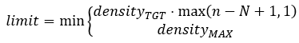
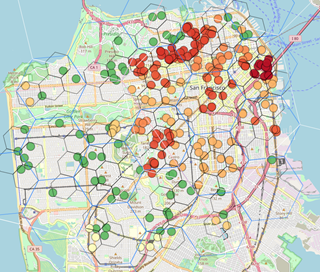
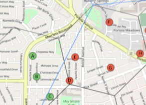

# Hex Density Based Transmit Reward Scaling

- Author(s): <!-- your GitHub @username -->
- Start Date: <!-- fill me in with today's date, YYYY-MM-DD -->
- Category: <!-- economic, technical, meta -->
- Original HIP PR: <!-- leave this empty; maintainer will fill in ID of this pull request -->
- Tracking Issue: <!-- leave this empty; maintainer will create a discussion issue -->

# Summary
[summary]: #summary

# Motivation
[motivation]: #motivation
Rewards are dominated by PoC activity (challenge and witness) with the growth of interest in Helium and the number of hotspots coming online, it’s important that rewards encourage “optimal” hotpsot deployment and density.  The current PoC, which rewards all challenge hops equally and targets hotspots roughly uniformly, does not account for density.  For example, you could have 5 hotspots in unique locations all >300m apart and able to do a PoC path.  This is healthy, but someone could place multiple hotspots at each of these locations and they will, multiply their earnings.

The two topologies shown above cover an equal area with coverage.  The topology on the right will have each hex targeted 20 times as often as the topology on the left and earn around 20 times the reward.  This is undesirable behavior as the increased reward is not going to providing any meaningful increase in coverage.

You can also see some dense urban areas such as SF and NYC have a very high density of hotspots.  These areas may be over-saturated and if not, will likely reach over saturation with the number of hotspots coming online and hotspot-based reward targeting overly benefiting dense areas.

# Stakeholders
[stakeholders]: #stakeholders

* Who is affected by this HIP?

* How are we soliciting feedback on this HIP from these stakeholders? Note that
  they may not be watching the HIPs repository or even aren't directly active in
  the Helium Community Slack channels.

# Detailed Explanation
[detailed-explanation]: #detailed-explanation

## Definitions:
To better describe the proposal, I will introduce some terms and variable names.
Note these may be formatted differently in formulas:

**Density_tgt**: Target number of hotspots in target hex resolution (example = 1).  Density in a target resolution hex will be clipped at this number unless certain conditions are met.  This would be a chain variable.
This could also be an array of target density for each resolution hex for finer tuning.

**Density_max**: maximum number of hotspots to consider for target resolution any density beyond this will be clipped under any conditions.  (Example= 4) This would be a chain variable.
This could also be an array of maximum density for each resolution hex for finer tuning.

**R**: H3 resolution for target density (Example = 8).  This would be a chain variable.
This could also be an array of hex resolutions corresponding to each entry in density target and max chain variable lists.

**N**: number of sibling hex’s that must meet Tgt_density before clipping will be raised above **Density_tgt**. (Example =2).  This would be a chain variable.

**Interactive Hotspot**: an active hotspot that has also recently had a transmission witnessed.  Lone wolves are active but not interactive.

**Occupied Hex**: hex where at least one interactive_hotspot is present.  This can apply to any resolution of interest.  It also implies that if we know a certain hex is occupied, all parents of that hex up to resolution 0 are also occupied.

**Hex Whitelist**: a list of hex’s that are eligible for rewards, these could be specified at any level but in general should be as low a resolution (largest area) as possible.  If this feature is not desired, you can assume all resolution 0 hexs are in the whitelist.  This would be a chain variable. 

## Algorithm

The goal if this algorithm is to limit density to a specific target while being flexible enough to reward areas that require density above this target.  For example, nation capitals or other dense urban areas.  It should also be flexible enough to recognize there are many areas that would require localized density to be best served (non-capital cities, college towns, tech centers, etc).

A brief summary is that rewards for transmitting hotspots and witnesses to transmitting hotspots will be scaled up or down based on hex density (and all parent hex densities) relative to target.  In general hotspots in overly dense areas will have a scale factor < 1 while hotspots in less dense areas will have a scaling factor > 1.  For this proposal to be effective each hotspot should be targeted uniformly randomly over a desired interval, much like initial hop targeting for PoC is done today.

### Getting interactive and losing interactive status

There are many conditions that can be placed on hotspots before they are classified as “interactive”.  As a minimum they need to have an assert_location transaction and must be able to transmit with valid witnesses (300m+ distance, valid metadata, etc).  

A hotspot should lose the status of interactive if its transmissions no longer have valid witness(es).  This can be a count of unwitnessed transmission or a period of blocks where the most recent witness must be within that range of blocks (something like 10 times the expected transmission period).

When a hotspot is not “interactive” it will still be targeted for transmitting but it will not contribute to hex densities and the reward scaling factor will be 0.0 meaning no reward is given for transmitting.  Note hotspots will still be motivated to transmit when challenged in order to discover witnesses and gain “interactive” status.

### Determine Hex Densities
The following describes the process to determine hex densities and how to calculate the limits to hex densities based on the proposed chain variables.

#### Limiting Density
In order to control density, the density of each hex is clipped at Density_tgt unless certain criteria are met which would allow density to increase up to Density_max.  Density limit can be raised if a certain number of neighboring hexs are also occupied by at least density_tgt hotspots.  Note there are 7 “neighbor” hexs (6 + reference hex in center).

The density limit follows the following criteria:

|  |    |
|---:|:---|
|  **Occupied Count** |   |
| **Hex Density Limit** |    |
|   |

Example thresholds for N=2, Density_tgt = 1

|  n  | 0  | 1  |  2 |  3 | 4  | 5  | 6  |  7 |
|---:|:---:|:---:|:---:|:---:|:---:|:---:|:---:|:---:|
|  limit % of Density_tgt | 100%  | 100%  |  100% | 200%  | 300%  | 400%  | 400%  | 400%  |

Example Topologies, assume we are looking at R=8, N=2, Density_tgt=1, Density_max=4.

| Example 1  | Example 2  | Example 3  | Example 4  |
|:---:|:---:|:---:|:---:|
|   |   |   |   |
| parent density=1  | parent density=2  | parent density=5  | parent density=7, 14, 16  |

**Example 1**: there is one occupied hex that has 5 interactive hotspots in it.  Since this is the only occupied hex among its children, its count is limited to Density_tgt which is 1.  

**Example 2**: There are two occupied hexs this is equal to N meaning we are at the threshold of our density limit.  Still, because we do not exceed N, each hex is still limited to Density_tgt.  

**Example 3**: There are now 3 occupied hexs meaning the occupied count is above N.  The new threshold is 200% 
Densty_tgt.  This raises the clipping limit to 2 meaning the total density of the parent jumps from 2 to 5.

**Example 4**: There are now 7 occupied hexs.  Since the Density_max is set to 4 times target density, the new threshold is  Density_max or 4 even though the parent occupancy is 5 hexs above N.  We can also see how such a dense parent is affected by its siblings in the same manner, if the siblings of the parent are not sufficiently occupied then the density of the parent is clipped. 

#### Determing Transmit Reward Scaling for a Hotspot
A lookup table including clipped and raw hex densities for each occupied hex will need to be built by the consensus group once per epoch or at whatever rate deemed necessary.
To determine the reward scaling for a given hotspot, iterate through lower and lower resolution hexs taking a product of the clipped / unclipped density per the formula below.

Important note, DexDensity_Unclipped is the unclipped sum of clipped child hexs meaning you clip the children, sum them and set the unclipped hex density.  An example of this operation for a specific hotspot is below:

    8828361563fffff h3res:8 has density clipped/unclipped of   4/ 61, scale reduced: 1.000 to 0.066
    872836156ffffff h3res:7 has density clipped/unclipped of  27/ 27, scale reduced: 0.066 to 0.066
    862836157ffffff h3res:6 has density clipped/unclipped of  49/106, scale reduced: 0.066 to 0.030
    85283617fffffff h3res:5 has density clipped/unclipped of  62/ 62, scale reduced: 0.030 to 0.030
    8428361ffffffff h3res:4 has density clipped/unclipped of 117/117, scale reduced: 0.030 to 0.030
    832836fffffffff h3res:3 has density clipped/unclipped of 136/136, scale reduced: 0.030 to 0.030
    822837fffffffff h3res:2 has density clipped/unclipped of 504/504, scale reduced: 0.030 to 0.030
    81283ffffffffff h3res:1 has density clipped/unclipped of 504/504, scale reduced: 0.030 to 0.030

### What does this look like for existing network?
For this analysis I used the example values for chain variables (N=2, R=8, tgt=1, max=4).

The chart below shows violin plots of the transmit reward scaling for hotspots in larger metro areas or those especially effected by this proposal.

Additionally, I mapped each interactive hotspot and its reward scale as well as drawing all resolution 8 and resolution 9, and 10 occupied hexs to get more detail on how this targeting will affect hotspots.

The interactive map can be found: https://carniverous19.github.io/para1_geohip_USA.html Some screenshots of areas of interest are below.  I draw occupied R resolution hexs (8: black) plus 3 levels of parents (7:blue, 6:white, 5:pink).  The circles represent hotspots and circle colors represent normalized probability with yellow being the average scale factor, green being above average and orange to red being below average.  The map has a lot of content and is not optimized for speed so it may be laggy to view.

| Manhattan, NY  |  San Fransisco, CA  |
|:---:|:---:|
|  |  |

| Modesto, CA  |  Austin, TX  |
|:---:|:---:|
|  |  |

### How Transmit Reward Scaling is Used
Its very important to understand that this is not a reward scaling for ALL rewards a hotspot will receive, it is scaling for a specific transmission and it effects the witnesses and transmitter.
Hotspots with low transmit reward scaling can still be very high earners if they can witness hotspots with high transmit reward scaling.
This will work best when implemented in conjunction with beaconing and a change in reward distribution that gives the bulk of challenge rewards to RF receivers (witnesses) not transmitters.
There is a separate proposal for details of beaconing in [HIP 15](https://github.com/helium/HIP/blob/master/0015-beaconing-rewards.md).

So for each transmit, the transmitting hotspot’s reward will be based on the number of witnesses and then scaled by its own transmit reward scale.  For witnesses, they will receive a portion of reward based on the number of witnesses scaled by the transmitter’s reward scale.  To better describe the relationship two example distributions are shown below:

#### Example 1
The Topology below is taken from real-world transmit scaling factors.  The normalized reward scaling factor for A-C is 1.38 and the normalized reward scaling factor for D-H is 0.31.  For this example, I assume all hotspots can witness all others.  Since hotspots are targeted uniformly, I also assume each hotspot transmits exactly once.  Finally, the rewards earned are assumed to be a (slightly simplified) reward distribution from beaconing above.

| Topology  | Reward Distribution  |
|---|---|
|   |   |

This is an over-simplification of real-word data, but we can see that although D-H have a transmit reward scale of less than ¼ those of A, B, C they only see a 20% reduction in earnings compared to A-C.  This is because they can all witness A-C’s transmissions earning a large chunk of rewards for those witnesses.

#### Example 2
Here we look at a slightly more complex topology.  Same beaconing reward method.  There are 3 sets of hotspots circled, assume transmissions can be heard by everyone in the set(s) the hotpot belongs to.  So for example D and e can witness all hotspots but A can only witness C-E, not F or G.

| Topology  | Reward Distribution  |
|---|---|
|   |   |

Based on this example we can see D and E earn the most even though they have half the transmit reward scaling factor as F and G.  A earns the least but it can only witness hotspots with low reward scaling factor and in proximity.  It is not providing significantly less coverage than D or E and the coverage it is providing is already well saturated.

#### Example 3
There are two topologies from the “motivation” section that show an area with near optimal coverage as well as that same area with 20 times the number of hotspots all covering the same geographic area.  The table on the left below gives an estimate of the rewards when there is only one hotspot per hex and the table on the right when there are 20 hotspots per hex. 

| 1 hotspot per Hex  |  20 hotspots per Hex  |
|:---:|:---:|
|  |  |

We can see that although the per-hex earnings do go up, they only see a 35-65% increase vs 2,000% increase with existing PoC or a PoC reward structure that does not take density into account.  

#### Lessons From Examples
Hopefully these examples demonstrate that transmit reward scaling factor does not fully describe earnings, and the way to increase earnings is to provide coverage to as many hexes (or just general area) as possible, especially hex’s without a large amount of coverage already. 

# Drawbacks
[drawbacks]: #drawbacks

- Why should we *not* do this?

# Rationale and Alternatives
[alternatives]: #rationale-and-alternatives

This is your chance to discuss your proposal in the context of the whole design
space. This is probably the most important section!

- Why is this design the best in the space of possible designs?

- What other designs have been considered and what is the rationale for not
  choosing them?

- What is the impact of not doing this?

# Unresolved Questions
[unresolved]: #unresolved-questions

- What parts of the design do you expect to resolve through the HIP process
  before this gets merged?

- What parts of the design do you expect to resolve through the implementation
  of this feature?

- What related issues do you consider out of scope for this HIP that could be
  addressed in the future independently of the solution that comes out of this
  HIP?

# Deployment Impact
[deployment-impact]: #deployment-impact

Describe how this design will be deployed and any potential imapact it may have on
current users of this project.

- How will current users be impacted?

- How will existing documentation/knowlegebase need to be supported?

- Is this backwards compatible?

        - If not, what is the procedure to migrate?

# Success Metrics
[success-metrics]: #success-metrics

What metrics can be used to measure the success of this design?

- What should we measure to prove a performance increase?

- What should we measure to prove an improvement in stability?

- What should we measure to prove a reduction in complexity?

- What should we measure to prove an acceptance of this by it's users?
