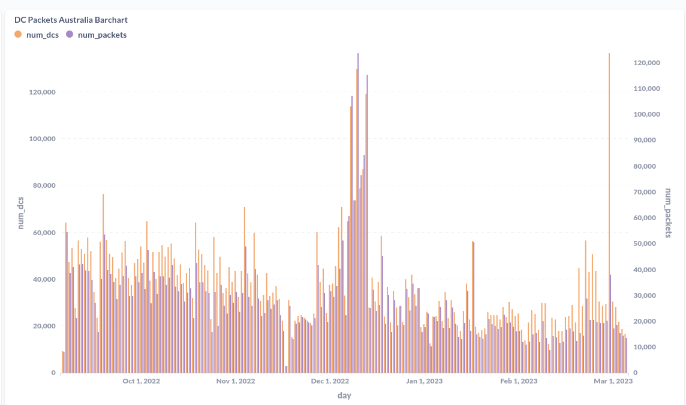
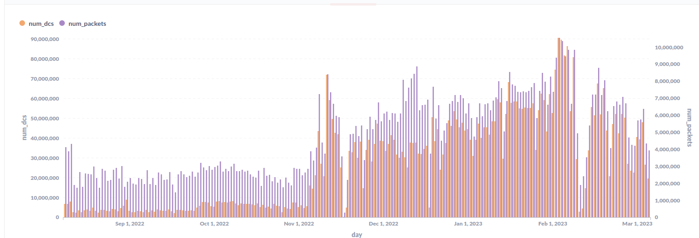

# HIP YZ: Australian Frequency Plan Choice - AU915

- Author(s): [@plainsimpledot](https://github.com/plainsimpledot),
  [@Buckshot22](https://github.com/Buckshot22)(@Jules22), [@mcauser](https://github.com/mcauser),
  [@leogaggl](https://github.com/leogaggl), [@tonysmith55](https://github.com/tonysmith55)
- Start Date: 2023-02-16
- Category: Technical
- Original HIP PR:
- Tracking Issue:
- Status: Daft

## Summary

This Helium Improvement Proposal is designed to allow the deployers of the Helium network in Australia to have a voice in determining the country's preferred frequency plan. The plan proposed by this HIP is AU915.

## Motivation

The LoRaWAN regional channel plan is critical to the operation of a LoRaWAN network. Two different channel plans are available for use in Australia, AU915 and AS923-1. The current Helium network in Australia operates on an AS923-1 channel plan variant. However, the community was not included in the decision-making process for the change in selecting this channel plan from the original AU915.

The reasoning related to a footnote inserted in a LoRa Alliance document by an industry player, which senior members of the Alliance have confirmed in no way reflects the LoRa Alliance's official stance. The LoRa Alliance have made it very clear, and all of their official documentation confirms that they support both AU915 and AS923 in Australia, and the Alliance make no distinction between the two. The LoRa Alliance also confirmed that, at this time, there is no intention to diminish the AU915 frequency plan in the future.

We believe, backed up by expert opinions including senior members of the LoRa Alliance, that the only effective way to support AS923 is to utilise 16-channel gateways, dual-head 8-channel gateways, or allow operators in densely populated areas to voluntarily operate on AS923 in line with the Helium IOT PoC roadmap goal of reducing congestion.

AU915 is better suited to the Australian environment/use cases due to

1. The availability of higher power sensors (as the default configuration)
2. The higher likelihood of roaming opportunities and partnerships in the public AU915 ecosystem is likely to bring more significant benefits than a single commercial operator who has limited use cases and provides coverage in areas where they are utilising sensors.
3. AU915 is currently better suited to regional areas and provides a common market for devices accross public networks in Australia. Given the relatively small size of the market, this is important to ensure growth of the network.

## Stakeholders

1. Every Australian Helium operator.
2. Current Helium device users.
3. Potential Roaming partners.

All of the public network operators and some that are still in the early stages run on the AU915 frequency plans. As well as some private commercial operators.

NNNCo (Actility) were the only operator currently utilising the AS923 channel plan in Australia who were active in this change. However, there has been no increase in data usage since the changes (in fact there has been a significant decrease) so it is unlikely that they are utilising any roaming.

Voting will be 1 vote per hotspot asserted in the Australian continent.

## Detailed Explanation

Technical arguments regarding the AU915/AS923 have yielded no results in the last two years, as experts can point out many advantages and drawbacks in both plans. The debate has not included effects on the common good or the overall public LoRaWAN ecosystem. The final choice has to be made by those affected in the region and aware of the local context.

The primary argument is based on the following economic points:

1. Based on the ETL data below, we can see a significant decrease in data usage in Australia compared to the rest of the world since the move to AS923 (Dual Plan).
2. Any AU915 LoRaWAN device is, by default, shipped with the appropriate settings for the region (TX Power 30dBm), whereas AS923 devices are shipped with the lowest common denominator (TX Power 16dBm). This is because there are already four official variants of AS923 (1 to 4) and Helium is proposing at least two more not officially recognised regional variants.
3. Helium growth in Australia has to be seen as part of the overall LoRaWAN ecosystem. Since all public networks are on AU915 FSB2 the chances of sustained growth are ultimately much higher by collaborating and growing the footprint of LoRaWAN across the continent than by competing over sparse resources in a geographically huge continent. The two commercial players on AS923 have comparatively tiny footprints focused on 3 states.
4. Australia has a vibrant community of dedicated LoRaWAN enthusiasts who were advocating for Helium and actively building the network. Since the change, we have heard from many of the largest builders and evangelists who have left and become disillusioned with Helium.
5. Businesses are moving their deployments away from Helium due to the issues supporting AS923 to other AU915 options. See below for some business impact statements we have received.
6. Australia is in a unique position because it has two valid choices fully supported by the LoRa Alliance. Allowing the Australian community the opportunity to decide on their future will restore a lot of faith in the Helium ecosystem that has been lost over the past six months.

The proposed change is extremely simple in reverting to a known working configuration (AU915 FSB2) utilising a LoRa Alliance-approved frequency plan at up to 30 dBm EIRP which is within the permitted range for Australia.

It is vital for the Community of Helium operators to participate in the decision-making process. The previous lack of Community participation in the decision-making process has led to the need for this proposal. It is essential to recognise that not allowing the Community to participate in the decision-making process may lead to significant risks, such as a lack of community adoption, mistrust, and a loss of community engagement.

Further risks in not switching to AU915 are that the current trend downwards in both operating gateways and data usage will continue to show the dramatic decline it has shown since the deployment of the
'dual plan'

### Australia Usage

### United States Usage

### Worldwide Usage

We have received the following impact statements from businesses who were previously building and promoting Helium solutions in Australia-

1. "Helium Mining PTY LTD, Helium Host PTY LTD and Helium Mining Sydney were running 58 gateways and 45 sensors on the Helium network at the time of the change to the     AS923 'Dual Plan'.
  We still have on hand a further 100 gateways and 300 sensors we had planned to roll out.
  We have currently begun moving these units to alternative networks and plan to move them all to AU915 networks as a result of the change.
  We had two major clients in the late stages of negotiations which we subsequently lost due to the change to AS923.
  We would only be able to continue to utilise the Helium network if it was to reinstate the AU915 frequency plan."

1. "The switch in the Helium Network Australian Regional Frequency Plan from AU915 to AS923 on the 17th of November 2022 had a significant impact on Rural Network PTY LTD's operations, particularly our customer's sensor deployments in the Riverland region. Before the switch, we were in the process of evaluating the expansion of the use of the Helium Network in the region. However, due to the change in the regional frequency plan, the company had to seek out other opportunities to maintain the AU915-focused gateway and sensor deployment.
We run 55 gateways and a large number of sensors. However, due to the nature of our main clients, we cannot disclose numbers.
Sensor deployments include:

     - Pump Monitoring along the River Murray (Water Utility)
     - Bio Security Bins (fruit fly prevention) across the whole Riverland region (Govt. Department)
     - Irrigation (Soil moisture, pressure)
     - Water quality monitoring
     - Biodiversity monitoring (wildlife traps)
     - Greenhouse monitoring
     - Environmental monitoring (rainfall, weather)

    The bulk of the above deployments in our region require the higher powered sensors available under AU915 and have not been sustainable under the AS923 'Dual Plan'.

    In conclusion, the switch from AU915 to AS923 in November presented significant challenges to our operations, directly resulting in significant wasted time, disgruntled clients and loss of goodwill. We were forced to move off the Helium network entirely due to this change. However, we continue to evaluate our options concerning the availability and reliability of IoT networks to support our business model

At the very least the operator/investors in Australia should be presented with the potential benefits of each option and be allowed to make the decision based on what is best for the whole network including growth, reliability and therefore their investments.

Since the Helium Network decided to switch from the AU915 to the AS923-1 regional channel plan in Australia on November 17th, 2022, the landscape of the Internet of Things (IoT) network industry has changed significantly. While the move has caused significant disruption and loss of momentum, for some organizations, it has also led to renewed recognition of the importance of public and emerging networks that have selected the AU915 channel plan.

Furthermore, there is emerging interest from Higher Education Institutions in expanding their pursuits in IoT through seeking LoRa Alliance memberships. These institutions are considering the various regional channel plans available, and there are indications that many of them are strongly considering the AU915 plan as their selection. The benefits of this plan, including its strong support for public and emerging networks, its potential for interoperability, and its capacity for more devices to be connected simultaneously, make it an attractive option for educational institutions that are looking to build out their IoT capabilities.

AS923 support can and will be looked at for future implementation as a means to reduce congestion in built-up areas by allowing hotspots in congested hexes to switch to this plan to avoid diminished earnings and to allow for 16-channel or dual gateway operations. This is already part of the Helium Roadmap as outlined by Helium Foundation Director of Proof-of-Coverage.

This would provide AS923 support where required while allowing full AU915 support across public networks ensuring Helium participates in the growth of the overall LoRaWAN ecosystem. This would also be helping to solve congestion issues in the few metropolitan areas of Australia.

## Drawbacks

The only potential drawback would be the short to medium-term lack of roaming support for AS923.
This has proven to be negligible and the loss of AU915 devices which have moved to alternatives as a result of the change to AS923 and associated issues has provided a significant nett decrease in data traffic and coverage. Therefore the move to AU915 is likely to result in recovering some of those losses and provide an immediate positive outcome.

This is the course of action recommended by all of the experts that have been consulted, including senior members of the LoRa Alliance.

## Rationale and Alternatives

Australia has two valid frequency plans available under local laws and supported by the LoRa Alliance. The Alliance make no official distinction between the two and both are freely available for use.

The availability of gateways and sensors suitable for a particular regional plan must be considered. Research indicates that both regional plans have supply chain support from Manufacturers making the selection seem less critical in this regard, however only AU915 has availability for the higher power sensors which are critical for many use cases in Australia. Further, due to the complication with needing to configure AU915 sensors to operate under the AU923-1 configuration, there is significant additional work required to accomplish this. This is detracting from the IoT experience placing at risk the speed of IoT adoption and slowing the expansion of network coverage.

This HIP simply provides the Australian community with the ability to choose the frequency plan to be used in the country, weighing up all of the factors and the changing landscape with the public AU915 networks.

Doing so brings the decision in line with the Helium governance principles and the advertised "People's Network". As has been outlined above, a Yes vote does not preclude future support for AS923, however, such support should be introduced in a manner that does not diminish full AU915 support to allow roaming from all AU915 networks, while introducing support for AS923 using more capable hardware.

"Full Support" in this context means that any device configured for the frequency plan in question will be able to operate on the network and other networks on the same frequency plan without any requirement for configuration changes.

The public networks currently and planned for Australia, all operating on AU915, are much more likely to provide roaming opportunities than the commercial operators who are much more likely to, and usually, deploy sensors in conjunction with their own gateway infrastructure.

## Voting mechanism

It is proposed to use the standard Helium on-chain voting system [HeliumVotes](https://heliumvote.com) to allow any wallet to vote on this HIP. See [Voting on Helium](https://docs.helium.com/community-voting/) documentation on Helium Docs.

Since this is a change only affecting the Australian Region it should be made clear that only wallets containing hotspots asserted in the Australian region will be eligible to be counted. Votes will be weighted on the basis of 1 vote per hotspot asserted to the Australian region at the time of the vote.

YES, Vote (meaning change the frequency plan to the working configuration AU915 FSB2, as it was prior to 17 November 2022) will be the total number of hotspots asserted to the AU region contained in wallets that have burned a vote transaction to the **FOR** wallet address.

NO, Vote (meaning remain on the post-November 2022 AS923 "dual plan") will be the total number of hotspots asserted to the AU region contained in wallets that have burned a vote transaction to the **AGAINST** wallet address.

## Deployment Impact

This change will impact any gateway asserted in the Australian region.

As the change will need the involvement of the maker community (although the end-state will be known as it effectively reverts to the gateway state before November 17).

Since this will require the change of chain vars the proposal would be to revert this as part of the migration to the new routing infrastructure and LNS implementation post the Solana chain migration.

Current device users will have to revert changes to their Sensors. Since the number of devices and data usage has been dropping past 17th November this should be done as a matter of urgency as soon as the chain migration has been completed and when manufacturers are required to switch over to the new gateway-rs implementation switching from LNS State channels to the NetID based routing infrastructure (coupled with the Chirpstack LNS switch).

The following documentation will need to be modified.

- [Frequencies on the Helium Network](https://docs.helium.com/LoRawan-on-helium/frequency-plans)
- [Frequencies by Region on the Helium Network](https://docs.helium.com/LoRawan-on-helium/region-plans)

The implementation procedure is the reversal of the change made on November 17th 2022 and is reversible in the same way.

The impact should be dramatically less since this would reinstate the plan that was in place for the years leading up to November 17th and was extensively tested.

## Success Metrics

1. Network Coverage: improved network coverage in the region is measured by monitoring the number of new gateways deployed in the region, as well as the number of devices connecting to the network. An increase in these numbers would indicate a successful selection of the channel plan and improved network coverage.
2. Device Compatibility: increased device compatibility is measured by monitoring the number of devices that are now able to connect to the network following the selection of the channel plan. An increase in the number of compatible devices would indicate a successful selection of the channel plan and increased device compatibility.
3. Adoption Rate: monitoring the adoption rate of the network in the region by tracking the number of new users and applications developed on the network following the selection of the channel plan. An increase in the adoption rate would indicate a successful selection of the channel plan and increased adoption of the network by businesses and organisations in the region.
4. Improved Service Quality: monitoring the quality of service provided by the network by tracking the number of network failures or disruptions following the selection of the channel plan. A reduction in these failures or disruptions would indicate a successful selection of the channel plan and improved service quality for users of the network.
5. Restore faith in Helium: We expect this change would restore confidence in investors who purchased Helium-related hardware and have suffered reduced performance since November. We expect a restoration of faith in the Helium governance system and less of a feeling that the Australian investors have been ignored.
6. We expect that by returning to the preferred frequency plan we will retain gateways and sensors that are or will continue to move to other networks as these units will now be able to continue to contribute to the Helium ecosystem rather than be lost to the network. We also will have the opportunity to attract operators who are currently or are first exposed to other networks to participate in the Helium ecosystem with their gateways and sensors.
