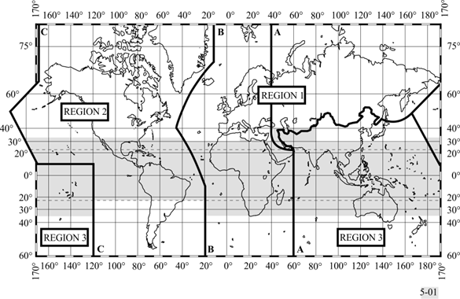
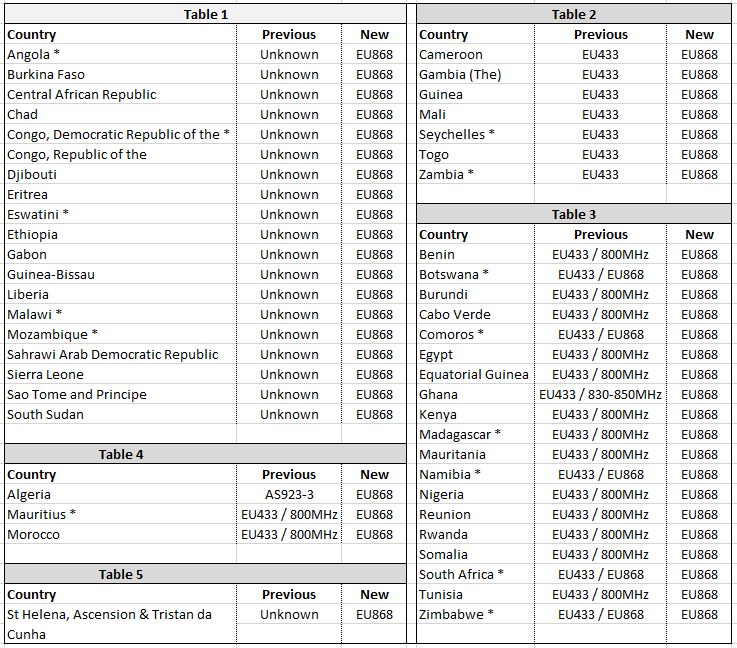
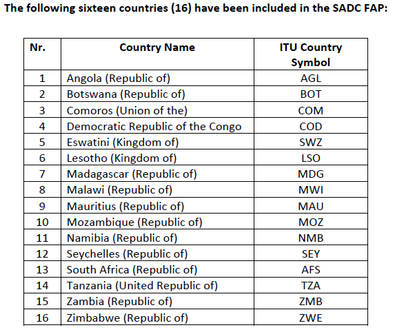

# HIP 100: Deploy EU868 Region Plan to the Majority of Africa

- Author: [Adrian Clint](https://github.com/waveform06) and [Helium Foundation](https://github.com/dewi-alliance)
- Start Date: 2023-09-22
- Category: Technical
- Original HIP PR: [#789](https://github.com/helium/HIP/pull/789)
- Tracking Issue: [#809](https://github.com/helium/HIP/issues/809)
- Vote Requirements: veIOT Holders

## Summary

This HIP recommends that the community provisionally sets the currently unspecified and EU433 countries in the Africa region to the EU868 frequency plan. This change would match guidance from local regulatory authorities like the Africa Telecoms Union (ATU) and local deployers. The LoRa Alliance does not currently specify regional parameters for all of these countries, or has EU433 as an only/primary frequency plan.

As a summary, this HIP proposes:

- All Africa region countries with an “Unknown” LoRaWAN regional frequency plan are set to EU868 per ETSI [EN300.220-2].
- All Africa region countries set to EU433 as the default LoRaWAN regional frequency parameter are set to EU868 on the Helium network.
- All Africa region countries with EU433 or an 800MHz based LoRaWAN regional frequency parameter are set to EU868 on the Helium network.
- The network, through the Helium Foundation and other participants, communicate with Telecom Regulatory Authorities in these countries and confirm Helium provisionally complies with the EU868 regional parameter recommendation from the Africa Telecoms Union.
- The network, through the Helium Foundation and other participants, present the approach to the LoRa Alliance Regulations and Regional Parameters Working Group.

## Motivation

Africa shows growing LoRaWAN demand, yet has fractional or unspecified spectrum guidance in each country. Despite the demand, the pace of standardization varies across the continent. Adopting the EU868 band, which aligns with the ETSI [EN300.220-2] standard, can help standardize IoT devices in Africa.

There's a rising interest from organizations aiming to deploy compatible infrastructure in Africa. They are seeking guidance on the suitable frequency plan, especially with the uncertainty around the legacy EU433 plan. Certain countries are eager to determine the appropriate legal spectrum for operation but may benefit from additional support.

The immediate objective is to promote EU868 as a provisional standard, enabling Helium deployers to roll out EU868 Hotspots across the African continent. By introducing this provisional amendment to the Helium network, there's an opportunity to influence changes in the LoRa Alliance's LoRaWAN Regional Parameters specifications. Major African countries like South Africa, Nigeria, Egypt and Kenya already utilize EU868. However, several African countries have yet to establish regulations specific to LoRaWAN. The EU868 plan is gaining traction as a potential global standard for IoT devices, particularly in the International Telecommunication Union (ITU) Region 1 (EMEA). The trigger countries for this HIP are Malawi, Liberia, The Democratic Republic of Congo, The Republic of Congo, and Ghana which the Foundation are working with on the ground through the One Planet Education Network team to establish local LoRaWAN connectivity on EU868 in these countries.

**Figure 1: The ITU Region 1 is shown in the map above. From ITU Radio Regulations 2020**

A proactive step is essential to clarify the regulatory landscape and offer support to any organization looking to deploy LoRaWAN. A unified regional frequency would greatly assist service providers and manufacturers in decision-making regarding hardware development and deployment.

## Stakeholders

- Prospective and current deployers of LoRaWAN Gateways and Sensors in each of the countries specified in this HIP. Example: [One Planet Education Network](https://www.oneplaneteducation.com/) (OPEN)
- The LoRaWAN Alliance Regulatory and Regional Parameters Working Groups (Foundation has been in contact)
- The African Telecoms Union (ATU) (Foundation has been in contact)
- The Regulatory Telecoms Authority in each of the countries in Tables 1,2 & 3
- African Telecoms and Commercial and Economic organizations, including [ECOWAS](https://ecowas.int/ecowas-member-states-adopt-common-positions-on-agenda-items-of-the-world-radiocommunications-conference-2023-wrc-23/), [CRASA](https://www.crasa.org/), [ASMG](https://www.itu.int/en/ITU-R/terrestrial/broadcast/ASMG/Pages/default.aspx), and others listed [here](https://en.wikipedia.org/wiki/Regional_Economic_Communities).
- Other public or private LoRaWAN networks considering similar or different regional frequency plans.
- Hotspot owners and operators in affected regions and other nations.

Communication will be established with all relevant authorities and organizations.

## Detailed Explanation

The proposed changes to regional frequency plans, based on the LoRaWAN Alliance's RP2-1.0.4 LoRaWAN Regional Parameters document, will be integrated into the regions.csv file and the corresponding .geojson files. The changes are aligned with the latest discussions, as documented in this [github issue](https://github.com/dewi-alliance/hplans/issues/51) and outlined in the tables below.

_Note: The countries marked with a \* are members of CRASA and frequency harmonization amongst members is a goal of this organization._

**Table 1**: Countries with no defined regional frequency plan (Unknown) will be set to EU868 - ATU discussed any countries wanting to define a regional frequency and looking for a recommendation for one from the ATU will have EU868 proposed
_Note: Eritrea and South Sudan do not appear to be or have been members of the ATU or CRASA - TBC. Some other countries need to have membership status confirmed_

**Table 2**: Countries with the EU433 plan defined will be set to EU868 - as per reasoning for Table 1 and because the LoRaWAN Alliance recommend no new EU433 installations or support. Helium HIP19 has not approved any EU433 hotspots so far.

**Table 3**: Countries with EU433 and any 800MHz plan defined will be set to EU868 - as per reasoning for Table 1 and that LoRaWAN Alliance recommends no new EU433 installations or support. \
This would support [hplans github issue 27](https://github.com/dewi-alliance/hplans/issues/27)

**Table 4**:The LoRaWAN Alliance has updated the regional parameters for Algeria from AS923-3 to EU868 and we will follow their direction. Similarly Mauritius and Morocco have been updated from EU433/800MHz to EU868.

**Table 5**: Saint Helena and its associated islands have been added as a proposal in this HIP though officially outside the Africa Region but is adjacent to other African islands and is a UK (EU868) Overseas Territory. It can be assumed that it would also be EU868 as African Islands that are French Overseas Territories are defined as EU868. And it exists within ITU Zone 1.

---

Other countries such as Uganda (AS923-1), Tanzania (AS923-1) and Niger (IN865) have specifications other than EU868. Lesotho, Libya and Sudan have frequency spectrum specifications that need further review before deploying EU868. It would be expected that over time all these countries harmonize with the proposed region plan of the ATU for EU868, this HIP does not describe a current attempt to change them, but proposes to add EU868 to the list of their allowable regional frequencies in the Helium regions.csv file.

The Southern African Development Community (SADC)’s regulatory arm - the Communications Regulators' Association of Southern Africa (CRASA) has a [frequency allocation plan](https://www.crasa.org/post-articles/sadc-radio-frequency-spectrum-allocation-plan-rfsap) common to all member countries. And members are urged to follow this “In order to achieve significant harmonization… as far as is practically possible.”

Table 6: List of SADC Member countries

## Drawbacks and Risks

Several considerations emerge when evaluating a provisional rollout of this regional plan:

1. Is the shift to EU868 for the remaining "Unknown" and EU433 countries premature?
1. Should the transition be limited to countries with established relationships and those actively endorsing the EU868 implementation?
1. Should the focus be solely on ATU member countries or those with an 800MHz regional plan?
1. Potential challenges may arise if a country adopts another regional plan. These challenges range from the need for Hotspot vendors to accommodate changes, updates to the hplans repository, and potential reconfigurations or replacements for sensors, depending on the chosen frequency spectrum.

## Rationale and Alternatives

Engaging with the African Telecom Union (ATU) provides insights into the regulatory landscape across the African continent. The ATU's current focus appears to be on 5G regulations. The goal is to prioritize IoT regulations and aim for a consistent regulatory framework for the entire African continent, similar to global standards for WiFi and cell phones.

The traditional approach has been country-centric, with individual countries establishing their own regulatory frameworks. However, a continent-wide standard simplifies deployments for manufacturers and network operators.

Considering the pace of technological advancements, waiting for each country to independently establish its regulatory framework may hinder the growth of IoT in Africa. By proactively promoting a unified standard, Helium and its partners can influence the regulatory landscape while simultaneously supporting the growth of LoRaWAN across the continent.

**Waiting for the LoRaWAN Alliance to set the frequency**

The approach is significantly different from the LoRa Alliance. The Alliance primarily works with individual African countries on a case-by-case basis and has not contacted the ATU to discuss an overall harmonious Africa plan. Progress has been slow, especially for the smaller countries and it could literally take a decade before all African countries have finalized regulations. The Helium plan is to drastically shorten that time with provisional approval by promoting a suggested regional plan rather than waiting to approve a regional plan for one country at a time.

The LoRaWAN Alliance Regulatory and Regional Parameters Working Groups are supportive of our efforts to speed up deployment and standardization of regional regulation in the African region.

## Deployment Impact

Helium uses the configuration files at [https://github.com/dewi-alliance/hplans](https://github.com/dewi-alliance/hplans) to define the regional frequency plans for each country. hplans is a geojson representation of the LoRaWAN regional parameter channel plans. It is based on the LoRa Alliance's RP2-1.0.4 LoRaWAN Regional Parameters, as well as the Helium Network's country definitions.

The geojson does not contain the channel plan and spectrum definitions; it only contains the geographic regions they apply to.

- The regions.csv file is the table of frequencies and the .geojson files visually show the countries that each region code is applied to.
- The current file status is the configuration to be applied at the next release
- The last release was on the [2nd of June 2023](https://github.com/helium/lorawan-h3/releases) and uses this set of [regional frequency parameters and plans](https://github.com/dewi-alliance/hplans/tree/e2a3a57a86c71e05064037576b3bc5f910ef5267)
- [Lw-generator](https://github.com/helium/lorawan-h3/tree/region_params_2023.06.02) generates uber h3 files for helium to use from the geojson files

There are a small number of hotspots in Algeria Switching from AS923 to EU868 which means their hardware is now obsolete, unless the hotspots can have their LoRaWAN Concentrator replaced,

### Documentation/knowledge updates

- [https://docs.helium.com/iot/lorawan-region-plans](https://docs.helium.com/iot/lorawan-region-plans) will be updated
  - A note will be added to each country affected, to a copy of this HIP and the decision and suitable processes for local regulatory authorities to use the frequency.
  - Countries not yet confirmed as EU868 by the LoRa Alliance will be noted as provisional proposed
  - Current status updates with countries viewing the EU868 proposal will be noted on this page or subpage
- [https://github.com/dewi-alliance/hplans](https://github.com/dewi-alliance/hplans) will match the docs site

Any country's authorities confirming they do not want to provisionally or actively deploy EU868 will be returned using the above processes to the LoRaWAN frequency plan definition in the latest LoRa Alliance Regional Parameters documentation. And any known deployers in that country in contact with the Foundation will be notified of the return to Alliance definitions.

## Success Metrics

### Phase 1 - before or during 2024 Q1

Malawi, Liberia, The Democratic Republic of Congo, The Republic of Congo and Ghana whom the Foundation are working with through the OPEN team have a fixed or provisional EU868 frequency assigned by local regulators.

### Phase 2 - before 2024 Q3

That all country's telecoms regulators in Tables 1-5 are contacted by the Helium Foundation proposing the provisional allowance of the EU868 as a regional LoRaWAN standard and a response status table is updated on the Helium DOCs pages.

Regular updates on the regional EU868 take-up will be provided on the Community Calls and to the LoRa Alliance working groups.

A further success metric will be the willingness of other LoRaWAN network operators to engage with and support this proposal for their own deployments

## References

- LoRaWAN Alliance's [RP2-1.0.4 LoRaWAN Regional Parameters](https://resources.lora-alliance.org/technical-specifications/rp002-1-0-4-regional-parameters)
- ITU [Radio Regulations 2020](https://www.itu.int/hub/publication/r-reg-rr-2020/)
- ATU's [African Spectrum Allocation Plan](https://atuuat.africa/african-spectrum-allocation-plan-afrisap/) (AfriSAP) See page 61 for 862 to 890 Mhz
- CRASA’s [Radio Frequency Spectrum Allocation Plan](https://www.crasa.org/post-articles/sadc-radio-frequency-spectrum-allocation-plan-rfsap) (RFSAP)
- CEP [ERC Recommendation 70-03](https://docdb.cept.org/download/4358) Relating to the use of Short Range Devices (SRD)
- ETSI [EN 300 220-2](https://www.etsi.org/deliver/etsi_en/300200_300299/30022002/03.02.01_60/en_30022002v030201p.pdf) V3.2.1 (2018-06) Short Range Devices (SRD) operating in the frequency range 25 MHz to 1 000 MHz
