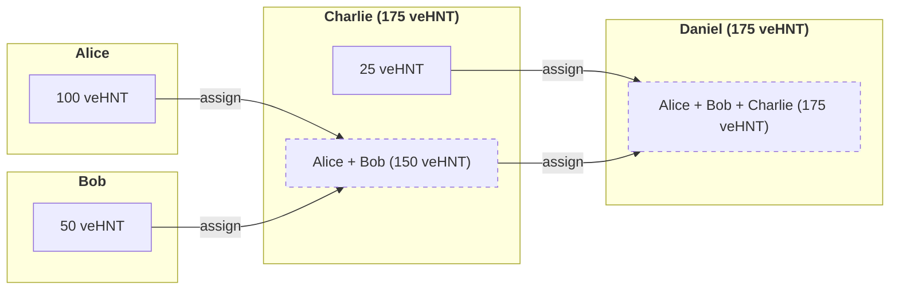

# HIP 110: Proxy Voting

- Author(s): [Abhay Kumar](https://github.com/abhay) and [Noah Prince](https://github.com/ChewingGlass)
- Start Date: 2024-03-01
- Category: Governance
- Original HIP PR: [#925](https://github.com/helium/HIP/pull/925)
- Tracking Issue: [#928](https://github.com/helium/HIP/issues/928)
- Vote Requirements: veHNT Holders, veIOT Holders, and veMOBILE Holders

---

# Summary

This proposal formalizes the concept of Proxy Voters in [Helium Governance](https://heliumvote.com). Proxy voting is a method of governance wherein a participant may assign their vote, potentially for a limited period of time, to another participant. In Helium Governance, we propose that a voting wallet with veToken power may assign their voting power, for a fixed period of time, to another voting wallet.

One can imagine a situation where a participant may not have the ability or time to properly research all Helium Improvement Proposals and directly vote using their vote power. There are also situations where participants are unable to directly vote, for a variety of reasons, but are able to assign their rights to another party. In either of these cases, we propose that participants can assign their voting power to a wallet held by a participant whom they trust without transferring control of the underlying assets.

Additionally, we propose that this proxy assignment be recursive, meaning that this assignment can then be assigned to another wallet. This allows voting power to flow to the most active representatives.

We also propose that this assignment can be revoked or reassigned at any time allowing the participant to both change their vote for a particular position or entirely reassign their vote power to a new voting proxy wallet. This provides an important balance that allows a voter to retain control at all times.

Finally, we propose that proxy voting in Helium’s ecosystem is broken into seasons that reset every August 1st, aligned with the anniversary of the network. This will ensure that assigned proxies do not get stale. To ensure that voters have adequate time to re-assign their proxies, there will be a 30 day window prior to the reset within which re-assigned proxies carry over to the next season. This way all non-stale proxies can be preserved, avoiding potential for a governance attack while voters re-assign.

It is worth noting that the concept of vote assignment already exists in [Realms](https://realms.today) on Solana but as we move to using Modular Governance, we believe that the protocol needs to explicitly formalize this feature. As part of formalizing this feature, the authors would like to create a curated registry of well known Proxies. This will allow people to fully research proxies before they assign voting power. The authors believe that the discovery aspect of voting proxies is important, otherwise it will have limited effectiveness.

**Disclosure**: This HIP is a formal proposal authored by the [Helium Foundation](https://helium.foundation). Employees listed as authors are acting in their official capacity as representatives of the Foundation. All proposals contained within reflect solely the recommendations of the Foundation and not those of any individual author(s).

**Note**: This proposal will likely need to voted on by each separate governance group. Specifically, if it's brought to a vote, a separate vote will be held of veHNT, veIOT, and veMOBILE holders.

# Motivation

Voter participation in on-chain governance across crypto is very low. While Helium has a relatively high turnout in comparison with other on-chain systems, the participation is very low compared to something like a national election in the United States.

Participants in the ecosystem may be too busy, or do not feel like they understand the issues well enough to vote. They may also be exhausted by the pace of some initiatives, a necessary side effect of a protocol that’s still in the iteration phase. By allowing proxy voting, we hope to increase meaningful participation.

A high voter turnout isn’t just important for guiding the direction of the protocol. It’s also important because it ensures that governance attacks are costly. With a low threshold of voting power needed to tip a vote, a malicious actor can guide the network towards decisions that only serve that actor.

In a Proof-of-Stake network, validators must vote on all decisions made. In this way, all staked tokens participate in governance. By adding proxy voting to Helium, we can take meaningful steps towards a system where most staked tokens are participating in governance. Much like selecting a validator, stakers in Helium tokens can select an appropriate Proxy based on their voting history and their documented positions.

# Specification

In Realms, a form of Proxy Voting already exists. You can “delegate” your vote from one wallet to another. This is typically done for voting with a hot wallet while your positions remain on a cold wallet.

## Proxy Registry

The authors believe that, in order for such a feature to be viable, it needs to have a strong level of discovery. While you should be able to assign a proxy to a known wallet address, there should also be a curated registry of well-known proxies. To keep things simple, the initial implementation should require Proxy Voters creating a Pull Request into this repository: https://github.com/helium/helium-vote-proxies

The pull request should add the proxy to proxies.json. This will include:
* Name - The name of the proxy voter
* Description - A short description of the voter
* Image - A link to an image file in the repository that will be a profile picture in the registry.
* Wallet - The wallet that will be used to vote
* Networks - What networks this proxy votes in
* Detail - A markdown file in the repository containing a full-length description of the Proxy Voter. This should include details like voting philosophy and background.

Once we have a registry of Proxies, users should be able to use heliumvote.com or the wallet app to discover proxies. From these interfaces, they should be able to assign their voting power to a proxy for a configurable timespan, up to August 1st of the following year. Proxies always reset on August 1st. Special care will need to be taken for votes that may be current during the reset period.

## Proxy Rules

Proxies will exist on a per-position basis. With proxy assignment being recursive, you can think of the proxies assigned for a given position as a linked list.

In the above image, you can see that both Alice and Bob assign their positions to Charlie. Charlie then assigns all of his positions (and Alice and Bob’s positions) to Daniel.

In this situation, Daniel can vote with 175 veHNT. Charlie can also (optionally) override 175 veHNT of Daniels vote if he disagrees. Further, Alice can override 100 veHNT of Charlie OR Daniel’s vote. Bob can override 50 veHNT of Charlie OR Daniel’s vote.

In this way, the earlier proxies (or the owner of the position) have the ultimate authority when it comes to voting. If they take a passive strategy, votes will be made by their proxies.

Similarly, at any time, Alice has the right to revoke the proxy assignment Charlie made to Daniel. Alice also has the right to revoke her proxy assignment to Charlie, effectively removing the proxy entirely.

# Implementation

## NFT Delegation Contract

A new smart contract will be added to modular governance smart contracts. This contract will allow assigning the voting power recursively from one voting NFT to another voting NFT. Because Helium positions are represented by NFTs, this generic contract can work for Helium and a number of other voting implementations.

## Proxy Registry Service

A service will be created to read well-known proxies from the proxy GitHub repository. This service will combine proxy information with on-chain data to provide detailed information, like a proxy’s voting history.

## Wallet App and Helium Vote

The wallet app and Helium Vote will need to be updated to provide a user interface to discover proxies, and assign voting power.

# Drawbacks

This feature depends on veHNT holders properly researching potential proxies and their voting history. If users do not choose proxies that represent their wishes, there is a potential for misalignment.

Another potential risk is a proxy accumulating a large amount of voting power, and then changing their voting style to selfishly benefit themselves. While it is impossible to eliminate this risk entirely, the authors believe that (1) voters having the ability to pull their proxies and (2) proxies resetting yearly will alleviate this issue.

# Success Metrics

The primary metric that will be assessed after this proposal is implemented is whether or not it drives greater vote participation from locked HNT, IOT, and MOBILE.
