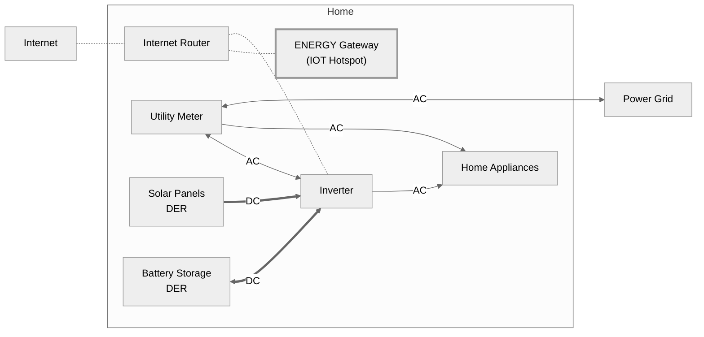
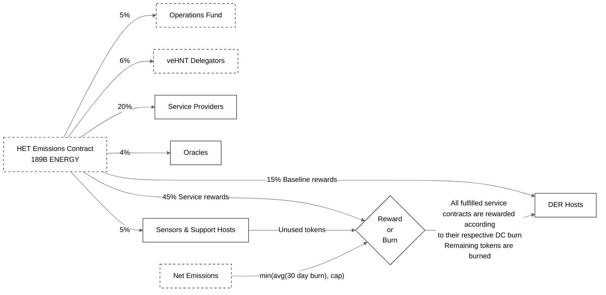

# HIP 128: Energy Subnetwork

- Author(s): [@frahlg](https://github.com/frahlg), [@T0bias0lss0n](https://github.com/h0bb3), [@leitet](https://github.com/leitet), [@VIKOLO](https://github.com/VIKOLO), [Helium Foundation](https://helium.foundation)
- Start Date: 2024-07-03
- Category: Economic, Technical, Governance
- Original HIP PR: [#1050](https://github.com/helium/HIP/pull/1050)
- Tracking Issue: [#1051](https://github.com/helium/HIP/issues/1051)
- Vote Requirements: veHNT Holders

---

## Summary

This HIP proposes the creation of ENERGY, a new subnetwork within the Helium ecosystem. This subnetwork rewards users who participate in solar power production and battery energy storage. The subnetwork aims to collect data from, and offer control of connected solar power and battery resources.

The ENERGY subnetwork is designed to create value for the entire Helium ecosystem:

1. **Dual Mining for Existing Compatible Hotspots**
   Existing compatible Helium Hotspots can be upgraded to participate in the ENERGY subnetwork and earn both IOT and ENERGY rewards.
2. **Utilization of the IOT Subnetwork**
   The ENERGY subnetwork will transfer supporting sensor data over the existing IoT infrastructure, including utility meter data and solar lux meter data.
3. **Increased DC Burn**
   Energy management and grid stabilization services provided by the ENERGY subnetwork will drive significant Data Credit (DC) burn. This increased DC burn directly benefits all HNT holders by potentially increasing HNT value through the burn-and-mint equilibrium.
4. **Expansion of Helium**
   By entering the rapidly growing renewable energy sector, Helium expands its utility and potential market reach attracting new participants and investors.
5. **Sustainability**
   The ENERGY subnetwork aligns Helium with global sustainability goals, potentially attracting environmentally conscious users and partners. This could open up new opportunities for grants, partnerships, and positive public relations for Helium.

The ENERGY subnetwork is a practical expansion for Helium. It builds on the existing network while tapping into the growing renewable energy market, solving the real world problems of the acceleration renewable power. This addition will increase IOT network usage, drive more Data Credit burn, and give Hotspot operators new ways to earn.

Disclosure: This HIP is a formal proposal co-authored by the Helium Foundation along with the Srcful AB team.

## The Problem

Global energy is shifting from centralized production, dominated by large-scale power plants, to a decentralized model where energy is produced closer to where it is consumed, with solar leading the charge.

However, existing grid infrastructure, designed for centralized production, struggles to effectively integrate this dispersed and variable power. This is being addressed via coordinating Decentralized Energy Resources (DERs), such as solar pv and battery storage. However, no system exists to adequately incentivize and support widespread DER coordination at a homeowner level.

There are already institutional markets for power management–often called _Demand and Response_ or _Ancillary Services_. However, these markets are generally unavailable to homeowners, because each individual energy resource is too small to qualify for participation. When these gated systems do permit participation, they disproportionately reward the centralized entities which manage them.

### The Solution/Opportunity

The ENERGY subnetwork seeks to incentivize and reward the efficient grid integration of renewable energy production. With an ENERGY-capable gateway, users will be able to onboard energy resources from a variety of manufacturers, activating and rewarding a network of decentralized power generation, responsive energy storage, and grid management.

Initially we're connecting small scale Solar Photovoltaic (PV) systems and Batteries. Batteries are incredibly effective at offsetting the variability of weather-dependent renewable energy production and also play a key role in stabilizing the power grid in real time.

These _Decentralized Energy Resources_ (DER) would be coordinated in what is known as a _Virtual Power Plant_ (VPP), a collection of disparate small- to medium-scale DERs. These can be energy generation resources, loads, or energy storage. For example, Solar PV systems, electric pool heaters, and batteries. These units are coordinated, virtually, to function as a single power plant.

At scale, the VPP that exists via the Helium ENERGY subnetwork may be leased (purchased via Data Credits) by Service Providers and offered to Clients such as energy companies, grid operators, or aggregators in order to balance grid supply or demand (Energy Services). Use of these resources would reward individual _DER Hosts_ with ENERGY token.

#### Overview

A typical installation consists of solar panels and an inverter, as shown in the diagram. Optionally, one or more batteries can be added.

The inverter's responsibility is to manage the energy from the solar panels, battery, home appliances, and the power grid. The inverter is connected to the local home network via the internet router (via Ethernet cable or Wi-Fi).

An ENERGY Gateway connected to the home network via the internet router allows for the collection of data from the inverter and control of its operation. The ENERGY Gateway signs the data from the inverter so that the source of the data is known. The ENERGY Gateway can receive signed signals to control the behavior of the inverter. The ENERGY Gateway can be an existing compatible IOT hotspot (a list of compatible IOT Hotspots will be published in the future). The IOT Hotspot will need a software update to support the ENERGY network.

In short, to earn ENERGY rewards you will need an ENERGY Gateway and at least one DER. An ENERGY Gateway can connect multiple DERs but a DER can connect to only one ENERGY Gateway.

### Subnetwork Goal

The primary objective is to create an ecosystem and incentive structure that promotes DER deployment and connects DER's to enhance their intelligence and flexibility. This is critical for achieving affordable and abundant renewable energy within the power system. Additionally, the subnetwork aims to capture opportunities in the global demand for energy data and a more intelligent ancillary services market, which is essential for grid stability as renewable energy integration increases.

Key objectives of the ENERGY subnetwork:

- **Establish a Network of Connected DERs:** Build the People’s Virtual Power Plant by creating a robust network of Distributed Energy Resources (DERs).
- **Stabilize the Power Grid:** Ensure grid stability as the integration of renewable energy sources increases.
- **Empower Homeowners:** Enable homeowners to participate in and benefit from energy markets traditionally dominated by centralized energy companies.

### Market Potential

The global market for ancillary services had a capitalization of over $9 billion in 2023, expected to grow to $18 billion by 2032. In the US, the Power Ancillary Service Market was valued at $6.09 billion in 2022 and is projected to reach $8.79 billion by 2028, with a compound annual growth rate of 6.14%. Today, there are no services available for aggregating a massive amount of small DER’s, globally and with an open and permissionless protocol. Additionally, the production of energy data represents a new market beyond traditional energy sales, providing further compensation opportunities for participants of the ENERGY subnetwork.

## Economic Overview

There are a number of real world physical entities that comprise the network and perform the following functional and economic roles:

| Name                     | Functional Role                                                                                                                                                                                             | Economic Role                                                                                                                                                                                                                                                             |
|--------------------------|-------------------------------------------------------------------------------------------------------------------------------------------------------------------------------------------------------------|---------------------------------------------------------------------------------------------------------------------------------------------------------------------------------------------------------------------------------------------------------------------------|
| DER Host                 | Operates a connected DER through an ENERGY-capable Gateway including compatible IOT Hotspots (Dual Mining).                                                                                                 | Receives ENERGY rewards for sharing data from DER. Stakes ENERGY to qualify DERs for additional data and VPP service usage and receives ENERGY rewards for participating with controllable DER in the VPP (Energy services).                                              |
| Service Provider         | Promotes and enables data and VPP services to Clients. Aggregates DERs for market optimizations and guarantees technical requirements. Srcful AB is the first service provider at ENERGY subnetwork launch. | Receives payments for data and VPP services from Clients, burns HNT into Data Credits and settles data usage with DER Hosts. Stakes ENERGY to receive % of rewards from Energy Emissions contract. A future HIP will decide the split between multiple Service Providers. |
| Client                   | Energy Companies, Grid Operators, or Aggregators that use the Energy subnetwork. Clients act in accordance with the country's Transmission System Operator.                                                 | Pays Service Providers to access data and/or the right to control DERs in the Energy subnetwork for VPP services.                                                                                                                                                         |
| Gateway Vendors          | Builds, sells and supports ENERGY-capable gateways. This includes firmware upgrades for existing Helium Hotspots to enable ENERGY subnetwork functionality (Dual Mining).                                   | Stakes ENERGY to access an NFT to be accepted to operate on the ENERGY subnetwork.                                                                                                                                                                                        |
| Sensors and Support Host | Provides needed high-quality data (e.g Frequency meters) to support the VPP, and special reward programs. The exact definition and rules for these will be defined in future HIPs.                          | Receives ENERGY mining rewards for verified sensor data or validation and support of the ENERGY subnetwork.                                                                                                                                                               |
| Oracles                  | Relay data to L1 emission contract. Calculate incentive points for service providers and sensor hosts.                                                                                                      | Stakes ENERGY. Receive % of rewards from emissions contract. Details regarding Oracle roles will be defined in a future HIP.                                                                                                                                              |

To operate on the network, Service Providers and Gateway Vendors must control a respective NFT. Acquiring this NFT requires Gateway Vendors and Service Providers to:

1. Gateway Vendors must stake 50M ENERGY, and new Service Providers must stake 500M ENERGY.
2. Obtain ENERGY subnetwork governance approval.

Vendors may add ENERGY to their stake and DC and ENERGY to their onboarding wallet to avoid depletion.

This HIP also provides governance approval for Srcful AB to be the first Service Provider when the network launches. Srcful AB will provide the needed stake within 3 months of network operation.

## Token Allocation

Allocation of ENERGY tokens prioritizes emission to the community of DER hosts for the data and energy services they provide. A max supply of 250B ENERGY tokens is enforced following the mechanics deployed on the IOT and MOBILE subnetworks. 190B tokens are dedicated to emissions mainly as rewards for DER hosts including a one time issuance of 1B tokens, where 900M tokens go to the Operations Fund and 100M for beta testers that participated before the start of the network. 60B tokens are dedicated as emissions for initial funding to investors and founders of the project.

### Emissions Curve

There will be a max supply of 250B ENERGY.

The proposal is for halving of ENERGY issuance to occur every 2 years.

We propose that 60B ENERGY be reserved for providing startup capital for Srcful AB and investors, required to launch the ENERGY subnetwork and develop the technical and operational infrastructure needed for its creation. These tokens will be minted over a 36-month period and will have a minimum lockup of 12 months after the token emission date. These tokens will be emitted on a daily basis.

189B ENERGY will be emitted on a daily basis mainly as community rewards but also for the continued operations of the network. Community rewards are divided into two parts: baseline rewards for participating in the subnetwork and service rewards for participating in energy services. The baseline rewards will receive 15% of emitted ENERGY, and the service rewards will receive 45%. Services are rewarded to reflect the respective DC burn of the DER host, with remaining tokens being burned.

The ENERGY protocol will use net emissions to replenish burned tokens into service rewards using a 30-day average of burned tokens, with a cap. The cap will initially be set at 1% of current emissions minted for Community but will likely be subject to change.

For clarity, the emission schedule is as follows:

| Year | ENERGY at the start of the year (M) | ENERGY minted for community (M) | DER host Baseline Rewards | DER host Service Contract Rewards | Sensor hosts | Service Providers | Oracles | Operations Fund | veHNT Delegators | ENERGY minted for Investors & Founders (M) |
|------|-------------------------------------|---------------------------------|---------------------------|-----------------------------------|--------------|-------------------|---------|-----------------|------------------|--------------------------------------------|
| 1    | 1&nbsp;000                          | 47&nbsp;250                     | 15 %                      | 45 %                              | 5 %          | 20 %              | 4 %     | 5 %             | 6 %              | 24&nbsp;000                                |
| 2    | 72&nbsp;250                         | 47&nbsp;250                     | 15 %                      | 45 %                              | 5 %          | 20 %              | 4 %     | 5 %             | 6 %              | 24&nbsp;000                                |
| 3    | 143&nbsp;500                        | 23&nbsp;625                     | 15 %                      | 45 %                              | 5 %          | 20 %              | 4 %     | 5 %             | 6 %              | 12&nbsp;000                                |
| 4    | 179&nbsp;125                        | 23&nbsp;625                     | 15 %                      | 45 %                              | 5 %          | 20 %              | 4 %     | 5 %             | 6 %              |                                            |
| 5    | 202&nbsp;750                        | 11&nbsp;812.5                   | 15 %                      | 45 %                              | 5 %          | 20 %              | 4 %     | 5 %             | 6 %              |                                            |
| 6    | 214&nbsp;562.5                      | 11&nbsp;812.5                   | 15 %                      | 45 %                              | 5 %          | 20 %              | 4 %     | 5 %             | 6 %              |                                            |
| 7    | 226&nbsp;375                        | 5&nbsp;906.25                   | 15 %                      | 45 %                              | 5 %          | 20 %              | 4 %     | 5 %             | 6 %              |                                            |
| …    |                                     |                                 |                           |                                   |              |                   |         |                 |                  |                                            |

Below is a high level overview of the reward flow from the emission curve to economic participants of the subnetwork:

### Baseline Rewards

The ENERGY subnetwork proposes an incentive system designed to optimize the participation and contribution of DERs. This approach aims to strengthen and connect more DERs, helping to integrate renewable energy into the grid effectively. The ENERGY subnetwork reward structure draws inspiration from DIMO's successful [Baseline Issuance model](https://docs.dimo.zone/governance/dip2), and rewards DERs for their consistent connectivity and high quality contribution to the network. This structured reward system is crucial for building a reliable data foundation that enables in-depth knowledge of the grid and new service proposals.

Baseline rewards for an online DER are defined in three parts based on the following principles:

#### Principle 1: Uptime

Reward DERs that have been part of the network for a long time;

| Level | Definition                 | Score |
|-------|----------------------------|-------|
| 1     | 3-20 weeks connected       | 100   |
| 2     | 21-35 weeks connected      | 200   |
| 3     | 36 or more weeks connected | 300   |

#### Principle 2: Quality

Incentivize an evenly distributed and continuous data connection; which tells a fuller story of DER behavior and performance. A given time period with data points is subdivided into several levels. If there is data across a whole level the score for that level is used. The score is proportionate to the division of the level. For an hour time period the first division is 2 (data every half hour), the next 2 (data every quarter), the next 3 (data every 5 min), the next 5 (data every min), the next 2 (data every 30 seconds). This gives the following:

| Level | Definition                 | Score |
|-------|----------------------------|-------|
| 1     | Data in each 30 min period | 10    |
| 2     | Data in each 15 min period | 20    |
| 3     | Data in each 5 min period  | 60    |
| 4     | Data in each 1 min period  | 300   |
| 5     | Data in each 30 sec period | 600   |

#### Principle 3: Value

Incentivize DERs who contribute with marketable services such as credible and rapidly controllable resources:

| Level | Definition                                       | Multiplier |
|-------|--------------------------------------------------|------------|
| 1     | Read DER Data                                    | 0.01       |
| 2     | Read Validated DER Data                          | 1          |
| 3     | Read Validated DER Data + Control Qualified DERs | 2          |

##### Validation and Qualification Mechanism

Validation and Qualification is offered by the Service Provider to DERs that want to participate in Energy Services. Validation is achieved by the DER Host staking $10 USD worth of ENERGY tokens per kW available power for 45 days with a 10 day un-staking period. During staking the DER is subject to additional Service Provider audits and tests. The DER Host must comply with requirements and provide needed information promptly. Failure to comply with the requirements the staked ENERGY tokens will be forfeited and burned. A validated and controllable DER can be Qualified by the Service Provider. A Qualified DER can be opted in to be available for energy services by the DER Host.

Note that this staking is for validation and qualification it does not provide income or governance rights.

#### Calculation

Each DER datapoint gets a score based on the sum of principles one and two multiplied by three for a given reward period, e.g. 1h. The scores are summarized for a given period. When the sum of scores for each DER is calculated, each DER is rewarded ENERGY tokens based on its fraction of the total score and the DER host Baseline Rewards emissions for that period.

${Score =  NumberOfDataPoints \times ( UptimeScore + QualityScore) \times ValueMultiplier }$

Example: A DER has been connected to the network for 5 weeks (Uptime Level 1). During the reward epoch of one hour the DER has provided 500 data points, but it had some connection problem for two minutes so there is no data for two consecutive minutes (Quality Level 3). The DER has not been validated (Value Level 1). This gives a score of ${500 \times (100 + 60) \times 0.01 = 800}$

The total scores for the hour is the sum of all DER scores, e.g. ${2\ 000\ 000}$ and the DER’s part of this is then ${\frac{800}{2\ 000\ 000} = 0.0004}$. The amount of ENERGY tokens issued to the DER is then 0.04% of the DER Host baseline rewards emissions for the hour.

Rewards will be issued once every 24h as per the token emission schedule.

### Rewards for Energy Services

Ancillary services from DERs are services that stabilize the power grid by rapidly adjusting to changes in electricity demand and supply. They ensure the grid maintains a consistent frequency (usually 50 or 60 Hz). As more renewable energy and distributed resources are integrated, the demand for these reserves increases because grid operators rely on them to quickly balance the system in the operating hour, creating a market for those capable of providing these services.

The demand for controllable resources typically comes from the respective country's Transmission System Operator, responsible for the stability of the electricity grid during the operating hour. Clients (energy companies, grid operators, aggregators) act, directly or indirectly, on behalf of the Transmission System Operator. This market differs from the more traditional energy market, focusing specifically on grid stability rather than bulk energy production and consumption.

DER Hosts opts DERs into the program after a successful Qualification (Value principle Level 3) by continued staking. On successful completion of a service contract the DER Host will be rewarded with ENERGY emitted from the Service Contract Rewards in proportion to the value of the service contract and the resource provided (kW). A DER that does not continue to fulfill requirements of the Qualification will lose the stake and the ENERGY tokens staked are forfeited and burned, providing an incentive for DER Hosts to maintain DER availability from Qualification and market bidding to the fulfillment of the Client contract.

Clients receive staked, qualified, controllable DERs from the Service Provider and bid these into the market (typically one day in advance). The winning bids generated revenue are allocated from the Service Contract Rewards (via HNT DC burn mechanism) to the DER Hosts who have staked controllable DERs (Value principle Level 3).

#### How it works for Battery storage

Batteries are flexible and can help regulate the grid by both consumption and production of energy, as an example; a battery with 0 % charge can only charge from the grid, and a battery with 100 % can only discharge power to the grid - in order to be flexible both ways the state of charge needs to be in the mid-range. Batteries are not affected by weather conditions or time of day and are as such a more valuable resource for the network.

To participate with a battery in energy services, the DER Host leases the battery to the Service Provider during the staking period. When participating with a battery in these services, DER Hosts will receive the state of charge (kW) schedule for the battery based on market bids, meaning the full capacity of the battery cannot be used to store generated solar energy during the staking period as it needs to have a state of charge being able to both discharge and charge power from the grid. Even if there is no need to discharge or charge power, the DER host still get rewards every hour just for being a backup.

Under normal grid conditions:

1. DER Hosts will receive a state of charge schedule for the battery based on market bids.
2. The Service Provider will manage the battery's charge and discharge to support grid stability.
3. A portion of the battery capacity can be reserved for emergency use by the homeowner (handled via staking).

During a power outage:

1. The DER Host regains full control of their battery for home backup purposes.
2. This emergency use does not violate staking rules or affect rewards.

#### How it works for Solar PV

Solar PV systems can contribute to frequency reserves by decreasing (curtailing) their production based on grid needs. Unlike batteries, solar panels can not store energy directly but can temporarily reduce output during production hours. Typically, this happens for a maximum of 20 minutes and occurs a few times per year, but compensation is provided hourly since the value lies in being a controllable, connected curtailment reserve. There can also be other reasons for decreasing the power production from PV such as negative prices on the electricity market (in this case you’re paying to deliver energy to the grid).

### Anti-Gaming Measures

The ENERGY Subnetwork will prioritize the prevention of gaming through a hybrid framework that will evolve over time. At a base level, the subnetwork will leverage knowledge of accurately deployed IOT gateways in addition to ENERGY-specific validation mechanisms ranging from daily satellite imagery to grid frequency checks. This ENERGY-specific validation can also be made available to the IOT Network.
The administrator of anti-gaming measures will be the Helium Foundation, who will delegate a portion of the operations fund to Srcful AB for anti-gaming measures. As the first service provider on the ENERGY Network, Srcful is appropriately aligned to ensure that valid entities are rewarded on the network. The design of the Oracle infrastructure will allow for community evaluation of raw data emitted from ENERGY gateways.

### Network Rates & Fees

#### Gateway Onboarding

Gateways can manage multiple DERs on a local network. Under a gateway, each DER is onboarded individually. In many cases this will be just one inverter for a household, but as the network evolves, additional entities may be onboarded – such as pool heaters, batteries, or even bitcoin miners.

The fee for onboarding an ENERGY gateway is set at $10 USD, paid using DC and the fee for onboarding one DER is set at $20 USD, paid using the ENERGY token.

Gateway vendors can issue coupons for the onboarding of gateways and their respective fees. If a coupon is redeemed and the vendor does not have enough DC/ENERGY to pay from their onboarding account, twice the amount will be slashed from the vendor's stake. Of the slashed amount, 50% will go to an insurance fund and 50% will be burned. When a vendor's stake is depleted, they are not allowed to issue onboarding coupons.

The location of the entity is defined as part of the DER onboarding. There is no separate location assertion fee.

### Network Rates

At the start, usage of the network is divided into two main buckets, energy data and ancillary services. Usage across all buckets is recorded by network oracles and rewarded to DER Hosts at the end of each epoch. Access to data and DERs for ancillary services is paid using Data Credits derived from HNT. Rewards are allocated to DER Hosts in ENERGY tokens. DER Hosts are eligible for rewards in both buckets simultaneously.

#### Ancillary Services

Ancillary services do not have a fixed price; rather, their prices are determined by the open market marginal pricing each hour, depending on the supply size and the minimum bids allowed by the resources comprising the supply.

Clients pay the Service Provider for the right to control an aggregation of DERs from the network. The Service Provider pays at least 80% to the DER hosts participating in the service by burning HNT into Data Credits. Service provider may retain 20% as a service fee.

In the years 2023-2024, the average price across several European and US markets ranges from $10-40 USD per hour for a portfolio of 1 MW controllable resources. As a rough example of the historical market, a standard household with a 10 kW battery (a typical battery installation) could range between $2.4 - $9.6 per day ($876 - $3504 per year), equivalent to 240 000 - 960 000 data credits (DC) burn per day. There are already well known services available such as the [Tesla Demand Side Grid Support](https://www.tesla.com/support/energy/virtual-power-plant/dsgs) that compensates battery owners with up to $350 for a year. The ENERGY subnetwork rewards will be equivalent or higher depending on region.

Solar PV systems are only eligible for curtailment during daylight hours with safety margins depending on the weather, making the reward significantly lower than for systems including batteries.

Example of a 24-hour delivery period of aggregated DERs with a combined power of 1 MW (equivalent to 100 average-sized DERs for a household) in a European country with prices as of Q2 2024:

| Type of DER | Daily availability | Controllable resources in MW | Daily price in $ | Daily price (DC)      | Monthly price (USD) |
|-------------|--------------------|------------------------------|------------------|-----------------------|---------------------|
| Batteries   | 24&nbsp;h          | 1                            | $1&nbsp;000      | 100&nbsp;000&nbsp;000 | $30&nbsp;000        |
| Solar PVs   | ~ 8&nbsp;h         | 1                            | $100             | 10&nbsp;000&nbsp;000  | $3&nbsp;000         |

## Oracle Operations for the ENERGY Subnetwork

Oracles within the ENERGY subnetwork ensures data integrity, pricing accuracy, and reward distribution across DERs. Key Functions of ENERGY Oracles:

- Gather and process market data to update pricing in given periods, reflecting changes in supply and demand, regional pricing variations, and emergency energy needs. This ensures that all transactions within the VPP are conducted at fair market rates, maximizing returns for DER hosts and minimizing costs for Clients.
- Calculate and distribute rewards to DER hosts based on the baseline rewards.

## ENERGY Subnetwork Governance
The ENERGY subnetwork will use the current vote escrowed token model for Helium tokens and HNT stakers will be able to delegate HNT to ENERGY as they are able to delegate to IOT and MOBILE. ENERGY token holders will be able to lock up ENERGY tokens as veENERGY voting power for ENERGY subnetwork governance. There are no rewards for locking up ENERGY as veENERGY at this time.

As a subnetwork in Helium, ENERGY will participate in the network utility score described in [HIP 51's "Omni Protocol PoC Incentive Model" section](https://github.com/helium/HIP/blob/main/0051-helium-dao.md#omni-protocol-poc-incentive-model) and subsequent [HIP 88](https://github.com/helium/HIP/blob/main/0088-adjustment-of-dao-utility-a-score.md).
* ${V}$ is the staked HNT delegated to ENERGY
* ${D}$ is the DCs burned for ENERGY services
* ${A}$ is the $10 Onboarding Fee paid per gateway

### ENERGY DC burn 
The ENERGY network currently achieves DC burn by the following:
* Payment for ENERGY services, currently control of a VPP by a service provider on the ENERGY network
* Onboard of a Hotspot/Gateway on the ENERGY network

### Note on Current Onboarding Fee

We have implemented a $10 USD onboarding fee in DC due to the current structure of the *A* variable in the Utility score. For future subnetworks, Srcful believes that the *A* score should be reconsidered in favor of using DC service burn as the proxy for network value, as the current onboarding fee may not be optimal for new subnetworks joining on fair terms.

# Rationale

As decentralized physical infrastructure has risen, token incentives are a path forward when it comes to coordinating the deployment of physical resources. Solar and battery storage, as a residential asset class, will benefit from the people-powered growth and management that comes with web3.

Solar PV deployments show no signs of slowing, and the energy they produce can only be managed at the production source. In order to make solar energy work on a global scale, utilities and people need a simple way to communicate and coordinate. Given the funds trading hands at an industrial scale, it stands to reason that an incentive should be passed to the small-scale individuals that make these larger systems work.

## The Power of Decentralized Physical Infrastructure Networks

Decentralized Physical Infrastructure Networks (DePIN) represent a new paradigm in building and managing critical infrastructure. By leveraging blockchain technology and token incentives, DePIN enables the creation of community-owned networks that are more resilient, cost-effective, and adaptable than traditional centralized systems.

### Why the DePIN Approach Makes Sense for ENERGY

The energy sector is undergoing a rapid transformation towards decentralization, driven by the proliferation of small-scale renewable energy resources. There needs to be an effective way of coordinating the vast number of small energy resources. By leveraging the community with already open hardware platforms, and coordinating current and unforeseen products, we can build a more cost-effective, permissionless, and transparent energy system than options available today.

The decentralization of the energy sector is a disruptive movement, and we need technology that empowers people to be the stakeholders and builders of this movement, not just bystanders.

The energy system is already a decentralized network that functions solely because there is a coordination of both consumption and production that is always in balance. However, it is rapidly growing and needs are outpacing what’s possible with existing tools. We believe that this coordination–built upon a decentralized and transparent protocol where the people participating are the stakeholders–can solve this problem.

One example: In Germany there is now the possibility of installing small scale solar PV that can be plugged directly into your wall socket (such as balcony solar). Bringing solutions like this to scale is a global energy solution, but there are currently no effective incentive mechanisms to get these resources coordinated in the traditional markets for small scale PV or batteries deployment. The Energy subnetwork will incentivize and reward individuals for addressing global power needs.

This shift presents both challenges and opportunities:

- **Coordination of Distributed Energy Resources**: There is a need for an effective way to coordinate the vast number of small energy resources. The DePIN model, with its community-driven approach, offers a solution that is more cost-effective, permissionless, and transparent than traditional centralized systems.
- **Empowering Stakeholders**: The decentralization of the energy sector is a disruptive movement. DePIN technology empowers individuals to be active stakeholders and builders in this movement, rather than passive bystanders.
- **Balancing Supply and Demand**: While the energy system is inherently decentralized in terms of consumption and now more increasingly renewable production, its rapid growth is outpacing the capabilities of existing coordination tools. A decentralized and transparent protocol, where participants are stakeholders, can address this coordination challenge.
- **Incentivizing Small-Scale Solutions**: Consider the example of "balcony solar" in Germany, where small-scale solar PV can be plugged directly into a wall socket. While such solutions have potential for global energy transformation, traditional markets lack effective incentive mechanisms to coordinate these small-scale resources. The ENERGY subnetwork, following the DePIN model, will provide the necessary incentives and rewards for individuals to contribute to addressing global power needs.

### Why Helium Makes Sense for ENERGY

The Helium Foundation acts as an established ecosystem for wireless DePIN, and by aligning a new subnetwork ENERGY it can effectively grow the pie so the whole Helium ecosystem gains value.

By being able to partner with the existing community of builders it’s a clear win for the whole ecosystem if subnetworks with a strong demand and use case are added. There are already hundreds of thousands Hotspots deployed in the world that can be utilized for the ENERGY subnetwork with a software update. This creates not only an opportunity for quicker growth of the ENERGY subnetwork, but also new incentives for those who are already operating a Helium Hotspot and have renewable energy production in their home. We see this as the natural evolution Helium ethos - building people-powered critical and decentralized infrastructure.

The ENERGY subnetwork will also help strengthen the IOT subnetwork as the software for reading and controlling DERs is running on the same Hotspot. This means a broader buildout of the IOT coverage to regions beyond highly populated areas with existing coverage. There will also be a need for sensors, such as certified energy meters, sensors for measuring state of the grid such as frequency and voltage and solar lux meters. These sensors will be utilizing the Helium IOT, creating a stronger demand for IOT data transfer. One important aspect is also the anti-gaming perspective: when a new subnetwork is created we can leverage both the ENERGY and IOT subnetwork for cross-validation. It is essential that the physical location is correct - and both networks benefit from the other’s validation. For instance, solar panels can be validated both by sensor data (such as energy meters running on Helium IOT) and satellite data where solar panels can be seen from space. As the Helium Hotspot is utilizing the same cryptographic chip for both networks it will be yet another layer of validation added that both networks can leverage from.

Applying the governance structure of the Helium community to power systems will increase the numbers of those involved in the influence and buildout of yet another very critical part of our infrastructure. Communication is essential for both sensors and people, but electrical energy is at the core of a modern society. Now is the time to be part of the start in the shift to a new model that is operated by the people - for the people.

# Stakeholders
This HIP proposes a new subnetwork as such has an overall impact the entire ecosystem. Specifically:
* Helium Foundation - will need to support and provide resources to a new subnetwork.
* Srcful AB - will need to be the first Service Provider and implement the subnetwork within the bounds of the Helium subnetwork structure.
* IoT Subnetwork - will be affected by HNT emission sharing, dual mining capabilities, and as a utility for sensor data transportation.
* Mobile Subnetwork - will be affected by HNT emision sharing.

# Implementation
Onboarding of an ENERGY gateway will be done using the current Helium Wallet App. A specific ENERGY webb app will be developed to handle onboarding and configuration of DERs, etc. The ENERGY webb app will utilize the Helium Wallet App for authentication and signing of DER specific settings. 

Srcful AB and Helium Foundation will be responsible for the implementation of the ENERGY network.

# Definitions

- [Decentralized/Distributed Energy Resource (DER)](https://en.wikipedia.org/wiki/Distributed_generation) - Electrical generation and storage performed by a variety of small, grid-connected or distribution system-connected devices.
- [Photovoltaic (PV)](https://en.wikipedia.org/wiki/Photovoltaics) - The conversion of light into electricity using semiconducting materials. Typically solar cells, which generate electrical power.
- [Ancillary Services](<https://en.wikipedia.org/wiki/Ancillary_services_(electric_power)>) - Services necessary to support the transmission of electric power from generators to consumers.
- [Virtual Power Plant (VPP)](https://en.wikipedia.org/wiki/Virtual_power_plant) - A system that integrates multiple, possibly heterogeneous, power sources to provide grid ancillary services (and grid power).
