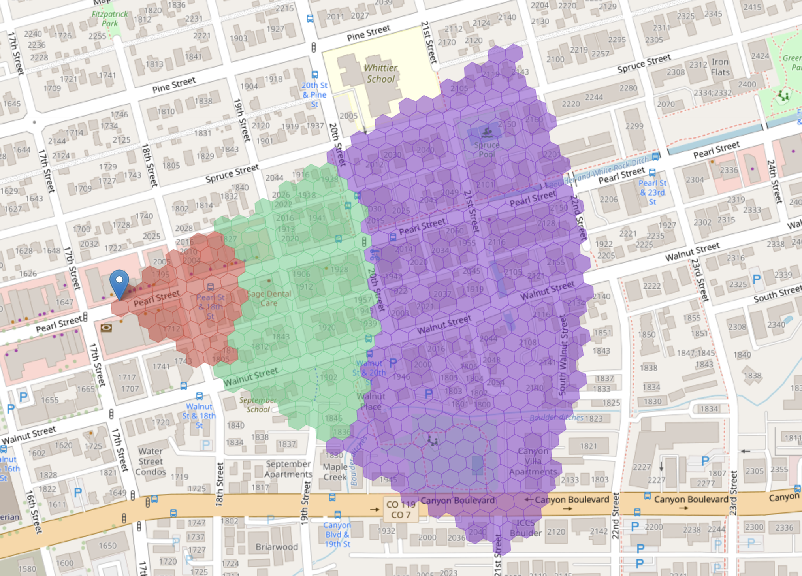

# HIP 135: Transitioning to Templated MOBILE Coverage

- Author(s): [@jhbr821](https://github.com/jhbr821), [@zer0tweets](https://github.com/zer0tweets), [@madninja](https://github.com/madninja)
- Start Date: 2024-10-09
- Category: Economic, Technical
- Original HIP PR: [#1095](https://github.com/helium/HIP/pull/1095)
- Tracking Issue: [#1100](https://github.com/helium/HIP/issues/1100)
- Voting Requirements: veMOBILE Holders

---

## Summary

[summary]: #summary

This HIP retroactively approves and updates the base coverage points of the emergency coverage templates that were deployed by Nova Labs as a result of a likely permanent outage in the Google Network Planner API that was previously relied on for the creation of modeled coverage objects. Specifically we propose using the median value of base CPs for all deployments of each radio type as the basis for deriving these templated coverage objects. These templated coverage objects have no impact on oracle hex multipliers or overlapping coverage and simply replace the clutter-adjusted objects previously provided by the Google Planner API.

## Motivation
[motivation]: #motivation

On 9/26/24, Nova Labs discovered an outage in the Google Network Planner service that was essential for the creation and maintenance of coverage objects. They immediately implemented a templated coverage fallback for deployments that required new or updated coverage objects. Subsequently, this templated coverage began to be deployed to all hotspots on 10/4/24.

In parallel to this, there have been ongoing discussions regarding the adoption of universal templated coverage objects in support of the Helium Mobile Network's efforts to expand internationally and given the lack of adequate existing services to create modeled coverage objects outside the US.

Further, because there are no current ways to enforce antenna direction and height for outdoor Wi-Fi units (these also are difficult to enforce post-CPI for CBRS units), real world coverage may not match modeled coverage if the asserted values do not match real world conditions.

Templated coverage objects are already utilized for outdoor Wi-Fi units deployed in Mexico as part of the Telefonica pilot, along with all indoor Wi-Fi and CBRS units.

## Stakeholders
[stakeholders]: #stakeholders

Deployers: Individuals who have deployments with more coverage points than the median will likely experience a decrease in rewards while those with fewer coverage points will see an increase in rewards. Deployments with no proposed changes in coverage points (those already utilizing templated coverage) may see a slight increase in rewards due to a decrease in the total number of coverage points of all deployments.

## Detailed Explanation
[detailed-explanation]: #detailed-explanation

Templated coverage objects are templates which cover a fixed number of high, medium, and low signal strength hexes and therefore provide a fixed number of "base" coverage points, i.e. the number of coverage points prior to any scaling due to oracle hex multipliers (HIP 103) or overlapping coverage (HIP 105). Templated coverage objects can also be derived (reverse engineered) from an intended number of base coverage points.

On 10/4/24, Nova Labs began to roll out a templated coverage object to all hotspots on the network derived from the following base coverage point parameters:

* Wi-Fi indoor - 400 CPs (no change)
* Wi-Fi outdoor - 1000 CPs
* Baicells 430 - 1428 CPs
* Baicells 436 - 5570 CPs
* Moso Indoor - 250 CPs (no change)
* Moso Outdoor - 504 CPs

Important note: these numbers represent post-HIP 113 values so the coverage objects created based off of them assign 16/8/4 CPs for high/medium/low hexes for Wi-Fi and 4/2/1 CPs for high/medium/low hexes for CBRS (see HIP 113 for further explanation).

While these numbers were primarily based on mean values across the network, two specific changes were introduced: The scaling down of CPs for Wi-Fi outdoor units (from 2164 mean CPs to 1000 in the object) and for the Baicells 436 (from 10648 mean CPs to 5570 in the object). For Outdoor Wi-Fi, the change was primarily driven by concerns about "height gaming" (falsely asserting an inflated height to maximize PoC earnings). This concern is born out by both real world investigations of hotspots and analysis of the distribution of coverage points across all outdoor Wi-Fi units which shows a significant rightward skew in the data along with a large standard deviation. For the Baicells 436, the scaling was performed due to the following concern: "The 436 setups generate unusually high points, likely because users with 436 antennas optimize propagation to maximize rewards. This leads to numerous inefficient setups, such as omni and butterfly antennas, in high-reward areas."

While these are certainly legitimate concerns, they are likely beyond the scope of an emergency HIP such as this one. Therefore, we propose a solely data-driven approach to creating these templated coverage objects utilizing the median values of base coverage points for each radio type prior to the implementation of templated coverages. This also helps mitigate some concerns over gaming setups as outlier data points will not impact the median value. Templated objects are proposed to be derived from the following base coverage point parameters:

* Wi-Fi indoor - 400 CPs (no change)
* Wi-Fi outdoor - 1760 CPs
* Baicells 430 - 795 CPs
* Moso Indoor - 250 CPs (no change)
* Moso Outdoor - 347 CPs
* Baicells 436 - 6464 CPs

Example templates by radio type are shown below. For the 436s, the exact shape will vary based on the beamwidth of the attached antenna. However, the total amount of base coverage points and hexes covered will remain the same regardless of antenna. (Red, green, and blue hexes represented high, medium, and low coverage respectively).

Wi-Fi Indoor:

Wi-Fi Outdoor:

Baicells 430:

Moso Indoor:

Moso Outdoor:

Baicells 436:

For these templated coverage objects, all the rules regarding oracle hex boosting (HIP 103) and overlapping coverage (HIP 105) still apply and will ultimately result in a final number of coverage points from which rewards for individual radios are derived. In addition, rewards will vary with the total number of coverage points on the network. The share of the PoC emission pool for each hotspot is determined by the final number of coverage points divided by the network total number of coverage points, as was the case prior to the implementation of templated coverage and as remains the case today.

## Drawbacks
[drawbacks]: #drawbacks

The main drawback is that this system no longer properly incentivizes deployments based on actual (or approximated through modeling) coverage as all deployments of a particular radio type receive the same rewards. Unfortunately, given the current lack of data to created modeled coverage, it is unclear how to mitigate this.

## Rationale and Alternatives
[alternatives]: #rationale-and-alternatives

This HIP is designed for one specific purpose, to provide a purely data-driven method for determining the amount of base coverage points that should be included in these templated coverage points. While concerns over height gaming and "useless" coverage are certainly legitimate, they are beyond the scope of this emergency HIP. Ongoing discussions in the community regarding "Proof-of-Utility" metrics will also likely result in further refinements to these CP values over time.

While some have suggested maintaining existing coverage objects and only applying templates to new assertions and re-assertions, this would unfairly impact these deployments. In addition, coverage objects expire and can be reset due to Skyhook or other mechanisms, so all deployments are likely to require templated coverage over time anyway.

A new data provider could be found, and had one previously been found. However, integration will still require months of work and templated coverage would be necessary regardless in the interim. In addition, the inability to compute modeled coverage outside the United States remains an issue.

## Unresolved Questions
[unresolved]: #unresolved-questions

None.

## Deployment Impact
[deployment-impact]: #deployment-impact

Nova Labs will be responsible for creating these templated coverage objects and deploying them on a network-wide basis. Deployments with coverage points exceeding the median for their radio type will likely see a decrease in PoC rewards while those with less than the median coverage points can expect to see an increase.

## Success Metrics
[success-metrics]: #success-metrics

Distribution of rewards aggregated by radio type after the deployment of these objects relatively closely match the distribution of rewards preceding the Network Planner API outage and the deployment of emergency templated coverage objects.
