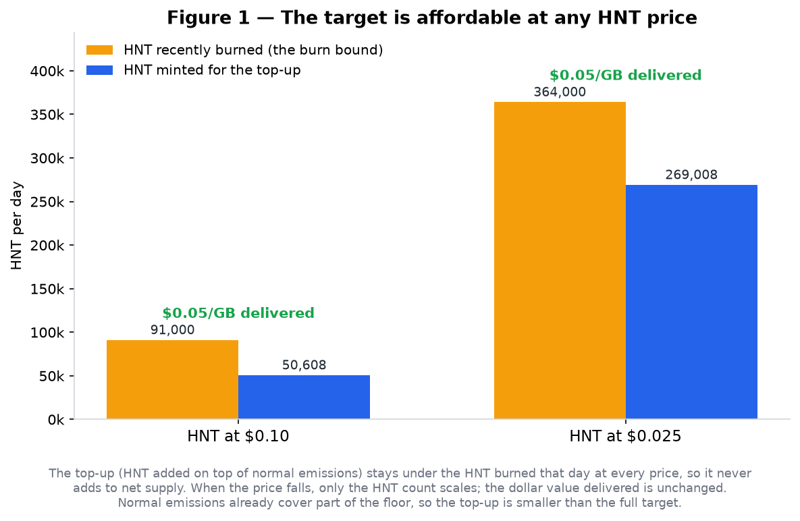
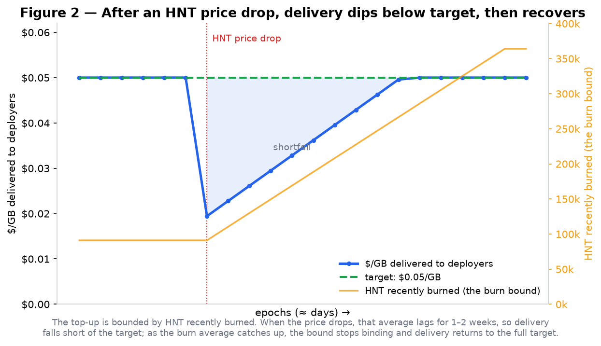

---
authors:
  - "@madninja"
start-date: 2026-06-02
category: Economic, Technical
original-hip-pr: https://github.com/helium/HIP/pull/1200
tracking-issue: https://github.com/helium/HIP/issues/1201
vote-requirements: veHNT Holders
status: In Discussion
reddit-post-id: 1twsn06
vote-summary-url: https://gist.githubusercontent.com/hiptron/dbaf4c1df802bf3f32a0eb75cb1918a3/raw/HIP-149-Vote-Summary.md
vote-pr: https://github.com/helium/helium-vote/pull/280
---

# HIP 149: Helium Utility and Emissions Realignment

## Summary

This HIP bundles four governance decisions, executed in a single program upgrade that ships once the Council is seated:

1. Mobile data deployers earn HNT based on the data they deliver, held within a band tied to the per-GB offload price Nova sets under [HIP 143][hip-143]: a target minimum, in dollars, of half that price, and a cap at three times it. The HNT that funds the minimum is capped at HNT recently burned, so the target on its own does not grow net HNT supply; earnings above the cap (when HNT appreciates faster than carrier revenue) are redirected to veHNT stakers and do not change supply. The Decision 2 supplement is separate, and it does raise the supply ceiling.
2. An operations and growth supplement: a per-epoch HNT mint into a Squads multisig vault administered by the Receiving Entity (the entity that receives the supplement mint; currently Nova Labs, Inc.) for a flat-rate window followed by a multi-year linear taper. Total **≈141M HNT over 36 months**, about 77% of current on-chain HNT supply (≈182.5M), front-loaded (≈50% in the first 12 months). Both windows are hardcoded at deploy and self-terminate.
3. Retirement of Proof-of-Coverage on both Mobile and IoT. Mobile data deployers earn pro-rata of rewardable bytes; the Service Provider allocation stays unchanged at 24%. IoT data transfer continues at the existing $/DC peg.
4. A 7-seat Advisory Council with standing oversight of how the operations and growth supplement is used, with the authority to escalate to a community curtailment vote (reduce, pause, or halt).

One veHNT vote approves all four decisions together. Acceptance of the supplement binds the Receiving Entity to good-faith commitments on how it is monetized, a non-compete, DC-burn alignment, and long-term alignment (the Receiving Entity Agreement), enforceable through the Council's escalation path; and no party holds any right to unminted or unallocated HNT.

## Motivation

The $0.50/GB target earn rate set in [HIP 53][hip-53] has compressed at the Hotspot. Over the past year, network rewardable bytes grew ≈4× (from ≈24K GB/day in June 2025 to ≈97K GB/day in April 2026) while HNT issuance stayed fixed under the [HIP 20][hip-20] schedule and HNT price more than halved.

Three problems follow:

- **Deployer earnings are unanchored to revenue.** Carrier-driven burn enters circulation as DC and permanently leaves on use; the income deployers receive is decoupled from the rate carriers actually pay.
- **Proof-of-Coverage pays for existing rather than for serving subscribers.** The work that grows the network now is offload utility, not coverage proofs.
- **Operations and growth are under-funded.** Carrier expansion, deployer programs, and core engineering are funded on a year-by-year basis with no encoded runway.

This proposal ties deployer earnings to the payer rate Nova sets under [HIP 143][hip-143], supplements operations and growth on a bounded schedule, retires PoC on both networks, and establishes standing community oversight of the supplement.

## Stakeholders

- **Mobile data deployers.** Gain two-sided participation from Decision 1: downside protection from the target minimum (binding at current HNT prices), and upside participation as HNT appreciates, since rewards are HNT-denominated, up to three times the payer rate. Above that the surplus is shared with stakers. The Decision 3 data bucket is unchanged at 70% (only PoC retires).
- **IoT data deployers.** Unchanged on the revenue side ($/DC peg preserved); IoT PoC retires.
- **veHNT holders and delegators.** 6% delegator allocation preserved, plus any Mobile data earnings above the Decision 1 cap. Effective HNT max supply rises from ≈206M (today's effective ceiling, after cumulative reductions since HIP 20) to ≈347M to fund the supplement in Decision 2.
- **Carriers and offload partners.** Continue under the existing [HIP 143][hip-143] commercial framework. The deployer target follows the payer rate.

## Detailed Explanation

### Decision 1: Revenue-linked emissions with a target minimum for Mobile deployers

What deployers get: earnings that move with the network in both directions. Proof-of-Coverage is already retired by consensus; in its place, deployers earn from the data they deliver, tied to the per-GB offload price Nova sets under [HIP 143][hip-143] (the dollar amount the network charges the payer per GB).

To the downside, a target minimum holds deployers at no less than half that price per GB: if HNT falls, the protocol re-emits a portion of the HNT burned for data transfer, sufficient to uphold the floor.

To the upside, deployers share in HNT's appreciation, because rewards are paid pro-rata in HNT, and their dollar value rises with the token, all the way up to three times the payer rate.

The old $/DC peg gave neither; it capped the dollar value of rewards per GB at the per-GB offload price, while allowing the effective reward rate in dollar terms to trend towards zero if the price of HNT diverged sufficiently from network data volumes. Now that network metrics reveal the verifiable utility each deployment delivers, the deployments carrying real traffic can share in the upside the token provides. Past three times the payer rate, where deployers would be earning more than triple what the payer pays for the data, the surplus flows to veHNT stakers. Deployers, stakers, and the network each gain.

Where the HNT comes from: the top-up is capped at the HNT recently burned, mostly Nova burning HNT to create the Data Credits used for paying the carrier offload. The protocol never mints more than was just burned, so this target on its own does not grow the net HNT supply, and when HNT price is low, HNT supply dynamics remain long-term deflationary. Decision 2's supplement is separate, and it does raise the supply ceiling.

The top-up is shared, not deployer-only: it is added to the epoch's total emissions and split across all reward pools by the usual percentages, the same as every other HNT emission. It is sized so Mobile data deployers reach the target after that split; the other pools (Service Provider Rewards, delegators, and the IoT sub-DAO) rise proportionally as a side effect.

The target minimum is what the protocol aims to deliver, not a hard guarantee every epoch. After a sharp drop in the HNT price, the amount delivered can fall short for 1 to 2 weeks, until the burn average catches up. Under normal conditions, deployers receive the full target.





| Condition | Outcome for Mobile data deployers |
|---|---|
| Baseline between half and three times the payer rate (USD/GB) | Top-up = 0, no redirect. Deployer earns baseline. |
| Baseline < half the payer rate | Total daily emissions increase, staying below the burn bound. Deployer earns half the payer rate in USD (target minimum binds). |
| Baseline < half the payer rate, and the required increase exceeds recent burns | Total daily emissions increase, bounded at `smoothed_hnt_burned`. Deployer earns below the target until the burn average catches up. |
| Baseline > three times the payer rate | Deployer earns three times the payer rate in USD (earnings cap binds); the excess HNT goes to veHNT stakers. Total daily emissions unchanged. |

The protocol computes the top-up (floor) and the overflow (cap) each epoch from the published formula:

```
D_target        = 0.5 × R_payer × bytes_GB / HNT_price
D_cap           = 3.0 × R_payer × bytes_GB / HNT_price
α               = mobile_percent_share × 0.70
top_up          = min(max(0, smoothed_hnt_burned − net_emissions_cap), max(0, (D_target − D_baseline) / α))
staker_overflow = max(0, deployer_pool − D_cap)
```

`R_payer` is the per-GB offload price Nova sets under [HIP 143][hip-143] (what the network charges the payer per GB); `bytes_GB` is rewardable bytes in the epoch (the GB that qualify for rewards); `HNT_price` is the HNT/USD price; `D_baseline = (HIP 20 schedule + Net Emissions re-emit) × α`; and `α` is the fraction of total HNT emission that reaches the Mobile data bucket. `mobile_percent_share` is the Mobile sub-DAO's on-chain percent share (a 30-epoch EMA of `mobile_vehnt / (mobile_vehnt + iot_vehnt)`, ≈0.89 today, giving `α ≈ 0.625`), read from chain each epoch; it is not a parameter and floats with veHNT delegation, so the target binds under any Mobile/IoT split.

The division by `α` follows from the distribution described above: only `α` of the top-up lands at Mobile data deployers; the remaining `(1 − α)` flows to Service Provider Rewards, the delegator pool, and the IoT sub-DAO at their existing percent shares (see Decision 3).

The cap is simpler than the top-up. `deployer_pool` is the Mobile data bucket itself, so the overflow above `D_cap` is moved directly from that bucket to the delegator pool with no `α` division (the top-up needs the division only because it sizes a DAO-level mint that then splits across buckets). The overflow is neither minted nor burned: total emission that epoch is unchanged, and the HNT is paid to veHNT delegators (claimed DAO-wide pro-rata of total veHNT) instead of deployers, so the cap is net-supply-neutral. The floor and the cap never bind in the same epoch, since the floor sits at a sixth of the cap. On-chain, the redirect rides the existing reward fields: the Mobile sub-DAO's reward-issuance step mints the overflow to the delegator pool rather than the rewards escrow, and the verifier oracle sizes the Mobile data pool as the escrow remainder after the flat Operations Fund cut, so no new account or schema is required.

The `min(max(0, smoothed_hnt_burned − net_emissions_cap), …)` cap stops the top-up from emitting more HNT than has recently been burned, and shares one burn budget with the existing HIP 20 net-emissions re-emit so the two paths never re-mint the same destroyed HNT twice. That HIP 20 re-emit already mints `min(smoothed_hnt_burned, net_emissions_cap)` (net-emissions cap ≈1,644 HNT/epoch) and is already counted in `D_baseline`; the top-up is allowed only the burn beyond it, `max(0, smoothed_hnt_burned − net_emissions_cap)`. `smoothed_hnt_burned` is the existing HIP 20 variable: a 7-epoch moving average of HNT destroyed on-chain, mostly from Nova's burns to mint DC. By construction the two re-emission paths sum to at most `smoothed_hnt_burned`, so together they never exceed HNT destruction over the same window, and the target on its own never adds to net supply; any single-epoch divergence between re-emission and that epoch's burn is the moving-average lag, bounded over the window. The deployer-facing trade-off shows up during sharp HNT price moves: it takes Nova 1–2 weeks of burns at the new price for the average to catch up, and during that window the cap binds and delivery falls short of the full target. Once the average catches up, delivery returns to the full target.

Effective Mobile data deployer earn rate per GB = `clamp(baseline_$/GB, 0.5 × R_payer, 3.0 × R_payer)`, the floor subject to the burn bound. Two effects flow through to deployers without a follow-on vote: HNT/USD price increases raise the USD value of pro-rata baseline rewards, up to the cap at three times the payer rate, above which the excess goes to stakers; payer-rate increases under [HIP 143][hip-143] raise both the floor and the cap.

Before the vote, and separately from this proposal, Nova reduces the payer rate from $0.50/GB to ≈$0.10/GB under [HIP 143][hip-143] (its existing authority), reflecting current commercial offload rates, with further adjustments permitted under Nova's commercial discretion. The floor and cap follow from that rate: $0.05/GB (50% × $0.10) and $0.30/GB (300% × $0.10).

Where deployers land depends on the HNT price. At current delegations (`α ≈ 0.625`), ≈91K GB/day rewardable volume, and the ≈13,870 HNT/day Mobile data deployer baseline (HIP 20 schedule + Net Emissions re-emit pass-through, with the data bucket unchanged at 70%), the baseline equals the $0.05/GB floor near an HNT price of $0.33 and the $0.30/GB cap near $1.97. HNT trades below the floor threshold today (≈$0.27), so the target minimum is already binding and is the protection that matters now; the cap is a guard against sustained appreciation, several times above the current price. The floor also activates under a payer-rate uplift; the cap also activates under a payer-rate cut.

The target share (50%), the cap (300%), and the 70% Mobile data bucket are hardcoded; changing them requires a community HIP and program upgrade.

IoT data transfer is unaffected by Decision 1 and continues on the existing $/DC peg. The IoT sub-DAO's existing percent share of any Mobile-driven top-up flows to the IoT Operations Fund (Decision 3).

### Decision 2: Operations and growth supplement

A per-epoch HNT mint into an operations and growth supplement vault (a Squads multisig administered by the Receiving Entity; recipient address fixed at the program upgrade), with two hardcoded boundary timestamps. Distinct from the on-chain Service Provider Rewards in Decision 3 (a flat 24% slice of Mobile sub-DAO emission distributed on-chain); the supplement vault is a separate mint stream that does not flow through the sub-DAO allocation.

| Parameter | First window (flat) | Second window (taper) |
|---|---|---|
| Per-epoch rate | ≈196,000 HNT | 196,000 → 0 (linear decay) |
| Duration | ≈360 days (≈12 months) | ≈720 days (≈24 months) |
| Total | ≈70.6M HNT | ≈70.6M HNT |
| Boundary | hardcoded at ≈mint start +12mo | hardcoded at ≈mint start +36mo |

Combined accrual: **≈141M HNT**, fully bounded at deploy. Both boundaries auto-terminate via hardcoded timestamps; no future vote or manual halt is required to end them.

**Scale.**

| | Value |
|---|---|
| Mint rate during flat window | ≈196,000 HNT/day (≈9.5× the current ≈20,548 HNT/day HIP 20 network emission) |
| Vault share of gross HNT issuance during flat | ≈90% (mint + existing emission ≈ 216,500 HNT/day; vault receives ≈196,000 of it, less the ≈1.25% Council-compensation carve-out in Decision 4) |
| Program total | ≈141M HNT over 36 months, front-loaded (≈50% in the flat first 12 months, ≈50% tapering linearly over the next 24) |
| Cumulative new supply vs current on-chain HNT | ≈141M / ≈182.5M ≈ 77% of current on-chain HNT supply (issued over 36 months) |
| USD value at HNT $0.30 reference | ≈$42M total (≈$21M in the first 12 months, ≈$21M over the next 24); illustrative, scales linearly with HNT price |

USD figures in this proposal are illustrative at a ≈$0.30 HNT reference and scale linearly with price; the binding commitments are HNT-denominated.

**Supply impact.** The supplement is a new mint stream, additive to [HIP 20][hip-20]'s halving schedule and not subject to its halvings. [HIP 20][hip-20]'s halving schedule continues unchanged; its named max-supply property is not preserved. HIP 20 projected an asymptotic max of 223M HNT in Nov 2020. Cumulative permanent reductions since (≈9.5M L1 post-Y1 reductions plus ≈10.3M Solana-era burns above the net_emissions_cap path and via the no_emit wallet, partially offset by HIP 138's ≈2.9M supplement above schedule) have shifted the effective ceiling to ≈206M today (current on-chain supply ≈182.5M plus ≈23.6M remaining under the HIP 20 schedule). Effective max HNT supply rises from ≈206M to ≈347M (= 206M + 141M HIP 149 supplement). The same pattern was used in the audited [HIP 138][hip-138] MOBILE-treasury supplement (≈2.9M HNT minted outside HIP 20's schedule from Dec 2024 to Aug 2025); the supplement here is also bounded at deploy.

**Use of funds.** International carrier expansion, deployer programs, engineering (network intelligence and carrier interoperability), ecosystem grants, regulatory work, and core operating costs. The supplement mints to the vault only; it does not flow to on-chain Hotspot rewards. Council compensation (Decision 4) is a separate ≈1.25% of the supplement minted directly to the five community-nominated members, not routed through this vault and not one of the operating uses above.

**Bound and immutability.** Per-epoch rate, boundary timestamps, and recipient vault address are fixed at the program upgrade; changing any of them requires a new community-voted program upgrade. Vault balance and outflows are observable on-chain in real time.

### Decision 3: PoC retirement on both networks

Removal of Proof-of-Coverage mechanisms from the Mobile and IoT verifier oracles, and reframing of the Mobile Service Provider allocation.

**Mobile sub-DAO allocation (at the program upgrade):**

| Bucket | Today | Under this proposal |
|---|---|---|
| Data deployers | ≈70%, pro-rata in practice | **70%**, pro-rata of rewardable bytes (unchanged) |
| Service Provider Rewards | 24% flat | **24% (unchanged)** |
| veHNT delegators | 6% | 6% (unchanged) |
| PoC bucket | residual under [HIP 147][hip-147] | **0** (retired) |

PoC retirement is the only Mobile allocation change: the data bucket stays at 70% and Service Provider Rewards stay at 24%. The deployer value comes from Decision 1's target minimum and earnings cap, which at current HNT prices is the binding support.

The Service Provider Rewards bucket is unchanged: a flat 24% to Nova Labs, the single registered Service Provider. Future carriers onboard as offload carriers under the existing [HIP 143][hip-143] framework, not as on-chain SPs.

**IoT sub-DAO changes:**

- PoC bucket retired.
- IoT data transfer continues at the existing $/DC peg (no change to deployer income mechanism).
- IoT Operations Fund absorbs the former PoC bucket and data-bucket underflow.
- The IoT sub-DAO's existing percent share of any Mobile-driven top-up (Decision 1) also flows to the IoT Operations Fund. IoT data deployers are already paid at peg from baseline; this share is not split with them.

**Top-up flow.** Decision 1's top-up distributes via the standard sub-DAO allocation. At the current ≈89/11 Mobile/IoT veHNT split, ≈62% reaches Mobile data deployers (the targeted uplift); the remaining ≈38% routes to Service Provider Rewards (≈21%), the delegator pool (≈6%), and the IoT sub-DAO (≈10%) at their existing percent shares. These shares move with veHNT delegation. The IoT sub-DAO's portion flows to the IoT Operations Fund.

### Decision 4: Advisory Council

A 7-seat Advisory Council with standing oversight of how the operations and growth supplement is used across both supplement windows. Its members are charged to act independently and in the best interest of the Helium Network and its HNT holders. The Council exists for the life of the supplement; its term and dissolution are set out below.

**Composition:**

- **5 community-nominated.** Any veHNT holder above a low nomination threshold may nominate themselves or others (with the nominee's consent); each nominee confirmed by veHNT-weighted vote, with each holder voting for up to five candidates. The Receiving Entity recuses the veHNT positions it directly controls from voting on these five seats; it does not control, and makes no commitment for, the voting of its individual equity holders.
- **2 Receiving-Entity-appointed.** Designated directly by the Receiving Entity; voting members; the Receiving Entity is responsible for their conduct and may replace them at any time at its discretion. They serve unpaid: compensation is paid only to the five community-nominated seats.
- All members' identities are disclosed to the community; no member serves anonymously.

**Term.** The Council's term runs with the supplement. It ends on the earliest of: a community vote to dissolve the Council; full distribution of the ≈141M HNT supplement; or the Receiving Entity declining further distributions. If the supplement is suspended early through a curtailment, the Council survives 90 days to facilitate restart discussions, then dissolves unless a restart HIP is actively in the voting process. There are no automatic renewals.

**Authority:** Once seated, the Council has the following authority at any time, including the pre-mint review window and both supplement windows.

- Confidential information rights over use of the operations and growth supplement and the Receiving Entity's progress toward the supplement's goals, including category-level financials and insight into carrier revenue negotiations relevant to the [HIP 143][hip-143] payer-rate setting (insight only; [HIP 143][hip-143] authority stays with Nova). The information rights are detailed in the [Governance Framework][council-roles].
- Standard actions (demand disclosure, publish dissent, recommend course-correction): 3 days' notice; quorum 5 of 7 seated, including at least 3 community seats; simple majority.
- Escalation action: recommend a curtailment of the supplement (a reduction, pause, or halt): 5 days' notice and a 5-day Council voting period; quorum 5 of 7 seated, including at least 3 community seats; simple majority. The Receiving Entity's 2 seats alone cannot trigger or block.
- No unilateral on-chain levers. A curtailment recommendation does not take effect by itself; it triggers a community vote (below). Halting or amending either supplement window requires a community-voted program upgrade; the community retains the final vote.

**Council-raised curtailment vote (operations and growth supplement; either or both supplement windows):**

- Triggered by Council escalation, at any time once seated.
- Announced within 3 days of the Council vote; minimum 7-day discussion period and 7-day voting window.
- Approved by a simple majority of voted veHNT; 100,000,000 veHNT quorum. Asymmetric with the authorizing vote: authorizing the supplement takes a 66.67% supermajority, while curtailing it (reduce, pause, or halt) through Council escalation takes a simple majority. The lever loosens downward only.
- On approval, a program upgrade implementing the curtailment is deployed within 7 days. Termination halts subsequent accrual in the active window (or, before mint start, prevents the first window from beginning).
- Curtailment can only reduce, pause, or halt the mint. Any increase, acceleration, restart, or other amendment requires a standard community HIP at the 66.67% supermajority.

This is the Council's built-in escalation mechanism, not a limit on normal governance: the community may raise an independent HIP to amend or stop the mint at any time, under the vote requirements that apply to that proposal.

**Scope.** Council authority over the supplement is oversight, not control. It covers whether spending conforms to the use-of-funds purposes in Decision 2 and the Receiving Entity's commitments under the Receiving Entity Agreement. The Council cannot block or direct any individual spend, cannot override the [HIP 143][hip-143] payer rate (which stays with Nova), and does not impose new spending restrictions by its own authority. The target-minimum parameters (the 50% share and the formula) sit outside Council authority; changing them requires a community HIP and program upgrade.

**If funds are used outside scope.** The Council has no on-chain veto over the supplement vault. Where it finds use outside the defined purposes or a breach of the Receiving Entity Agreement, its remedies escalate: (1) demand disclosure; (2) publish dissent; (3) recommend course-correction; (4) recommend a curtailment, which on a simple-majority community vote can reduce, pause, or halt the supplement. The binding safeguard is the community's standing ability to curtail the supplement.

**Vacancies.** When one or more community-nominated seats are vacant for any reason, the mint continues and the Council retains full authority, including escalation. Quorum adjusts to the seated members minus one, provided at least two community-nominated members remain seated. If fewer than two community-nominated members are seated, the Council cannot act and the mint pauses until at least three community-nominated members are seated. An expedited replacement vote is initiated within 14 days of the vacancy and completed within 30 days. The Receiving Entity may replace its two appointed seats at any time at its discretion.

**Removal.** A member may be removed for cause (fraud, breach of the duty of care and loyalty, breach of the CPA or trading policy, sustained non-participation, or conduct materially harming the network) by a Council vote followed by a community vote, or without cause by at least four votes to remove. The Receiving Entity may suspend a member's access to confidential information for cause; suspension does not by itself vacate the seat. Details are in the [Governance Framework][council-roles] and the [CPA][council-cpa].

**Compensation.** Paid only to the five community-nominated members; the two Receiving-Entity-appointed seats serve unpaid. The five community seats share **1.25% of the supplement** (≈1.76M HNT total; ≈352,500 HNT per seat over the program if all five remain seated; at the ≈$0.30 reference, ≈$529K total, illustrative and scaling with HNT price), distributed pro-rata among the seated community members and minted directly to their wallets. The full 1.25% is always distributed: a vacant seat's share goes to the seated community members, not back to the vault. The Receiving Entity is not the custodian or payer of these funds. A member accrues only while seated. The total allocation may be adjusted by Council vote or community vote but may not exceed 1.25% of the supplement. Members receiving compensation must pass KYC, are responsible for their own taxes, and fund any independent legal counsel from their compensation; all compensation is publicly reported by the Council quarterly. There is no Council-controlled discretionary or operating fund.

**Receiving Entity voting position.** The Receiving Entity votes its veHNT like any other holder, including on votes arising from Council escalation; all votes are public on-chain. Supplement HNT is different: the Receiving Entity does not lock or delegate supplement HNT for voting while it is under its control. The vault address is fixed, so outflows into lockup positions are publicly traceable.

**Operational terms.** The Council's composition, authority, scope, and the supplement parameters are established by this HIP and the [Advisory Council: Roles, Responsibilities, and Access][council-roles] document (the Governance Framework), an appendix to and extension of this HIP, amendable only by community vote. The member-level operational terms a member takes on once seated, the detailed information rights, confidentiality, the HNT trading policy, and removal for cause, take binding effect through the [Confidentiality and Participation Agreement (CPA)][council-cpa] each member signs with the Receiving Entity. These do not alter the authority established here.

### Receiving Entity Agreement

Acceptance or use of any supplement funds constitutes the Receiving Entity's acceptance of the commitments below. These are good-faith commitments overseen by the Council; they are not financial directions, and the Council does not approve, deny, or direct individual transactions. The Council's sole remedy for a breach is to recommend a curtailment under the escalation process in Decision 4.

- **Monetization guidelines.** The Receiving Entity will, in good faith and to the extent commercially practicable, prefer over-the-counter sales over open-market or exchange sales of the supplement allocation, and seek reasonable lockup periods on OTC purchasers, so as not to flood the market before the long-term benefits of the allocation are realized. It will report all supplement sales activity (type, size, timing, and lockup terms, aggregated so as not to disclose information it is legally restricted from sharing) to the Council.
- **Non-compete.** The Receiving Entity will not fund, develop, or acquire any blockchain network or token that competes with the Helium Network or HNT during the Supplement period and for three (3) years thereafter. This restriction does not prevent ordinary business activity, integrations, partnerships, software development, or technology work that primarily supports the Helium Network, increases adoption, improves utility, increases DC burn, supports deployer economics, or contributes to long-term sustainability.
- **DC burn alignment.** The Receiving Entity will, to the greatest extent commercially practicable, process carrier offload usage fees through the DC burn mechanism, acknowledging that offload revenue cannot always be determined cleanly in the moment and that periodic reconciliation may be required. Authority over the payer/burn rate remains with Nova under [HIP 143][hip-143].
- **Long-term alignment.** The Receiving Entity will work in good faith to align its interests with those of token holders over the life of the mint and thereafter, to the extent consistent with its obligations to its equity holders and applicable law, and will present recommendations to the Council and community on how that alignment could be encoded in the mint-and-burn protocol, with a first recommendation within six (6) months of mint start. Any such encoding is implemented through the community's normal governance process (HIP and program upgrade), not by Receiving Entity or Council fiat.

Where the Council concludes the Receiving Entity is not honoring these commitments, its remedy is to recommend a curtailment of the supplement under Decision 4, which on a simple-majority community vote can reduce, pause, or halt the supplement. The supplement is curtailed only through a community vote, not by Council action alone.

### No rights in unminted or unallocated tokens

No person or entity, including the Receiving Entity, any Council member, contributor, advisor, participant, or affiliate, holds any right, title, interest, entitlement, expectancy, or claim in or to any portion of the supplement that has not been both minted and transferred to a wallet designated for that person or entity. Tokens are owned only upon actual transfer to the designated wallet.

For the supplement authorized under Decision 2, the designated wallet is the on-chain vault whose address is fixed at the program upgrade, and each per-epoch mint is transferred to that vault upon minting; no separate allocation process, custodian, or third-party authorization stands between the mint and that vault. No prior communication, course of dealing, Council membership, allocation discussion, or projection creates any right to tokens not actually transferred pursuant to an authorized allocation. By exercising control over any allocated minted tokens, a party accepts this provision.

### Execution sequence

| Milestone | Timing | What happens |
|---|---|---|
| **Pre-vote payer-rate change** | pre-passage | Nova reduces the payer rate from $0.50/GB to ≈$0.10/GB under [HIP 143][hip-143] (existing authority; no governance vote required), reflecting current commercial offload rates. |
| **Passage** | pre-M0 | Bundle approved at the 66.67% supermajority. Council nomination opens. |
| **Council seated** | M0 | Per-nominee community confirmation concludes; all seven seats filled, disclosure obligations and escalation pathway operational. Within 48 hours of seating, the Receiving Entity turns over the materials approved for Council review; any delay extends the mint start by an equal period. Program upgrade ships: the target-minimum formula (live; binding at current HNT prices near $0.27), PoC retirement in Mobile and IoT verifier oracles, Mobile data rewards move to 70% pro-rata (unchanged bucket), Service Provider Rewards unchanged at 24%. Supplement mint configured but not yet active. |
| **Mint start** | M0 + 2 weeks | First-window supplement begins minting into the vault. The two-week gap lets the seated Council conduct diligence and, if it objects, recommend a curtailment that triggers a community vote before minting starts; a halt here prevents the first window from beginning. Its standing escalation power continues throughout both windows. |
| **Flat boundary** | ≈ mint start + 12 months (hardcoded) | First-window supplement auto-transitions to the tapering window. |
| **Taper boundary** | ≈ mint start + 36 months (hardcoded) | Tapering supplement reaches zero and halts. |

### Voting mechanics

- veHNT-weighted, single yes/no on the four-decision bundle. The Council exists to oversee the supplement that funds operations and growth; voting them separately would let one pass without the other.
- Minimum 7-day forum discussion period; 7-day voting window.
- 66.67% supermajority of votes cast; 100,000,000 veHNT quorum. Token-economic votes pass on a supermajority, not a simple majority (precedent: [HIP 85][hip-85], [HIP 124][hip-124]); a proposal should not authorize its own issuance at a self-set simple-majority bar.

### What this proposal does not change

- [HIP 20][hip-20] halving emission schedule and Net Emissions re-emission mechanism (HIP 20's max-supply projection is raised by HIP 149's supplement; the schedule itself runs unchanged).
- Sub-DAO structure (Mobile and IoT).
- veHNT lockup positions, multipliers, and voting mechanics.
- 6% delegator allocation.
- [HIP 138][hip-138] single-token (HNT) reward model.
- [HIP 143][hip-143] commercial payer-rate decoupling. The deployer target anchors to the payer rate Nova sets under [HIP 143][hip-143]; authority over the rate itself stays with Nova.
- [HIP 130][hip-130] data-only Mobile Hotspots.
- $/DC peg for IoT data transfer.

## Drawbacks

- **Dilution.** The supplement in Decision 2 raises effective max HNT supply from ≈206M (today's effective ceiling, after cumulative reductions since HIP 20's 2020 projection) to ≈347M. The accrual is bounded at deploy and self-terminating.
- **Bundling.** Voters cannot accept some decisions and reject others. The decisions are operationally coupled (the Council oversees the supplement; the target relies on the same program upgrade as PoC retirement), but a voter who supports three of four still has to vote on the bundle.
- **PoC removal ends a reward category.** Some deployments that brought network value primarily through PoC may not be sustained on data utility alone. The proposal accepts this trade in exchange for routing rewards to verifiable utility.
- **Dependence on the payer-rate setting.** The deployer target depends on the payer rate Nova sets under [HIP 143][hip-143]. Council insight rights cover this setting, but the authority remains with Nova as in [HIP 143][hip-143].
- **Delivery dips briefly after sharp HNT moves.** The top-up is bounded by `smoothed_hnt_burned` so it can't emit more HNT than has been burned recently. After a sharp HNT crash, deployers get partial delivery for 1–2 weeks until Nova's burns at the new price lift the moving average; delivery returns to the full target after. The same bound is what prevents unbounded minting under crash.

## Rationale and Alternatives

**Why a target tied to the payer rate rather than a fixed $/GB.** A fixed $/GB number goes stale as HNT price and offload economics change; the original $0.50/GB target no longer reflects actual deployer earnings. Tying the target to the payer rate Nova sets under [HIP 143][hip-143] makes deployer earnings track the revenue the network actually generates and routes future payer-rate improvements directly to deployers.

**Why cap deployer earnings at three times the payer rate, and route the excess to stakers.** Because the baseline pool is fixed in HNT and distributed pro-rata, its USD value rises without limit as HNT appreciates, so deployers could earn many multiples of what the payer pays the network for the same GB. The cap bounds that: deployer USD pay can't run more than 3× ahead of revenue. The 6× band ($0.05 to $0.30/GB at the current payer rate) leaves deployers full exposure to HNT appreciation through normal ranges and engages only on sustained appreciation. The excess is redirected to veHNT stakers rather than burned: it gives lockers a revenue-linked upside that activates exactly when deployer pay outruns revenue, and keeps the cap net-supply-neutral. Burning instead would tighten supply but return nothing to participants; redirecting concentrates the benefit on the holders who lock to govern.

**Why pro-rata of rewardable bytes for Mobile data.** Pro-rata is splitting-resistant by construction: subdividing a busy site doesn't change total rewards earned from its traffic. Tiered-DAU and per-Hotspot caps were modeled and rejected because they reward subdivision.

**Why retire PoC rather than reduce it further.** [HIP 147][hip-147] already implemented "data eats first" in Sept 2025. With most viable Mobile deployments now reaching carrier offload within weeks, the residual PoC bucket pays for existing rather than for utility. Retiring it is preferable to maintaining a verifier code path that produces near-zero rewards.

**Why encode the supplement rather than seek annual approvals.** Operations and growth funding through year-by-year HIPs creates uncertainty that compromises multi-year hiring, partner commitments, and carrier expansion. Encoding the windows at deploy with hardcoded boundaries gives the protocol runway without leaving open-ended issuance authority. The same pattern was used in the audited [HIP 138][hip-138] MOBILE-treasury supplement (2024-2025).

**Why a 7-seat Council rather than a larger body or no body.** A 7-seat Council with 5 community-elected members is large enough that no single appointment swings outcomes and small enough to function as a working body. Without a Council, the supplement accrues without scheduled disclosure.

**Alternatives considered and not adopted:**

- A 60/40 tiered-DAU + data composite for Mobile, rejected because tiered-DAU's diminishing-returns curve creates a splitting incentive.
- A utility-indexed emission curve replacing the [HIP 20][hip-20] schedule, rejected in favor of preserving the halving schedule and layering a USD target minimum on top.

## Unresolved Questions

- Council nomination threshold (veHNT minimum) for the initial seating and replacement votes.
- Whether to add additional disclosure obligations beyond the quarterly supplement outflow report.

## Deployment Impact

The on-chain changes ship in a single program upgrade once the Council is seated. Verifier oracle changes for PoC retirement (Mobile and IoT) are coordinated with that upgrade. We leave the implementation of the program upgrade and verifier oracle changes up to the Helium Core Developers to determine.

This proposal is not backwards compatible in the sense that PoC reward emissions stop when the program upgrade ships (at Council seating). Hotspots earning predominantly through PoC today will see their rewards drop to zero from the PoC bucket and depend on data utility. The target minimum and earnings cap are the offsetting mechanisms for Mobile (the data bucket is unchanged at 70%); IoT continues at the existing $/DC peg.

HIPs retired by Mobile PoC removal: [74][hip-74], [75][hip-75], [85][hip-85], [105][hip-105], [113][hip-113], [119][hip-119], [131][hip-131], [133][hip-133], [135][hip-135], [147][hip-147].

HIPs retired by IoT PoC removal: [15][hip-15], [17][hip-17], [54][hip-54], [58][hip-58], [83][hip-83], [136][hip-136], [137][hip-137].


HIPs partially amended: [10][hip-10] (Mobile $/DC peg replaced by pro-rata of rewardable bytes plus the target minimum; IoT $/DC peg preserved), [53][hip-53] ($0.50/GB Mobile target superseded by Decision 1's target minimum; Mobile sub-DAO structure preserved), [93][hip-93].

Documentation at <http://docs.helium.com> will need to reflect the retirement of PoC on both networks, the new Mobile allocation, and the target-minimum mechanism.

## Success Metrics

- Mobile data deployer earnings (USD per GB) meet the target in every epoch after Decision 1 goes live, outside the brief recovery windows after a sharp HNT price drop.
- Carrier offload traffic on the Mobile network (rewardable GB/day) continues to grow after passage.
- Operations and growth supplement vault outflows are published quarterly by the Council, with material disclosures (carrier expansion commitments, deployer programs, ecosystem grants).
- Council activity: nominee participation, quorum on standard actions, escalation events surfaced for community vote.

[council-roles]: ./files/0149/advisory-council-roles.md
[council-cpa]: ./files/0149/advisory-council-cpa.md
[hip-10]: ./0010-usage-based-data-transfer-rewards.md
[hip-15]: ./0015-beaconing-rewards.md
[hip-17]: ./0017-hex-density-based-transmit-reward-scaling.md
[hip-20]: ./0020-hnt-max-supply.md
[hip-53]: ./0053-mobile-dao.md
[hip-54]: ./0054-h3dex-targeting.md
[hip-58]: ./0058-poc-distance-limit.md
[hip-74]: ./0074-mobile-poc-modeled-coverage-rewards.md
[hip-75]: ./0075-mobile-poc-initiate-programmatic-minting-and-updated-emissions-curve.md
[hip-82]: ./0082-helium-mobile-service-provider.md
[hip-83]: ./0083-restore-first-to-witness.md
[hip-85]: ./0085-mobile-hex-coverage-limit.md
[hip-87]: ./0087-proportional-service-provider-rewards.md
[hip-93]: ./0093-addition-of-wifi-aps-to-mobile-subdao.md
[hip-105]: ./0105-modification-of-mobile-subdao-hex-limits.md
[hip-113]: ./0113-reward-cbrs-as-experimental.md
[hip-119]: ./0119-closing-gaming-loopholes-within-the-mobile-network.md
[hip-124]: ./0124-securing-iot-governance-through-voting-rewards.md
[hip-130]: ./0130-data-only-mobile-hotspots.md
[hip-131]: ./0131-bridging-gap-between-verification-mappers-and-anti-gaming-measures.md
[hip-133]: ./0133-bridging-gap-for-anti-gaming-measures-phase2.md
[hip-135]: ./0135-transitioning-to-templated-mobile-coverage.md
[hip-136]: ./0136-eliminate-iot-rewards-for-redundant-coverage.md
[hip-137]: ./0137-remove-cn470-from-iot-poc.md
[hip-138]: ./0138-return-to-hnt.md
[hip-143]: ./0143-decoupling-service-provider-pricing-from-governance.md
[hip-147]: ./0147-mobile-data-eats-first.md
