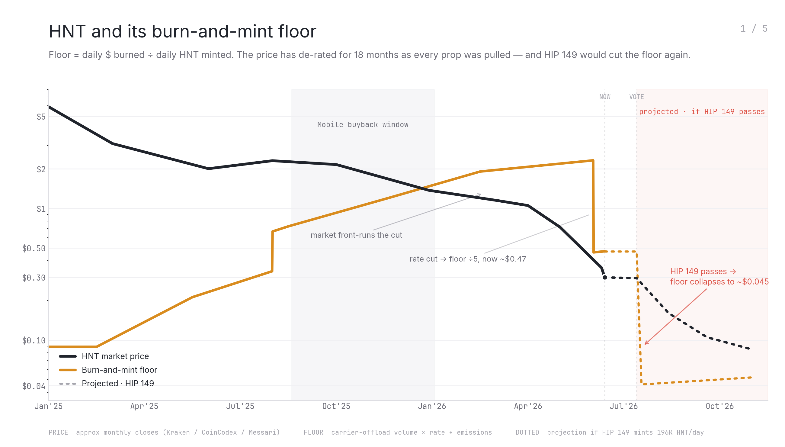
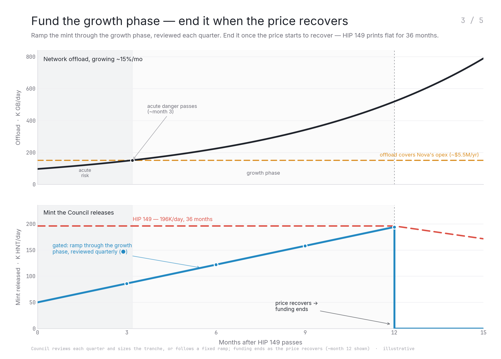
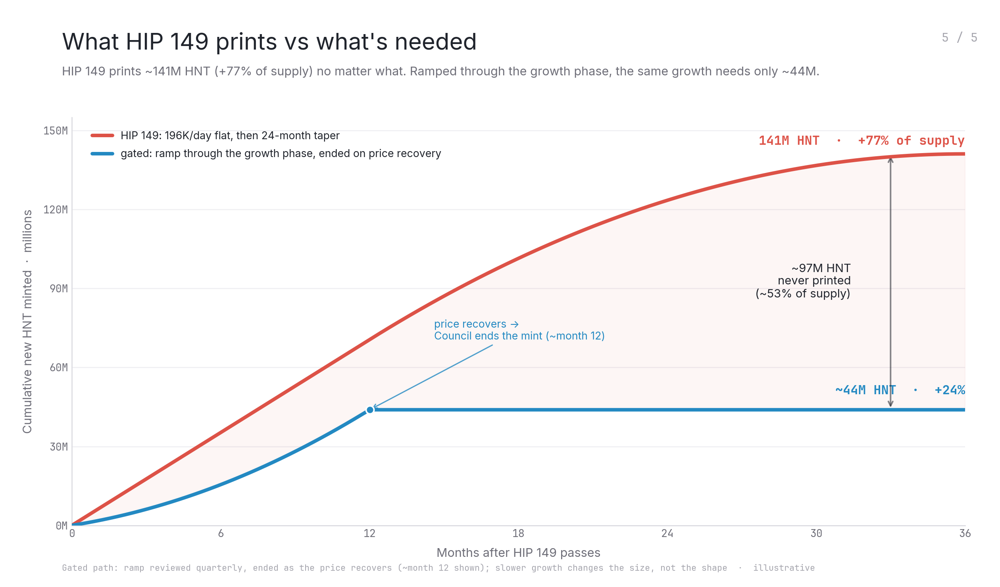
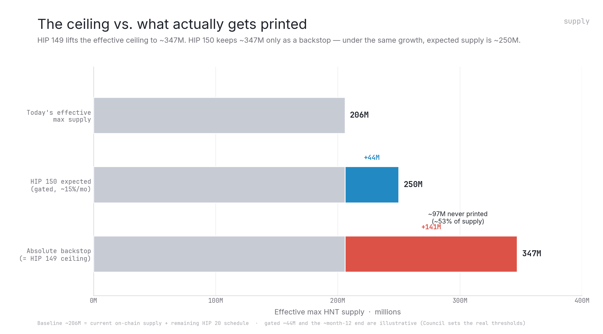
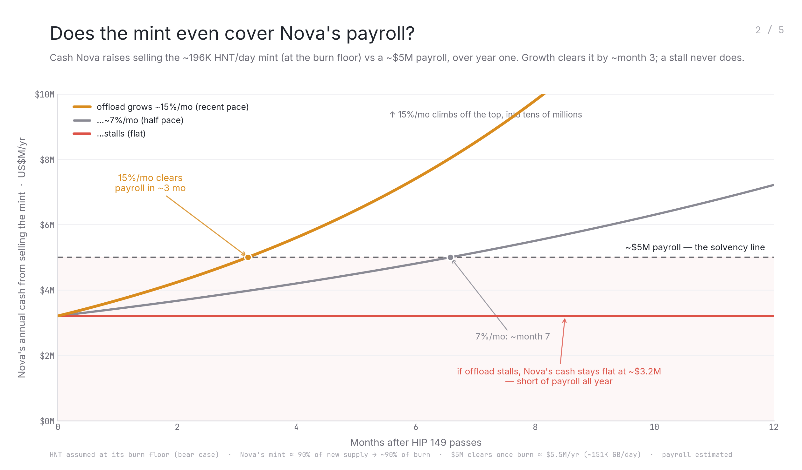
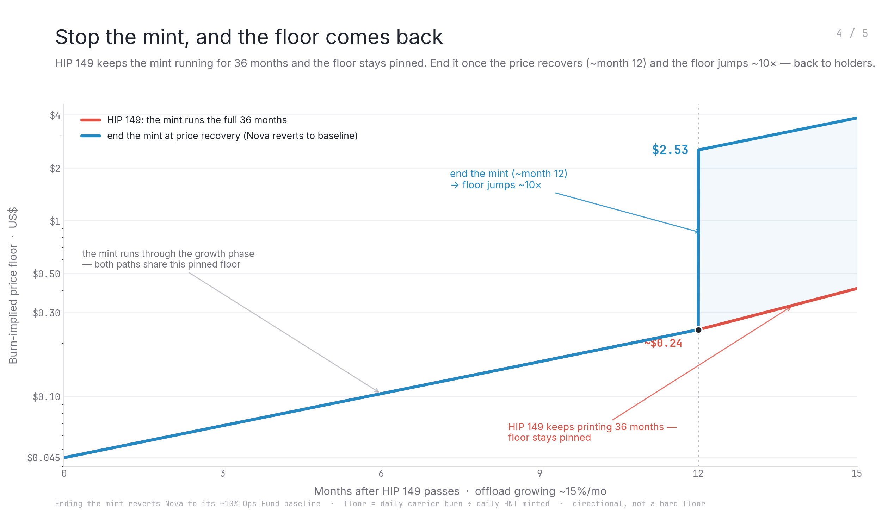

# HIP 150: The People's Network

*Surgical modifications to [HIP 149][hip-149] by @gradoj.*

> **Author's note.** This proposal is written by a veHNT/token holder. The author seeks no Advisory Council seat, no operational role, and no control over Nova or Helium Foundation funds — the only interest here is the value of HNT. HIP 150 is not a rewrite of HIP 149; it keeps HIP 149's structure intact and makes precision edits to the one thing that most damages token value: an unconditional, front-loaded mint.
>
> The premise is simple. Nova understands this is a fight for its existence and will deploy capital to grow wifi offload. The community's job is therefore **not** to audit, gate, or second-guess Nova's technical progress — its primary lever on the *new issuance* is to decide **when to stop diluting the token.** Every token minted and sold transfers value from token holders to Nova's private equity; the more we dilute, the larger that transfer. If Nova succeeds, that upside accrues to equity that holders financed through dilution; if Nova fails, everyone loses. The Advisory Council exists to keep that transfer as small as possible while still giving Nova the runway to survive.
>
> But this is more than an off-switch on dilution. The same Council is given **direct control of the operations funds and Helium Foundation–controlled funding** — a genuine restoration of community authority. A community-majority body, acting in the interest of token holders and the network, becomes the standing steward of how protocol funds are raised and spent, rather than leaving that to Nova or the Foundation alone.

## Summary

This HIP bundles four governance decisions, executed in a single program upgrade at passage:

1. Mobile data deployers earn HNT pro-rata of rewardable bytes. A USD-anchored backstop tops up that baseline whenever it falls below 50% of the carrier-paid burn rate Nova sets under [HIP 143][hip-143].
2. An operations and growth capitalization: a per-epoch HNT mint into a Nova-administered Squads multisig vault, released as a **ramp that begins small and is wound down by the Advisory Council** — reduced, paused, or ended — as soon as dilution is no longer needed to keep Nova solvent and the HNT burn floor can recover, rather than on a fixed calendar. HIP 149's **~141M HNT / 36-month** schedule is retained only as an **absolute backstop ceiling**; under the network's own ~15%/mo growth case, expected accrual is on the order of **~44M HNT**.
3. Retirement of Proof-of-Coverage **on Mobile**. Mobile data deployers earn pro-rata of rewardable bytes; the on-chain Service Provider allocation under [HIPs 82][hip-82]/[87][hip-87] is reframed as a flat Mobile Operations Fund. **IoT Proof-of-Coverage is retained** as a small, Council-sized single-digit allocation. IoT data transfer continues at the existing $/DC peg.
4. A 7-seat, community-majority Advisory Council acting in the interest of token holders and the network. On the **new issuance**, its job is to **decide when to stop diluting the token** — winding the capitalization down and ending it at the earliest responsible moment. More broadly, it holds **direct control of the operations funds and Helium Foundation–controlled funding**, plus the Mobile/IoT emission ratio — a restoration of community authority over how protocol funds are raised and spent. (The capitalization vault itself remains Nova-administered as in HIP 149; the Council controls how much is minted into it, not how Nova spends it.) It is the community's steward of issuance and protocol funding, not an auditor of Nova.

One veHNT vote approves all four decisions together.

## Motivation

The $0.50/GB target earn rate set in [HIP 53][hip-53] has compressed materially at the Hotspot. Over the past year, network rewardable bytes grew ~4× (from ~24K GB/day in June 2025 to ~97K GB/day in April 2026) while HNT issuance stayed fixed under the [HIP 20][hip-20] schedule and HNT price more than halved.



*The burn-implied floor is daily dollars burned ÷ daily HNT minted — a burn-implied fair value, directional rather than an enforced protocol floor. HNT has de-rated for ~18 months as network props were pulled; the recent carrier rate cut already lowered this value to ~$0.47, and layering HIP 149's ~196K HNT/day mint on top collapses it roughly tenfold, to ~$0.045. Protecting that value — not cutting it further — is the problem HIP 150 is written to solve.*

Three problems follow:

- **Deployer earnings are unanchored to revenue.** Carrier-driven burn enters circulation as DC and permanently leaves on use; the income deployers receive is decoupled from the rate carriers actually pay.
- **Proof-of-Coverage pays for existing rather than for serving subscribers.** The work that grows the Mobile network now is offload utility, not coverage proofs.
- **Operations and growth are under-funded.** Carrier expansion, deployer programs, and core engineering are funded on a year-by-year basis with no encoded runway.

HIP 149's answer to the third problem is to pre-commit ~141M HNT — about 77% of current on-chain supply — on a fixed, front-loaded schedule that runs for 36 months regardless of how the network performs. That shape is the problem. A request for three years of pre-committed operating capital is, on its face, an admission that the operator cannot fund itself today; the funding should match that reality. The right lever is real carrier offload, which burns real dollars, lifts the burn floor, and lifts the price — and a higher price means Nova must sell *fewer* tokens for the same dollars, i.e. *less* dilution. Printing runs that loop backwards. So issuance should be a **minimal bridge through the early phase, ended the instant real demand can carry the token.**

This proposal ties deployer earnings to the carrier-paid rate Nova sets under [HIP 143][hip-143], capitalizes operations and growth on a ramp the community winds down rather than a fixed front-loaded schedule, retires PoC on Mobile while retaining it on IoT, and places operations and Foundation funding under direct community-majority Council control.

## Stakeholders

- **Mobile data deployers.** Gain an immediate +20% uplift on baseline data rewards from the reallocation in Decision 3, plus a USD-anchored floor from Decision 1.
- **IoT data deployers.** Unchanged on the income side ($/DC peg preserved); **IoT PoC is retained** as a small, Council-sized allocation funded from existing IoT sub-DAO emission.
- **veHNT holders and delegators.** 6% delegator allocation preserved. The effective HNT max-supply ceiling rises from ~206M (today's effective ceiling, after cumulative reductions since HIP 20) to ~347M — but under HIP 150 this ~347M is an **absolute ceiling that is rarely approached**, not the active schedule. Under the network's own ~15%/mo growth assumption, expected accrual is on the order of **~44M HNT**, for an expected effective supply of roughly **~250M**.
- **Carriers and offload partners.** Continue under the existing [HIP 143][hip-143] commercial framework. The deployer floor follows carrier pricing.

## Detailed Explanation

### Decision 1: Deployer floor tied to carrier burn

Mobile data deployers earn HNT pro-rata of rewardable bytes from the 84% data bucket of Mobile sub-DAO emission (Decision 3). Each epoch, that baseline emission is valued in USD/GB and compared against a floor of 50% of the carrier-paid burn rate. When the baseline meets or exceeds the floor, the backstop is zero and deployers earn the pro-rata baseline. When it falls below, the protocol mints additional HNT to bring deployer earnings up to the floor.

| Condition | Outcome for Mobile data deployers |
|---|---|
| Baseline ≥ half the carrier-paid rate (USD/GB) | Backstop = 0. Deployer earns baseline. |
| Baseline < half the carrier-paid rate | Backstop emits. Deployer earns half the carrier-paid rate in USD (floor binds). |

The protocol computes the backstop emission each epoch from the published formula:

```
D_target = 0.5 × R_burn × bytes_GB / HNT_price
α        = mobile_percent_share × 0.84
backstop = min(smoothed_hnt_burned, max(0, (D_target − D_baseline) / α))
```

`R_burn` is the carrier-paid burn rate Nova sets under [HIP 143][hip-143]; `bytes_GB` is rewardable bytes in the epoch; `HNT_price` is the HNT/USD price; `D_baseline = (HIP 20 schedule + Net Emissions re-emit) × α`; and `α` is the fraction of total HNT emission that reaches the Mobile data bucket. `mobile_percent_share` is the Mobile sub-DAO's on-chain percent share (a 30-epoch EMA of `mobile_vehnt / (mobile_vehnt + iot_vehnt)`, ~0.89 today, giving `α ≈ 0.75`), read from chain each epoch; it is not a parameter and floats with veHNT delegation, so the floor binds under any Mobile/IoT split.

The division by `α` reflects how the floor reaches deployers: the backstop is minted into the protocol's per-epoch total emission and distributed via the standard sub-DAO allocation, so only `α` of it lands at Mobile data deployers; the remaining `(1 − α)` flows to the Mobile Operations Fund, the delegator pool, and the IoT sub-DAO at their existing percent shares (see Decision 3). Decision 1 is named for its goal, a deployer floor, but mechanically raises every recipient's emission proportionally whenever the backstop fires.

The `min(smoothed_hnt_burned, …)` cap stops the backstop from emitting more HNT than has recently been burned. `smoothed_hnt_burned` is the existing HIP 20 variable: a 7-epoch moving average of HNT destroyed on-chain, mostly from Nova's burns to mint DC. Over any window, backstop emissions stay below total HNT destruction over the same window, so the backstop never adds to net supply. The trade-off shows up during sharp HNT price moves: it takes Nova 1–2 weeks of burns at the new price for the moving average to catch up, and during that window the cap binds and the floor delivers less than the full USD target. Once the average catches up, the floor returns to full delivery.

Effective Mobile data deployer earn rate per GB = `max(baseline_$/GB, 0.5 × R_burn)`. Two effects flow through to deployers without a follow-on vote: HNT/USD price increases raise the USD value of pro-rata baseline rewards; carrier-rate increases under [HIP 143][hip-143] raise the floor.

Ahead of the vote on this proposal, Nova will reduce the carrier-paid burn rate from $0.50/GB to ~$0.10/GB under [HIP 143][hip-143]. The reduction reflects current commercial offload rates; [HIP 143][hip-143] is the existing authority for the burn-rate setting and permits further adjustments under Nova's commercial discretion. The floor sits at $0.05/GB (50% × $0.10 carrier-paid burn rate). At current delegations (`α ≈ 0.75`), the Mobile data deployer pool (~15,215 HNT/day after Decision 3's +14pp reallocation) at ~91K GB/day rewardable volume falls below $0.05/GB in USD when HNT drops below ~$0.30. Above that threshold the backstop stays at zero; it activates under HNT downside or carrier-rate uplift.

The floor share (50%) and the 84% Mobile data bucket are hardcoded; changing them requires a community HIP and program upgrade.

IoT data transfer is unaffected by Decision 1 and continues on the existing $/DC peg. The IoT sub-DAO's existing percent share of any Mobile-driven backstop emission flows to the IoT Operations Fund (Decision 3).

### Decision 2: Operations and growth capitalization (ramped, council-wound-down)

A per-epoch HNT mint into an operations and growth capitalization vault (Nova-administered Squads multisig; recipient address fixed at the program upgrade). Distinct from the on-chain Mobile Operations Fund in Decision 3 (which is a 10% slice of Mobile sub-DAO emission distributed on-chain); the capitalization vault is a separate mint stream that does not flow through the sub-DAO allocation.

Rather than a fixed, front-loaded schedule that runs for a hardcoded 36 months, the capitalization is released as a gradually rising allocation that begins small and **ramps by default**, and that the Advisory Council **winds down — reducing, pausing, or ending it — at the earliest point dilution is no longer needed to keep Nova solvent and the HNT burn floor can recover.** It ends on that recovery condition, not on a fixed calendar.

The Council's role here is **not** to audit, gate, or grade Nova's spending or progress; the working assumption is that Nova will deploy this capital to grow offload because its existence depends on it. With respect to this capitalization, the Council's primary job is to protect token holders by ending dilution as soon as responsibly possible — because every token minted and sold transfers value from holders to Nova's private equity, and the larger the dilution, the larger that transfer. (Its broader authority over the operations funds and Helium Foundation–controlled funding is set out in Decision 4.)

- **Ramp, not flat front-load.** Accrual begins at a low baseline (~50,000 HNT/epoch) and the per-epoch mint rate then steps up by ~12,000 HNT/epoch each month (about +36,000 HNT/epoch per quarter), climbing toward a hard per-epoch ceiling of **~196,000 HNT/epoch**. This reduces the day-one issuance shock — a ~50,000 HNT/epoch baseline is ~71% of issuance versus HIP 149's day-one ~90% — and minimizes early dilution while the burn floor is most fragile.
- **Quarterly review (default = ramp continues).** Each quarter the Council reviews accrual in the community's interest and may **increase, decrease, or pause** it (never above the ~196,000 HNT/epoch ceiling). The default is the ramp above. This is a decision about how much to dilute — not an audit of Nova's use of funds.
- **Termination on recovery.** Accrual ends when the recovery condition (below) is met: the Council ends accrual, or escalates termination to a community vote, once offload demand is sufficient to sustain Nova's operations and support the HNT burn floor without continued issuance. There is no requirement to run any fixed window to completion.
- **Absolute ceiling (backstop).** A hard maximum of **~141M HNT** and a hard final boundary at **~M0 + 36 months** remain as an absolute backstop; actual accrual is the *lesser* of the gated ramp and this ceiling. Under the network's own ~15%/mo growth case, accrual is on the order of **~44M HNT** and ends well before the ceiling.

**Recovery condition.** Accrual is expected to end when, sustained across at least two consecutive Council reviews, (a) network offload generates carrier burn sufficient to cover Nova's operating costs, **and** (b) the burn-implied floor (daily carrier burn ÷ daily HNT minted) has recovered to a target level without reliance on the capitalization mint. The Council sets and publishes the exact thresholds at first seating.

Vault balance and outflows remain observable on-chain in real time. The per-epoch ceiling, the absolute backstop, the vault address, and the recovery-condition framework are fixed at the program upgrade; changing them requires a new community-voted program upgrade.



*Top: offload growing ~15%/mo crosses the self-sustaining line (~$5.5M/yr) at ~month 3 — the acute death-spiral risk passes, but the growth phase continues. Bottom: the ramp runs through the growth phase and is wound down at price recovery (~month 12), versus HIP 149's flat mint for the full 36 months.*



*Under the network's recent ~15%/mo growth (≈24K→97K GB/day over the past year), the fixed schedule prints ~141M HNT (+77% of supply); the ramp wound down on recovery needs ~44M (~+24%). The ~97M gap — roughly half of current supply — is dilution that never has to happen.*

**Supply impact.** The capitalization is a new mint stream, additive to [HIP 20][hip-20]'s halving schedule and not subject to its halvings. [HIP 20][hip-20]'s halving schedule continues unchanged; its named max-supply property is not preserved. HIP 20 projected an asymptotic max of 223M HNT in Nov 2020. Cumulative permanent reductions since (~9.5M L1 post-Y1 reductions plus ~10.3M Solana-era burns above the net_emissions_cap path and via the no_emit wallet, partially offset by HIP 138's ~2.9M supplement above schedule) have shifted the effective ceiling to ~206M today (current on-chain supply ~182.5M plus ~23.6M remaining under the HIP 20 schedule). The **absolute** effective max supply rises from ~206M to ~347M (= 206M + the ~141M HIP 149 ceiling). But because accrual is gated to a ramp and wound down on recovery, the **expected** effective supply under the network's own growth case is roughly **~250M** (~206M + ~44M). The same minting pattern was used in the audited [HIP 138][hip-138] MOBILE-treasury supplement (~2.9M HNT minted outside HIP 20's schedule from Dec 2024 to Aug 2025).



*HIP 149 lifts the effective ceiling to ~347M and prints toward it regardless. HIP 150 keeps ~347M only as a backstop; under the same growth, expected supply is ~250M — the ~97M difference is never printed.*

**Use of funds.** International carrier expansion, deployer programs, engineering (network intelligence and carrier interoperability), ecosystem grants, regulatory work, and core operating costs. The capitalization mints to the vault only; it does not flow to on-chain Hotspot rewards.

### Decision 3: PoC retirement on Mobile; IoT PoC retained

Removal of Proof-of-Coverage mechanisms from the Mobile verifier oracle, and reframing of the Mobile Service Provider allocation. **IoT Proof-of-Coverage is retained.**

**Mobile sub-DAO allocation (at passage):**

| Bucket | Today | Under this proposal |
|---|---|---|
| Data deployers | ~70%, pro-rata in practice | **84%**, pro-rata of rewardable bytes |
| SP / Operations Fund | up to 24% ([HIP 87][hip-87] data-proportional, capped by [HIP 82][hip-82] plan-price formula) | **10%** flat, Mobile Operations Fund (reuses the SP NFT/entity as bucket holder) |
| veHNT delegators | 6% | 6% (unchanged) |
| PoC bucket | residual under [HIP 147][hip-147] | **0** (retired) |

The Mobile data pool grows from 70% to 84% of sub-DAO emission (+14pp), a ~+20% per-Hotspot uplift on baseline data rewards (84/70 = 1.20).

The on-chain SP role under [HIPs 82][hip-82] and [87][hip-87] ends; the SP NFT/entity is reused as the bucket holder for the flat 10% Mobile Operations Fund. Future carriers onboard as offload carriers under the existing [HIP 143][hip-143] framework, not as on-chain SPs.

**IoT sub-DAO changes:**

- **IoT Proof-of-Coverage is retained**, not retired — a good-faith allocation to Helium's oldest and most loyal community, the global IoT network. IoT PoC continues at a **small single-digit share** of network emission, with the **Mobile/IoT emission ratio set and periodically reviewed by the Advisory Council** (per Decision 4). The allocation is funded from existing IoT sub-DAO emission — a reallocation, **not additive to the Decision 2 capitalization** — so it does not change total issuance or the burn floor. The Council-set cap is sized to preserve the anti-gaming protections built into the existing IoT-PoC HIPs.
- IoT data transfer continues at the existing $/DC peg (no change to deployer income mechanism).
- The IoT sub-DAO's existing percent share of any Mobile-driven backstop emission (Decision 1) flows to the IoT Operations Fund. IoT data deployers are already paid at peg from baseline; this share is not split with them.

**Backstop flow.** Decision 1's backstop distributes via the standard sub-DAO allocation. At the current ~89/11 Mobile/IoT veHNT split, ~75% reaches Mobile data deployers (the targeted floor uplift); the remaining ~25% routes to the Mobile Operations Fund (~9%), the delegator pool (~6%), and the IoT sub-DAO (~10%) at their existing percent shares. These shares move with veHNT delegation. The IoT sub-DAO's portion flows to the IoT Operations Fund.

### Decision 4: Advisory Council

A 7-seat, community-majority Advisory Council that acts in the interest of token holders and the network. Its mandate has two parts. First, on the **new issuance**: decide when to stop diluting the token, winding the Decision 2 capitalization down at the earliest responsible moment. Second, and more broadly: **direct control of the operations funds and Helium Foundation–controlled funding**, restoring community authority over how protocol funds are raised and spent. It is the community's standing steward of issuance and protocol funding — not an audit body for Nova's day-to-day execution, and it does not gate the capitalization on graded progress.

**Composition:**

- **5 community-nominated.** Any veHNT holder above a low threshold may nominate themselves or others; each nominee confirmed by veHNT-weighted vote.
- **2 Nova-appointed.** Designated directly by Nova; voting members; Nova responsible for their conduct.

**Authority:** Once seated, the Council has the following authority at any time while the capitalization is accruing.

- **Quarterly review of accrual.** Review the network each quarter and determine whether the Decision 2 capitalization should be increased, decreased, or paused within the per-epoch ceiling (default = the ramp continues; the Council may never exceed the ceiling). Quorum: 4 of 7 seated, including ≥2 community seats. This is a decision about how much to dilute, not an audit of Nova.
- **Recovery-condition termination.** Once the Decision 2 recovery condition is met, end accrual or escalate termination to a community vote, per the existing termination-vote process. Quorum to escalate: 5 of 7 seated, including ≥3 community seats. Nova's 2 seats alone cannot authorize, adjust, block, or terminate.
- **Direct control of operations and Foundation funding.** The Mobile Operations Fund, the IoT Operations Fund, and any Helium Foundation–controlled protocol funding are placed under the Council's direct control: the community-majority Council is the administering and disbursing authority (e.g., a Council-controlled multisig / required Council co-signers), replacing unilateral Nova or Foundation control. Routine disbursements at quorum 4 of 7 including ≥2 community seats; all balances and outflows remain observable on-chain. (The Decision 2 capitalization vault is **not** disbursed by the Council — it remains Nova-administered as in HIP 149; the Council's authority over it is limited to the accrual, i.e. how much is minted into it, per Decision 2.)
- **Mobile/IoT emission ratio.** The Council sets and periodically reviews the Mobile/IoT sub-DAO emission ratio, including the retained IoT PoC allocation (Decision 3), holding the IoT share to a small single-digit percentage.
- NDA-level information rights over use of the capitalization, including insight into carrier revenue negotiations relevant to the [HIP 143][hip-143] burn-rate setting (insight only; [HIP 143][hip-143] authority stays with Nova).

**Scope.** Council authority covers when and how much to dilute (the capitalization accrual), the operations and Foundation funding it administers, and the Mobile/IoT ratio. Dynamic floor parameters (50% share, the formula) sit outside Council authority; changing them requires a community HIP and program upgrade.

**Compensation.** HNT-denominated, performance-gated. Paid from the Mobile and IoT Operations Funds (not from the capitalization). Working amount: ~2,000 HNT/month per member, settled by community vote at first seating.

**Termination or amendment vote (the capitalization):**

- Triggerable by Council escalation or direct community proposal, at any time while the capitalization is accruing.
- 7-day voting window.
- Simple majority of votes cast; ≥7% quorum (symmetric with this authorizing vote: same bar to amend or terminate as to authorize).
- 7-day enforcement: on approval, a program upgrade implementing the change is deployed within 7 days. Termination halts subsequent accrual; amendments take effect from deployment forward.

### Execution sequence

| Milestone | Timing | What happens |
|---|---|---|
| **Pre-vote burn-rate change** | pre-M0 | Nova reduces the carrier-paid burn rate from $0.50/GB to ~$0.10/GB under [HIP 143][hip-143] (existing authority; no governance vote required), reflecting current commercial offload rates. |
| **Passage** | M0 | Program upgrade ships: capitalization ramp begins minting at the low baseline, the dynamic floor formula, Mobile PoC retirement in the verifier oracle, Mobile data reallocation to 84% pro-rata, SP allocation reframed to the 10% Mobile Operations Fund, IoT PoC retained at a Council-set single-digit share. Floor formula is live but dormant at passage conditions. Council nomination opens. |
| **Council seated** | ~M0+49 days | Per-nominee community confirmation vote concludes. Quarterly accrual review, disclosure obligations, and escalation pathway operational; Council assumes direct control of the operations funds and Foundation funding (the capitalization vault stays Nova-administered; the Council controls its accrual). |
| **Quarterly Council review** | every ~90 days from seating | Council reviews the network and determines whether the capitalization should be increased, decreased, or paused (default = ramp continues; per-epoch ceiling enforced). |
| **Recovery-condition termination** | when met (Council-determined or by vote) | Accrual ends; a program upgrade halting subsequent accrual is deployed within 7 days. |
| **Absolute backstop boundary** | ~M0+36 months (hardcoded) | If not already ended, accrual reaches the ~141M ceiling / final boundary and halts regardless. |

### Voting mechanics

- veHNT-weighted, single yes/no on the four-decision bundle. The Council exists to govern the dilution that funds operations and growth; voting them separately would let one pass without the other.
- Minimum 7-day forum discussion period; 7-day voting window.
- Simple majority of votes cast; ≥7% quorum.

### What this proposal does not change

- [HIP 20][hip-20] halving emission schedule and Net Emissions re-emission mechanism (HIP 20's max-supply projection is raised by HIP 150's capitalization ceiling; the schedule itself runs unchanged).
- Sub-DAO structure (Mobile and IoT).
- veHNT lockup positions, multipliers, and voting mechanics.
- 6% delegator allocation.
- [HIP 138][hip-138] single-token (HNT) reward model.
- [HIP 143][hip-143] commercial burn-rate decoupling. The deployer floor anchors to the rate Nova sets under [HIP 143][hip-143]; authority over the rate itself stays with Nova.
- [HIP 130][hip-130] data-only Mobile Hotspots.
- $/DC peg for IoT data transfer.
- IoT Proof-of-Coverage (retained at a Council-set single-digit share; see Decision 3).

## Drawbacks

- **Dilution.** The capitalization in Decision 2 raises the *absolute* effective max HNT supply ceiling from ~206M to ~347M. But unlike HIP 149's fixed schedule, accrual is gated to a ramp and **wound down on a recovery condition**, so realistic dilution sits well below the ceiling — on the order of ~44M (expected effective supply ~250M) under the network's own growth case. Every token printed is a permanent transfer from token holders to Nova's private equity; minting less in total is strictly better than minting more and stopping, which is why the design optimizes for the smallest total mint, and why the Council's mandate is to end dilution at the earliest responsible moment.
- **Bundling.** Voters cannot accept some decisions and reject others. The decisions are operationally coupled (the Council governs the capitalization; the floor relies on the same program upgrade as the reallocation), but a voter who supports three of four still has to vote on the bundle.
- **Mobile PoC removal ends a reward category.** Some Mobile deployments that brought network value primarily through PoC may not be sustained on data utility alone. The proposal accepts this trade in exchange for routing Mobile rewards to verifiable utility. IoT PoC is retained.
- **Concentration of authority in the Council.** Placing the operations funds and Foundation-controlled funding under direct Council control — plus control of how much is minted into the capitalization vault — is a significant transfer of authority to a 7-seat body. It strengthens community control, but it raises the stakes on Council composition (5 community / 2 Nova), nomination thresholds, conflict-of-interest rules, and multisig security.
- **Dependence on the carrier-rate setting.** The deployer floor depends on the carrier-paid rate Nova sets under [HIP 143][hip-143]. Council insight rights cover this setting, but the authority remains with Nova as in [HIP 143][hip-143].
- **Floor dips briefly after sharp HNT moves.** The Decision 1 backstop is capped at `smoothed_hnt_burned` so it can't emit more HNT than has been burned recently. After a sharp HNT crash, deployers get a partial floor for 1–2 weeks until Nova's burns at the new price lift the moving average; floor returns to full after. The same cap is what prevents unbounded minting under crash.

## Rationale and Alternatives

**Why a floor tied to the carrier rate rather than a fixed $/GB.** A fixed $/GB number goes stale as HNT price and offload economics change; the original $0.50/GB target no longer reflects actual deployer earnings. Tying the floor to the carrier-paid rate Nova sets under [HIP 143][hip-143] makes deployer earnings track the revenue the network actually generates and routes future carrier-rate improvements directly to deployers.

**Why pro-rata of rewardable bytes for Mobile data.** Pro-rata is splitting-resistant by construction: subdividing a busy site doesn't change total rewards earned from its traffic. Tiered-DAU and per-Hotspot caps were modeled and rejected because they reward subdivision.

**Why retire Mobile PoC rather than reduce it further.** [HIP 147][hip-147] already implemented "data eats first" in Sept 2025. With most viable Mobile deployments now reaching carrier offload within weeks, the residual PoC bucket pays for existing rather than for utility. Retiring it is preferable to maintaining a verifier code path that produces near-zero rewards.

**Why a community-controlled wind-down rather than a hardcoded schedule.** This is the central change from HIP 149, and it follows directly from how the mint affects holders:

- *Printing is the wrong lever.* Real carrier offload burns real dollars, which raises the burn floor's numerator and the price. A higher price means Nova sells fewer tokens to cover the same costs → less dilution → price holds → repeat. Printing runs that loop backwards (more supply → lower price → more selling). The only legitimate role for issuance is a minimal bridge through the early phase, ended the instant real demand can carry the token.



*The whole program is a bet on offload growth. Only ~15%/mo growth clears payroll from the mint (~month 3); half-pace clears later; a stall never does. If you must fund a bet on growth, fund it as the growth proves out — and stop when the price can carry the token.*

- *The dilution is an asymmetric wealth transfer.* If Nova fails, holders' diluted bag is worthless; if Nova succeeds, the upside accrues to Nova's private equity that holders financed by diluting themselves. The funding mechanism should not pre-commit holders to that asymmetry on a fixed, unconditional schedule. Gating issuance to the growth the proposal already bets on, and ending it on recovery, keeps the transfer as small as the network's own success allows.
- *Stopping is what brings the floor back.* While the mint runs, the tokens sold each day suppress the floor and the price. End the extra emissions and the denominator (daily HNT minted) collapses to Nova's small baseline, and the burn floor jumps — on the same offload.



*Both paths share the suppressed floor while the mint runs; ending it at price recovery (~month 12) jumps the floor ~10× on the same offload, while HIP 149 keeps it pinned for the full 36 months. The community's lever — deciding when to stop — is what unlocks that recovery for holders.*

The working assumption throughout is that Nova will execute; the Council is not there to verify that, only to end the dilution as soon as the network can stand on real demand.

**Why retain IoT Proof-of-Coverage.** Helium's commercial expansion into international Mobile markets runs through the same regions the global IoT community already covers; that footprint and goodwill are an asset to the expansion, not a legacy cost. Retaining a modest, Council-sized IoT PoC allocation honors the community that bootstrapped the network, keeps it aligned with where Mobile is going, and avoids further alienating holders or adding to sell pressure. The share is held to a single-digit percentage and is Council-controlled and funded from existing IoT sub-DAO emission (not additive), so it does not change total issuance or reintroduce the coverage-gaming dynamics the existing IoT-PoC HIPs were built to manage.

The case is sharpened by how IoT has been treated to date. Active development on the IoT network has largely stalled, and proposals that would have grown IoT revenue — such as [HIP 86][hip-86]'s increase to the IoT data transfer cost — were closed without adoption. Retiring IoT PoC *while also* declining to let IoT pricing rise would leave Helium's oldest network with neither a coverage incentive nor a revenue lever; that combination is hard to justify and reads as managed decline of the very community that bootstrapped the network. Meanwhile the broader industry tells the opposite story: LoRaWAN and industrial IoT continue to grow, and Helium still operates the world's largest LoRaWAN network. That footprint is a live strategic asset — directly relevant to the international Mobile expansion — worth maintaining rather than winding down. A small, Council-sized IoT PoC allocation keeps that asset alive at negligible cost to issuance.

**Why a 7-seat Council rather than a larger body or no body.** A 7-seat Council with 5 community-elected members is large enough that no single appointment swings outcomes and small enough to function as a working body. Without a Council, the dilution accrues on autopilot with no community hand on the off-switch.

**Alternatives considered and not adopted:**

- HIP 149's fixed, front-loaded ~141M / 36-month schedule, rejected because it is not gated on the offload growth the proposal itself bets on, craters the burn floor on day one, and pre-commits holders to the maximum dilution regardless of outcome. Its figure survives here only as an absolute backstop ceiling.
- A hard month-3 cut once offload covers opex, rejected because month 3 ends the *acute* death-spiral risk but not the growth phase, and the price has not recovered by then — so the right end trigger is price recovery, a judgment the Council makes, not a fixed date.
- A 60/40 tiered-DAU + data composite for Mobile, rejected because tiered-DAU's diminishing-returns curve creates a splitting incentive.
- A utility-indexed emission curve replacing the [HIP 20][hip-20] schedule, rejected in favor of preserving the halving schedule and layering a USD-anchored floor on top.

## Unresolved Questions

- Council nomination threshold (veHNT minimum) and selection cadence specifics for replacements during a term.
- The exact recovery-condition thresholds (carrier-burn coverage of opex and the burn-floor target), to be set and published by the Council at first seating.
- The exact ramp parameters (baseline, per-month step) and the IoT PoC share, within the bounds set here.
- Conflict-of-interest rules and multisig security model for the Council's direct control of the operations funds and Foundation funding.
- The exact compensation amount; the working figure of ~2,000 HNT/month per member is to be settled by community vote at first seating.

## Deployment Impact

The on-chain changes ship in a single program upgrade at passage. Verifier oracle changes for Mobile PoC retirement are coordinated with that upgrade. We leave the implementation of the program upgrade and verifier oracle changes up to the Helium Core Developers to determine.

This proposal is not backwards compatible in the sense that Mobile PoC reward emissions stop after passage. Mobile Hotspots earning predominantly through PoC today will see their rewards drop to zero from the PoC bucket and depend on data utility. The +20% Mobile data reallocation and the dynamic floor are the offsetting mechanisms for Mobile; IoT continues at the existing $/DC peg with PoC retained.

HIPs retired by Mobile PoC removal: [74][hip-74], [75][hip-75], [85][hip-85], [105][hip-105], [113][hip-113], [119][hip-119], [131][hip-131], [133][hip-133], [135][hip-135], [147][hip-147].

IoT Proof-of-Coverage is retained; the IoT-PoC HIPs ([15][hip-15], [17][hip-17], [54][hip-54], [58][hip-58], [83][hip-83], [136][hip-136], [137][hip-137]) remain in effect, subject to the Council-set single-digit IoT allocation.

HIPs retired under the SP allocation reframe: [82][hip-82] and [87][hip-87].

HIPs partially amended: [10][hip-10] (Mobile $/DC peg replaced by pro-rata of rewardable bytes plus the dynamic floor; IoT $/DC peg preserved), [53][hip-53] ($0.50/GB Mobile target superseded by Decision 1's dynamic floor; Mobile sub-DAO structure preserved), [93][hip-93].

Documentation at <http://docs.helium.com> will need to reflect the retirement of Mobile PoC, the retention of IoT PoC at a Council-set share, the new Mobile allocation, the dynamic-floor mechanism, and the Council-governed capitalization.

## Success Metrics

- Mobile data deployer earnings (USD per GB) stay at or above the floor in every epoch after Decision 1 goes live.
- Burn-implied floor recovery: the floor trends toward the Council's published recovery target without reliance on the capitalization mint.
- Total capitalization accrued stays well below the ~141M absolute ceiling; dilution is wound down vs the default ramp (tranches reduced, paused, or ended).
- Recovery-condition status is assessed and published each quarter; accrual ends once it is met.
- Carrier offload traffic on the Mobile network (rewardable GB/day) continues to grow after passage.
- Operations, capitalization, and Foundation-funding outflows are published quarterly by the Council, with material disclosures.
- Council activity: nominee participation, quorum on wind-down reviews, and escalation events surfaced for community vote.

[hip-10]: ./0010-usage-based-data-transfer-rewards.md
[hip-15]: ./0015-beaconing-rewards.md
[hip-17]: ./0017-hex-density-based-transmit-reward-scaling.md
[hip-20]: ./0020-hnt-max-supply.md
[hip-53]: ./0053-mobile-dao.md
[hip-54]: ./0054-h3dex-targeting.md
[hip-58]: ./0058-poc-distance-limit.md
[hip-74]: ./0074-mobile-poc-modeled-coverage-rewards.md
[hip-75]: ./0075-mobile-poc-initiate-programmatic-minting-and-updated-emissions-curve.md
[hip-82]: ./0082-helium-mobile-service-provider.md
[hip-83]: ./0083-restore-first-to-witness.md
[hip-85]: ./0085-mobile-hex-coverage-limit.md
[hip-86]: ./0086-increase-iot-data-transfer-cost.md
[hip-87]: ./0087-proportional-service-provider-rewards.md
[hip-93]: ./0093-addition-of-wifi-aps-to-mobile-subdao.md
[hip-105]: ./0105-modification-of-mobile-subdao-hex-limits.md
[hip-113]: ./0113-reward-cbrs-as-experimental.md
[hip-119]: ./0119-closing-gaming-loopholes-within-the-mobile-network.md
[hip-130]: ./0130-data-only-mobile-hotspots.md
[hip-131]: ./0131-bridging-gap-between-verification-mappers-and-anti-gaming-measures.md
[hip-133]: ./0133-bridging-gap-for-anti-gaming-measures-phase2.md
[hip-135]: ./0135-transitioning-to-templated-mobile-coverage.md
[hip-136]: ./0136-eliminate-iot-rewards-for-redundant-coverage.md
[hip-137]: ./0137-remove-cn470-from-iot-poc.md
[hip-138]: ./0138-return-to-hnt.md
[hip-143]: ./0143-decoupling-service-provider-pricing-from-governance.md
[hip-147]: ./0147-mobile-data-eats-first.md
[hip-149]: ./0149-helium-utility-and-emissions-realignment.md
