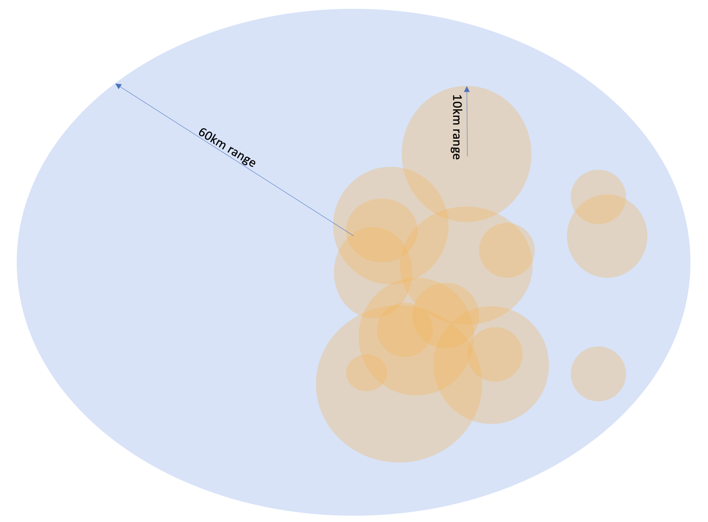
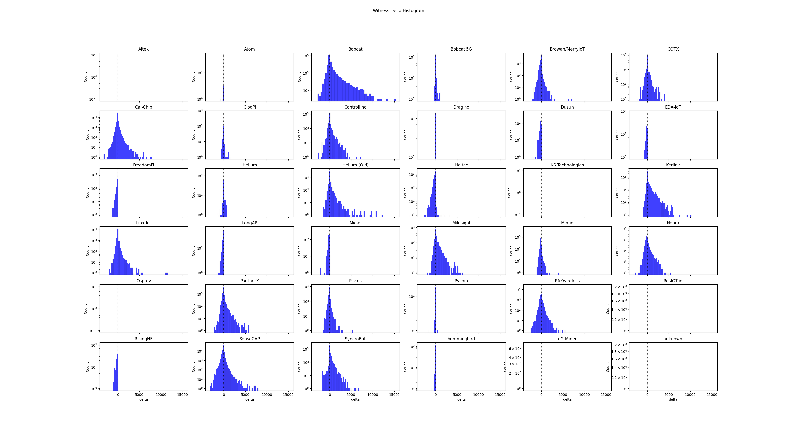

# HIP XX: Response Time Windows for Witness Rewarding

- Author: @disk91, @jmarcelino
- Start Date: 2023/07/20
- Category: Economic, Technical
- Tracking issue:
- Voting Requirements: veIoT Holders

# Summary 

Currently the Proof-of-Coverage Oracles rewards the 14 first hotspots reporting a witness. This rewards 
the fastest hotspots, incentivizing fiber backhauls and specific hardware models that happen to be able 
to produce fast signatures. The result is that the same hotspots are selected, making others unviable 
even if they provide unique and useful coverage for the network. In other words, punishes hotspots for 
falling short of millisecond optimizations when the LoRaWAN protocol functions to the order of seconds. 
A hotspot’s utility in providing LoRaWAN coverage is based on measuring “good enough” response times, not 
absolute fastest as absolute speeds provides no marginal utility, Uplink does not have a particular time-window, 
donwlink time windows is up to 2 seconds, Join process up to 6 seconds.

Since HIP-83, changing the way hotspot are selected, we see an acceleration of [hotspots not participating to PoC anymore](#network-hotspot-loss-acceleration) conducting to network size reduction.

This HIP proposes to evolve the hotspot selection by adding a response time window to eliminate only 
slow hotspots that fail to meet LoRaWAN-grade timing constraints and push helium hotspots to improve their reponse time, over time, reasonibly. 

# Motivation

The LoRaWAN network has some timing constraints to be considered, these ones are related to the JOIN mechanism 
and ACK/Downlink mechanism. JOIN requires a full loop within 5 seconds, up to 6. ACK/Downlink requires a full loop in 1 
second for RX1 window, up to 2 seconds for RX2 windows. Out of this time frame, the response will be ignored by the devices.  [Appendix](#packet-processing-and-lorawan-time-constraints) gives the consequence of these constraints on the expected hotspot response time.

LoRaWAN is a question of seconds, not a question of microseconds, this is why creating a competition between hotspots and network connectivity at a millisecond scale is not achieving any network goal.

Hotspots with highly valuable locations, such as the mountaintops, cell towers, and even rooftops 
sometimes rely on higher latency connectivity (4G/5G, Home Plug, Satellites) which adds anywhere from 
10ms to 100ms. These hotspots generally have a higher operating cost due to dedicated connectivity and hosting cost
and are unfairly impacted by the current selection algorithm as they still operate within LoRaWAN timing specifications. 
See [appendix](#highly-valuable-coverage) about highly valuable coverage.

Hotspot out of the city centers will get a slower Internet response time from the one in the city center, 
even with fast Internet access, due to some extra network hops or downgraded connectivity technology like xDSL.
See [Appendix](#suburb-valuable-coverage) about suburb valuable coverage.

Hotspot with the worst locations, indoor, in the city center, gets the best response time experience 
with direct fiber connectivity.

We have seen that depending on the hardware of the hotspot, the Witness processing time is largely dependent 
on the packet signature as described in the [appendix](#ecc-signature-impact). As the signature is delegated to an hardware 
ECC chip for most of the deployed hotspot, the processing time depends on the [hardware solution](#mcu-performance-impact) soldered. 
Even if firmware can be improved, the current solution disqualifies certain hardware whatever is the hotspot owner's efforts. 

More generally speaking, it disqualifies lower-end hardware like light-hotspots based on micro-controllers as, by definition, their capacity to process the same thing than an hotspot based on CPU is lower. This is nonsense as these hardware have a 
better fit for stability, long-life, energy saving, lower cost, and should be privileged long term.

The Peoples Network must be accessible to anyone and not be a competition of miliseconds optimization limited to a 
small group of experts.

The witness response time is not representative of the data packet processing. Witness response time does not have any 
constraint of time. Witnesses are processed by Oracle, and response time depends on the Oracle localization, 
associated with the network path to reach that Oracle. It totally differ from the LNS network path.
Response time can differ from a Witness to another Witness, the absolute response time is not a good way to measure a performance responding to the LoRaWAN timing constraints. The [Witness process](#witness-processing-waterfall) and the [Packet process](#packet-processing-waterfall) are detailed in the respective appendixes.

As for a given witness, the Hotspots from a similar area will report it to the same Oracle, we can consider a response 
time window starting from the first witness received by the Oracle as a viable solution to eliminate the variable offset 
timing and to eliminate hotspot that are really slower and can cause a problem for data processing.

# Rationale and Alternatives

This HIP proposes to select a valid witness from the ones arriving in a time window of MAX_WITNESS_WAIT_WINDOW_MS starting 
from the first received witness by the Oracle. 

The MAX_WITNESS_WAIT_WINDOWS_MS parameter will be initially set to 200ms, accordingly to the calculation described in appendix. 
It could be later adjusted from 100ms to 300ms by Helium Foundation to optimize the network quality without a need for a new
vote. The purpose of this adjustement is to push hardware manufacturers to optimize their solutions in a scheduled way. The initial 200ms take into consideration the ECC signature and radio backhaul normal impact vs DiY in the LoRaWan constraints. 

When less than 14 Witnesses have been received within the MAX_WITNESS_WAIT_WINDOWS_MS, the Oracle accepts Witnesses up to EXTENDED_WITNESS_WAIT_WINDOWS_MS, fixed at 500ms, the acceptable wait time for RX1 windows for regional traffic. This will allow slower hotspot to be accepted in the low density area when in high density the constraint is stronger. The current situation, with HIP83, is accepting witness without limit of time in a such case, even if the time makes no LoRaWAN downlink & join possible.

This means: 
1. Different hotspots receive a beacon and send the witness information to the related Oracle
2. The Oracle receives the first witness notification and opens a witness reception window for MAX_WITNESS_WAIT_WINDOWS_MS
milliseconds. Witness is marked valid.
3. The Oracle receives the next witnesses during the MAX_WITNESS_WAIT_WINDOWS_MS ms and mark them valid.
4. When 14 or more have been received, it marks the other as invalid
5. When MAX_WITNESS_WAIT_WINDOWS_MS is over and less than 14 received, Oracle marks the first received as selected and waits until 14 or EXTENDED_WITNESS_WAIT_WINDOWS_MS, mark them as valid, then the others invalid.
7. The Oracle selects all the **selected** witnesses and complete to 14 by selected ramdomly some of the one marked as valid.

### Exemple 1

8 witnesses received:
- 4 within MAX_WITNESS_WAIT_WINDOWS_MS
- 3 within EXTENDED_WITNESS_WAIT_WINDOWS_MS
- 1 out of WINDOWS

The 4 firsts are marked as SELECTED, the 3 next are marked as VALID, the last one is marked as INVALID. Oracle rewards all the one marked as SELECTED, it can select 10 more randomly as part of the ones marked as VALID, so it reward all of them. The last one is not rewarded.

### Exemple 2
25 witnesses received:
- 20 within MAX_WITNESS_WAIT_WINDOWS_MS
- 4 within EXTENDED_WITNESS_WAIT_WINDOWS_MS
- 1 out of WINDOWS

Only the first 20 within MAX_WITNESS_WAIT_WINDOWS_MS will be selected and marked as VALID, all the others are INVALID and won't be part of the reward calculation. The Oracle will randomly select 14 of the 20 VALID witness and reward them.

### Exemple 3
25 witnesses received:
- 10 within MAX_WITNESS_WAIT_WINDOWS_MS
- 8 within EXTENDED_WITNESS_WAIT_WINDOWS_MS
- 7 out of WINDOWS

The 10 firsts are marked as SELECTED, the next 8 are marked as VALID, the 7 others are marked as INVALID. Oracle will reward all the SELECTED, then is will randomly choose 6 (14-8) of the 8 witnesses marked as VALID and reward them.

** Alternate Proposal **

This HIP proposes to select all witness arriving in a time window of MAX_WITNESS_WAIT_WINDOW_MS starting 
from the first received witness by the Oracle. 

The MAX_WITNESS_WAIT_WINDOWS_MS parameter will be initially set to 200ms, accordingly to the calculation described in appendix. 
It could be later adjusted from 100ms to 300ms by Helium Foundation to optimize the network quality without a need for a new
vote. The purpose of this adjustement is to push hardware manufacturers to optimize their solutions in a scheduled way. The initial 200ms take into consideration the ECC signature and radio backhaul normal impact vs DiY in the LoRaWan constraints. 

When less than 5 Witnesses have been received within the MAX_WITNESS_WAIT_WINDOWS_MS, the Oracle accepts Witnesses, with a maximum ot 5 total, up to EXTENDED_WITNESS_WAIT_WINDOWS_MS, fixed at 500ms, the acceptable wait time for RX1 windows for regional traffic. This will allow slower hotspot to be accepted in the low density area when in high density the constraint is stronger. This allows to have sat backhaul in low density areas. The current situation, with HIP83, is accepting witness without limit of time in a such case, even if the time makes no LoRaWAN downlink & join possible.

This means: 
1. Different hotspots receive a beacon and send the witness information to the related Oracle
2. The Oracle receives the first witness notification and opens a witness reception window for MAX_WITNESS_WAIT_WINDOWS_MS
milliseconds. Witness is marked SELECTED.
3. The Oracle receives the next witnesses during the MAX_WITNESS_WAIT_WINDOWS_MS ms and mark them SELECTED.
4. When 5 or more have been received, it marks the other as INVALID
5. When MAX_WITNESS_WAIT_WINDOWS_MS is over and less than 5 received, Oracle marks the next SELECTED until EXTENDED_WITNESS_WAIT_WINDOWS_MS with a maximum of 5 witnesses total, next are marked INVALID.
7. The Oracle selects all the **SELECTED** witnesses to be rewarded.

### Exemple 1

8 witnesses received:
- 4 within MAX_WITNESS_WAIT_WINDOWS_MS
- 3 within EXTENDED_WITNESS_WAIT_WINDOWS_MS
- 1 out of WINDOWS

The 4 firsts are marked as SELECTED, the first 1 next is marked as SELECTED, the 2 two next within EXTENDED_WITNESS_WAIT_WINDOWS_MS and the one out of WINDOWS are marked as INVALID. Oracle rewards all the one marked as SELECTED. The last 3 are not rewarded.

### Exemple 2
25 witnesses received:
- 20 within MAX_WITNESS_WAIT_WINDOWS_MS
- 4 within EXTENDED_WITNESS_WAIT_WINDOWS_MS
- 1 out of WINDOWS

Only the first 20 within MAX_WITNESS_WAIT_WINDOWS_MS will be selected and marked as SELECTED, all the others are INVALID and won't be part of the reward calculation. The Oracle will reward all the SELECTED witnesses.

### Exemple 3
25 witnesses received:
- 10 within MAX_WITNESS_WAIT_WINDOWS_MS
- 8 within EXTENDED_WITNESS_WAIT_WINDOWS_MS
- 7 out of WINDOWS

The 10 firsts are marked as SELECTED, the next 8 are marked as INVALID, the 7 others are marked as INVALID. Oracle will reward all the SELECTED and reward them.

# Unresolved Questions

- Packet processing is currently involving signature from ECC fro every packet, this is time costly and not mandatory.
Some discussions are already opened to move this with a software signature from an ECC derivated key negotiated with Helium
Packet Router for a given period of time.

- Witness could be selected also in regard of their location. For exemple we could get a priority on the witnesses comming from the longest distance to offer an advantage to the hotpost offering the larger coverage.

# Deployment Impact

Oracle PoC rewarding code needs to be modified to take this into consideration. Deployment is global, Hotspots are not impacted.

# Success Metrics

# Appendix

## Highly Valuable Coverage

Some of the hotspot have a really large coverage by being installed in really good / high location. These hotspots, due to the 
geographical location and the height are covering wide zone, larger than the city. That way, they are offering a uniq coverage. The following picture is illustrating this: the blue area is representing the coverage offered by this sigle hotspot, the orange 
represent the city coverage provided by the mass of the other hotspot in the same area. All these hotspots are in competition for the same witness.

This illustration is based on a real exemple, but is a general illustration for hotspot placed on cell-towers and high elevation point. The hotspot used in the illustration as model is Attractive-Olive-Cybord, located in Clermont-Ferrand, France. This hotspot is deployed on high elevation point. Coverage can be seen on mappers.helium.com, with 80km coverage from North to South.

In term of coverage comparision, 60km hotspot provides 36x a 10km hotspot in area coverage. It provides about 3600x coverage compared to a indoor, city center located hotspot.

This HIP does not propose to give these hotspots any advantages, the existing POC mechanisms already manage this. This HIP attempts to remove the penalty these important hotspots are currently suffering due to HIP-83.

## Suburb Valuable Coverage

The hotspots located in suburb and above, in blue in the illustration, are expending the network coverage with uniq 
coverage zone and are in competition with the hotspot inside the city. They are also the hotspot that are opening the PoC rewarding to the next hotspot out of the city and suburb. 

These hotspots does not get benefit of the fastest Internet connection as their fiber connectivity will pass through the city center to reach the main Internet highways. For most of them the fiber connectivity will not be available and they are going to rely on xDSL connectivity before reaching the ISPs fiber Internet backhall.

These hotspots are participating to the same PoC as the city center hotspot getting benefit of the fastest Internet connection.

This HIP does not propose to give these hotspots any advantages, the existing POC mechanisms already manage this. This HIP attempts to remove the penalty these important hotspots are currently suffering due to HIP-83.

## Packet Processing and LoRaWan time constraints

The Helium Packet Router (HPR) is accepeting all the coming packets up to the limit of the max_copies set on the route or eui in 
the config service. First come, first paid. Only for roaming the HPR is applying a time limit. The time limit for a packet is 
decided by the LNS after the HPR. This time limit for the LNS is a LNS setup and can vary for each of the LNS.

LoRaWAN time constraints are the following:
- UPLINK first copy arrival has no time constraint, next copies are withing the defined LNS deduplication time windows.
- JOIN REQUEST needs to be responded within 5s for RX1 (same frequency, standard power) or 6s for RX2 (other frequency, potentially higher power). LNS decides of the selection between RX1 and RX2 dynamically, according to the time available.
- DOWNLINK REQUEST / ACK needs to be responded within 1s for RX1 (same frequency, standard power) or 2s for RX2 (other frequency, potentially higher power). LNS decides of the selection between RX1 and RX2 dynamically, according to the time available.

There is no reasons to prefer RX1 vs RX2, most of the implementations try to reach RX1 first, but RX2 provides different advantages, in particular in Europe where the duty cycle on RX2 is better and the higher power makes more chance to reach the device. It also reduce the limited bandwidth usage on the 8 available channels and the risk of collision on these busy channels. Device power impact can be considered higher on RX2 but with a lower risk of collision and reception loss, practically speaking, this assumption is not always true. Selection between RX1 / RX2 is not a question in regard of this HIP. This is informative to
understand that nothing bad in using one vs the other, both have advantages.

Basically, only the DOWNLINK REQ / ACK creates generate a time constraint at the time scale discussed in this HIP. This time constraints is to make sure that the order to send the ACK or the DOWNLINK transfer order comes to the desired Hotspot before the RX2 windows.

In this constraint of time, we need to execute the [full packet processing steps](#packet-processing-waterfall).

Based on this the LNS is able to accept incoming packets in a time windows with a minimal duration of 210ms with a 200ms margin,
so basically up to 350-400ms. 

## Network hotspot loss acceleration

This month we see a clear acceleration of the network's hotspot reduction as shown with the following stats. This is the number of Hotspot that have participated to the PoC process since the indicated date, seen from July 28th. Basically hotspot with Witness revenue.
Rq : This does not exclude new hotspots, lost hostpot may be a little bit higher. 

| Date      | Hotspot Witnessing | Loss that day | Remark |
| --------- | ----------------- | ---------- | -------- |
| 2023-7-25 | 367066 | 2156 | |
| 2023-7-24 | 369222 | 2106 | |
| 2023-7-23 | 371328 | 1830 | |
| 2023-7-22 | 373158 | 1774 | |
| 2023-7-21 | 374932 | 1676 | |
| 2023-7-20 | 376608 | 1456 | |
| 2023-7-19 | 378064 | 1387 | |
| 2023-7-18 | 379451 | 1445 | |
| 2023-7-17 | 380896 | 1267 | |
| 2023-7-16 | 382163 | 1259 | |
| 2023-7-15 | 383422 | 1302 | |
| 2023-7-14 | 384724 | 1253 | |
| 2023-7-13 | 385977 | 1170 | HIP 83 activation day |
| 2023-7-12 | 387147 | 1238 | |
| 2023-7-11 | 388385 | 1107 | |
| 2023-7-10 | 389492 | 1064 | |
| 2023-7-09 | 390556 | 1025 | |
| 2023-7-08 | 391581 | 1138 | |
| 2023-7-07 | 392719 | 2313 | |
| 2023-7-06 | 395032 | 1296 | |
| 2023-7-05 | 396328 | 1103 | may include about 160 from denylist addition, here of later |
| 2023-7-04 | 397431 | 1086 | |
| 2023-7-03 | 398517 | 1120 | |
| 2023-7-02 | 399637 | 1052 | |
| 2023-7-01 | 400689 | 1085 | |

Average loss per day before HIP-83 was about 1215 Hotspot per day, Average loss per day since HIP-83 is 1575 per day, growing.

The following graphics is diplaying the Loss that day (Y axis) over days (X axis)

## MCU performance impact

| Hotspot | Motherboard | CPU/MCU | Clock | Cores | 
|---------|-------------|---------|-------|-------|
| Nebra...| RPI CM3     | BCM2837B0 | 1400MHz | 4 | 
| Rak...  | RPI 4       | BCM2711 | 1500MHz | 4 | | 
| Kerlink | Custom | MCIMX6X1CVO08AB | 800MHz | 1 | 
| Senscap M2| Mediatek | MT7628 | 580MHz | 1 |

## ECC Signature impact

The ECC Signature process is having a significant impact on the overall processing, some measure have been conducted by 
community members like Miroslav (heliootics) & co, Jose Marcelino, using the gateway-mfr-rs test kit. For the tested hotspot provider we can the following average signature time:

| Manufacturer Brand | Model | Avg Signature Time | Note |
| ------------------ | ----- | ------------------ | ---- |
| Calchip v1         |        | ?  | no ECC |
| DiY                | x86    | ?  | no ECC |
| DiY                | RPI 4  | ?  | no ECC |
| Bobcat             | RK3566 | 105 ms | |
| Milesight          |        | 105 ms | |
| Nebra       | indoor CM3 v1 | 113 ms | |
| Synchrobit            | CM4 | 120 ms | |
| Cotx                   | X3 | 130 ms | |
| Heltec           | HT-M2808 | 135 ms | |
| Bobcat             | Others | 150 ms | |
| Linxdot                  |  | 152 ms | |
| Dusun                    |  | 154 ms | |
| Nebra       | indoor CM3 v2 | 157 ms | |
| RAK / MNTD           | Gold | 165 ms | |
| RAK / MNTD          | Black | 174 ms | |
| Pycom               | Other | 175 ms | |
| Sensecap               | M1 | 175 ms | |
| PantherX1                |  | 179 ms | |
| Pisces                   |  | 180 ms | |
| Controllino              |  | 180 ms | |
| Heltec              | Other | 242 ms | |

The signature impacts on the first to arrive show a variability up to 250ms. ( to be completed with the non ECC device data later one)

The consequence of this in regard of the HIP-83 can be shown on the following grapfics:

This graphic shows, after the start of the HIP-83, the witness selection change by maker. It show the number of hotspot (Y axis) selected more time, on the right side of the 0 (X axis) or selected less time, on the left side of the 0 (X axis). 

We see that the distribution is not centered, with certain brands getting an advantage on the other, due to hardware and software implementation. Bobcat ( faster ECC ) and Kerlink ( MCU intergrated ECC ) takes advantage over the other manufacturer.

## Packet Processing Waterfall

The following waterfall represents the different steps in the data packet processing, in the case of a packet requesting a ACK or a downlink. The HPR is geo-replicated, time to reach it is within the zone. 

Two scenarios are identified:
- the first one in gray is the best case scenario, hotspot is fast and the LNS is in the same zone the device is, so the communication from HPR to LNS then LNS to Hotspot is short.
- the second one in orange is the worst case scenario, hotspot is slower and LNS and device are in at the longest Internet distance, considering 600ms.

The first scenario gives an idea of the acceptable copies reception windows to match with the RX1 window, in blue, up to 600ms. The second scenario gives an idea of the acceptable copies reception windows to match with RX2 window (RX1 not achievable due to round trip delay), up to 210ms. Both scenario includes a margin of 200ms for non seen yet.

This minimum reception window to achieve the worst case has been used to propose the initial time windows for accepting the 
witnesses.

## Witness Processing Waterfall

The following waterfall represent the different steps in the witness processing, the variability of each of the steps, depending on hardware, network access, network variability as been identified to have the scale of magnitude of each of the steps on the global processing. As steps normal variability is large and really context driven, this illustration tries to approximate the best way as possible but can't be exact.

- Witness processing is the time to execute the gateway-rs code (out of ECC signature), I don't have reference of time and assume it should be around 10ms, any better data is welcome. The variability comes from the different hardware performace for running the same code, we have seen previously a ratio of 3x in term of cpu frequency, associable to performance.
- ECC signature, as seen previsouly is a factor of magnitude of 4x between no ECC signature and worst ECC implementation.
- The Witness is then reported to iotpoc server, this architecture is zone distributed, so we can assume all the hotspot reporting the Witness will report to the same server within their zone. The time to reach http://mainnet-pociot.helium.io:8080 can be checked with https://check-host.net/ in TCP Port check. The response time vary from 20 to 100ms including network latency natural variability. On top of this we can add an extra variable time related to the use of 4G (50-100ms) or xDSL (30-50ms).
- Then the iotpoc server reports the witnesses to the Oracle to verify the PoC and compute the rewarding. The time depends on the Oracle location compared to iotpoc server. This is the same network path for all packets. The network natural network latency we have between packets (measurable with ping command, max - min) have an order of magnitude of 10-50ms (about 20%).

The variation of time related to the hotspot type of connectivity (yellow block) is really limited compared to the overall variability in the Witness processing. Hotspot hardware is first impacting the performance, then network acces is quite equivalent to Internet natural variability from one packet to the other ( distribution is different ).

A reception windows of 320ms should cancel all the natural variability, the use of a windows 200ms will still impact the slow hostpots. The extended windows, used in the low density area is covering all the variability. 

