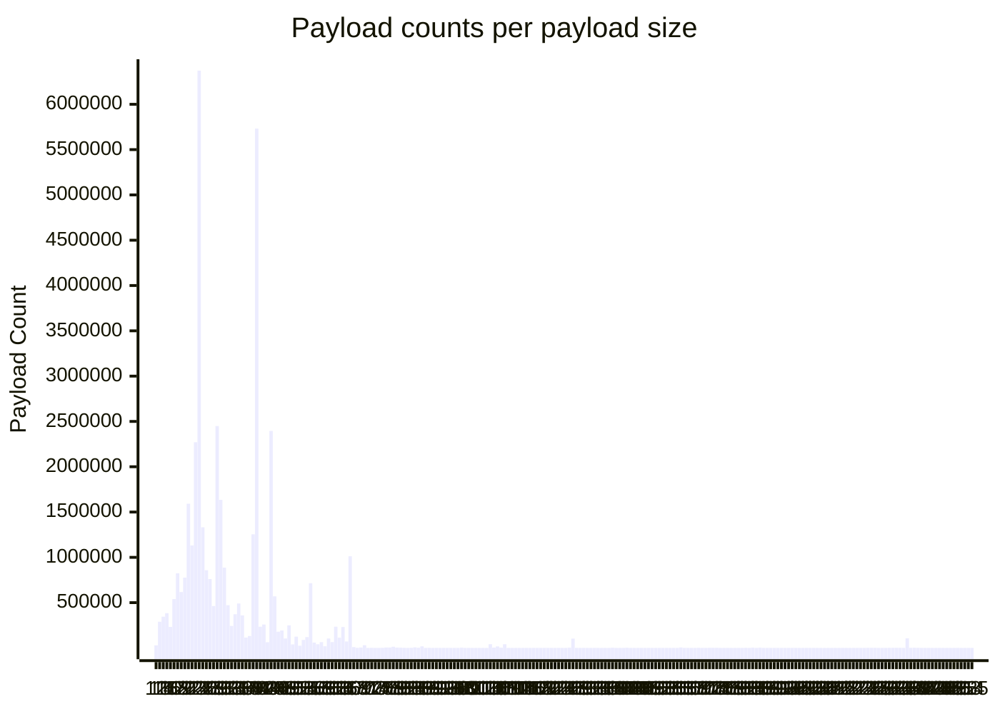

# HIP XXXX: IOT Data Pricing

- Author(s): [@rawrmaan](https://github.com/rawrmaan), [@jthiller](https://github.com/jthiller)
- Start Date: 2024-09-19
- Category: Economic
- Original HIP PR:
- Tracking Issue:
- Voting Requirements: veIOT holders

## Summary

This HIP proposes to increase the base cost of transferring messages on the Helium IOT Network. This would be done via an increase of the floor "multibuy"[[Definition 1]](#1) value for each message as well as a simplification of payload pricing.

This HIP outlines four main actions:

- Increase the multibuy value to 10 for all devices, ensuring up to 10 sets of payload metadata are returned for each message.
- Charge a minimum of 10 Data Credits (DC) for each message, regardless of the number of participating Hotspots.
- Split the data transfer reward for these messages across all participating Hotspots.
- Eliminate the 24 byte pricing tiers for payloads sent through the network. All messages may be sent for 10 DC, regardless of size.

## Motivation

Separate from the actions outlined in the summary, there are four objectives this HIP seeks to achieve.

The primary motivation of this proposal is to realize and capture the true value of data transfer delivered by the IOT subnetwork, the largest public LoRaWAN network in the world. Despite seeing widespread adoption and consistent growth, the IOT Network's revenue from data transfer has been slow to meet expectations. This is largely due to the very low cost of data transfer on the network; put simply, $ 1{,}000\ \text{messages} \ / \ \$1.00\ \text{USD}$ (1,000 Data Credits) at a base message size.

Next, when sending LoRaWAN downlinks[[Definition 2]](#2), prior receipt of verbose payload metadata is critical for LoRaWAN Network Servers (LNSs) to select the best Hotspot to broadcast the message for delivery to the device in the field. This metadata are retrieved when devices send uplinks[[Definition 3]](#3) and are reported by Hotspots. The number of Hotspots included in these reports is gated by the multibuy value.  
The current design of the network leaves the selection of the multibuy value up to the network operator, which has proven to be a generally confusing attribute for existing LPWAN operators who expect a full set of this metadata. Enforcing a base multibuy value ensures all operators receive a minimum set of available metadata to ensure successful downlink delivery.

Furthermore, in conjunction with the raise in base cost for messages, it becomes unnecessary to meter payloads based on 24 byte increments. LoRaWAN devices generally benefit from the smallest payload size possible in the interest of preserving battery life. The LoRaWAN specification generally limits payloads to 255 bytes. Due to spreading factors[[Definition 4]](#4), these limits do not directly correlate to time on air.

Lastly, by splitting the 10 DC reward among participating Hotspots, a greater incentive is offered to rural Hotspots which may be rewarded in greater proportion than more densely deployed, generally urban Hotspots.

## Stakeholders

All customers (e.g., sensor owners), hosts, and operators of the Helium IOT Network. This HIP notes special consideration to voters that the most heavily impacted party, sensor operators, are not strongly represented from a token voting standpoint. Voters are encouraged to consider all stakeholder perspectives.

### Hivemapper

Hivemapper leverages the Helium Network as a location verification check in its HDC and HDC-S high-precision dashcams for mapping.

> Helium has a pricing problem. @Hivemapper uses the Helium network for location verification, and its pricing model undervalues the service it provides.
> \- [@aseidman](#a)

### WeatherXM

WeatherXM operates a suite of weather sensing devices, including a product line which leverages Helium LoRaWAN exclusively for data transfer.

> Thank you for reaching out to us regarding the proposed increase in DC pricing. As one of the largest users of the Helium IoT network, responsible for ~17% of the network's earnings, we take this matter very seriously.  
> To be clear, we are not in favour of any price increase, as even a modest change could impact our network's operations. However, we understand that some adjustments may be necessary. While a 30-50% increase would be challenging, it’s something we could potentially adapt to. A 10x increase, on the other hand, would be entirely unsustainable for us and would greatly undermine our ability to continue leveraging the network.  
> We hope that any decision or proposal finalised takes into account the realities of users like us who significantly contribute to the network's success.

** Add additional stakeholder comments **

## Detailed Explanation

The cost of packet transfer on the Helium IOT Network is far too inexpensive. Some customers have even publicly commented that the cost is too low.[[A]](#a) Due to the low cost of data transfer, a Hotspot must transfer a huge number of messages to earn meaningful revenue. If an individual Hotspot can't earn sustainable revenue, it's probable that the network as a whole cannot sustain itself.

Currently, transferring a 24 byte packet on the Helium IOT Network through a single Hotspot costs a customer 1 DC. This HIP proposes to change that cost to 10 DC and to remove the 24 byte constraint associated with message size billing.

-> expand on importance of metadata

24 byte increments act as a proxy for airtime controls, but do not effectively ensure any particular usage patterns. As a crude example, a 24 byte payload sent using SF12 takes 452ms. A 242 byte payload at SF7 takes 399ms. Despite the large gap in payload sizes, both messages use approximately the same airtime.

-> expand on opportunity to grow rural coverage

In the interest of supporting a transitional period for network users, a one-time issuance of DC will be made into the escrow accounts of the Organizationally Unique Identifiers[[Definition 5]](#5) (OUIs) on the network. This issuance will be 1 year of additional DC based on a snapshot of the previous usage over 90 days from the close of a vote, minus any anomalous usage. Specifically, it will cover 9 times the usage at the current rate for two years, calculated using the average usage of the preceding three months. These funds are to be paid from the IOT Operations Fund as a swap to HNT.

### Example Impacts

Excluding the one-time emission of Data Credits to operator's escrow accounts, let's evaluate the cost impacts to network operators given a number of device deployment scenarios.

| Scenario                                                                                   | Before Cost | After Cost |
| ------------------------------------------------------------------------------------------ | ----------- | ---------- |
| Operator runs 5000 devices sending a 40 byte payload every 3 minutes with no multibuy.     | $XX/year    | $XX/year   |
| Operator runs 10 devices sending a 24 byte payload every 30 minutes with a multibuy of 4.  | $XX/year    | $XX/year   |
| Operator runs 1 device sending a 24 byte payload every minute with a multibuy value of 50. | $XX/year    | $XX/year   |

## Implementation

- base cost
- dc split
- DC airdrop
  - computation of rate
- eliminate 24b tiers

The multibuy value will be set to 10, ensuring up to 10 Hotspots are included for all messages's metadata. Network operators reserve the right to set this value higher, but only the floor of 10 are required to be paid for each message. For example, if a user sets their multibuy value to 20 and their device is reported through 15 Hotspots, 15 DC are used.

In scenarios where fewer than 10 copies of a message are delivered to the LNS, the cost of the message will still be calculated as if 10 copies were delivered, and the data transfer reward will be divided among the reporting Hotspots.

## Alternatives

- Per-device pricing is a common approach in the LoRaWAN industry, but it's not feasible for Helium due to its multi-LNS architecture. If Helium controlled all devices through a single network server and had no roaming users, this approach would be cleanly feasible.

- Regional pricing could be explored as a future option, as different regions may have varying price sensitivities.

### Selection of Multiplier

The HIP explores a 10x multiplier. However, the range of suggested increases vary from 2x to 1000x. These proposed values can be viewed as an optimization problem, wherein the vectors include attrition across active devices, continued network growth, protocol revenue, and distribution across the global fleet of Hotspots.

## Drawbacks

- A significant price increase may deter customers from using the network, potentially reducing message volume.

- Increased DC usage could lead to a reduction in available tokens for Proof of Coverage rewards.

## Unresolved Questions

The main unresolved question is how Helium IOT customers will respond to the price change. This HIP is being submitted in hopes of gaining that feedback.

## Deployment Impact

- Public LNS operators will need to understand this change and possibly communicate it to their customers, depending on how their customer relationships work

- When the variable is changed, data consumers will immediately begin paying the new rate. Hotspots will immediately begin receiving rewards in accordance with the 10 DC message base and multibuy sharing.

- The two-year supplemental issuance of DC will be deployed on the day of activation, ensuring existing device operations are uninterrupted.

## Success Metrics

There are two success metrics. First that the price is changed and, second, that the demand remains inelastic (users don't leave the network). Only the first is required for the HIP to be considered successful.

## Definitions

<a id="1">**Multibuy**</a>: Refers to the number of Hotspots and their corresponding metadata that are reported to the LNS for a specific device payload. This value is also known as "max copies" or "microdiversity," indicating the maximum number of Hotspot records that can be included for each transmission.

<a id="2">**Uplink**</a>: Payloads sent from deployed devices through Hotspots to the LNS.

<a id="3">**Downlink**</a>: Payloads sent from LNSs through Hotspots to deployed devices.

<a id="4">**Spreading Factor**</a>: Ranging from SF7 (fastest) to SF12 (slowest), spreading factor controls data transmission speed. Devices adjust spreading factors to balance time on air, battery consumption, and distance the message may be received.

<a id="5">**Organizationally Unique Identifier**</a>: Registered by network operators, the OUI designates the operator's network server's configurations and DC balances. An OUI may be held by an individual network operator or roaming user. Each OUI has one DC escrow account.

## References

<a id="a">Ariel Seidman, Hivemapper</a> X.com. (n.d.). X (Formerly Twitter). https://x.com/aseidman/status/1614445419693740033

## Figures

