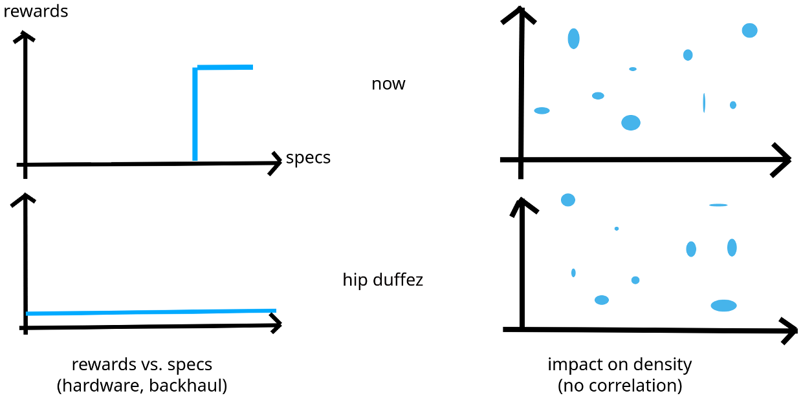

# HIP ???: remove latency sorting

* Authors: Benoit Duffez @BenoitDuffez (@bduffez on discord)
* Start Date: Nov 14, 2023
* Category: rewards for the IoT network (data routing, and thus PoC)
* Tracking Issue: https://github.com/helium/HIP/issues/805
* Voting Requirements: ???

## Summary

The Helium network is an IOT network composed of several nodes, including hotspots.  
Hotspots bring value to the IOT network in routing data packets.

It can be inferred that the value they provide is proportional to the RF coverage they have.

Thus, Helium implemented a Proof of Coverage mechanism where some hotspots would broadcast a beacon, and neighbors would confirm they saw the message.

Hotspot owners are rewarded in crypto tokens whenever their hotspot(s) route data packets, broadcast a beacon, or witness a beacon. This is the value they bring to the network.

Rewards should focus on hotspots that provide value to the network, and not based on a metric that is detrimental to hardware diversity (currently: latency only).

## Stakeholders

* Hotspot owners, hotspot makers
* Discord and GitHub Helium communities

## Detailed Explanation

### Current state

Today, this value is rewarded in tokens based on latency, with an emphasis of the importance of a few milliseconds.

### Latency in an IOT network

Helium is an IOT network based on LoRaWAN.

LoRaWAN supports both ways communication, and support acks (confirmed uplinks/downlinks). Here is the most common delays in the world:

| Situation                                          | Minimal latency (ms) | Optimal latency (ms) |
|----------------------------------------------------|----------------------|----------------------|
| Unconfirmed uplink, class A, no scheduled downlink | none                 | 1000                 |
| Unconfirmed uplink, class A, scheduled downlink    | 2000                 | 1000                 |
| Confirmed uplink                                   | 2000                 | 1000                 |
| Join Request                                       | 6000                 | 5000                 |

For any uplink, there may be some considerations on the use case. For example, plotting the temperature of a refrigerator for historical data and a school panic button do not have the same requirements.  
The former would tolerate minutes if not hours of delay in data collection (as long as the data is there eventually), however the latter would not tolerate a latency over a few seconds.

Thus, LoRaWAN has a latency requirement in the order of magnitude of about 10^3 milliseconds.

### Latency vs. value

After looking at the value provided by hotspots and how they are rewarded, it appears that there are several orders of magnitude of difference between what is rewarded and what is actually useful to the network (10^1 vs 10^3 milliseconds).

### Motivation

Ideally, we should sort hotspots that perform the work (witnessing or routing a packet) using a KPI that fairly represents the value they bring to the network.

As a reminder of said value from the first paragraph:

* routing packets: unless they are unreasonably slow (see table above), all hotspots provide the same amount and value of work (e.g. routing the packet from A to B)
* witnessing coverage: the uptime, coverage, RF performance, reliability, power usage, data consumption, etc.

It is very hard to assert a reliable KPI to assess this value.  
Today, latency fails to do so.

Short of a better KPI, randomness seems the fairest option.

#### Selection

A typical flow could be shown as:

1. Uplink received by gateway
2. Cloud processing
3. Downlink sent to gateway (if any)

Latency is often measured as round trip time (RTT), so here it would be split in two on steps 1 and 3.  
During step 2, it becomes known whether a class A downlink has to be sent to that device, we know which RX window can be selected, and we know from step 1 what is the uplink latency. By inferring that it is symmetrical (assumption that could be wrong and thus add the need for headroom), we could know at the end of step 2 whether a particular hotspot would be able to route the packet or not.

Thus, some hotspots could be eliminated if they fail to provide the packet within a reasonable time (threshold).

#### Threshold

Even if latency does not matter in terms of milliseconds or tens or milliseconds (or more) for LoRaWAN (see above), there could be a threshold to filter out hotspots that are too slow.

| Scenario                                              | Threshold | Rationale                                                                                                 |
|-------------------------------------------------------|-----------|-----------------------------------------------------------------------------------------------------------|
| Uplink with no scheduled class A downlink             | 2500ms    | See table above; even with the most critical LoRaWAN use case, no latency below a few seconds is expected |
| Uplink with a scheduled class A downlink, target RX1  | 800ms     | Gives 200ms headroom for cloud processing (LNS handling, window selection, latency computation, etc)      |
| Uplink with a scheduled class A downlink, target RX2  | 1800ms    | Gives 200ms headroom for cloud processing (LNS handling, window selection, latency computation, etc)      |

### Behavior

For PoCs or data packets:

1. first packet received from first hotspot: check if there is a class A downlink pending, decide RX1/RX2, and compute threshold accordingly
2. collect hotspots that brought value (routing/witnessing) until the threshold expires (from packet timestamp, not from first hotspot)
3. validate their work (cryptographically or through analysis e.g. denylist)
4. if the list is greater than 14, select randomly 14 winners among the list

### Impact

Here is a simulation of what would happen

## Drawbacks

* removing the race to latency and switching to lottery for those under a threshold, if threshold is too high, could lead to increased earnings for packet stuffers

## Rationale and Alternatives

Removing the race to latency is fair for hotspot owners because latency wasn't a HIP19 requirement when makers started selling hotspots.

A *good* threshold is crucial to avoid packet stuffing. It needs also to be fair, e.g. not exclude any maker or future hardware (so-called *light hotspot*).

[Empirical data](https://discord.com/channels/404106811252408320/1144746781071130795/1179544725951365273) taken from [Groot's data](https://discord.com/channels/404106811252408320/1144746781071130795/1177697584643575818) yield the following -3dB/50%/median latency per maker (with at least 5k online hotspots):

| online hs   | maker      | 50% cutoff |
|-------------|------------|------------|
| 160k        | bobcat     |  40        |
| 79k         | sensecap   |  25        |
| 46k         | calchip    |  20        |
| 31k         | rak        |  20        |
| 18k         | nebra      |  30        |
| 15k         | linxdot    |  20        |
| 9k          | browan     |  30        |
| 8k          | pantherx   | 100        |
| 8k          | finestra   |  ??        |
| 6k          | kerlink    |  45        |
| 6k          | heltec     |  30        |
| 5k          | freedomfi  |  20        |
| 5k          | helium OG  |  ??        |

PantherX hotspots seem to be completely off the rest of the group. It should be determined what is the reason behind this figure that looks abnormal (e.g. is it post 1.3.0?).

It looks like the rough minimum latency to avoid any exclusion would be:

| log10(latency) | excluded vendors (>5k online hotspots)           |
|----------------|--------------------------------------------------|
| 2.0            | none                                             |
| 1.7            | pantherX                                         |
| 1.5            | bobcat, pantherX, kerlink                        |
| 1.4            | bobcat, nebra, browan, pantherX, kerlink, heltec |

To avoid impacting too many hotspot owners, it looks like the sweet spot would be 1.7 (== 50ms). PantherX should provide input as to why their hotspots seem to have a 2x latency compared to the next slowest.

## Unresolved Questions

* is 50ms a good threshold?

## Deployment Impact

I (author) don't know.

## Success Metrics

* no increased gaming (how to quantify?)
* level earnings across makers
* no impact on data routing in dense areas
